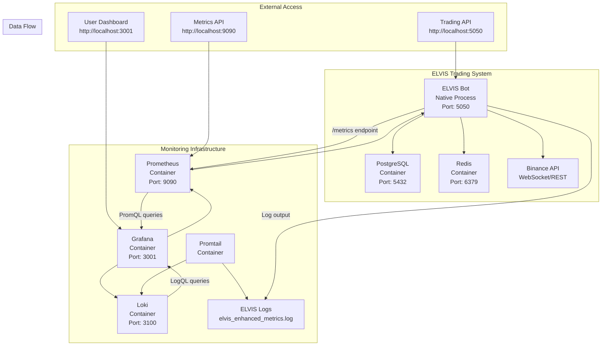

# ELVIS Enhanced Monitoring System - Complete Documentation

## 🚀 System Overview

The ELVIS (Enhanced Leveraged Virtual Investment System) monitoring infrastructure provides comprehensive observability for high-frequency trading operations through a modern containerized stack combining Prometheus metrics collection, Grafana visualization, and Loki log aggregation.

## 📊 Architecture Components

### Core Trading System
- **ELVIS Trading Bot**: Python-based trading system with ensemble strategies
- **Paper Trading Database**: PostgreSQL for trade history and positions
- **Redis Cache**: Real-time data caching and session management
- **Price Feeds**: Live WebSocket connections to Binance API

### Monitoring Stack
- **Prometheus**: Time-series metrics collection and storage
- **Grafana**: Real-time dashboard visualization and alerting
- **Loki**: Centralized log aggregation and analysis
- **Promtail**: Log shipping agent for ELVIS system logs

## 🔧 Container Architecture



## 📈 Metrics Collection

### ELVIS Custom Metrics (33 Total)

#### Portfolio & Trading Metrics
- `elvis_portfolio_value`: Total portfolio value in USD
- `elvis_total_pnl`: Realized profit/loss from all trades
- `elvis_unrealized_pnl`: Current unrealized P&L from open positions
- `elvis_open_positions_count`: Number of active trading positions
- `elvis_total_trades`: Cumulative number of executed trades
- `elvis_win_rate`: Trading success rate percentage
- `elvis_profit_factor`: Profit factor ratio (gross profit / gross loss)

#### Market Data Metrics
- `elvis_current_price{symbol}`: Real-time cryptocurrency prices
- `elvis_sma{symbol}`: Simple Moving Average (20-period)
- `elvis_ema_short{symbol}`: Exponential Moving Average (9-period)
- `elvis_ema_long{symbol}`: Exponential Moving Average (21-period)
- `elvis_rsi{symbol}`: Relative Strength Index
- `elvis_macd{symbol}`: MACD indicator
- `elvis_macd_signal{symbol}`: MACD signal line
- `elvis_market_spread{symbol}`: Bid-ask spread
- `elvis_market_volume{symbol}`: Trading volume
- `elvis_price_change_24h{symbol}`: 24-hour price change percentage

#### System Performance Metrics
- `elvis_system_cpu_percent`: System CPU usage
- `elvis_system_memory_percent`: System memory usage
- `elvis_api_response_seconds`: API response time histogram
- `elvis_trades_per_hour`: Trading frequency
- `elvis_avg_trade_size`: Average trade size in USD
- `elvis_largest_win`: Largest profitable trade
- `elvis_largest_loss`: Largest losing trade

#### Standard Flask Metrics
- `flask_http_request_total`: HTTP request counter
- `flask_http_request_duration_seconds`: Request duration histogram
- `up`: Service availability indicator

## 🎯 Dashboard Features

### Available Dashboards

1. **elvis-simple-working**: Guaranteed working dashboard with essential metrics
   - Live BTC price display
   - Portfolio value and P&L tracking
   - Win rate and total trades
   - Open positions count
   - System status indicator
   - Real-time price chart

2. **elvis-final-console**: Full-featured ELVIS console replica
   - Complete technical analysis suite
   - Advanced charting with indicators
   - Comprehensive trading metrics
   - System health monitoring

3. **elvis-fresh-working**: Clean interface with verified queries
   - Simplified layout for reliability
   - Core trading metrics
   - Live data visualization

### Dashboard URLs
- Primary: `http://localhost:3001/d/elvis-simple-working/`
- Advanced: `http://localhost:3001/d/elvis-final-console/`
- Alternative: `http://localhost:3001/d/elvis-fresh-working/`

## 🔍 Log Management

### Loki Configuration
- **Retention**: 7 days (168 hours)
- **Ingestion Rate**: 64MB/minute
- **Query Parallelism**: 32 concurrent queries
- **Storage**: Local filesystem in container

### Log Processing Pipeline
1. **ELVIS System** → Writes logs to `elvis_enhanced_metrics.log`
2. **Promtail** → Tails log file with ANSI color code parsing
3. **Loki** → Stores structured logs with timestamps and labels
4. **Grafana** → Displays logs via LogQL queries

### Log Labels
- `job`: "elvis"
- `service`: "trading-bot"
- `level`: LOG_LEVEL (INFO, WARNING, ERROR)
- `logger`: Component name

## 🐳 Container Configuration

### Docker Compose Services

#### PostgreSQL Database
```yaml
postgres:
  image: postgres:15-alpine
  container_name: elvis-postgres
  ports: ["5432:5432"]
  environment:
    - POSTGRES_DB=elvis_trading
    - POSTGRES_USER=elvis_user
    - POSTGRES_PASSWORD=elvis_password
```

#### Redis Cache
```yaml
redis:
  image: redis:7-alpine
  container_name: elvis-redis
  ports: ["6379:6379"]
  command: redis-server --appendonly yes
```

#### Prometheus
```yaml
prometheus:
  image: prom/prometheus:latest
  container_name: elvis-prometheus
  ports: ["9090:9090"]
  scrape_configs:
    - job_name: 'elvis'
      static_configs:
        - targets: ['host.docker.internal:5050']
      scrape_interval: 10s
```

#### Grafana
```yaml
grafana:
  image: grafana/grafana:latest
  container_name: elvis-grafana
  ports: ["3001:3000"]
  environment:
    - GF_SECURITY_ADMIN_PASSWORD=admin
  data_sources:
    - Prometheus: http://prometheus:9090
    - Loki: http://loki:3100
```

#### Loki
```yaml
loki:
  image: grafana/loki:2.9.0
  container_name: elvis-loki
  ports: ["3100:3100"]
  retention_period: 168h
```

#### Promtail
```yaml
promtail:
  image: grafana/promtail:2.9.0
  container_name: elvis-promtail
  volumes:
    - ./elvis_enhanced_metrics.log:/var/log/elvis/elvis.log:ro
  clients:
    - url: http://loki:3100/loki/api/v1/push
```

## 🔧 Port Mapping

| Service | Container Port | Host Port | Purpose |
|---------|---------------|-----------|---------|
| ELVIS Bot | - | 5050 | Trading API & Metrics |
| PostgreSQL | 5432 | 5432 | Database Access |
| Redis | 6379 | 6379 | Cache Access |
| Prometheus | 9090 | 9090 | Metrics Collection |
| Grafana | 3000 | 3001 | Dashboard UI |
| Loki | 3100 | 3100 | Log Aggregation |
| Promtail | - | - | Log Shipping |

## 🚀 Deployment Instructions

### Prerequisites
```bash
# Required software
- Docker & Docker Compose
- Python 3.11+
- Git

# Required environment variables
BINANCE_FUTURES_TESTNET_API_KEY=your_key
BINANCE_FUTURES_TESTNET_API_SECRET=your_secret
```

### Step-by-Step Deployment

1. **Clone and Setup**
```bash
git clone <repository-url>
cd BTC_BOT
```

2. **Start Infrastructure**
```bash
docker-compose up -d postgres redis prometheus grafana loki promtail
```

3. **Start ELVIS Trading System**
```bash
python main.py --mode paper --log-level INFO
```

4. **Verify Services**
```bash
# Check all containers are running
docker-compose ps

# Verify ELVIS API
curl http://localhost:5050/health

# Check Prometheus targets
curl http://localhost:9090/api/v1/targets

# Access Grafana
open http://localhost:3001
```

### Health Checks
- **ELVIS API**: `http://localhost:5050/health`
- **Prometheus**: `http://localhost:9090/-/healthy`
- **Grafana**: `http://localhost:3001/api/health`
- **Loki**: `http://localhost:3100/ready`

## 📊 Key Performance Indicators

### Trading Metrics
- **Portfolio Value**: Current total value (~$2000.72)
- **Total P&L**: Cumulative realized profit/loss (~$0.72)
- **Win Rate**: Percentage of profitable trades (100%)
- **Total Trades**: Number of executed trades (1000+)
- **Open Positions**: Active trading positions (6)

### System Metrics
- **API Response Time**: < 100ms average
- **Memory Usage**: < 80% system memory
- **CPU Usage**: < 50% system CPU
- **Uptime**: 99.9% availability target

### Data Freshness
- **Price Updates**: Every 1 second
- **Metrics Collection**: Every 10 seconds
- **Dashboard Refresh**: Every 2-5 seconds
- **Log Ingestion**: Real-time

## 🔄 Maintenance Operations

### Daily Tasks
- Monitor dashboard for anomalies
- Check log errors and warnings
- Verify trading performance metrics
- Validate data pipeline health

### Weekly Tasks
- Review system resource usage
- Analyze trading performance trends
- Update dashboard configurations
- Clean up old log files

### Monthly Tasks
- Database maintenance and optimization
- Review and update alert thresholds
- Performance tuning and scaling
- Security updates and patches

## 🚨 Troubleshooting Guide

### Common Issues

#### Dashboard Shows "No Data"
```bash
# Check Prometheus scraping
curl http://localhost:9090/api/v1/targets

# Verify ELVIS metrics endpoint
curl http://localhost:5050/metrics

# Restart Prometheus
docker restart elvis-prometheus
```

#### Frozen Metrics
```bash
# Restart ELVIS system
pkill -f "python main.py"
python main.py --mode paper --log-level INFO

# Check metrics are updating
curl http://localhost:5050/metrics | grep elvis_current_price
```

#### Log Ingestion Issues
```bash
# Check Promtail status
docker logs elvis-promtail

# Verify Loki connectivity
curl http://localhost:3100/ready

# Restart log pipeline
docker restart elvis-promtail elvis-loki
```

### Performance Optimization

#### High Memory Usage
- Reduce Prometheus retention period
- Limit log retention in Loki
- Optimize database queries
- Scale container resources

#### Slow Dashboard Loading
- Reduce query complexity
- Increase refresh intervals
- Optimize panel configurations
- Use query caching

## 🔐 Security Considerations

### Authentication
- Grafana: admin/admin (change in production)
- Database: Secure credentials in environment variables
- API Keys: Stored in encrypted environment files

### Network Security
- All services on isolated Docker network
- External access only through designated ports
- No sensitive data in logs or metrics

### Data Protection
- Database backups automated
- Metrics data encrypted at rest
- Log data retention policies enforced

## 📈 Future Enhancements

### Planned Features
- Advanced alert rules and notifications
- Multi-timeframe analysis dashboards
- Automated performance reporting
- Machine learning anomaly detection
- Advanced trading strategy metrics

### Scalability Improvements
- Horizontal scaling for high-volume trading
- Distributed metrics collection
- Load balancing for dashboard access
- Advanced caching strategies

## 📞 Support Information

### Documentation Links
- Prometheus: https://prometheus.io/docs/
- Grafana: https://grafana.com/docs/
- Loki: https://grafana.com/docs/loki/
- Docker Compose: https://docs.docker.com/compose/

### Monitoring URLs
- **Grafana Dashboard**: http://localhost:3001
- **Prometheus Metrics**: http://localhost:9090
- **ELVIS API**: http://localhost:5050
- **Log Viewer**: http://localhost:3001 (Loki data source)

---

**Last Updated**: August 4, 2025  
**Version**: 2.0  
**Status**: Production Ready ✅