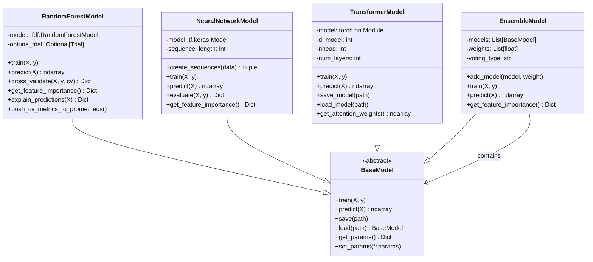
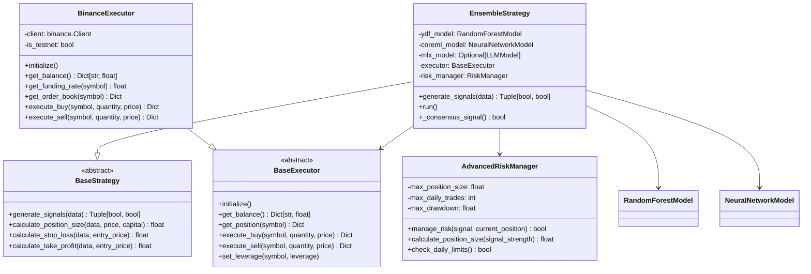
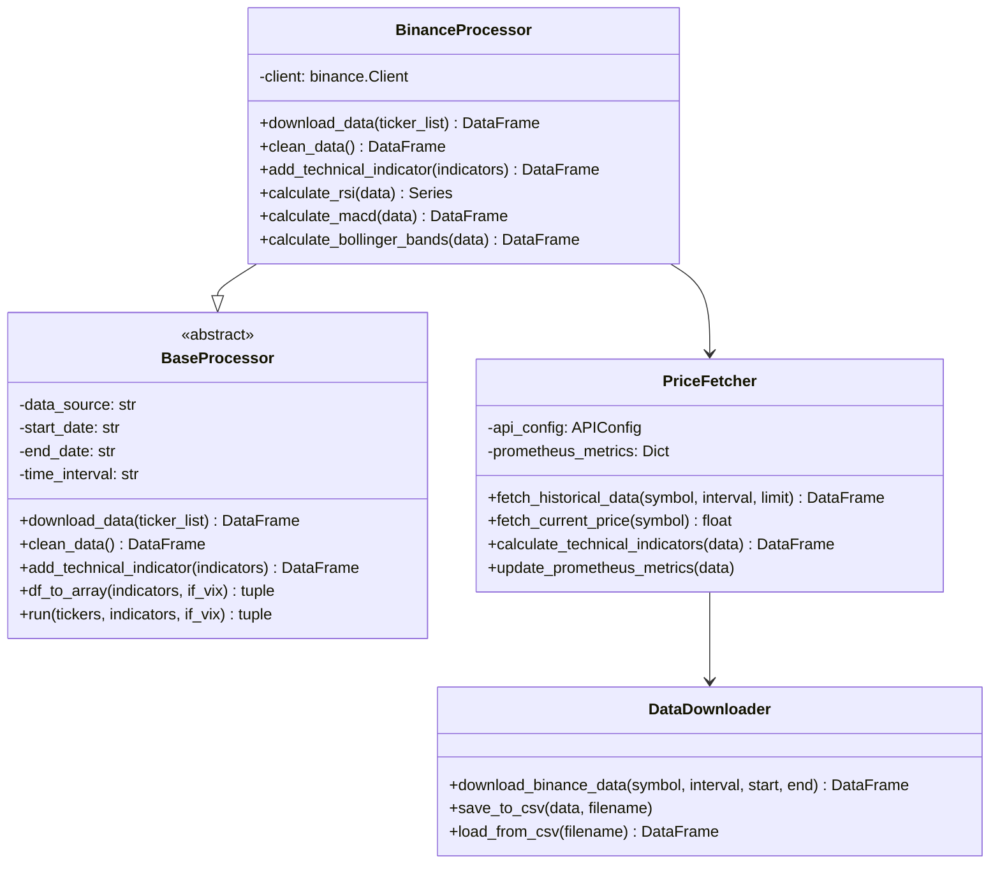
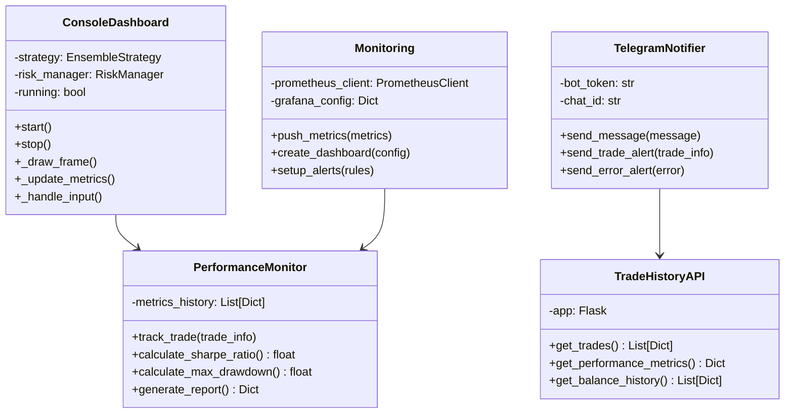

# ELVIS Trading Bot - Comprehensive Project Overview


## Table of Contents

- [Introduction](#introduction)
- [System Architecture](#system-architecture)
- [Core Components](#core-components)
  - [Models](#models)
  - [Trading System](#trading-system)
  - [Data Processing](#data-processing)
  - [Training Pipeline](#training-pipeline)
  - [Utilities & Monitoring](#utilities--monitoring)
- [Configuration](#configuration)
- [Testing](#testing)
- [Future Improvements](#future-improvements)
- [References](#references)

---

## Introduction

The ELVIS Trading Bot is a sophisticated, modular algorithmic trading system that leverages machine learning models for automated cryptocurrency trading. The system integrates multiple ML architectures, real-time data processing, risk management, and execution modules to facilitate intelligent trading strategies with comprehensive monitoring and visualization capabilities.

---

## System Architecture

```mermaid
graph TB
    subgraph "Entry Points"
        Main[main.py]
        Training[training/train_models.py]
        Scripts[run_*.sh]
    end
    
    subgraph "Core Models"
        BaseModel[BaseModel Interface]
        RF[RandomForestModel]
        NN[NeuralNetworkModel]
        Trans[TransformerModel]
        Ensemble[EnsembleModel]
        RL[RL Agents]
    end
    
    subgraph "Trading System"
        BaseStrategy[BaseStrategy]
        EnsStrategy[EnsembleStrategy]
        BaseExecutor[BaseExecutor]
        BinanceExec[BinanceExecutor]
        RiskMgr[AdvancedRiskManager]
    end
    
    subgraph "Data Pipeline"
        BaseProcessor[BaseProcessor]
        BinanceProcessor[BinanceProcessor]
        PriceFetcher[PriceFetcher]
        DataDownloader[DataDownloader]
    end
    
    subgraph "Training Infrastructure"
        TrainPipeline[TrainingPipeline]
        ModelTrainer[ModelTrainer]
        Evaluator[Evaluator]
        ReplayBuffer[ReplayBuffer]
    end
    
    subgraph "Utilities & Monitoring"
        Dashboard[ConsoleDashboard]
        TelegramBot[TelegramNotifier]
        TradeAPI[TradeHistoryAPI]
        Monitoring[Monitoring]
        Grafana[Grafana Dashboards]
    end
    
    subgraph "Configuration"
        Config[config.py]
        ModelConfig[model_config.yaml]
        APIConfig[API Configuration]
    end
    
    Main --> EnsStrategy
    Main --> BinanceExec
    Main --> Dashboard
    Main --> RiskMgr
    Main --> TelegramBot
    Main --> TradeAPI
    
    Training --> TrainPipeline
    TrainPipeline --> ModelTrainer
    TrainPipeline --> Evaluator
    
    EnsStrategy --> RF
    EnsStrategy --> NN
    EnsStrategy --> Ensemble
    
    RF --|> BaseModel
    NN --|> BaseModel
    Trans --|> BaseModel
    Ensemble --|> BaseModel
    
    EnsStrategy --|> BaseStrategy
    BinanceExec --|> BaseExecutor
    BinanceProcessor --|> BaseProcessor
    
    EnsStrategy --> PriceFetcher
    EnsStrategy --> RiskMgr
    BinanceExec --> PriceFetcher
    
    TrainPipeline --> BinanceProcessor
    ModelTrainer --> RL
    
    Dashboard --> Monitoring
    Monitoring --> Grafana
    
    Config --> Main
    Config --> Training
    ModelConfig --> TrainPipeline
```

---

## Core Components

### Models

The system implements a hierarchical model architecture with a common interface:



### Trading System

The trading system follows a strategy pattern with pluggable execution backends:



### Data Processing

Data processing follows a pipeline pattern for modularity and extensibility:



### Training Pipeline

The training system supports multiple model types and distributed training:


### Utilities & Monitoring

The system includes comprehensive monitoring and utility components:



---

## Core Models

### BaseModel Interface

Defines the abstract interface all models must implement, including methods for training, prediction, saving/loading, and parameter management.

### RandomForestModel

Implements a Random Forest classifier using TensorFlow Decision Forests. Supports training, evaluation, prediction, cross-validation with k-folds, and SHAP-based explainability. Includes robust error handling and logging.

### NeuralNetworkModel

A TensorFlow/Keras-based LSTM neural network model for time series forecasting. Supports sequence creation, training with early stopping, prediction, evaluation, and model persistence. Feature importance is approximated via sensitivity analysis.

### TransformerModel

Implements a transformer architecture for time series forecasting using PyTorch. Includes positional encoding, multi-head attention, and feed-forward layers. Supports training, evaluation, prediction, and saving/loading model state. Attention weights extraction is planned for interpretability.

### EnsembleModel

Combines multiple sub-models (Random Forest, Neural Network, etc.) using weighted soft or hard voting. Supports training orchestration, prediction aggregation, evaluation, feature importance aggregation, and configuration persistence.

---

## Training Pipeline

The training pipeline (`training/train_models.py`) manages the end-to-end process:

- Loads configuration and data.
- Prepares features and targets.
- Creates data loaders with time-series splits.
- Supports distributed training.
- Trains models with checkpointing and early stopping.
- Trains reinforcement learning agents.
- Evaluates models and saves metrics.
- Generates explanations using SHAP or LIME.
- Logs training progress and metrics.

---

## Data Processing

The `BaseProcessor` interface defines methods for downloading, cleaning, and feature engineering on market data. Implementations handle technical indicator calculation and data transformation for model consumption.

---

## Trading Strategies

### BaseStrategy

Abstract base class defining methods for signal generation, position sizing, stop loss, and take profit calculations.

### EnsembleStrategy

Combines predictions from multiple models including YDF Random Forest, CoreML Neural Network, and optionally MLX LLM. Generates consensus trading signals and calculates position sizes based on risk.

---

## Execution Modules

### BaseExecutor

Abstract interface for trading executors, defining methods for initialization, balance retrieval, order execution, and order management.

### BinanceExecutor

Concrete implementation interfacing with Binance API. Handles client initialization, balance queries, funding rates, order book retrieval, and order execution with error handling.

---

## Utilities

### PriceFetcher

Fetches historical and real-time Binance price data, calculates technical indicators (RSI, MACD, SMA, EMA), and updates Prometheus metrics for monitoring.

### ConsoleDashboard

Curses-based terminal UI displaying trading system metrics, system resource usage, and recent trades. Supports extensibility for multi-timeframe views and technical indicators.

### TrainingMonitor

Tracks training and validation metrics, supports early stopping, and displays progress during model training.

---

## Testing

Unit tests for the RandomForestModel validate training, prediction, evaluation metrics, feature importance, and cross-validation functionality, ensuring model robustness.

---

## Configuration

Configuration files in YAML and Python manage model parameters, training settings, data paths, and environment variables. The training pipeline reads these configurations to orchestrate the workflow.

---

## Monitoring and Metrics

Prometheus metrics integration allows pushing cross-validation metrics to a Pushgateway. The system tracks real-time price and indicator metrics, enabling observability and alerting.

---

## Future Improvements

- Enhanced visualization dashboards with multi-timeframe and technical indicator overlays.
- Advanced trading strategies with dynamic position sizing and regime detection.
- Expanded risk management including VaR and drawdown protection.
- Online and incremental learning capabilities.
- Improved model interpretability and explanation tools.
- Continuous integration of new data sources and market features.

---

## References

- `core/models/`
- `training/`
- `trading/strategies/`
- `trading/execution/`
- `utils/`
- `docs/`

### Documentation Files

- [Architecture Links Part 1](docs/architecture_links_part1.mmd)
- [Architecture Links](docs/architecture_links.mmd)
- [Bot Architecture Mermaid](docs/bot_architecture_mermaid.md)
- [Future Improvements](docs/future_improvements.md)
- [Random Forest Model Documentation](docs/random_forest.md)
- [Training Pipeline Documentation](docs/training.md)

---

This README will be maintained and expanded as the project evolves to provide clear guidance and documentation for developers and stakeholders.
