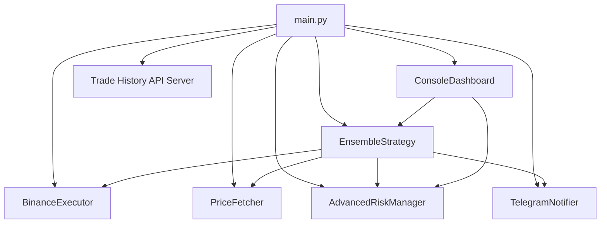
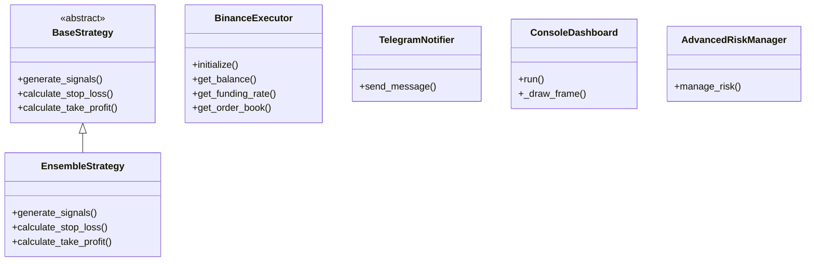

# ELVIS Trading Bot

## Overview

ELVIS (Enhanced Leveraged Virtual Investment System) is a modular framework for developing and deploying cryptocurrency trading bots on Binance Futures, specifically targeting BTC/USDT. It integrates various trading strategies, machine learning models (including Random Forest, Neural Networks, Transformers, and Reinforcement Learning), risk management techniques, and performance monitoring tools.

## Documentation

- [Training Documentation](docs/training.md) - Comprehensive guide to training RL agents
- [Random Forest Documentation](docs/random_forest.md) - Guide to the Random Forest model implementation
- [CHANGELOG.md](CHANGELOG.md) - Version history and changes
- [FUTURE_IMPROVEMENTS.md](FUTURE_IMPROVEMENTS.md) - Planned enhancements

## Random Forest Model Updates

The Random Forest model in `core/models/random_forest_model.py` has been enhanced with the following features:

- Integration of Optuna for automated hyperparameter optimization.
- Support for advanced feature engineering.
- Improved evaluation metrics handling with default values for missing metrics.
- Enhanced feature importance extraction supporting multiple importance types.
- Robust error handling and detailed logging.
- Updated training, prediction, evaluation, saving, and loading methods.

These improvements increase model robustness, interpretability, and ease of tuning for better trading performance.

## Training Data Downloader

The `training/data/data_downloader.py` script downloads OHLCV (Open, High, Low, Close, Volume) data from the public Binance API for the BTCUSDT trading pair. It saves the data locally as a CSV file (`price_data.csv`) for use in model training.

### Usage

Run the data downloader script to fetch the latest market data:

```bash
python training/data/data_downloader.py
```

This will create or update the `price_data.csv` file in the `training/data` directory.

## Model Training

The training pipeline is implemented in `training/train_models.py`. It loads configuration from `training/config/model_config.yaml`, prepares data, trains transformer and reinforcement learning models, evaluates them, and generates explanations.

### Running Training

Use the provided shell script to set up the environment and start training:

```bash
bash run_training.sh
```

## Configuration

Model training parameters are specified in `training/config/model_config.yaml`. Adjust this file to change model hyperparameters, data paths, and training settings.

## Installation

1. Clone the repository:

```bash
git clone https://github.com/cluster2600/elvis-trading.git
cd elvis-trading
```

2. Create and activate a virtual environment:

```bash
python3 -m venv env
source env/bin/activate
```

3. Install the package in development mode:

```bash
pip install -e .
```

4. Set up monitoring (optional):

```bash
# Install Prometheus
brew install prometheus  # macOS
# or
sudo apt-get install prometheus  # Ubuntu/Debian

# Install Grafana
brew install grafana  # macOS
# or
sudo apt-get install grafana  # Ubuntu/Debian
```

## Usage

### Training Models

```bash
./run_training.sh
```

This script will:
1. Activate the virtual environment
2. Install required packages
3. Run the model training pipeline
4. Save trained models and optimized parameters

### Validating Strategies

```bash
python trading/scripts/validate_strategy.py \
    --strategy examples/simple_strategy.py \
    --data your_data.csv \
    --mode all
```

The validation script supports:
- Monte Carlo simulations
- Walk-forward analysis
- Statistical tests
- Stress testing

### Monitoring with Grafana

ELVIS includes a comprehensive Grafana dashboard for real-time monitoring.

**Important:**
- Prometheus server runs on port 9090 by default (`http://localhost:9090`).
- The ELVIS app (main.py) must be running and must expose its metrics on port 8000 (`start_http_server(8000)`).
- Prometheus must be configured to scrape ELVIS metrics from `http://localhost:8000/metrics`.
- Grafana's Prometheus datasource must point to `http://localhost:8000` to visualize ELVIS metrics.

#### Steps:

1. Start Prometheus:

```bash
prometheus --config.file=/opt/homebrew/etc/prometheus.yml
```

2. Start the ELVIS app (must be running for metrics to be available):

```bash
python main.py --mode paper --log-level DEBUG
```

3. Start Grafana:

```bash
grafana-server --config /opt/homebrew/etc/grafana/grafana.ini
```

4. Access the dashboard at `http://localhost:3000` (default Grafana port).

## Architecture Diagram

### Component Interaction



### Class Structure



## Contributing

1. Fork the repository
2. Create a feature branch
3. Commit your changes
4. Push to the branch
5. Create a Pull Request

## License

This project is licensed under the MIT License - see the LICENSE file for details.

## Acknowledgments

- Thanks to all contributors
- Inspired by various trading systems and research papers
- Built with ❤️ for the crypto trading community

Special thanks to Annelotte Bonenkamp for her work:

**Bachelor Econometrics**  
**High-Frequency Algorithmic Bitcoin Trading Using Both Financial and Social Features**  
**Annelotte Bonenkamp** (12378593)  
**June 2021**
