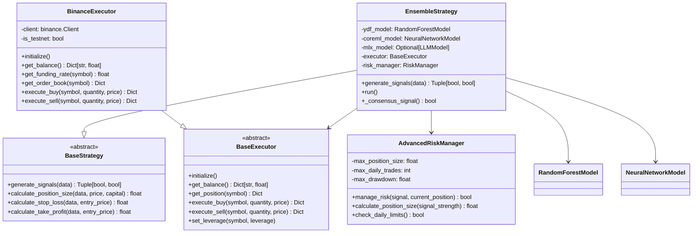
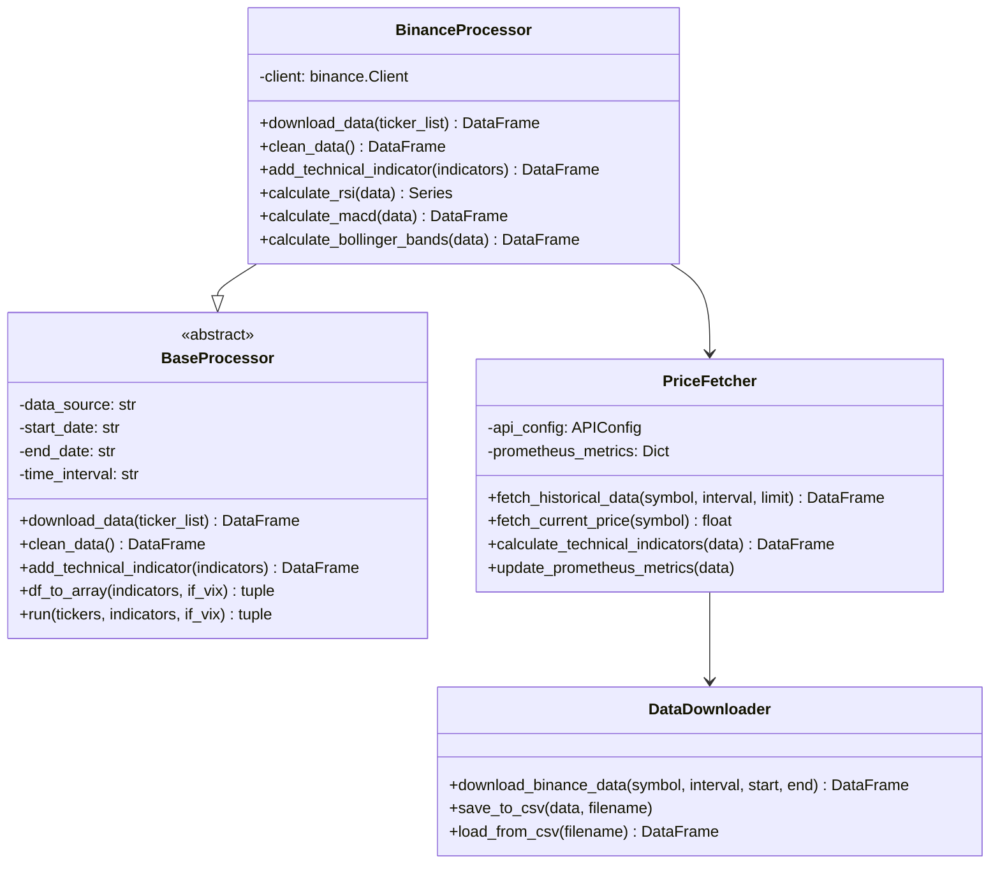
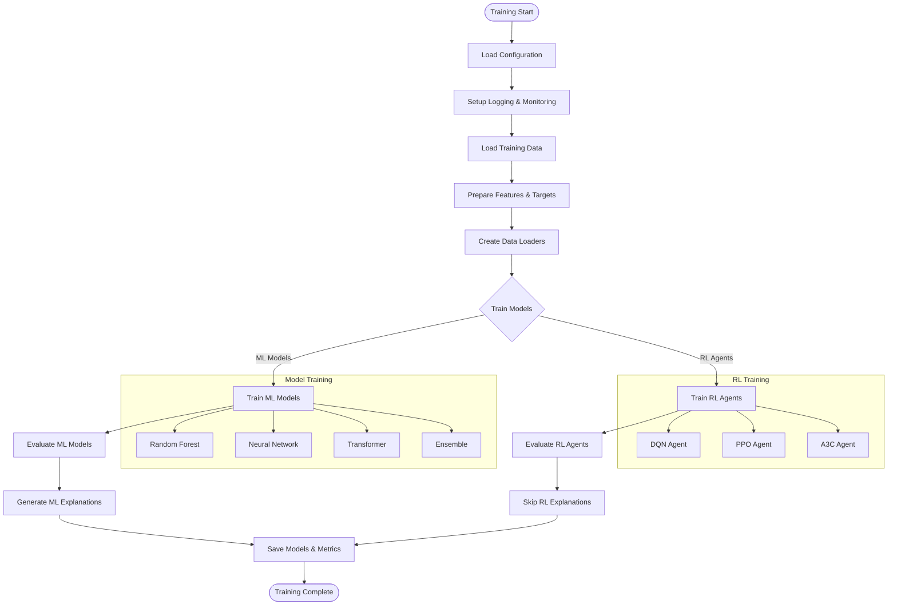
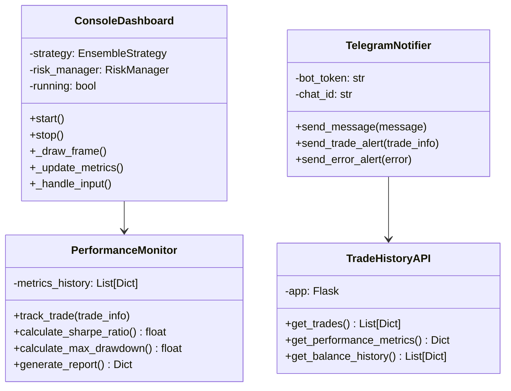
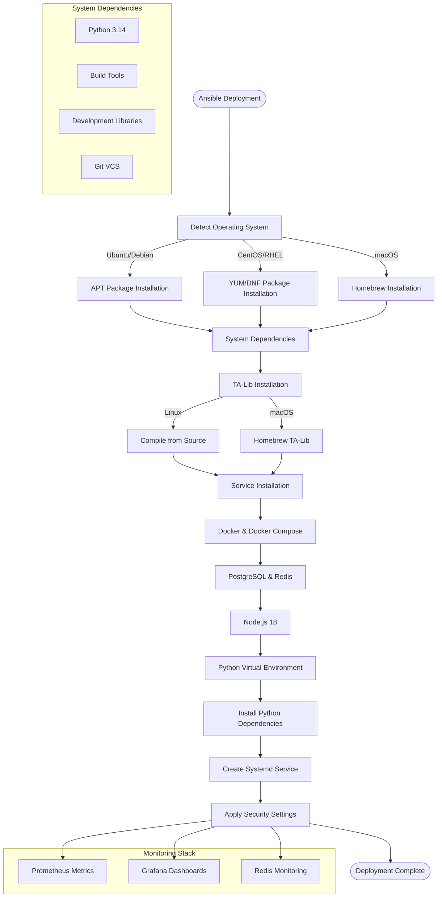

# ELVIS Trading Bot - Comprehensive Project Overview

**E**nhanced **L**everaged **V**irtual **I**nvestment **S**ystem


## Table of Contents

- [Introduction](#introduction)
- [2026-02-18 Hardening Notes](#2026-02-18-hardening-notes)
- [Current Status](#current-status-july-2026)
- [Security & Performance](#security--performance)
  - [Vault / OpenBao Integration](#hashicorp-vault--openbao-integration)
  - [Fast Trading Loop](#fast-trading-loop)
  - [API Monitoring](#api-monitoring-dashboard)
- [System Architecture](#system-architecture)
- [Core Components](#core-components)
  - [Models](#models)
  - [Trading System](#trading-system)
  - [Data Processing](#data-processing)
  - [Training Pipeline](#training-pipeline)
  - [Utilities & Monitoring](#utilities--monitoring)
- [Security Documentation](#security-documentation)
- [Configuration](#configuration)
- [Testing](#testing)
- [Future Improvements](#future-improvements)
- [References](#references)

---

## Introduction

The **ELVIS** (**E**nhanced **L**everaged **V**irtual **I**nvestment **S**ystem) Trading Bot is a sophisticated, modular algorithmic trading system that leverages machine learning models for automated cryptocurrency trading. The system integrates multiple ML architectures, real-time data processing, risk management, and execution modules to facilitate intelligent trading strategies with comprehensive monitoring and visualization capabilities.

## 2026-02-18 Hardening Notes

The February 18, 2026 hardening update closed issues `#9`, `#10`, `#11`, `#13`, and `#16` and changed runtime defaults in ways operators need to know:

- `VAULT_TOKEN` is no longer hardcoded or auto-populated.
- `POSTGRES_PASSWORD` no longer has a hardcoded default.
- Trade History API bind is now local by default:
  - `TRADE_HISTORY_API_HOST=127.0.0.1`
  - `TRADE_HISTORY_API_PORT=5050`
- Repository hygiene policy now ignores local virtualenv/build trees by default (`env*/`, `venv*/`, `.venv/`, `tensorflow/`).

Operational runbook and troubleshooting:
- `docs/ops/2026-02-18_container_observability_runbook.md`
- `SECURITY.md`

## Current Status (July 2026)

The bot runs on **Python 3.14**, trades in **paper mode** against live Binance
market data, and ships as a Docker image (`ghcr.io/cluster2600/elvis`). Secrets
are Vault/OpenBao-backed, the control API is JWT+RBAC protected, and the test
suite runs green in CI. See [RELEASE_NOTES.md](RELEASE_NOTES.md) for the
current release.

## Security & Performance

### HashiCorp Vault / OpenBao Integration
- **Centralized Secret Management**: API keys live in the Vault KV v2 mount `secrets`, one path per service (`secrets/binance`, `secrets/binance_testnet`)
- **Encrypted local fallback**: Fernet (AES-128-CBC + HMAC-SHA256) encrypted file, master key in the OS keyring
- **Zero Hardcoded Secrets**: credentials are never committed as literals
- **Lookup order**: Vault → environment variables → encrypted local file
- **Live monitoring**: console dashboard shows per-service Vault/DB/exchange health

### Fast Trading Loop
- **No per-iteration sleep** in the trading loop; pacing follows the active strategy's `trading_frequency_minutes` when set
- **Inter-trade cooldown**: a configurable cooldown (default ~15 min) is enforced by `TradeCooldownManager` — deliberate, not zero
- **Fast secrets**: Vault reads are cached (encrypted, short TTL)

### API Monitoring Dashboard
- **Visual Status Indicators**: ✅❌⏳ for Binance, Postgres, Vault, Redis, Telegram
- **Response Time Tracking**: live per-service latency
- **Overall Health Score**: connected services ÷ total, shown in the dashboard
- **Prometheus**: `/metrics` on the trade-history API (port 5050), Grafana on 3001

**Quick Security Setup:**
```bash
# Start Vault/OpenBao (Development)
vault server -dev -dev-root-token-id=<choose-a-local-dev-token>
export VAULT_ADDR=http://127.0.0.1:8200
export VAULT_TOKEN=<choose-a-local-dev-token>

# Store secrets securely (KV v2 mount `secrets`, one path per service)
vault kv put secrets/binance \
    api_key=your-api-key \
    secret_key=your-api-secret

# Start with maximum security
python main.py --mode paper  # Shows ✅ Vault connected
```

### Research-Based Strategy

**ELVIS includes an academic research-based strategy** following the methodology from:
*"High-Frequency Algorithmic Bitcoin Trading Using Both Financial and Social Features"* by Bonenkamp (2021)

**Key Features:**
- **14.9% annual return / 2.02 Sharpe** — the *paper's reported results*, used as targets; **not** verified live results of this bot
- **Binary Classification** (BUY/SELL only - no HOLD signals)
- **9 Financial Indicators** (RSI, STOCH, ROC, EMA, MACD, CCI, OBV, ATR, WILLR)
- **2 Social Features** (Twitter sentiment + Google Trends; require optional `tweepy`/`pytrends` + API keys, else neutral defaults)
- **Random Forest Model** (600 trees, 10-fold time-series cross-validation)
- **5-Minute Trading Frequency** as specified in research

**Usage:**
```bash
# Basic research strategy
STRATEGY_MODE=research python main.py --mode paper

# With social features
STRATEGY_MODE=research SOCIAL_DATA_ENABLED=true python main.py --mode paper

# With rolling training (1-week windows)
ROLLING_TRAINING_ENABLED=true STRATEGY_MODE=research python main.py --mode paper
```

**What it changes:**
- ❌ **Bot idles in chop** → ✅ **Binary classification always takes a side**
- ❌ **Ad-hoc methodology** → ✅ **Published academic methodology** (the paper reports 14.9%/yr and 57.6% F1 — treat as targets, not guarantees; live results depend on market regime and fees)
- ❌ **HOLD signals** → ✅ **Always BUY or SELL decisions**

### Quick Start

**Option 1: Docker Deployment (Recommended)**
```bash
git clone https://github.com/cluster2600/ELVIS.git
cd ELVIS/ansible
chmod +x run_setup.sh
./run_setup.sh --docker
# API health: http://localhost:5050/health
# Grafana: http://localhost:3001
```

**Option 2: Secure Development Setup**
```bash
# 1. Clone and setup
git clone https://github.com/cluster2600/ELVIS.git
cd ELVIS

# 2. Start HashiCorp Vault for secure secrets
vault server -dev -dev-root-token-id=<choose-a-local-dev-token> &
export VAULT_ADDR=http://127.0.0.1:8200
export VAULT_TOKEN=<choose-a-local-dev-token>

# 3. Store your API keys securely in Vault (KV v2 mount `secrets`)
vault kv put secrets/binance \
    api_key=your-binance-api-key \
    secret_key=your-binance-api-secret

# 4. Start trading (paper mode)
python main.py --mode paper
# Dashboard shows ✅ Vault connected
```

**Option 3: Direct Execution**
```bash
git clone https://github.com/cluster2600/ELVIS.git
cd ELVIS
python main.py --mode paper --log-level INFO
```

**Option 4: Research-Based Strategy**
```bash
# Use the academic research methodology (paper targets 14.9%/yr; not a guarantee)
STRATEGY_MODE=research python main.py --mode paper --log-level INFO

# With social features (Twitter + Google Trends)
STRATEGY_MODE=research SOCIAL_DATA_ENABLED=true python main.py --mode paper
```

### 📊 **What's Working**
- ✅ **Live Market Data**: Fetching real-time BTCUSDT price data from Binance
- ✅ **Technical Analysis**: Calculating SMA, ADX, RSI, MACD, Bollinger Bands, ATR
- ✅ **Trading Signals**: Generating buy/sell signals with confidence scoring  
- ✅ **Paper Trading**: Safe execution of trades in simulation mode
- ✅ **Performance Dashboard**: Real-time metrics, PnL tracking, trade analytics
- ✅ **Risk Management**: Position sizing, stop-loss, take-profit calculations
- ✅ **Docker Support**: Containerized deployment ready
- ✅ **Comprehensive Logging**: Detailed activity monitoring
- ✅ **Research-Based Strategy**: Academic methodology targeting 14.9% annual returns
- ✅ **Binary Classification**: Always BUY/SELL (no HOLD signals for active trading)
- ✅ **Social Features**: Twitter sentiment + Google Trends integration

### 🔍 **Live Trading Activity**
The bot continuously:
1. Fetches 1-minute BTCUSDT candlestick data
2. Calculates technical indicators
3. Runs ensemble strategy analysis
4. Generates trading signals when conditions are met
5. Executes paper trades with proper logging
6. Updates performance metrics in real-time

### 📈 **Sample Output** (illustrative — prices from an earlier session)
```
[INFO] Fetched and cached 200 klines for BTCUSDT 1m.
[INFO] Signal Check: Fast MA=105168.01, Slow MA=104313.11, ADX=53.15, Buy=False, Sell=False
[INFO] [PAPER TRADE] BUY order executed: 0.001500 BTCUSDT at $104750.00
```

### 🐳 **Docker Quick Start**
```bash
# Build and run in container
docker build -f Dockerfile.simple -t elvis-trading-bot:simple .
docker run --name elvis-bot elvis-trading-bot:simple
```

---

## System Architecture

```mermaid
graph TB
    subgraph "Entry Points"
        Main[main.py]
        Training[training/train_models.py]
        Scripts[run_*.sh]
    end
    
    subgraph "Core Models"
        BaseModel[BaseModel Interface]
        RF[RandomForestModel]
        NN[NeuralNetworkModel]
        Trans[TransformerModel]
        Ensemble[EnsembleModel]
        RL[RL Agents]
    end
    
    subgraph "Trading System"
        BaseStrategy[BaseStrategy]
        EnsStrategy[EnsembleStrategy]
        BaseExecutor[BaseExecutor]
        BinanceExec[BinanceExecutor]
        RiskMgr[AdvancedRiskManager]
    end
    
    subgraph "Data Pipeline"
        BaseProcessor[BaseProcessor]
        BinanceProcessor[BinanceProcessor]
        PriceFetcher[PriceFetcher]
        DataDownloader[DataDownloader]
    end
    
    subgraph "Training Infrastructure"
        TrainPipeline[TrainingPipeline]
        ModelTrainer[ModelTrainer]
        Evaluator[Evaluator]
        ReplayBuffer[ReplayBuffer]
    end
    
    subgraph "Utilities & Monitoring"
        Dashboard[ConsoleDashboard]
        TelegramBot[TelegramNotifier]
        TradeAPI[TradeHistoryAPI]
        PerfMonitor[PerformanceMonitor]
        Prometheus[Prometheus /metrics]
        Grafana[Grafana Dashboards]
    end
    
    subgraph "Configuration"
        Config[config.py]
        ModelConfig[model_config.yaml]
        APIConfig[API Configuration]
    end
    
    Main --> EnsStrategy
    Main --> BinanceExec
    Main --> Dashboard
    Main --> RiskMgr
    Main --> TelegramBot
    Main --> TradeAPI
    
    Training --> TrainPipeline
    TrainPipeline --> ModelTrainer
    TrainPipeline --> Evaluator
    
    EnsStrategy --> RF
    EnsStrategy --> NN
    EnsStrategy --> Ensemble
    
    RF --> BaseModel
    NN --> BaseModel
    Trans --> BaseModel
    Ensemble --> BaseModel
    
    EnsStrategy --> BaseStrategy
    BinanceExec --> BaseExecutor
    BinanceProcessor --> BaseProcessor
    
    EnsStrategy --> PriceFetcher
    EnsStrategy --> RiskMgr
    BinanceExec --> PriceFetcher
    
    TrainPipeline --> BinanceProcessor
    ModelTrainer --> RL
    
    Dashboard --> PerfMonitor
    PerfMonitor --> Prometheus
    Prometheus --> Grafana
    
    Config --> Main
    Config --> Training
    ModelConfig --> TrainPipeline
```



---

## Core Components

### Models

The system implements a hierarchical model architecture with a common interface:


### Trading System

The trading system follows a strategy pattern with pluggable execution backends:



### Data Processing

Data processing follows a pipeline pattern for modularity and extensibility:



### Training Pipeline

The training system supports multiple model types and distributed training:



### Utilities & Monitoring

The system includes comprehensive monitoring and utility components:



---

## Core Models

### BaseModel Interface

Defines the abstract interface all models must implement, including methods for training, prediction, saving/loading, and parameter management.

### RandomForestModel

Implements a Random Forest classifier using scikit-learn (`RandomForestClassifier`), persisted with joblib. Supports training, evaluation, prediction, k-fold cross-validation, and Prometheus Pushgateway CV metrics. `explain_predictions()` uses SHAP when the `shap` package is installed, else falls back to sklearn `feature_importances_` (no LIME in the base model); `tune_hyperparameters()` uses Optuna when installed, else a `GridSearchCV` fallback.

### NeuralNetworkModel

A TensorFlow/Keras-based LSTM neural network model for time series forecasting. Supports sequence creation, training with early stopping, prediction, evaluation, and model persistence. Feature importance is approximated via sensitivity analysis.

### TransformerModel

Implements a transformer architecture for time series forecasting using PyTorch. Includes positional encoding, multi-head attention, and feed-forward layers. Supports training, evaluation, prediction, and saving/loading model state. Attention weights extraction is planned for interpretability.

### EnsembleModel

Combines multiple sub-models (Random Forest, Neural Network, etc.) using weighted soft or hard voting. Supports training orchestration, prediction aggregation, evaluation, feature importance aggregation, and configuration persistence.

---

## Training Pipeline

The training pipeline (`training/train_models.py`) manages the end-to-end process:

- Loads configuration and data.
- Prepares features and targets.
- Creates data loaders with time-series splits.
- Supports distributed training.
- Trains models with checkpointing and early stopping.
- Trains reinforcement learning agents.
- Evaluates models and saves metrics.
- Generates explanations using SHAP or LIME.
- Logs training progress and metrics.

---

## Data Processing

The `BaseProcessor` interface defines methods for downloading, cleaning, and feature engineering on market data. Implementations handle technical indicator calculation and data transformation for model consumption.

---

## Trading Strategies

### BaseStrategy

Abstract base class defining methods for signal generation, position sizing, stop loss, and take profit calculations.

### EnsembleStrategy

Combines predictions from multiple models including YDF Random Forest, CoreML Neural Network, and optionally MLX LLM. Generates consensus trading signals and calculates position sizes based on risk.

---

## Execution Modules

### BaseExecutor

Abstract interface for trading executors, defining methods for initialization, balance retrieval, order execution, and order management.

### BinanceExecutor

Concrete implementation interfacing with Binance API. Handles client initialization, balance queries, funding rates, order book retrieval, and order execution with error handling.

---

## Utilities

### PriceFetcher

Fetches historical and real-time Binance price data, calculates technical indicators (RSI, MACD, SMA, EMA), and updates Prometheus metrics for monitoring.

### ConsoleDashboard

Curses-based terminal UI displaying trading system metrics, system resource usage, and recent trades. Supports extensibility for multi-timeframe views and technical indicators.

### TrainingMonitor

Tracks training and validation metrics, supports early stopping, and displays progress during model training.

---

## Testing

Unit tests for the RandomForestModel validate training, prediction, evaluation metrics, feature importance, and cross-validation functionality, ensuring model robustness.

---

## Deployment with Ansible

The ELVIS Trading Bot includes comprehensive Ansible automation for seamless deployment across multiple platforms. Choose between containerized Docker deployment (recommended) or traditional installation.

### 🐳 **Docker Deployment (Recommended)**

```bash
cd ansible
chmod +x run_setup.sh
./run_setup.sh --docker
```

**What you get:**
- Complete containerized stack with PostgreSQL, Redis, Prometheus, and Grafana
- Automatic service orchestration and health monitoring
- Isolated environment with persistent data volumes
- One-command deployment and management

### 🔧 **Traditional Installation**

```bash
cd ansible
./run_setup.sh
```

**What you get:**
- Direct installation on host system
- Full system integration and service management
- Platform-specific optimizations

### What Gets Automated

The Ansible deployment system provides:



### Deployment Features

- **Cross-platform Support**: Ubuntu/Debian, CentOS/RHEL, macOS
- **Automated Dependency Resolution**: System packages, Python libraries, TA-Lib compilation
- **Service Management**: Systemd service creation with auto-restart capabilities
- **Security Hardening**: File permissions, service isolation, user separation
- **Multi-environment Support**: Development, staging, production configurations
- **Database Setup**: PostgreSQL and Redis installation and configuration
- **Monitoring Integration**: Prometheus metrics and Grafana dashboards
- **Container Support**: Docker and Docker Compose installation

### Environment Configuration

```bash
# Docker deployment (recommended)
./run_setup.sh --docker

# Development (default)
./run_setup.sh

# Staging environment
./run_setup.sh staging

# Production environment  
./run_setup.sh production

# Test connection only
./run_setup.sh --test

# Dry run (check mode)
./run_setup.sh --check
```

### 🐳 **Docker Deployment Details**

The Docker deployment creates a complete ecosystem:

```
┌─────────────────┐    ┌─────────────────┐    ┌─────────────────┐
│   ELVIS Bot     │    │   PostgreSQL    │    │     Redis       │
│   Port: 5050    │◄──►│   Port: 5432    │    │   Port: 6379    │
│   Port: 8000    │    │   DB: trading   │    │   Cache/Queue   │
└─────────────────┘    └─────────────────┘    └─────────────────┘
         │                       │                       │
         └───────────────────────┼───────────────────────┘
                                 │
┌─────────────────┐    ┌─────────────────┐
│   Prometheus    │    │    Grafana      │
│   Port: 9090    │    │   Port: 3000    │
│   Metrics       │    │   Dashboards    │
└─────────────────┘    └─────────────────┘
```

**Access Points:**
- Trading Bot API: http://localhost:5050/api/docs
- Web Dashboard: http://localhost:8000
- Grafana Monitoring: http://localhost:3001
- Prometheus Metrics: http://localhost:9090

**Management Commands:**
```bash
# View service status
docker ps

# Check trading bot logs
docker logs -f elvis-trading-bot

# Restart services
docker restart elvis-trading-bot

# Full stack management
docker-compose up -d
docker-compose down
docker-compose logs -f
```

### Post-Deployment

After successful Ansible deployment:

1. **Configure Environment Variables**:
   ```bash
   cp .env.example .env
   # Edit .env with your API keys
   ```

2. **Start the ELVIS Bot**:
   ```bash
   sudo systemctl start elvis-bot
   sudo systemctl enable elvis-bot
   ```

3. **Access Web Interfaces**:
   - Grafana: http://localhost:3001
   - API Documentation: http://localhost:5050/api/docs
   - Prometheus: http://localhost:9090

For detailed Ansible documentation, see [ansible/README.md](ansible/README.md).

---

## Security Documentation

### 🔐 **Enterprise-Grade Security Implementation**

ELVIS Trading Bot implements comprehensive security with HashiCorp Vault integration:

#### **Security Architecture**
- **[SECURITY.md](SECURITY.md)** - Complete security architecture and implementation details
- **[docs/VAULT_SETUP.md](docs/VAULT_SETUP.md)** - Step-by-step Vault configuration guide
- **[docs/README.md](docs/README.md)** - Documentation index and quick start

#### **Key Security Features**
```
🛡️ HashiCorp Vault / OpenBao Integration
├── KV v2 secrets engine (mount `secrets`) with versioning
├── Fernet-encrypted local fallback (AES-128-CBC + HMAC-SHA256),
│   master key in the OS keyring
├── Lookup order: Vault → environment → encrypted local file
├── Encrypted local cache with 5-minute TTL
└── Live health monitoring in the console dashboard

🔒 Zero Hardcoded Secrets
├── All API keys read at runtime (Vault or env), never committed
└── Role-based access control on the control API (JWT `role` claim)

📊 Security Monitoring
├── Live dashboard with visual indicators (✅❌⏳)
├── Response time tracking per service
└── Overall health percentage
```

> **Honest scope**: this is a personal/experimental bot. It has **no** SOC 2,
> FIPS 140-2, or OWASP certification, and does not use AES-256-GCM. Any formal
> compliance would come from the Vault/OpenBao deployment you run, not from
> this repository. See [SECURITY.md](SECURITY.md) for the authoritative posture.

#### **Quick Security Setup**
```bash
# 1. Start Vault (Development)
vault server -dev -dev-root-token-id=<choose-a-local-dev-token>

# 2. Configure environment
export VAULT_ADDR=http://127.0.0.1:8200
export VAULT_TOKEN=<choose-a-local-dev-token>

# 3. Store secrets securely (KV v2 mount `secrets`, one path per service)
vault kv put secrets/binance \
    api_key=your-api-key \
    secret_key=your-api-secret

# 4. Verify security status
python main.py --mode paper
# Dashboard shows: ✅ Vault 3ms (connected)
```

#### **Security Monitoring Dashboard**
The console dashboard provides real-time security monitoring:
```
--- API Status ---
✅ Overall: 100%   (connected services ÷ total; example)
✅ Vault        3ms
✅ Binance Spot 45ms  
✅ Postgres     12ms
Other: BIN✅ RED✅ TEL❌ PRO✅
Updated: 18:15:42
```

#### **Emergency Procedures**
- **Secret Compromise**: Immediate token revocation and rotation
- **Vault Unavailable**: Automatic fallback to secure local storage  
- **Authentication Failure**: Alert and graceful degradation
- **Incident Response**: Complete forensic audit trail

For complete security documentation, see **[SECURITY.md](SECURITY.md)** and **[docs/VAULT_SETUP.md](docs/VAULT_SETUP.md)**.

---

## Configuration

Configuration files in YAML and Python manage model parameters, training settings, data paths, and environment variables. The training pipeline reads these configurations to orchestrate the workflow.

---

## Monitoring and Metrics

Prometheus metrics integration allows pushing cross-validation metrics to a Pushgateway. The system tracks real-time price and indicator metrics, enabling observability and alerting.

---

## Future Improvements

- Enhanced visualization dashboards with multi-timeframe and technical indicator overlays.
- Advanced trading strategies with dynamic position sizing and regime detection.
- Expanded risk management including VaR and drawdown protection.
- Online and incremental learning capabilities.
- Improved model interpretability and explanation tools.
- Continuous integration of new data sources and market features.

---

## References

- `core/models/`
- `training/`
- `trading/strategies/`
- `trading/execution/`
- `utils/`
- `docs/`

### Documentation Files

- [Verified Architecture (mermaid)](docs/architecture.md)
- [Bot Architecture Mermaid](docs/bot_architecture_mermaid.md)
- [Documentation Index](docs/README.md)
- [Security Posture](SECURITY.md)
- [Vault Setup](docs/VAULT_SETUP.md)
- [Trading System](docs/trading_system.md)
- [Paper Trading Setup](PAPER_TRADING_SETUP.md)
- [Future Improvements](docs/future_improvements.md)
- [Random Forest Model Documentation](docs/random_forest.md)
- [Training Pipeline Documentation](docs/training.md)
- [Release Notes](RELEASE_NOTES.md)

---

This README will be maintained and expanded as the project evolves to provide clear guidance and documentation for developers and stakeholders.
