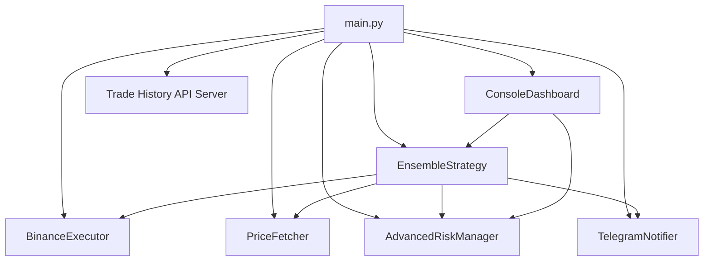
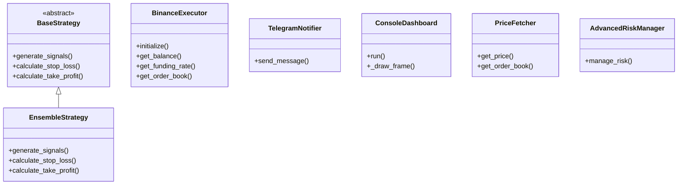

# ELVIS: Enhanced Leveraged Virtual Investment System


## Overview

ELVIS (Enhanced Leveraged Virtual Investment System) is a modular framework for developing and deploying cryptocurrency trading bots on Binance Futures, specifically targeting BTC/USDT. It integrates various trading strategies, machine learning models (including Random Forest, Neural Networks, Transformers, and Reinforcement Learning), risk management techniques, and performance monitoring tools.

## Documentation

- [Training Documentation](docs/training.md) - Comprehensive guide to training RL agents
- [Random Forest Documentation](docs/random_forest.md) - Guide to the Random Forest model implementation
- [CHANGELOG.md](CHANGELOG.md) - Version history and changes
- [FUTURE_IMPROVEMENTS.md](FUTURE_IMPROVEMENTS.md) - Planned enhancements

## Sources

This project is inspired by and builds upon several academic papers and research:

- **Deep Reinforcement Learning for Cryptocurrency Trading** by Berend Jelmer Dirk Gort et al.
- **High-Frequency Algorithmic Bitcoin Trading Using Both Financial and Social Features** by Annelotte Bonenkamp, Bachelor Econometrics, 12378593, June 2021.
- **Attention Is All You Need** by Vaswani et al. (Transformer architecture)
- **Proximal Policy Optimization Algorithms** by Schulman et al. (PPO implementation)
- **A Comprehensive Guide to Machine Learning for Trading** by Marcos Lopez de Prado

> **⚠ WARNING: NON-PRODUCTION MODE ONLY ⚠**
>
> ELVIS is currently configured to run in non-production mode by default. Live trading is disabled for safety.
>
> This project is for educational purposes only and is not production-ready without extensive validation.
>
> Leveraged trading carries high risk—use simulation or Binance Testnet first.
>
> To enable live trading (at your own risk), set `PRODUCTION_MODE: True` in `config/config.py`.

## Features

- **Machine Learning Models**
  - Transformer-based time series forecasting
  - Reinforcement learning agents
  - Explainable AI components
  - Automated feature engineering

- **Risk Management**
  - Advanced position sizing using Kelly Criterion
  - Dynamic risk allocation based on market regimes
  - Drawdown protection with circuit breakers
  - Correlation analysis and portfolio optimization

- **Data Processing**
  - On-chain data integration
  - Order book analysis
  - Funding rate monitoring
  - Technical indicator calculation
  - Market regime detection

- **Strategy Validation**
  - Monte Carlo simulations
  - Walk-forward analysis
  - Statistical validation
  - Stress testing
  - Performance metrics

- **Monitoring & Visualization**
  - Real-time Prometheus metrics
  - Grafana dashboards for trading analytics
  - System resource monitoring
  - Order book depth visualization
  - Performance tracking and alerts

## Installation

1. Clone the repository:

```bash
git clone https://github.com/cluster2600/elvis-trading.git
cd elvis-trading
```

2. Create and activate a virtual environment:

```bash
python -m venv venv
source venv/bin/activate  # On Windows: venv\Scripts\activate
```

3. Install the package in development mode:

```bash
pip install -e .
```

4. Set up monitoring (optional):

```bash
# Install Prometheus
brew install prometheus  # macOS
# or
sudo apt-get install prometheus  # Ubuntu/Debian

# Install Grafana
brew install grafana  # macOS
# or
sudo apt-get install grafana  # Ubuntu/Debian
```

## Configuration

The system uses YAML configuration files for different components:

- `trading/config/model_config.yaml`: Machine learning model settings
- `trading/config/risk_config.yaml`: Risk management parameters
- `trading/config/data_config.yaml`: Data processing settings
- `trading/config/validation_config.yaml`: Strategy validation parameters
- `/opt/homebrew/etc/grafana/provisioning/datasources/datasources.yml`: System location for Prometheus data source configuration
- `/opt/homebrew/var/lib/grafana/*.json`: System location for Grafana dashboard files
- `grafana/provisioning/datasources/datasources.yml`: Prometheus data source configuration
- `grafana/provisioning/dashboards/dashboards.yml`: Grafana dashboard provisioning

## Usage

### Training Models

```bash
./run_training.sh
```

This script will:
1. Activate the virtual environment
2. Install required packages
3. Run the model training pipeline
4. Save trained models and optimized parameters

### Validating Strategies

```bash
python trading/scripts/validate_strategy.py \
    --strategy examples/simple_strategy.py \
    --data your_data.csv \
    --mode all
```

The validation script supports:
- Monte Carlo simulations
- Walk-forward analysis
- Statistical tests
- Stress testing

### Monitoring with Grafana

ELVIS includes a comprehensive Grafana dashboard for real-time monitoring.

**Important:**
- Prometheus server runs on port 9090 by default (`http://localhost:9090`).
- The ELVIS app (main.py) must be running and must expose its metrics on port 8000 (`start_http_server(8000)`).
- Prometheus must be configured to scrape ELVIS metrics from `http://localhost:8000/metrics`.
- Grafana's Prometheus datasource must point to `http://localhost:8000` to visualize ELVIS metrics.

#### Steps:

1. Start Prometheus:

```bash
prometheus --config.file=/opt/homebrew/etc/prometheus.yml
```

2. Start the ELVIS app (must be running for metrics to be available):

```bash
python main.py --mode paper --log-level DEBUG
```

3. Start Grafana:

```bash
grafana-server --config /opt/homebrew/etc/grafana/grafana.ini
```

4. Access the dashboard at `http://localhost:3000` (default Grafana port).

## Architecture Diagram

### Component Interaction



### Class Structure



## Contributing

1. Fork the repository
2. Create a feature branch
3. Commit your changes
4. Push to the branch
5. Create a Pull Request

## License

This project is licensed under the MIT License - see the LICENSE file for details.

## Acknowledgments

- Thanks to all contributors
- Inspired by various trading systems and research papers
- Built with ❤️ for the crypto trading community

Special thanks to Annelotte Bonenkamp for her work:

**Bachelor Econometrics**  
**High-Frequency Algorithmic Bitcoin Trading Using Both Financial and Social Features**  
**Annelotte Bonenkamp** (12378593)  
**June 2021**  
