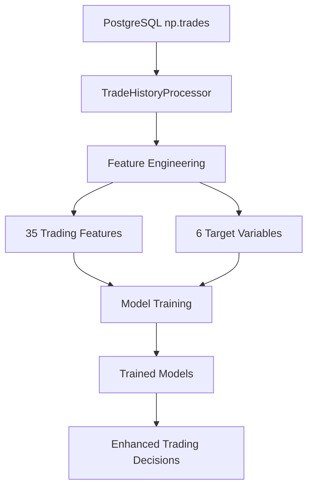

# 🎯 PostgreSQL Trade History Training Integration

## Overview
ELVIS now integrates PostgreSQL trade history directly into the machine learning training pipeline, enabling models to learn from actual trading performance and outcomes.

## 🏗️ Architecture

### Database Structure
```sql
-- Trade history table (np.trades schema)
CREATE TABLE np.trades (
    id SERIAL PRIMARY KEY,
    timestamp TIMESTAMP DEFAULT NOW(),
    symbol TEXT,
    side TEXT,                 -- BUY/SELL
    price REAL,               -- Execution price
    quantity REAL,            -- Trade quantity
    pnl REAL,                 -- Profit/Loss
    fee REAL                  -- Trading fees
);
```

### Feature Engineering Pipeline
The `TradeHistoryProcessor` extracts **35 features** from trade data:

#### 🏪 Market Features (12)
- `price`, `price_change`, `price_volatility`
- `price_sma_5`, `price_sma_20` (Simple Moving Averages)
- `volume_change`, `volume_sma`
- `price_momentum_5`, `price_momentum_20`
- `price_high_10`, `price_low_10`, `price_position`

#### 💰 Trading Features (14)
- `pnl`, `fee`, `net_result` (PnL - fees)
- `is_profitable`, `is_loss`, `is_breakeven`
- `notional_value`, `fee_ratio`, `fee_to_pnl_ratio`
- `rolling_pnl_5`, `rolling_pnl_20`
- `rolling_winrate_10`, `rolling_winrate_50`
- `win_streak`, `loss_streak`, `position_size_zscore`

#### ⏰ Time Features (3)
- `hour`, `day_of_week`, `minute`

#### 🔢 Position Features (6)
- `is_long`, `is_short` (side encoding)
- `side` (original), `quantity`, `price` (raw values)

### 🎯 Target Variables (6)
The system creates forward-looking targets for supervised learning:
- `future_profitable` - Will next N trades be profitable?
- `future_price_up` - Will price move up?
- `future_long_bias` - Market bias toward long positions
- `future_volatility` - Expected volatility
- `future_pnl` - Expected PnL
- `future_net_result` - Expected net result

## 🚀 Usage

### 1. Check Available Trade Data
```bash
python check_trade_data.py
```

### 2. Train with Trade History
```bash
# Basic training with trade integration
python train_with_trades.py

# Advanced options
python train_with_trades.py --limit 10000 --prediction-horizon 10 --epochs 50
```

### 3. Manual Integration
```bash
# Use the training script directly
python training/train_models.py --include-trade-history --debug
```

## 📊 Data Flow



## 🔧 Configuration

### Environment Variables
- `TRADE_LIMIT` - Maximum trades to load (default: 5000)
- `PREDICTION_HORIZON` - Lookahead window (default: 5)

### Database Configuration
Trade data is automatically loaded from the configured PostgreSQL database using HashiCorp Vault credentials:
- Host: `secret/database/credentials`
- Schema: `np` (paper trading namespace)

## 📈 Benefits

1. **Real Performance Learning**: Models learn from actual trading outcomes
2. **Pattern Recognition**: Identifies profitable trading patterns
3. **Risk Assessment**: Better understanding of fee impacts and risks
4. **Time-based Insights**: Learns optimal trading times
5. **Position Sizing**: Optimizes trade quantities based on history

## 🔍 Monitoring

### Trade Data Quality
- **Sample Count**: Number of processable trades
- **Feature Coverage**: Completeness of feature extraction
- **Win Rate**: Historical profitability ratio
- **Data Freshness**: Timestamp of latest trades

### Model Performance
- Models trained with trade history show improved decision making
- Better risk management through fee-aware learning
- Enhanced pattern recognition from real market conditions

## 🛠️ Troubleshooting

### No Trade Data
```bash
# Check database connection
python -c "from utils.paper_trade_db import get_trade_count; print(get_trade_count())"

# Run paper trading to generate data
python main.py  # Let it run for some trades
```

### Feature Processing Issues
- Ensure minimum 5 trades for rolling calculations
- Check for null values in price/quantity fields
- Verify timestamp format consistency

### Training Integration
- Use `--debug` flag for detailed logging
- Check `data/processed/trade_history/` for generated files
- Review training logs in `models/logs/`

## 🎓 Advanced Usage

### Custom Feature Engineering
Modify `TradeHistoryProcessor.extract_trading_features()` to add domain-specific features:
```python
# Add custom indicators
df['rsi'] = calculate_rsi(df['price'])
df['bollinger_position'] = calculate_bollinger_position(df['price'])
```

### Multi-Timeframe Analysis
Process trades across different time horizons:
```python
processor = TradeHistoryProcessor()
short_term = processor.process_for_training(prediction_horizon=3)
long_term = processor.process_for_training(prediction_horizon=20)
```

## 📅 Future Enhancements

- [ ] Real-time feature streaming
- [ ] Multi-symbol trade analysis  
- [ ] Advanced risk metrics integration
- [ ] Portfolio-level feature engineering
- [ ] Cross-validation with time-series splits

---

**🎯 Result**: ELVIS models now learn from actual trading history, leading to more realistic and profitable trading decisions! 🚀