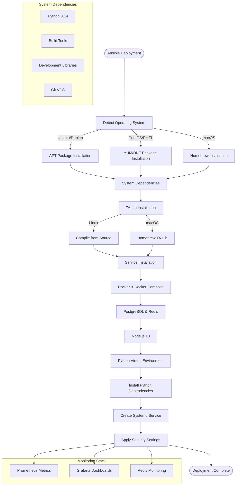

# ELVIS Deployment Guide (Ansible + Docker)

> Extracted from the original README during the 2026-07 root cleanup; content preserved verbatim.
>
> **V2 deployment warning:** these commands deploy the current compatibility
> stack. They do not provision the dedicated V2 runtime identities, establish
> the exclusive database-administration window, remove runtime DDL, or perform
> a generation-bound cut-over. A healthy service is not proof of V2 readiness.
> Follow the pending gates in the
> [V2 migration roadmap](architecture_migration/04-migration-roadmap.md);
> `ACTIVE` remains a **NO-GO**.

## Deployment with Ansible

The ELVIS Trading Bot includes comprehensive Ansible automation for seamless deployment across multiple platforms. Choose between containerized Docker deployment (recommended) or traditional installation.

### 🐳 **Docker Deployment (Recommended)**

```bash
cd ansible
chmod +x run_setup.sh
./run_setup.sh --docker
```

**What you get:**
- Complete containerized stack with PostgreSQL, Redis, Prometheus, and Grafana
- Automatic service orchestration and health monitoring
- Isolated environment with persistent data volumes
- One-command deployment and management

### 🔧 **Traditional Installation**

```bash
cd ansible
./run_setup.sh
```

**What you get:**
- Direct installation on host system
- Full system integration and service management
- Platform-specific optimizations

### What Gets Automated

The Ansible deployment system provides:



### Deployment Features

- **Cross-platform Support**: Ubuntu/Debian, CentOS/RHEL, macOS
- **Automated Dependency Resolution**: System packages, Python libraries, TA-Lib compilation
- **Service Management**: Systemd service creation with auto-restart capabilities
- **Security Hardening**: File permissions, service isolation, user separation
- **Multi-environment Support**: Development, staging, production configurations
- **Database Setup**: PostgreSQL and Redis installation and configuration
- **Monitoring Integration**: Prometheus metrics and Grafana dashboards
- **Container Support**: Docker and Docker Compose installation

### Environment Configuration

```bash
# Docker deployment (recommended)
./run_setup.sh --docker

# Development (default)
./run_setup.sh

# Staging environment
./run_setup.sh staging

# Production environment  
./run_setup.sh production

# Test connection only
./run_setup.sh --test

# Dry run (check mode)
./run_setup.sh --check
```

### 🐳 **Docker Deployment Details**

The Docker deployment creates a complete ecosystem:

```
┌─────────────────┐    ┌─────────────────┐    ┌─────────────────┐
│   ELVIS Bot     │    │   PostgreSQL    │    │     Redis       │
│   API: 5050     │◄──►│   Port: 5432    │    │   Port: 6379    │
│   /metrics      │    │   DB: trading   │    │   Cache/Queue   │
└─────────────────┘    └─────────────────┘    └─────────────────┘
         │                       │                       │
         └───────────────────────┼───────────────────────┘
                                 │
┌─────────────────┐    ┌─────────────────┐
│   Prometheus    │    │    Grafana      │
│   Port: 9090    │    │   Port: 3000    │
│   Metrics       │    │   Dashboards    │
└─────────────────┘    └─────────────────┘
```

**Access Points:**
- Trade History API health: http://localhost:5050/health
- Prometheus metrics: http://localhost:5050/metrics
- Grafana Monitoring: http://localhost:3001
- Prometheus Metrics: http://localhost:9090

**Management Commands:**
```bash
# View service status
docker ps

# Check trading bot logs
docker logs -f elvis-trading-bot

# Restart services
docker restart elvis-trading-bot

# Full stack management
docker-compose up -d
docker-compose down
docker-compose logs -f
```

### Post-Deployment

After successful Ansible deployment:

1. **Configure Environment Variables**:
   ```bash
   cp .env.example .env
   # Edit .env with your API keys
   ```

2. **Start the ELVIS Bot**:
   ```bash
   sudo systemctl start elvis-bot
   sudo systemctl enable elvis-bot
   ```

3. **Access Web Interfaces**:
   - Grafana: http://localhost:3001
   - API Documentation: http://localhost:5050/api/docs
   - Prometheus: http://localhost:9090

For detailed Ansible documentation, see [ansible/README.md](../ansible/README.md).

---
