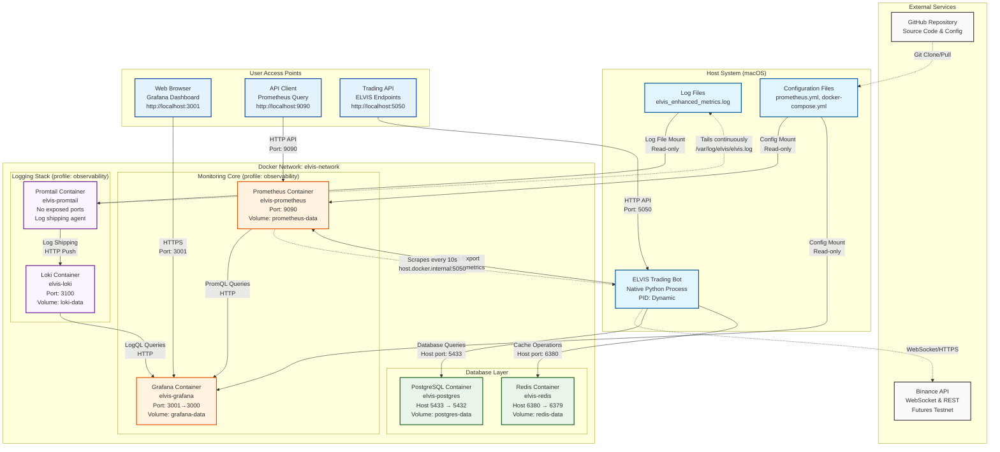
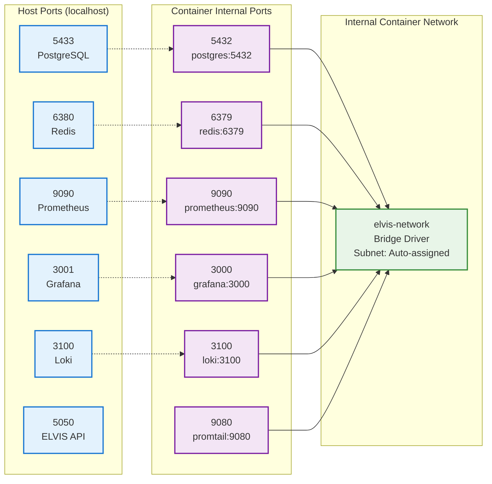
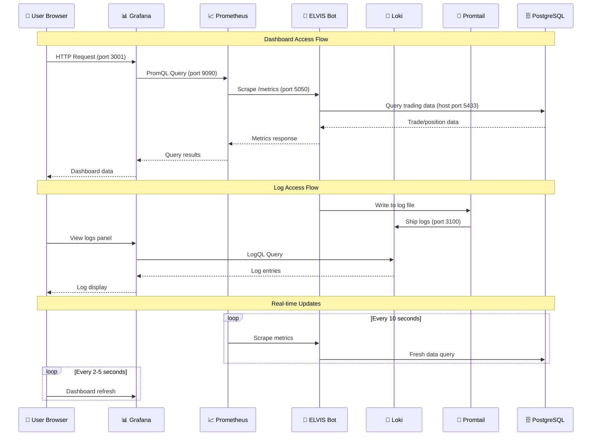
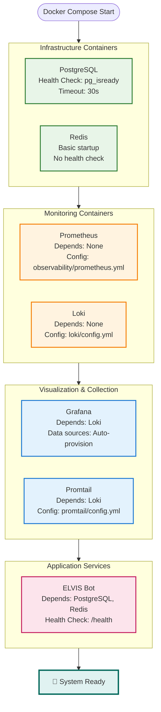
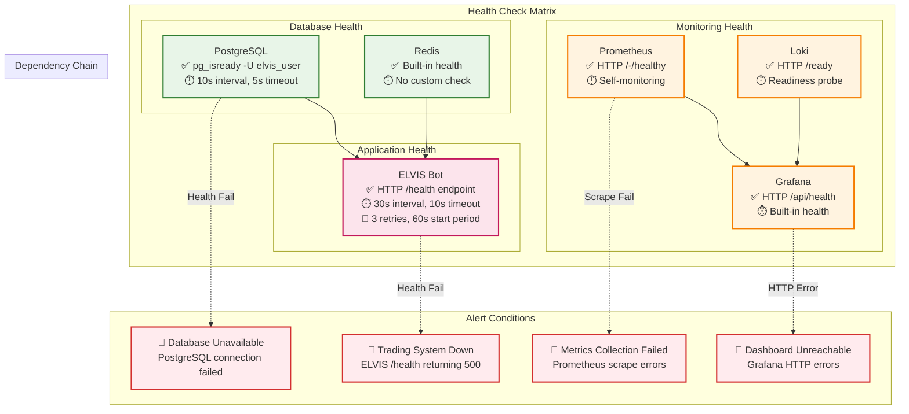

# ELVIS System Architecture - Container Relationships & Port Mapping

## 🏗️ Complete System Architecture



> **Monitoring is not a standalone service.** The Prometheus/Grafana/Loki/Promtail
> containers above are optional and only start with the `observability` Compose
> profile (`docker compose --profile observability up`). The bot's actual
> monitoring code lives in three places:
> - **`trading/utils/trade_history_api.py`** — the Flask trade-history API on port
>   `5050`; exposes `GET /metrics` (Prometheus format, via `prometheus_client` /
>   `prometheus_flask_exporter`) and `GET /health`. This is the target Prometheus
>   scrapes at `host.docker.internal:5050`.
> - **`utils/api_connection_tester.py`** — `APIConnectionTester` runs per-service
>   health checks (Binance spot/futures/testnet, PostgreSQL, Redis, Vault,
>   Telegram, Prometheus) and rolls them up via `get_overall_health()`.
> - **`core/metrics/performance_monitor.py`** — `PerformanceMonitor` tracks
>   trading performance (rolling Sharpe, drawdown).

## 🔌 Detailed Port Mapping & Network Configuration



## 📊 Data Flow & Communication Patterns



## 🏗️ Container Dependencies & Startup Order



## 🔒 Network Security & Access Control

```mermaid
graph TB
    subgraph "Public Internet"
        INT[Internet Access<br/>Binance API Only]
    end
    
    subgraph "Host Network (macOS)"
        HOST[Host Interface<br/>127.0.0.1 & 10.x.x.x]
    end
    
    subgraph "Docker Bridge Network"
        subgraph "elvis-network (Isolated)"
            NET[Internal Container DNS<br/>Service Discovery<br/>172.x.x.x subnet]
        end
    end
    
    subgraph "Access Control Matrix"
        PUB[Published Ports (bound to host)<br/>🔓 3001: Grafana UI<br/>🔓 9090: Prometheus API<br/>🔓 5050: ELVIS API<br/>🔓 3100: Loki API<br/>🔓 5433→5432: PostgreSQL<br/>🔓 6380→6379: Redis]
        INT_CONT[Container-to-Container<br/>🔒 Service DNS on elvis-network<br/>🔒 postgres:5432, redis:6379]
    end
    
    INT -.->|HTTPS/WSS| HOST
    HOST --> PUB
    HOST -.->|Port Mapping| NET
    NET --> INT_CONT
    
    classDef public fill:#ffebee,stroke:#d32f2f,stroke-width:2px
    classDef internal fill:#e8f5e8,stroke:#388e3c,stroke-width:2px
    classDef network fill:#e3f2fd,stroke:#1976d2,stroke-width:2px
    
    class INT,PUB public
    class INT_CONT internal
    class HOST,NET network
```

## 📦 Volume Management & Data Persistence

```mermaid
graph TB
    subgraph "Host File System"
        HOST_CONFIG[Configuration Files<br/>./prometheus.yml<br/>./docker-compose.yml<br/>./grafana/provisioning/]
        HOST_LOGS[Log Files<br/>./elvis_enhanced_metrics.log<br/>./logs/]
        HOST_DATA[Application Data<br/>./data/<br/>./models/]
    end
    
    subgraph "Docker Volumes (Persistent)"
        VOL_PG[postgres-data<br/>Database storage<br/>~500MB]
        VOL_REDIS[redis-data<br/>Cache persistence<br/>~50MB]
        VOL_PROM[prometheus-data<br/>Metrics storage<br/>~1GB]
        VOL_GRAF[grafana-data<br/>Dashboard configs<br/>~100MB]
        VOL_LOKI[loki-data<br/>Log storage<br/>~200MB]
    end
    
    subgraph "Container Mount Points"
        MOUNT_CONFIG[/etc/prometheus/<br/>/etc/grafana/provisioning/<br/>/etc/loki/]
        MOUNT_DATA[/var/lib/postgresql/data<br/>/data<br/>/prometheus<br/>/var/lib/grafana<br/>/loki]
        MOUNT_LOGS[/var/log/elvis/<br/>Read-only mounts]
    end
    
    HOST_CONFIG -.->|Bind Mount<br/>Read-only| MOUNT_CONFIG
    HOST_LOGS -.->|Bind Mount<br/>Read-only| MOUNT_LOGS
    HOST_DATA -.->|Bind Mount<br/>Read-write| MOUNT_DATA
    
    VOL_PG --> MOUNT_DATA
    VOL_REDIS --> MOUNT_DATA
    VOL_PROM --> MOUNT_DATA
    VOL_GRAF --> MOUNT_DATA
    VOL_LOKI --> MOUNT_DATA
    
    classDef hostData fill:#fff3e0,stroke:#f57c00,stroke-width:2px
    classDef dockerVol fill:#e8f5e8,stroke:#388e3c,stroke-width:2px
    classDef mountPoint fill:#e3f2fd,stroke:#1976d2,stroke-width:2px
    
    class HOST_CONFIG,HOST_LOGS,HOST_DATA hostData
    class VOL_PG,VOL_REDIS,VOL_PROM,VOL_GRAF,VOL_LOKI dockerVol
    class MOUNT_CONFIG,MOUNT_DATA,MOUNT_LOGS mountPoint
```

## 🚀 Service Health & Monitoring



---

**Architecture Version**: 2.0  
**Last Updated**: August 4, 2025  
**Container Runtime**: Docker 24.x with Compose v2  
**Network Driver**: Bridge (default)  
**Volume Driver**: Local filesystem