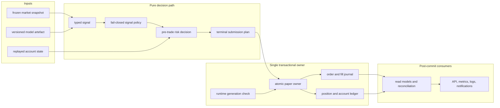
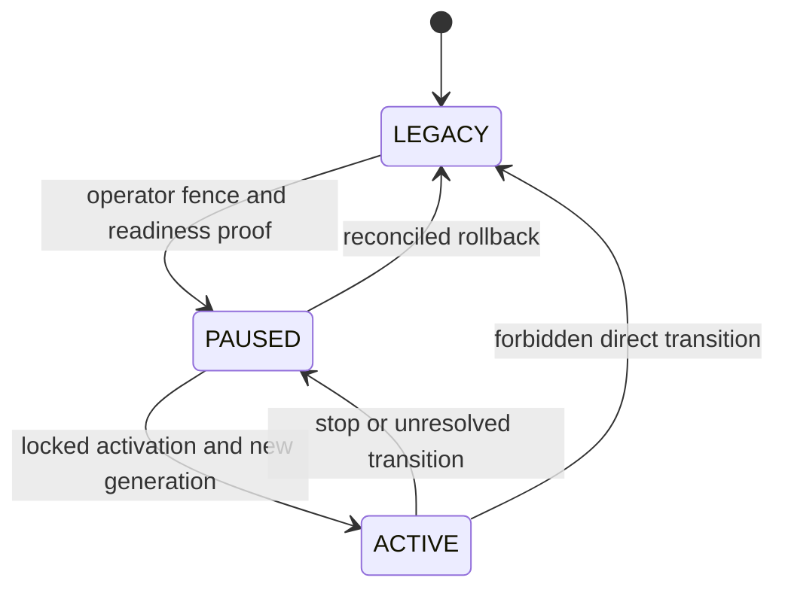
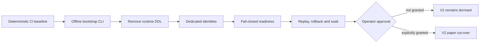

# ELVIS V2 architecture

ELVIS V2 is an architecture programme in progress. It replaces implicit,
coupled paper-trading state changes with deterministic decisions, durable
journals, single-owner transactions, and an explicit database-enforced
activation boundary.

> **V2 is not released or deployed.** The compatibility paper runtime remains
> authoritative. Implemented V2 persistence and activation components are
> dormant unless the migration ledger says otherwise. `ACTIVE` remains a
> **NO-GO** until every cut-over gate in the
> [migration roadmap](architecture_migration/04-migration-roadmap.md) is closed.
> Live trading is not an executable capability.

## Why V2

The repository audit found a working but tightly coupled polling runtime:
decision rules, risk checks, execution, persistence, exits, API work, and
observability are interleaved; PostgreSQL ownership is shared; and some runtime
paths can create database objects during startup. That shape makes an ambiguous
submission, restart, or ownership transition difficult to prove safe.

V2 keeps ELVIS as a small Python modular monolith. It does not introduce a
distributed service mesh or copy a larger trading framework. The new approach
is deliberately narrower:

1. pure, typed domain decisions before I/O;
2. one application owner for each order, fill, position, and account change;
3. immutable, checksummed journal facts with deterministic replay;
4. atomic PostgreSQL transactions for related journal and account facts;
5. a generation-bound database fence for sole-writer activation;
6. least-authority runtime roles created by an offline bootstrap; and
7. fail-closed startup, readiness, and health before the V2 runtime can become
   authoritative.

The measured baseline and design inputs remain in the
[repository analysis](architecture_migration/01-elvis-repository-analysis.md)
and [reference comparison](architecture_migration/02-reference-architectures.md).
The full component contracts live in the
[target architecture](architecture_migration/03-target-architecture.md).

## Architecture and data flow

The synchronous decision path stays direct. Events describe completed state
transitions for observability; they do not decide whether an order is safe to
submit. A submission acknowledgement is not treated as a fill. Ambiguous or
unreadable state is reconciled or quarantined, never guessed.

The database control plane is separate from that hot path:

Each entry into `ACTIVE` receives a new durable runtime generation. Rollback
must pass through `PAUSED`, reconcile the current owner, and deliberately select
one writer. Legacy and V2 writers must never be authoritative together.

## Current state

| Area | State on the V2 branch | Runtime meaning |
|---|---|---|
| Typed signals, order intents, submission reports, and direct `OrderService` | Implemented; selected boundaries are used by the compatibility path | Narrows legacy execution without making V2 authoritative |
| Versioned feature/model contracts and migrated policy/risk slices | Implemented incrementally | Remaining orchestration is still mixed with legacy code |
| Order, fill, position, and paper-account journal/replay contracts | Implemented and tested | Persistence path remains dormant |
| Atomic paper submission/account owners | Implemented and tested | Not composed into the running bot |
| Readiness assessment, legacy-writer fence, runtime generations, and locked activation | Implemented and tested | Database capabilities exist but no cut-over is authorised |
| Least-authority PostgreSQL role/catalog bootstrap and pre-role admission | Implemented as an operator library | Rejects an unsafe database before managed roles are created; no CLI, secret writer, startup hook, Compose wiring, or deployment activation |
| Dedicated runtime identities and fail-closed composition | Pending | Current shared-credential/runtime-DDL paths still block V2 authority |
| Replay, reconciliation, shadow comparison, rollback rehearsal, and soak | Pending evidence | `ACTIVE` remains **NO-GO** |

“Implemented” means present on this branch with the checks recorded in the
roadmap. “Dormant” means there is no production composition or authority.
Neither word means deployed.

## Migration phases

| Phase | Outcome | Status |
|---|---|---|
| Foundation | Audit, target design, typed domain and application boundaries | Implemented |
| Progressive runtime extraction | Signal policy, risk, execution, and position ownership moved in small reversible slices | In progress |
| Durable authority | Versioned migrations, journals, replay, account ledger, fence, generations, activation, and role/catalog bootstrap | Implemented but dormant |
| Deployment composition | Offline orchestration, dedicated credentials, restrictive database/network policy, removal of runtime DDL, fail-closed health | Pending |
| Cut-over evidence | Bounded replay, reconciliation, side-effect-free shadowing, rollback rehearsal, soak, explicit operator approval | Pending |
| Cleanup | Remove superseded legacy owners only after parity and cut-over proof | Pending |

The [roadmap](architecture_migration/04-migration-roadmap.md) is the
authoritative slice-by-slice status ledger. This summary intentionally does not
duplicate its test counts or acceptance evidence.

The V2 application target is Python 3.14. Python 3.10 remains the package's
temporary compatibility floor and the runtime for the isolated TensorFlow/ML
trainer, so CI verifies both interpreters. Retiring 3.10 requires its own
explicit migration after that trainer boundary is replaced or upgraded.

## Incremental delivery gates

V2 lands as small pull requests with independent evidence. A later gate cannot
turn an earlier red gate into success, and merging dormant capability never
authorises runtime cut-over.

Graph artefacts: [Mermaid source](../diagrams/v2-delivery-gates.mmd),
[editable Excalidraw](../diagrams/v2-delivery-gates.excalidraw),
[SVG](../diagrams/v2-delivery-gates.svg), and
[PNG](../diagrams/v2-delivery-gates.png).

## Operator safety contract

- Paper trading is the only executable mode; V2 does not add live submission.
- Bootstrap and activation are offline operator actions, never runtime startup
  side effects.
- Secrets remain outside Git and outside command arguments, logs, and receipts.
- Role/catalog admission must run inside an operator-enforced exclusive DDL and
  role-administration window; the advisory lock coordinates only cooperating
  bootstrap processes.
- Existing-volume adoption requires the built-in PL/pgSQL extension, languages,
  and referenced handlers to belong to the independently authenticated admin.
  A volume whose old shared superuser owns that baseline must be rehearsed and
  remediated offline on a clone or replaced by a fresh admin-owned target; the
  bootstrap never performs a silent ownership repair.
- Startup and health must fail closed when the durable database authority,
  generation, credentials, or catalog cannot be proven exactly.
- Shadow evaluation must be side-effect free. It cannot submit twice or mutate
  cooldowns, positions, account state, model feedback, or persistence.
- Activation requires explicit operator approval after replay, reconciliation,
  rollback, and soak evidence. No document or successful unit test grants that
  approval.

## Documentation authority

| Need | Canonical document |
|---|---|
| V2 overview, approach, data flow, and safety | This page |
| Detailed V2 contracts | [Target architecture](architecture_migration/03-target-architecture.md) |
| Current implementation status and verification | [Migration roadmap](architecture_migration/04-migration-roadmap.md) |
| Audited compatibility-runtime baseline | [Repository analysis](architecture_migration/01-elvis-repository-analysis.md) |
| Current legacy runtime topology | [Runtime architecture](architecture.md) |
| Current deployment commands | [Deployment guide](DEPLOYMENT.md), subject to its V2 warning |
| Historical or superseded claims | `docs/archive/` and explicitly labelled legacy guides |

When documents disagree, source code and the roadmap's latest committed
implementation record win. A generated artefact, successful test, or dormant
database capability is not proof that a deployment or cut-over happened.
