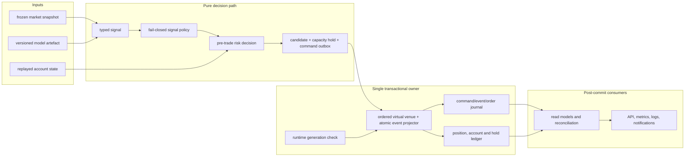
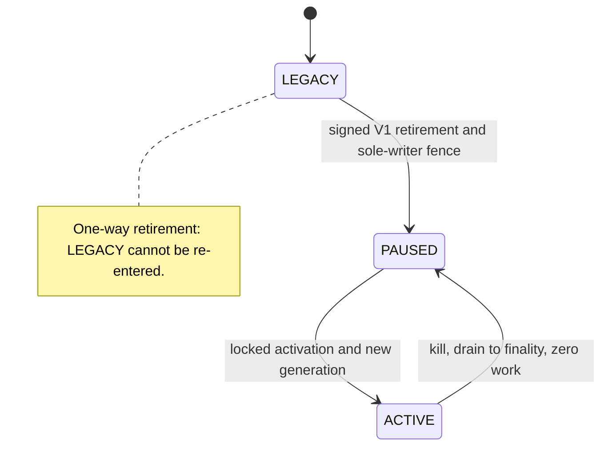
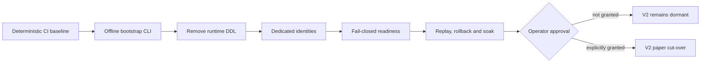

# ELVIS V2 preview architecture (historical alpha.2 baseline)

ELVIS V2 is an architecture programme in progress with an installable operator
preview. It replaces implicit,
coupled paper-trading state changes with deterministic decisions, durable
journals, single-owner transactions, and an explicit database-enforced
activation boundary.

> **Historical background, not production authority.** The preview is not a
> deployed runtime. The compatibility paper runtime
> remains authoritative. Implemented V2 persistence and activation components
> are dormant unless the migration ledger says otherwise. `ACTIVE` remains a
> **NO-GO** until every cut-over gate in the authoritative trajectory-B/1B
> [production plan](architecture_migration/05-v2-production-plan.md),
> [failure register](architecture_migration/06-v2-production-failure-register.md),
> and [E2E matrix](architecture_migration/07-v2-production-e2e-matrix.md) is
> closed.
> Live trading is not an executable capability.

## Why V2

The repository audit found a working but tightly coupled polling runtime:
decision rules, risk checks, execution, persistence, exits, API work, and
observability are interleaved; PostgreSQL ownership is shared; and some runtime
paths can create database objects during startup. That shape makes an ambiguous
submission, restart, or ownership transition difficult to prove safe.

V2 keeps ELVIS as a small Python modular monolith. It does not introduce a
distributed service mesh or copy a larger trading framework. The new approach
is deliberately narrower:

1. pure, typed domain decisions before I/O;
2. one application owner for each order, fill, position, and account change;
3. immutable, checksummed journal facts with deterministic replay;
4. atomic PostgreSQL transactions for related journal and account facts;
5. a generation-bound database fence for sole-writer activation;
6. least-authority runtime roles created by an offline bootstrap; and
7. fail-closed startup, readiness, and health before the V2 runtime can become
   authoritative.

The measured baseline and design inputs remain in the
[repository analysis](architecture_migration/01-elvis-repository-analysis.md)
and [reference comparison](architecture_migration/02-reference-architectures.md).
The full component contracts live in the
[target architecture](architecture_migration/03-target-architecture.md).

## Architecture and data flow

The pure decision path stays direct, but trajectory 1B does not use the old
terminal full-fill submission batch. Admission atomically writes a bounded
capacity hold and ordered command; the deterministic virtual venue then emits
acknowledgement, rejection, cancellation and zero/partial/multiple-fill events.
Every event is applied exactly once by contiguous causal prefix. Ambiguous or
unreadable state is reconciled or quarantined, never guessed.

The database control plane is separate from that hot path:

Each entry into `ACTIVE` receives a new durable runtime generation. A one-way
signed retirement moves `LEGACY/0` to `PAUSED/0`; V1 can never regain authority.
V2 rollback sets kill, drains accepted work, passes through `PAUSED`, and
redeploys a compatible V2 candidate before the next activation. Legacy and V2
writers must never be authoritative together.

## Current state

| Area | State on the V2 branch | Runtime meaning |
|---|---|---|
| Typed signals, order intents, submission reports, and direct `OrderService` | Implemented; selected boundaries are used by the compatibility path | Narrows legacy execution without making V2 authoritative |
| Versioned feature/model contracts and migrated policy/risk slices | Implemented incrementally | Remaining orchestration is still mixed with legacy code |
| Order, fill, position, and paper-account journal/replay contracts | Implemented and tested | Persistence path remains dormant |
| Atomic paper submission/account owners | Implemented and tested | Not composed into the running bot |
| Readiness assessment, legacy-writer fence, runtime generations, and locked activation | Implemented and tested | Database capabilities exist but no cut-over is authorised |
| Least-authority PostgreSQL role/catalog bootstrap, pre-role admission, and offline CLI | Implemented as dormant operator capability | The CLI accepts only a strict non-secret manifest and external libpq service names; it rejects unsafe databases and adds no secret writer, automatic startup hook, active Compose wiring, or deployment activation |
| Isolated fresh PostgreSQL 15 rehearsal composition | Implemented as a disposable operator harness | Separate internal-only Compose project; never mounts the active volume or composes bot, trainer, or activation |
| Fresh-target cut-over preflight | Implemented as a dormant read-only operator capability | Inspects a stopped source clone and a separate fresh target, requires distinct cluster system identifiers, streams canonical typed-row evidence, and returns only a stale-on-return sanitized receipt; it copies nothing |
| Bounded legacy snapshot importer | Implemented as a dormant offline operator capability | Revalidates the c3c2 pair, copies only the seven raw V1 tables in one transaction, preserves explicit IDs, requires `open_positions` to remain empty, and normalizes sequences after row commit; it synthesizes no V2 journal or ledger |
| Legacy snapshot reconciliation review | Implemented as a dormant read-only operator capability | Sequentially revalidates the imported target and compares its complete opening candidate with an explicitly non-runtime operator hypothesis; every usable result is `DECISION_REQUIRED`, source provenance and a coherent database snapshot remain unproven, and no account is opened or provisioned |
| Dedicated runtime identities and fail-closed composition | Pending | Current shared-credential/runtime-DDL paths still block V2 authority |
| Signed fresh opening, one-way V1 retirement, async virtual venue, V2-only rollback, soak and course evidence | Pending evidence | `ACTIVE` remains **NO-GO** |

“Implemented” means present on this branch with the checks recorded in the
roadmap. “Dormant” means there is no production composition or authority.
Neither word means deployed.

## Migration phases

| Phase | Outcome | Status |
|---|---|---|
| Foundation | Audit, target design, typed domain and application boundaries | Implemented |
| Progressive runtime extraction | Signal policy, risk, execution, and position ownership moved in small reversible slices | In progress |
| Durable authority | Versioned migrations, journals, replay, account ledger, fence, generations, activation, and role/catalog bootstrap | Implemented but dormant |
| Deployment composition | Offline bootstrap, read-only fresh-target preflight and reconciliation review, and dormant bounded raw importer available; dedicated credentials, restrictive database/network policy, removal of runtime DDL, and fail-closed health remain | In progress; not deployed |
| Cut-over evidence | Historical raw V1 snapshot preservation and non-authoritative candidate review exist only as read-only evidence; trajectory B instead requires a signed fresh opening with zero V1 continuity, one-way retirement, deterministic async-venue proof, V2-only recovery, soak, and explicit per-epoch approval | In progress; no authority change |
| Cleanup | Redundant V1 prose and unverified deployment helpers are removed; runtime owners retire only after parity and cut-over proof | In progress; no authority change |

The [production plan](architecture_migration/05-v2-production-plan.md),
[failure register](architecture_migration/06-v2-production-failure-register.md),
and [E2E matrix](architecture_migration/07-v2-production-e2e-matrix.md) are the
authoritative production records. This historical summary intentionally does
not duplicate their status or acceptance evidence.

Python 3.14 is the only supported interpreter. Optional ML integrations without
compatible wheels are skipped; they do not create a second supported runtime.

## Incremental delivery gates

V2 lands as small pull requests with independent evidence. A later gate cannot
turn an earlier red gate into success, and merging dormant capability never
authorises runtime cut-over.

Graph artefacts: [Mermaid source](../diagrams/v2-delivery-gates.mmd),
[editable Excalidraw](../diagrams/v2-delivery-gates.excalidraw),
[SVG](../diagrams/v2-delivery-gates.svg), and
[PNG](../diagrams/v2-delivery-gates.png).

## Operator safety contract

- Paper trading is the only executable mode; V2 does not add live submission.
- Bootstrap and activation are offline operator actions, never runtime startup
  side effects. The exact bootstrap procedure is in the
  [offline PostgreSQL runbook](V2_POSTGRES_BOOTSTRAP.md).
- Secrets remain outside Git and outside command arguments, logs, and receipts.
- Role/catalog admission must run inside an operator-enforced exclusive DDL and
  role-administration window; the advisory lock coordinates only cooperating
  bootstrap processes.
- Existing-volume adoption requires the built-in PL/pgSQL extension, languages,
  and referenced handlers to belong to the independently authenticated admin.
  A volume whose old shared superuser owns that baseline must be rehearsed and
  remediated offline on a clone or replaced by a fresh admin-owned target; the
  bootstrap never performs a silent ownership repair.
- The chosen fresh-target path starts with the read-only
  [cut-over preflight](V2_FRESH_TARGET_CUTOVER.md). It must inspect a stopped
  source clone and a separate terminal V2 target, never the active volume. Its
  canonical SHA-256 and `READY_FOR_FRESH_TARGET` receipt are non-authoritative
  evidence, stale on return, and cannot trigger the importer or activation.
- The [bounded legacy snapshot importer](V2_LEGACY_SNAPSHOT_IMPORT.md) accepts
  that exact secret-free receipt only as a strict JSON document, binds it as
  stale expected evidence, and then revalidates the pair. It copies only the
  seven raw V1 relations, keeps `open_positions` empty, and never invents V2
  order, fill, position, account, fee, or generation provenance.
  Row commit and non-transactional sequence normalization are separate recovery
  phases; every returned receipt remains stale and non-authoritative.
- The [legacy snapshot reconciliation
  reviewer](V2_LEGACY_SNAPSHOT_RECONCILIATION.md) consumes the supplied c3c3a
  receipt as a canonically bound but unauthenticated input and rereads the target
  through distinct read-only identities. It preserves the complete
  imported balance tuple and a separate `OPERATOR_EQUITY_HYPOTHESIS`, including
  deterministic, separately folded PnL, trade-fee, and liquidation-fee values.
  The observations span database snapshots, the session check is point-in-time,
  and the source is never contacted. The adapter derives hypothesis values from
  target reads, but the typed receipt authenticates neither those observations
  nor source provenance. Only `DECISION_REQUIRED` or `BLOCKED` can result;
  neither selects provenance, opens or provisions an account, or authorises
  activation.
- Startup and health must fail closed when the durable database authority,
  generation, credentials, or catalog cannot be proven exactly.
- Shadow evaluation must be side-effect free. It cannot submit twice or mutate
  cooldowns, positions, account state, model feedback, or persistence.
- Activation requires explicit operator approval after replay, reconciliation,
  rollback, and soak evidence. No document or successful unit test grants that
  approval.

## Documentation authority

| Need | Canonical document |
|---|---|
| Historical preview approach, data flow, and safety | This page |
| Historical detailed contracts | [Target architecture](architecture_migration/03-target-architecture.md) |
| Authoritative production design | [Production plan](architecture_migration/05-v2-production-plan.md) |
| Open blockers and acceptance | [Failure register](architecture_migration/06-v2-production-failure-register.md) and [E2E matrix](architecture_migration/07-v2-production-e2e-matrix.md) |
| Offline PostgreSQL bootstrap contract and recovery | [Bootstrap runbook](V2_POSTGRES_BOOTSTRAP.md) |
| Fresh PostgreSQL 15 SCRAM/HBA rehearsal | [Rehearsal runbook](V2_POSTGRES_REHEARSAL.md) |
| Historical stopped-clone/fresh-target admission and pre-retirement recovery phases | [Fresh-target cut-over preflight](V2_FRESH_TARGET_CUTOVER.md) |
| Historical bounded raw V1 copy, resume, and pre-retirement recovery | [Legacy snapshot import](V2_LEGACY_SNAPSHOT_IMPORT.md) |
| Read-only opening-candidate comparison and no-opening boundary | [Legacy snapshot reconciliation](V2_LEGACY_SNAPSHOT_RECONCILIATION.md) |
| Audited compatibility-runtime baseline | [Repository analysis](architecture_migration/01-elvis-repository-analysis.md) |
| Current legacy runtime topology | [Runtime architecture](architecture.md) |
| Installation and deployment boundary | [V2 install](../INSTALL_V2.md) and [deployment status](DEPLOYMENT.md) |
| Historical or superseded claims | [V1 restore manifest](archive/v1/README.md) and Git tags |

When documents disagree, source code and documents 05–07 win for production
planning. A generated artefact, successful test, or dormant database capability
is not proof that a deployment or cut-over happened.
