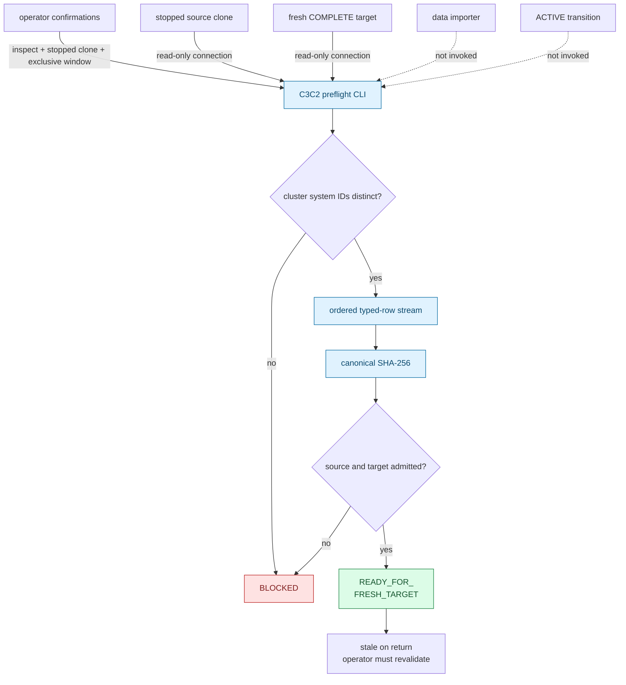
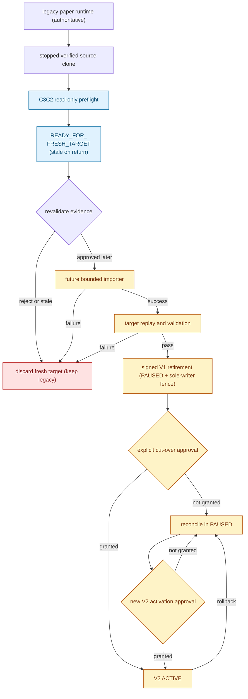

# ELVIS V2 fresh-target cut-over preflight

> **Historical alpha.2 preflight — superseded for production.** This document
> records a pre-retirement inspection from the alpha.2 preview. It is not
> trajectory-B/1B production authority: the
> [production plan](architecture_migration/05-v2-production-plan.md),
> [failure register](architecture_migration/06-v2-production-failure-register.md),
> and [E2E matrix](architecture_migration/07-v2-production-e2e-matrix.md)
> supersede it. No V1 source state, V1 clone, or c3c2/c3c3 import output may
> seed the trajectory-B production opening or account. Within this historical
> slice, a stopped V1 clone is pre-retirement read-only evidence only; after
> signed retirement, V1 is never a writer or rollback authority.

This runbook defines M9b.14c3c2: a one-shot, read-only inspection that binds a
stopped clone of the legacy PostgreSQL source to a separate, freshly
bootstrapped V2 target. It records whether that pair is eligible for a later,
bounded data-import design.

> **This slice does not copy data or authorise production.** It never connects
> to the active source volume, writes either inspected database, changes a
> role, invokes bootstrap, starts a runtime, or requests activation. A
> `READY_FOR_FRESH_TARGET` receipt is stale as soon as the command returns.
> `ACTIVE` remains a
> **NO-GO**.

## Decision

The legacy ELVIS volume was initialized under the old shared superuser. Its
built-in PL/pgSQL ownership does not satisfy the independent-admin boundary of
the V2 bootstrap, and the bootstrap correctly refuses to repair that ownership
in place.

M9b.14c3c2 therefore selects a fresh-target migration path:

1. stop every writer to the source and produce a verified physical clone;
2. bootstrap a different, fresh PostgreSQL cluster to the exact V2 terminal
   catalog;
3. inspect both databases without mutation and require different PostgreSQL
   cluster system identifiers;
4. record a canonical source-data fingerprint and exact target evidence; and
5. design the importer in the next bounded pull request.

The stopped source clone was an alpha.2 pre-retirement audit reference, not a
production seed or post-retirement rollback authority. The fresh target was
disposable until the later import, replay, reconciliation, and cut-over gates
then envisaged had all passed. A checksum is evidence about inspected rows, not
a backup and not a copy of those rows.

## Evidence and trust boundary



Graph artefacts:
[Mermaid source](../diagrams/v2-c3c2-preflight-trust.mmd),
[SVG](../diagrams/v2-c3c2-preflight-trust.svg),
[PNG](../diagrams/v2-c3c2-preflight-trust.png), and
[editable Excalidraw](../diagrams/v2-c3c2-preflight-trust.excalidraw).

The application contract is
`trading.application.fresh_target_cutover`; the PostgreSQL adapter is
`trading.persistence.postgres_cutover_preflight`; and the only operator entry
point is `scripts.postgres_cutover_preflight`. The pure context is exactly
`FreshTargetCutoverContext(source_expected_database, source_expected_role,
target_bootstrap_intent)`, where the intent contains a pure
`FreshTargetBootstrapIntent` and `FreshTargetRoleManifest`. The public port
exposes only
`inspect(context, /)`. None is called by `main.py`, a Compose dependency,
the retired deployment experiments, or a health probe.

## Preconditions

The operator must establish and independently verify all of these conditions:

1. Every writer to the source cluster is stopped before the physical clone is
   taken. The CLI cannot prove how or when a clone was created.
2. The source service resolves only to that stopped clone, never to the active
   source cluster or its persistent volume.
3. The target is a separately provisioned PostgreSQL cluster whose bootstrap
   ended in `COMPLETE`. It is not the c3c1 disposable rehearsal volume.
4. The source and target databases are held in an externally enforced
   exclusive database window for the complete inspection. Read-only SQL and an
   application advisory lock cannot fence an independent superuser.
5. The external libpq service file and passfile are access controlled, refer
   to the intended databases, and are not stored in Git.
6. The legacy runtime remains authoritative, paper is the only executable
   mode, and no V2 activation operation is scheduled from this inspection.

If any condition is uncertain, do not run the preflight. Recreate the stopped
clone or fresh target from independently verified evidence instead of editing
catalogs or application rows to make the inspection pass.

## Command contract

Run one explicit invocation from the repository root:

```bash
PGSERVICEFILE=/secure/operator/pg_service.conf \
PGPASSFILE=/secure/operator/pgpass \
python -m scripts.postgres_cutover_preflight \
  --config /secure/operator/fresh-target-preflight-v1.json \
  --inspect \
  --confirm-stopped-source-clone \
  --confirm-exclusive-database-window
```

The command shape is exact:

```text
python -m scripts.postgres_cutover_preflight \
  --config <fresh-target-preflight-v1.json> \
  --inspect \
  --confirm-stopped-source-clone \
  --confirm-exclusive-database-window
```

- `--config` selects the strict, non-secret version-1 intent document.
- `--inspect` is mandatory. There is no apply, repair, copy, reconcile, or
  activate mode.
- `--confirm-stopped-source-clone` records the operator assertion that the
  source endpoint is a clone captured after every source writer stopped. The
  flag does not stop sessions or verify the clone procedure.
- `--confirm-exclusive-database-window` records the operator assertion that
  neither inspected database can change during the command. It does not create
  a database-wide writer fence.

Missing flags or unknown arguments are input failures. There is no automatic
retry. A second invocation is a new operator decision after revalidating the
source clone, target, services, and exclusive window.

## Exact non-secret configuration

The committed schema is closed: unknown keys, missing keys, wrong JSON types,
connection strings, and values outside their declared bounds are rejected.
Connection endpoints and credentials remain exclusively in the operator's
libpq files.

```json
{
  "schema_version": 1,
  "source": {
    "expected_database": "elvis_trading",
    "expected_role": "elvis_user",
    "service": "elvis_source_clone"
  },
  "target": {
    "admin_service": "elvis_fresh_target_admin",
    "bootstrap_context": {
      "expected_database": "elvis_paper_v2",
      "admin_role": "elvis_bootstrap_admin",
      "roles": {
        "schema_owner": "elvis_schema_owner",
        "migrator": "elvis_migrator",
        "legacy_runtime": "elvis_legacy_runtime",
        "atomic_runtime": "elvis_atomic_runtime",
        "activation": "elvis_activation",
        "readiness": "elvis_readiness",
        "trainer": "elvis_trainer"
      },
      "adoption": null
    }
  }
}
```

- `schema_version` must be the integer `1`.
- `source.expected_database` and `source.expected_role` are the authenticated
  source-clone identity expected by the operator.
- `source.service` resolves that read-only connection through `PGSERVICEFILE`.
- `target.admin_service` resolves the independently authenticated target admin
  connection through the same external libpq boundary.
- `target.bootstrap_context` is the strict bootstrap context for the fresh
  target: expected database, independent admin, and the exact seven managed
  roles. `adoption` must be `null`; an adopted legacy database is not a fresh
  target.

Service and role identifiers are intent, not credentials. The document cannot
contain a DSN, host, port, password, passfile content, or arbitrary libpq
keyword. Each resolved connection must authenticate to its declared database
and role; a service-file override cannot silently redefine that identity.

## Read-only inspection contract

The public preflight operation performs inspection only. It never exposes a
reconcile or apply method and never runs DDL, DML, role administration, session
termination, bootstrap, migration, or activation SQL.

The adapter must fail closed unless all of the following evidence is exact:

- both connections authenticate to the declared databases and expected
  identities;
- both endpoints support the required PostgreSQL inspection semantics;
- `pg_control_system().system_identifier` differs between source and target,
  proving that the fresh target is not another database in the source cluster;
- the source clone exposes the exact V1 `0001` `np` import surface, including
  the seven legacy source tables:
  `np.account_balances`, `np.liquidations`, `np.margin_history`,
  `np.model_predictions`, `np.open_positions`, `np.trades`, and
  `np.trading_session_resets`;
- those tables, their seven owned sequences, and ten canonical indexes belong
  to the declared shared legacy owner, with the exact columns, constraints,
  persistence, and ownership expected by V1;
- the source contains no migration ledger, V2 table, routine, type, user
  trigger, surplus ACL, default ACL, or other `np` object;
- the source has no other session, open position, or semantically invalid
  admitted row;
- the target matches the terminal V2 bootstrap catalog and its required empty
  import boundary, with runtime control exactly `LEGACY` at generation zero;
  and
- all inspected source rows can be encoded as the declared typed canonical
  stream.

This is a closed inventory of the `np` import surface, not a claim that every
object in every other source schema is absent. The importer remains restricted
to the seven admitted, schema-qualified relations and must never copy roles,
ACLs, extensions, routines, or objects from another schema.

Source rows are streamed in an explicit stable order. Values include their
logical type in the canonical encoding so that, for example, text, numeric,
timestamp, and null values cannot collapse to the same byte representation.
The SHA-256 accumulator is updated incrementally. Each relation records its
name, row count, primary-key minimum and maximum, and digest. The implementation
does not load an unbounded source table into memory or depend on PostgreSQL's
display format, locale, or query-plan order.

The empty target boundary covers rows in every business, journal, account, and
runtime-generation relation. It does not claim that the seven legacy serial
sequences retain their initial `last_value`/`is_called` runtime state: an
insert followed by a delete can advance a sequence while leaving the admitted
relations empty. The later importer must explicitly validate and normalize
each target sequence after copying bounded source rows, then include that state
in its parity evidence before any runtime is allowed to write.

`READY_FOR_FRESH_TARGET` means only that the inspected pair passed this exact read-only
assessment. It does not reserve either database. The result is non-authoritative
and stale on return because an external actor can change evidence after the
transactions and connections close.

## Receipts and exit codes

The CLI writes one compact JSON object to stdout. `READY_FOR_FRESH_TARGET` and
`BLOCKED` use this exact top-level shape:

```json
{
  "status": "READY_FOR_FRESH_TARGET",
  "blockers": [],
  "stale_on_return": true,
  "snapshot_authoritative": false,
  "source": {
    "system_identifier": "7340000000000000001",
    "relations": [
      {
        "name": "np.account_balances",
        "row_count": 0,
        "pk_min": null,
        "pk_max": null,
        "sha256": "e3b0c44298fc1c149afbf4c8996fb92427ae41e4649b934ca495991b7852b855"
      },
      {
        "name": "np.liquidations",
        "row_count": 0,
        "pk_min": null,
        "pk_max": null,
        "sha256": "e3b0c44298fc1c149afbf4c8996fb92427ae41e4649b934ca495991b7852b855"
      },
      {
        "name": "np.margin_history",
        "row_count": 0,
        "pk_min": null,
        "pk_max": null,
        "sha256": "e3b0c44298fc1c149afbf4c8996fb92427ae41e4649b934ca495991b7852b855"
      },
      {
        "name": "np.model_predictions",
        "row_count": 0,
        "pk_min": null,
        "pk_max": null,
        "sha256": "e3b0c44298fc1c149afbf4c8996fb92427ae41e4649b934ca495991b7852b855"
      },
      {
        "name": "np.open_positions",
        "row_count": 0,
        "pk_min": null,
        "pk_max": null,
        "sha256": "e3b0c44298fc1c149afbf4c8996fb92427ae41e4649b934ca495991b7852b855"
      },
      {
        "name": "np.trades",
        "row_count": 42,
        "pk_min": 1,
        "pk_max": 42,
        "sha256": "0123456789abcdef0123456789abcdef0123456789abcdef0123456789abcdef"
      },
      {
        "name": "np.trading_session_resets",
        "row_count": 0,
        "pk_min": null,
        "pk_max": null,
        "sha256": "e3b0c44298fc1c149afbf4c8996fb92427ae41e4649b934ca495991b7852b855"
      }
    ],
    "other_session_count": 0,
    "open_position_count": 0,
    "semantic_invalid_row_count": 0,
    "canonical_sha256": "0123456789abcdef0123456789abcdef0123456789abcdef0123456789abcdef",
    "legacy_layout_exact": true,
    "identity_exact": true
  },
  "target": {
    "system_identifier": "7340000000000000002",
    "terminal_catalog_exact": true,
    "migration_versions": [1, 2, 3, 4, 5, 6],
    "runtime_mode": "LEGACY",
    "runtime_generation": 0,
    "nonempty_relations": []
  }
}
```

The example digest values illustrate the 64-character lowercase representation;
the actual values come only from the inspected snapshot. A blocked result uses
the same evidence shape and one or more exact blocker codes:

- `SOURCE_IDENTITY`;
- `SOURCE_ACTIVE_SESSIONS`;
- `SOURCE_SCHEMA`;
- `SOURCE_OPEN_POSITIONS`;
- `SOURCE_DATA_QUALITY`;
- `SAME_CLUSTER`;
- `TARGET_NOT_COMPLETE`;
- `TARGET_MODE`; or
- `TARGET_NOT_EMPTY`.

The blocker array is empty on `READY_FOR_FRESH_TARGET`; `BLOCKED` contains the
applicable codes and the observed sanitized evidence. It never contains prose.

Receipts and errors exclude
libpq service names, PostgreSQL role identifiers, connection details, secret
paths, SQL text, exception messages, and arbitrary error text. Stderr remains
empty for handled outcomes.

| Exit | `status` / `code` | Meaning and required action |
|---:|---|---|
| `0` | `READY_FOR_FRESH_TARGET` | This pair passed the read-only inspection. Treat the receipt as stale and revalidate before any later import. |
| `21` | `BLOCKED` | Identity, catalog, source-data, target-emptiness, or pair evidence is not admitted. Stop; never auto-repair. |
| `2` | `ERROR` / `INPUT` | Invocation or non-secret configuration is invalid. Correct it before a new explicit inspection. |
| `20` | `ERROR` / `STORAGE` | A safe database connection or inspection could not be completed. Restore observability; the outcome is unproven. |
| `70` | `ERROR` / `INTERNAL` | An unexpected CLI failure occurred. Stop and treat all evidence as unproven. |

Handled errors contain only their typed code:

```json
{"status":"ERROR","code":"STORAGE"}
```

No exit authorises a data copy, target mutation, deployment, credential
rotation, runtime start, or transition to `ACTIVE`.

## Historical alpha.2 follow-on sketch (superseded)

Only the blue preflight steps in this diagram belonged to c3c2. The amber
import, validation, fencing, and activation nodes preserve the alpha.2 preview
sequence for historical review; they are not the trajectory-B/1B production
path. The production plan, failure register, and E2E matrix linked in the
banner above replace this sketch. No source clone, importer, or imported target
shown here may seed the trajectory-B production opening.



Graph artefacts:
[Mermaid source](../diagrams/v2-c3c2-cutover-rollback.mmd),
[SVG](../diagrams/v2-c3c2-cutover-rollback.svg),
[PNG](../diagrams/v2-c3c2-cutover-rollback.png), and
[editable Excalidraw](../diagrams/v2-c3c2-cutover-rollback.excalidraw).

Historical containment depended on the alpha.2 phase:

| Historical phase | Authority at that time | Containment boundary |
|---|---|---|
| c3c2 inspection | Legacy runtime | Close the read-only connections. Keep or discard only the fresh target under a separately verified operator procedure; the source clone and active source are untouched. |
| c3c3a raw import, before authority change | Legacy runtime | Stop the importer, preserve evidence, and use its exact empty/exact/conflicting readback procedure. Discard or rebuild only the fresh target under a separate verified procedure. |
| c3c3b read-only candidate review | Legacy runtime | Close the target connections and preserve the stale review receipt. `DECISION_REQUIRED` or `BLOCKED` never permits opening, provisioning, or activation; c3c3b has no match outcome. |
| Future validation or shadow | Legacy runtime | Reject cut-over, keep V2 non-authoritative, and rebuild the target if exact replay or reconciliation cannot be proved. |
| Future `PAUSED` after signed V1 retirement | V2 remains the only eligible writer | Preserve the fence, reconcile V2 durable state, and activate only an approved compatible V2 candidate. V1 cannot regain authority. |
| Future `ACTIVE` | V2 only | Set kill, drain and reconcile V2 work, return to `PAUSED`, and activate only an approved compatible V2 candidate. |

There is no destructive cleanup command in this runbook because c3c2 does not
own the production source, clone mechanism, backup store, or target lifecycle.
An operator must resolve and verify an exact disposable target before deleting
anything.

## Next bounded import and reconciliation

M9b.14c3c3a adds the separately reviewed
[bounded legacy snapshot importer](V2_LEGACY_SNAPSHOT_IMPORT.md). It binds this
preflight's strict secret-free receipt from an operator-controlled file as stale
expected evidence, revalidates both databases, and copies only the seven
allowlisted V1 tables with `open_positions` held empty. Its row copy,
post-commit sequence normalization, exact resume, commit-unknown readback, and
rollback contract are independent of this preflight.

This c3c2 slice still contains no importer implementation and makes no claim
that historical ELVIS data was copied by the inspection. A later c3c3a receipt
is also stale, non-authoritative, and cannot activate V2.

M9b.14c3c3b adds the separate read-only
[legacy snapshot reconciliation review](V2_LEGACY_SNAPSHOT_RECONCILIATION.md).
It canonically binds the supplied c3c3a receipt, checks the receipt's relation
hash for internal consistency, and sequentially revalidates the imported target
without contacting or authenticating the source. It preserves the complete
imported balance tuple and one deterministic `OPERATOR_EQUITY_HYPOTHESIS`; that
hypothesis is not proof of the compatibility runtime's starting capital,
algorithm, or state. Even identical candidate documents remain
`DECISION_REQUIRED` because runtime provenance is unproven. The review spans
database snapshots, enforces no window, performs no DML, chooses no candidate,
and never opens or provisions a V2 account.

## Remaining `ACTIVE` blockers

- The read-only c3c3b candidate comparison does not authenticate source/runtime
  provenance, prove a coherent database snapshot, select opening provenance,
  provision an account, or synthesize a journal or ledger; V2 opening and replay
  remain pending;
- runtime DDL remains in the compatibility path;
- production bot and trainer identities, SCRAM secrets, HBA, and network policy
  are not composed;
- the root compatibility composition is not a V2 deployment path;
- runtime startup and health do not yet fail closed on V2 catalog, identity,
  generation, and authority evidence;
- side-effect-free shadow comparison, reconciliation, stale-writer removal,
  rollback rehearsal, soak, and explicit operator approval remain pending.

## Verification requirement

Acceptance requires the focused Python 3.14 contracts, two-cluster PostgreSQL
15 scenarios, full regression gates, formatting, compilation, link/diagram
checks, and zero disposable residue to pass on one frozen commit. Scenarios
must cover `READY_FOR_FRESH_TARGET`, adversarial `BLOCKED` branches, stable
hashing, read-only SQL, redaction, and zero mutation. The pull request and
release record exact evidence; none of it proves deployment or cut-over.
