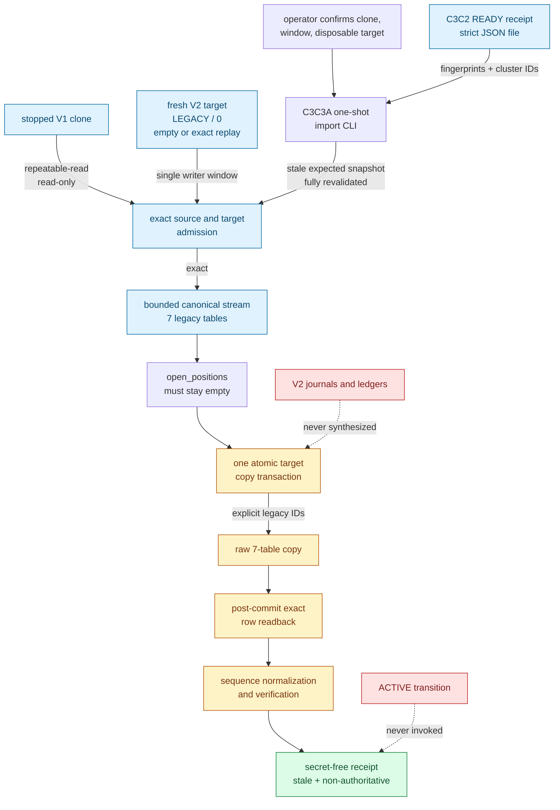
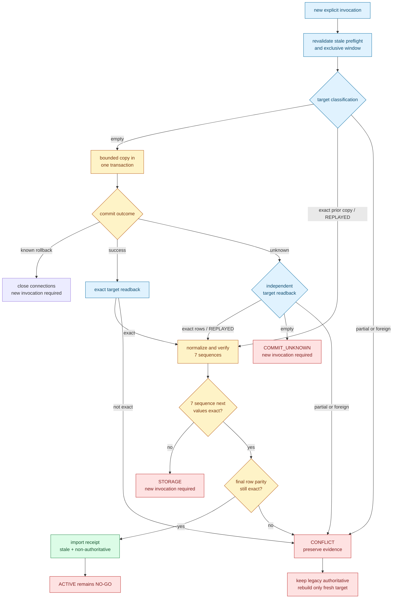

# ELVIS V2 bounded legacy snapshot import

This runbook defines M9b.14c3c3a: a one-shot, bounded import of the exact seven
legacy V1 tables from a stopped source clone into the same seven relations on a
separate, freshly bootstrapped V2 target.

> **This slice preserves history; it does not manufacture V2 history or grant
> runtime authority.** The importer never reads the active source volume,
> copies an open position, synthesizes an order/fill journal or paper-account
> ledger, starts a runtime, or invokes activation. The compatibility paper
> runtime remains authoritative and `ACTIVE` remains a **NO-GO**.

## Decision and scope

M9b.14c3c2 admitted a stopped V1 clone and an empty terminal V2 target, but its
receipt is deliberately non-authoritative and stale as soon as inspection
ends. M9b.14c3c3a accepts the exact secret-free c3c2 JSON receipt from an
operator-controlled file, treats it only as the expected snapshot, and proves
the complete pair again under importer transactions before it can write. This
binding also permits an exact previously imported target to be classified as
`REPLAYED`; rerunning c3c2 alone would correctly reject that non-empty target.

The importer has one narrow purpose:

1. bind the source and target to the exact c3c2 cluster identifiers, relation
   fingerprints, and canonical hash in the supplied receipt;
2. revalidate the exact V1 source catalog, rows, stopped-session boundary, and
   exact terminal V2 target before mutation;
3. copy the seven allowlisted legacy relations with their original primary-key
   values, including intentional ID gaps, in bounded batches;
4. prove exact target row counts, key bounds, and canonical SHA-256 values;
5. normalize and verify the seven legacy serial sequences only after the row
   transaction has committed; and
6. return sanitized evidence for a later replay/reconciliation slice.

The source clone remains the audit and rollback reference. The target remains
disposable and non-authoritative. A successful import is not a cut-over and is
not permission to point a bot, trainer, API, or readiness probe at the target.

## Trust boundary



Graph artefacts:
[Mermaid source](../diagrams/v2-c3c3a-import-trust.mmd),
[SVG](../diagrams/v2-c3c3a-import-trust.svg),
[PNG](../diagrams/v2-c3c3a-import-trust.png), and
[editable Excalidraw](../diagrams/v2-c3c3a-import-trust.excalidraw).

The pure application contract is
`trading.application.legacy_snapshot_import`. Its public intent is
`LegacySnapshotImportContext(cutover_context, batch_size=512)`, and the port
exposes only `import_snapshot(context, preflight_receipt, /)`. Success returns
`LegacySnapshotImportDisposition.IMPORTED` after a new row commit or
`LegacySnapshotImportDisposition.REPLAYED` after exact prior-copy recovery.
The PostgreSQL adapter is
`trading.persistence.postgres_legacy_snapshot_import.PostgresLegacySnapshotImport`
with pairwise-distinct source, target-admin, and target-migrator connection
factories. Its typed failure boundary is
`PostgresLegacySnapshotImportInputError`,
`PostgresLegacySnapshotImportBusyError`,
`PostgresLegacySnapshotImportConflict`,
`PostgresLegacySnapshotImportStorageError`, and
`PostgresLegacySnapshotImportCommitUnknown`; exception messages are never part
of CLI JSON.

The importer is an offline operator boundary. It is not called by `main.py`,
the root Compose project, Ansible, the Apple launch path, application startup,
health, readiness, the trainer, or activation.

## Exact data boundary

The mapping is deliberately identity-shaped. Each source relation maps only to
the relation with the same schema, table, and V1 column layout on the target:

| Source | Target | Import rule |
|---|---|---|
| `np.account_balances` | `np.account_balances` | Copy admitted rows with explicit legacy IDs. |
| `np.liquidations` | `np.liquidations` | Copy admitted rows with explicit legacy IDs. |
| `np.margin_history` | `np.margin_history` | Copy admitted rows with explicit legacy IDs. |
| `np.model_predictions` | `np.model_predictions` | Copy admitted rows with explicit legacy IDs. |
| `np.open_positions` | `np.open_positions` | Must contain zero rows on both sides; no row is copied. |
| `np.trades` | `np.trades` | Copy admitted rows with explicit legacy IDs. |
| `np.trading_session_resets` | `np.trading_session_resets` | Copy admitted rows with explicit legacy IDs. |

Primary keys are preserved exactly rather than regenerated. Gaps are valid and
remain gaps. The copy does not substitute defaults, recalculate timestamps,
coerce text, round PostgreSQL `REAL` values, or turn null into a sentinel.
Canonical post-copy evidence uses the same typed ordering and SHA-256 contract
as the c3c2 source preflight.

`np.open_positions` is a hard zero-row condition. A legacy open position cannot
be represented as a safe V2 durable position without the missing causal order,
fill, account, fee, and runtime-generation provenance. Any source or target open
position blocks the import before the first insert.

The following V2 relations remain exactly as the terminal bootstrap created
them and receive no historical row from this slice:

- `np.orders` and `np.order_events`;
- `np.position_streams`;
- `np.paper_account_streams`, balances, settlements, postings, manifests, and
  margin reservations;
- `np.paper_runtime_generations`; and
- the singleton `np.paper_runtime_control`, which remains `LEGACY` at
  generation zero.

V1 does not contain the immutable IDs, event sequence, execution scope,
confirmed-fill causality, account version, exact decimal settlement, or runtime
generation needed to synthesize those facts. Inventing them would create an
apparently replayable history that never occurred. A later, separately reviewed
reconciliation slice must decide how admitted legacy balances and trades inform
V2 opening provenance; c3c3a only preserves the raw V1 snapshot.

The importer never copies schemas, roles, memberships, ACLs, defaults,
extensions, routines, triggers, indexes, sequences as objects, migration-ledger
rows, large objects, or any relation outside the seven-row allowlist.

## Preconditions

Before every invocation, the operator must independently establish all of the
following:

1. The source endpoint is the stopped physical clone named by the supplied c3c2
   evidence, never the active source cluster or volume.
2. The target is the separate terminal V2 cluster named by that evidence.
3. No source writer or foreign source session can appear during the import.
4. No target process other than this importer can change the migration
   boundary during the complete operation. Database locks coordinate admitted
   SQL, but do not replace the external exclusive maintenance window.
5. The source and target libpq service files and passfile are held outside Git,
   are access controlled, and resolve to the reviewed identities.
6. The compiled total-row, canonical-row, and canonical-byte ceilings fit the
   reviewed snapshot and the operator-approved maintenance budget.
7. The legacy runtime remains authoritative and no deployment, credential
   rotation, shadow, pause, activation, or target runtime start is scheduled by
   this command.
8. The target is disposable by a separately verified operator procedure; the
   CLI confirmation records this assertion but does not discover or delete it.

If any precondition is uncertain, stop. Recreate the stopped clone or fresh
target under an independently verified procedure. Do not edit source rows,
truncate a partial target, reset a sequence, loosen a cap, or expand the
allowlist merely to make admission pass.

## Command and non-secret configuration

Run one explicit invocation from the repository root:

```bash
PGSERVICEFILE=/secure/operator/pg_service.conf \
PGPASSFILE=/secure/operator/pgpass \
python -m scripts.postgres_legacy_snapshot_import \
  --config /secure/operator/legacy-snapshot-import-v1.json \
  --preflight-receipt /secure/operator/cutover-preflight-ready.json \
  --import-snapshot \
  --confirm-stopped-source-clone \
  --confirm-exclusive-database-window \
  --confirm-disposable-target
```

All six options are mandatory. `--config` and `--preflight-receipt` must each
resolve to a regular, non-symlink file and must not exceed 65,536 bytes. The
receipt's strict JSON must be an exact secret-free c3c2
`READY_FOR_FRESH_TARGET` receipt:
empty blockers, `stale_on_return: true`, `snapshot_authoritative: false`, two
distinct positive cluster identifiers, the exact seven ordered source
relations, their counts/bounds/lowercase SHA-256 values, the source canonical
SHA-256, zero source sessions/open positions/invalid rows, exact V1 layout and
identity, and an empty exact terminal V2 target in `LEGACY/0` with migrations
1 through 6.

The importer binds every receipt fingerprint and identity as expected evidence
but never treats the file as current authority. The file contains no password,
service name, role, endpoint, SQL, or business-row value. Capture the exact
compact JSON emitted by c3c2 without editing its evidence. Keep both config and
receipt files owner-controlled and non-world-writable as operator hygiene; the
CLI rejects symlinks and non-regular paths but does not claim to enforce file
ownership or an exact permission mode. Never regenerate a hash by hand to make
a changed source pass.

`--confirm-disposable-target` records the operator assertion that only the
separate fresh target may later be rebuilt if recovery fails. It grants no
permission to delete that target and never broadens the source boundary.

The exact committed example is
`deploy/v2/legacy-snapshot-import-v1.example.json`. Its closed shape is:

```json
{
  "schema_version": 1,
  "batch_size": 512,
  "source": {
    "expected_database": "elvis_trading",
    "expected_role": "elvis_user",
    "service": "elvis_source_clone"
  },
  "target": {
    "admin_service": "elvis_fresh_target_admin",
    "migrator_service": "elvis_fresh_target_migrator",
    "bootstrap_context": {
      "expected_database": "elvis_paper_v2",
      "admin_role": "elvis_bootstrap_admin",
      "roles": {
        "schema_owner": "elvis_schema_owner",
        "migrator": "elvis_migrator",
        "legacy_runtime": "elvis_legacy_runtime",
        "atomic_runtime": "elvis_atomic_runtime",
        "activation": "elvis_activation",
        "readiness": "elvis_readiness",
        "trainer": "elvis_trainer"
      },
      "adoption": null
    }
  }
}
```

The `source` and `bootstrap_context` values retain the exact c3c2 meanings.
`target.admin_service` is used only for read-only terminal-catalog inspection
and readback; `target.migrator_service` is a distinct connection authenticated
as the declared migrator. The source, target-admin, and target-migrator service
names must be pairwise distinct. `batch_size` is the only configurable resource
cap and must be an integer from 1 through 512; the committed example uses 512.
The configuration file is capped at 65,536 bytes.

Unknown, duplicate, missing, wrongly typed, or out-of-bound configuration
values are input errors. `adoption` must be `null`. Service names are libpq
references, not connection values.

## Bounded execution contract

The command accepts one strict, non-secret versioned intent and mandatory
operator confirmations. Connection endpoints and credentials remain in
external libpq files. The JSON cannot contain a DSN, host, port, password,
passfile content, SQL, or an arbitrary connection keyword.

The batch size limits both source fetches and target parameter groups; it does
not split durability into partial commits. The importer also enforces compiled,
non-configurable limits: at most 100,000 total source rows, at most 65,536
canonical bytes for one row, and at most 512 MiB of canonical source bytes.
The separate 65,536-byte cap on the configuration document is not a dataset
cap. Source row counts and semantic validity must match the supplied stale c3c2
receipt exactly before mutation. Business rows are streamed directly through
bounded in-memory batches and are never written to a local spool file.

One source `REPEATABLE READ READ ONLY` transaction fixes the admitted source
snapshot for reinspection, hashing, and copying. The source transaction and
connection remain read-only and are closed on every outcome. A first full pass
validates and hashes the seven relations; the bounded copy is a second full
pass whose typed hashes and bounds must match before the target can commit.

Before any insert, the target path:

1. authenticates and rechecks the expected database identity;
2. authenticates and rechecks the dedicated migrator identity before `SET
   ROLE` selects the schema owner;
3. acquires the exact target relation locks in a fixed order;
4. revalidates the terminal catalog, `LEGACY/0` control state, empty-or-exact
   import state, and all c3c2 pair evidence while those locks are held; and
5. rejects a partial, surplus, or foreign target rather than deleting,
   truncating, upserting, disabling triggers, or repairing it.

For an admitted empty target, all explicit-ID row inserts occur in one target
transaction. A known pre-commit failure rolls that transaction back. The
importer does not run DDL, `GRANT`, `REVOKE`, role administration, catalog
repair, source DML, target `DELETE`, target `TRUNCATE`, conflict-upsert, or
trigger disabling.

## Resume, commit-unknown, and sequence boundary

The raw row commit and serial-sequence normalization are deliberately separate.
PostgreSQL sequence changes made by `setval` are not transactional, so calling
`setval` before row commit could leak sequence state after a row rollback. The
source next value is `last_value + 1` when `is_called` is true and `last_value`
otherwise. For each target sequence, the safe next value is
`max(source_sequence_next, pk_max + 1)`, using one as the empty-relation floor.
It must fit the PostgreSQL integer sequence range. Normalization uses that value
with `is_called = false`, so the next `nextval` returns the declared value. The
importer therefore follows this order:

1. commit the complete seven-relation raw copy once;
2. perform an independent exact target readback using the canonical evidence
   contract;
3. only when that readback is exact, normalize each legacy serial sequence;
4. read back every sequence state and require the declared value and
   `is_called` semantics; and
5. revalidate row parity before returning a receipt.

An exception from the row commit is commit-unknown: the importer must not guess
whether the database committed and must not immediately insert again. The same
invocation performs an independent readback and classifies the target:

- **empty**: no row commit is visible; return `COMMIT_UNKNOWN`, and allow no
  automatic second copy;
- **exact prior copy**: all seven relation counts, key bounds, and SHA-256
  values match; treat the commit as proven, continue sequence
  normalization/readback, and return `REPLAYED` rather than claiming a newly
  witnessed commit;
- **partial or foreign**: any subset, surplus row, mismatched value, changed
  control state, or catalog drift returns `CONFLICT` without repair.

On a later explicit invocation, the same classification makes a completed
copy repeatable. It does not use `ON CONFLICT`, overwrite an existing row, or
infer success from a few sampled keys. A failure after row commit but before
all sequence verification is recoverable only through exact full readback
followed by the same bounded sequence normalization path. It returns `STORAGE`
with no receipt, but it does not make exact committed rows partial business
data.



Graph artefacts:
[Mermaid source](../diagrams/v2-c3c3a-import-recovery.mmd),
[SVG](../diagrams/v2-c3c3a-import-recovery.svg),
[PNG](../diagrams/v2-c3c3a-import-recovery.png), and
[editable Excalidraw](../diagrams/v2-c3c3a-import-recovery.excalidraw).

There is no automatic retry loop. Every retry is a new operator decision after
reviewing the previous phase, restoring readback, and re-establishing the
exclusive window.

## Evidence is stale and non-authoritative

An import receipt records what the importer proved while its source snapshot
and target locks existed. All connections and locks are closed before the JSON
is returned. The receipt therefore always has `stale_on_return: true` and
`snapshot_authoritative: false`, including after an exact repeat or
commit-unknown recovery.

The receipt contains disposition `IMPORTED` or `REPLAYED`, decimal-string
cluster identifiers, the source canonical SHA-256, `target_exact: true`,
`runtime_activation_authorized: false`, `stale_on_return: true`,
`snapshot_authoritative: false`, and seven ordered relation entries. Each entry
contains name, row count, primary-key bounds, SHA-256, source next-sequence
value, and target next-sequence value. It must not contain service names, role
names, DSNs, hosts, ports, secret paths, SQL,
exception messages, arbitrary error strings, or copied business-row values.

No receipt is a reservation, deployment token, readiness result, activation
capability, backup, or proof that the target has remained unchanged after the
command returned.

| Exit | `status` / `code` | Meaning and required action |
|---:|---|---|
| `0` | `IMPORTED` or `REPLAYED` | Exact row and sequence readback succeeded. Keep the receipt as stale evidence only. |
| `2` | `ERROR` / `INPUT` | Invocation, configuration, strict receipt document, context, or receipt binding is invalid. Correct it before a new explicit run. |
| `20` | `ERROR` / `STORAGE` | A safe database operation failed without an accepted terminal receipt. Preserve evidence and recover only through a new exact invocation. |
| `22` | `ERROR` / `BUSY` | The declared exclusive window or required target lock was unavailable. Do not retry until external exclusivity is re-established. |
| `23` | `ERROR` / `CONFLICT` | Source evidence changed or target state is partial, foreign, or otherwise non-exact. Stop without repair. |
| `24` | `ERROR` / `COMMIT_UNKNOWN` | Row commit acknowledgement is unknown and exact readback did not prove a committed copy. Preserve evidence and reconcile in a new invocation. |
| `70` | `ERROR` / `INTERNAL` | An unexpected CLI failure occurred. Stop and treat all evidence as unproven. |

Handled errors contain only the typed code. The import CLI has no exit `21`; a
receipt other than exact c3c2 `READY_FOR_FRESH_TARGET` evidence is input failure.

## Rollback

Authority never moves in c3c3a, so rollback always keeps the legacy paper
runtime authoritative:

| Observed phase | Required response |
|---|---|
| Failure before row commit | Require a confirmed rollback, close both connections, preserve sanitized evidence, and begin only with a new explicit invocation. |
| Commit acknowledgement lost | The same invocation performs an independent readback. Exact rows continue; partial or foreign rows conflict; an empty or unprovable outcome returns `COMMIT_UNKNOWN`, after which any retry requires a new explicit invocation. |
| Exact rows but incomplete sequence normalization | Preserve the target; resume only through exact row readback and the declared sequence path. |
| Partial, surplus, or foreign target | Stop without delete, truncate, or repair. Preserve evidence and rebuild only the separately verified fresh target. |
| Exact import receipt | Keep V2 dormant. Continue only into separately reviewed replay, reconciliation, shadow, and cut-over gates. |

This runbook intentionally contains no destructive cleanup command. The
importer does not own the source clone mechanism, backup store, target
lifecycle, or production deployment. An operator must resolve and verify an
exact disposable target through a separate procedure before removing it.

## Remaining `ACTIVE` blockers

- Raw legacy rows have no synthesized V2 order/fill, position, account, fee,
  or generation provenance.
- Target replay and semantic reconciliation of imported balances and trades
  remain pending.
- Runtime DDL remains in the compatibility path.
- Production bot and trainer identities, SCRAM secrets, restrictive HBA, and
  network policy are not composed.
- Root Compose, Ansible, and Apple deployment paths are not migrated.
- Runtime startup and health do not fail closed on V2 catalog, identity,
  generation, import, and authority evidence.
- Side-effect-free shadow comparison, stale-writer removal, pause/rollback
  rehearsal, soak, and explicit operator approval remain pending.

## Verification status

Acceptance requires focused contract checks under Python 3.10 and 3.14, a
dedicated two-cluster PostgreSQL 15 suite, the complete PostgreSQL and
non-PostgreSQL regressions, static checks, link validation, exact Mermaid
source/render parity, visual inspection of both PNGs, and disposable-resource
cleanup. Test totals belong in the roadmap only after those commands pass on
the frozen slice; this runbook does not claim unexecuted evidence.
