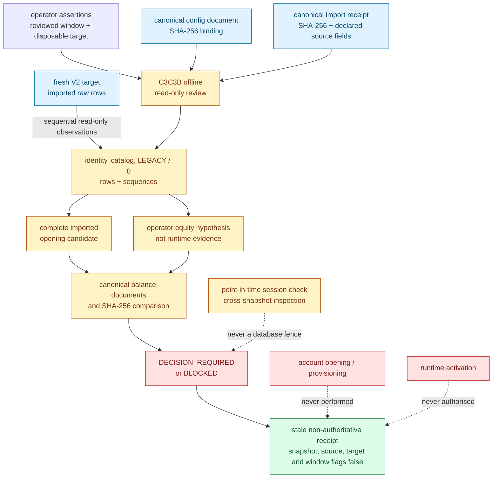
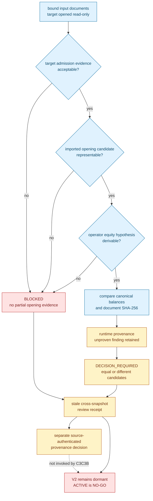

# ELVIS V2 legacy snapshot reconciliation review

This runbook defines M9b.14c3c3b: a one-shot, read-only comparison between the
opening balances stored by a receipt-bound c3c3a target import and one explicitly
operator-supplied equity hypothesis.

> **This slice cannot match, choose, or create a V2 account.** The hypothesis is
> not evidence of the compatibility runtime's configuration, algorithm, or
> state. Every usable comparison is `DECISION_REQUIRED`; an inadmissible review
> is `BLOCKED`. The compatibility paper runtime remains authoritative and
> `ACTIVE` remains a **NO-GO**.

## Decision and scope

C3c3a copied seven allowlisted V1 relations without inventing V2 journal,
ledger, account, fee, or generation provenance. C3c3b keeps that boundary. It
opens no source connection. It consumes two operator-controlled JSON documents,
binds their canonical SHA-256 values, checks that the import receipt's combined
relation hash is internally consistent, then rereads the imported target
through read-only database transactions.

The review retains two separate prospective opening documents:

1. every exact imported `np.account_balances` row; and
2. `OPERATOR_EQUITY_HYPOTHESIS`, derived from an explicit starting-collateral
   assumption and a deterministic c3c3b fold over imported trade rows.

The second document is deliberately an operator hypothesis. The command does
not inspect the active runtime's configured starting collateral, prove which
runtime algorithm produced historical balances, or authenticate the imported
rows against the original source. Equal candidate balances and hashes therefore
still require a later provenance decision. Equality has no success disposition
or ordinary-success exit.

## Trust boundary



Graph artefacts:
[Mermaid source](../diagrams/v2-c3c3b-reconciliation-trust.mmd),
[SVG](../diagrams/v2-c3c3b-reconciliation-trust.svg),
[PNG](../diagrams/v2-c3c3b-reconciliation-trust.png), and
[editable Excalidraw](../diagrams/v2-c3c3b-reconciliation-trust.excalidraw).

The reviewer is an offline operator boundary. It is not called by `main.py`,
the root compatibility project, retired deployment experiments, application startup,
health, readiness, the trainer, account provisioning, or activation.

## Application contract

The pure boundary is
`trading.application.legacy_snapshot_reconciliation`. Its exact public context
is `LegacySnapshotReconciliationContext(import_context,
config_document_sha256, import_receipt_sha256, execution_scope, account_key,
owner_generation, collateral_asset, margin_quantum,
hypothesis_starting_collateral)`. Money inputs are finite `Decimal` values: the
margin quantum is positive and the operator's starting-collateral hypothesis is
non-negative. The positive durable owner generation and clean account identity
bind both candidate documents to the future opening intent without creating it.

`LegacyOpeningCandidateSource` fixes the exact candidate order as
`IMPORTED_ACCOUNT_BALANCES`, then `OPERATOR_EQUITY_HYPOTHESIS`. Each
`LegacyOpeningCandidate` is either unavailable with no balances or hash, or
available with a non-empty, unique, asset-sorted tuple of
`PaperAccountBalance` values, non-negative available amounts, zero
reservations, exactly one declared-collateral row, and a lowercase
`opening_payload_sha256`.

The pure `legacy_opening_candidate_sha256` helper hashes the exact prospective
opening document: execution scope, owner generation, account policy, margin
quantum, and complete balance tuple. The receipt rederives both hashes and also
rederives the hypothesis balances through
`legacy_operator_equity_hypothesis_balances`; supplied or forged comparison
tokens cannot create a decision receipt.
`legacy_opening_quantization_required` likewise rederives whether the exact
starting-hypothesis conversion or any available balance requires the bounded
`QUANTIZATION_REQUIRED` finding.

`LegacySnapshotReconciliationEvidence` preserves a canonical naive ISO reset
timestamp with exactly six fractional digits, exact
`hypothesis_realised_pnl`, `hypothesis_trade_fees`, and
`hypothesis_liquidation_fees` Decimal values, then the two candidates in enum
order. These numeric fields describe the documented hypothesis algorithm, not
authenticated runtime observations.

Findings use only the bounded `LegacySnapshotReconciliationFindingKind`
taxonomy:

- target identity, catalog, runtime-control, legacy-row, sequence, open-position,
  V2-state, or point-in-time active-session drift;
- missing collateral, unsupported hypothesis collateral, invalid numeric
  evidence, or unrepresentable opening evidence; and
- mandatory unproven runtime provenance, quantisation required, or candidate
  mismatch.

`LegacySnapshotReconciliationDisposition` contains only `DECISION_REQUIRED` and
`BLOCKED`:

- `DECISION_REQUIRED` requires both candidates, canonical self-consistency, and
  the mandatory `RUNTIME_PROVENANCE_UNPROVEN` finding. It may additionally
  report `QUANTIZATION_REQUIRED` and exactly reports `CANDIDATE_MISMATCH` when
  the balance documents or their hashes differ.
- `BLOCKED` requires a blocking finding. It exposes both candidate identities as
  unavailable, no opening balances or hashes, no reset timestamp, and zero
  sentinel numeric fields; those zeroes are not partial observations.

`LegacySnapshotReconciliationReceipt` binds the exact context and import
receipt, live target system identifier, declared source relation-evidence hash,
and both canonical input-document hashes. It hard-codes
`stale_on_return: true`, `snapshot_authoritative: false`,
`coherent_snapshot_observed: false`,
`source_provenance_authenticated: false`,
`target_observations_authenticated: false`,
`database_window_enforced: false`,
`account_opening_authorized: false`,
`account_provisioning_authorized: false`, and
`runtime_activation_authorized: false`.

`LegacySnapshotReconciliationPort.reconcile(context, import_receipt, /)` is the
only application operation. It returns review evidence and has no mutation,
selection, or provisioning method.

## Document binding is not source authentication

The CLI calculates two canonical, key-sorted JSON document hashes after strict
parsing:

- `config_document_sha256` binds the exact configuration document consumed by
  this invocation; and
- `import_receipt_sha256` binds the exact public c3c3a receipt document consumed
  by this invocation.

`legacy_snapshot_relation_evidence_sha256` also recomputes the combined hash of
the seven relation receipt entries and requires it to equal the receipt's
`source_canonical_sha256`. This proves internal consistency between the supplied
receipt fields and the target rows rehashed during c3c3b. It does not prove who
created either document, authenticate the declared source cluster, or
retroactively bind the c3c3a import to a configuration file that c3c3a did not
itself authenticate.

The output therefore labels `import_disposition` and
`declared_source_system_identifier` as declarations carried by the bound import
document. Only the target identity is checked live. The permanent
`source_provenance_authenticated: false` flag is the authoritative
interpretation of the source-side fields and hashes.

## Read-only PostgreSQL observation model

The adapter is
`trading.persistence.postgres_legacy_snapshot_reconciliation.PostgresLegacySnapshotReconciliation`.
Its constructor takes distinct target-admin and target-readiness connection
factories, in that order. It authenticates both declared target identities,
including the readiness role marker and target system identifier, and uses
`REPEATABLE READ READ ONLY` transactions with UTC timestamps and a controlled
search path. It performs no DML, DDL, sequence operation, `SET ROLE`, role
administration, session termination, advisory lock, or source connection.

The adapter sequentially checks a point-in-time view of other target client
sessions, the terminal bootstrap catalog and `LEGACY/0`, all seven raw relation
fingerprints, all seven sequence next values, absence of imported open
positions, and absence of V2 authority state. These observations span distinct
admin/readiness transactions and an additional terminal inspection. They do not
form one shared PostgreSQL snapshot. A process can also connect after the
session query. Consequently:

- `coherent_snapshot_observed` is always false;
- `target_observations_authenticated` is always false: the adapter derives the
  imported balances and three hypothesis folds from target reads, but the typed
  receipt alone does not cryptographically authenticate those observations;
- `database_window_enforced` is always false; and
- an operator confirmation is never a lock, reservation, or database fence.

The typed adapter boundary is
`PostgresLegacySnapshotReconciliationInputError`,
`PostgresLegacySnapshotReconciliationConflict`, and
`PostgresLegacySnapshotReconciliationStorageError`. A client session observed
at the one session check yields a `BLOCKED` receipt with
`TARGET_ACTIVE_SESSIONS`. Driver and exception text is removed from the public
error path.

## Exact candidate meanings

### Imported balance candidate

The imported candidate preserves every `np.account_balances` row in canonical
asset order. Each PostgreSQL `REAL` amount is read through its exact
`float4send` bytes, reconstructed as the equivalent Python float, then captured
without loss by `Decimal.from_float`; it is not rounded to the margin quantum.
The declared collateral asset must be present. Every zero or non-zero additional
asset remains part of the prospective opening document.

An invalid asset, missing collateral, invalid or non-finite float4, or loss of
target/import parity blocks the review. A finite amount outside the margin
quantum is preserved and adds `QUANTIZATION_REQUIRED`. The imported tuple is
evidence of what the target currently exposes in its readiness snapshot. It is
not proof of the original deposits, withdrawals, fees, marks, source identity,
or trade causality that produced it.

### Operator equity hypothesis

The operator supplies `hypothesis_starting_collateral`; the committed example
uses `100`. That value is not read from, compared with, or authenticated against
the active compatibility runtime. C3c3b then applies this explicitly documented
hypothesis algorithm to rows on the imported target:

```text
window = timestamp >= latest reset_timestamp; without a reset, all rows
pnl = binary64 fold from 0.0 over exact float4 trades.pnl ordered by trade id
trade_fees = binary64 fold from 0.0 over exact float4 trades.fee ordered by trade id
liquidation_fees = binary64 fold from 0.0 over exact float4 liquidation_fee ordered by liquidation id
equity = max(0.0, binary64(hypothesis starting collateral) + pnl)
opening balances = BNB 0, BTC 0, USDT equity; every reserved amount is 0
```

Rows exactly equal to the latest reset timestamp are included. The latest reset
is selected by descending timestamp then ID. Each input float4 is reconstructed
from `float4send`; accumulation is an explicit, deterministic binary64 fold in
primary-key order. Empty row sets fold to exact zero. A null, malformed,
non-finite, or out-of-range value blocks numeric evidence. The resulting
binary64 totals and balance are captured losslessly with `Decimal.from_float`.

This is neither PostgreSQL `SUM(REAL)` nor a replay of the active runtime. The
active runtime's starting capital, row visibility, ordering, and historical
algorithm have no authenticated provenance in this slice. The candidate is
USDT-specific; another declared collateral asset is blocked. Trade fees and
liquidation fees remain separate hypothesis values and are neither combined nor
deducted because V1 does not prove non-overlapping accounting meaning.

The exact hypothesis tuple can equal the imported tuple, for example when the
import contains `BNB=0`, `BTC=0`, and the same USDT value. Equality only omits
`CANDIDATE_MISMATCH`; it cannot remove `RUNTIME_PROVENANCE_UNPROVEN` or produce a
match. A USDT-only import, an unknown extra asset, non-zero BNB/BTC, a different
USDT amount, or another document/hash difference adds `CANDIDATE_MISMATCH`.

## Review outcome



Graph artefacts:
[Mermaid source](../diagrams/v2-c3c3b-opening-decision.mmd),
[SVG](../diagrams/v2-c3c3b-opening-decision.svg),
[PNG](../diagrams/v2-c3c3b-opening-decision.png), and
[editable Excalidraw](../diagrams/v2-c3c3b-opening-decision.excalidraw).

| Disposition | Meaning | Required action |
|---|---|---|
| `DECISION_REQUIRED` | Both prospective openings are available, but runtime/source provenance is unproven whether their canonical documents agree or differ. | Preserve both candidates and all findings. Obtain source-authenticated runtime provenance in a separate reviewed slice before choosing an opening. |
| `BLOCKED` | Target admission or candidate derivation failed. No opening balances, hashes, reset, or partial numeric observations are exposed. | Keep V2 dormant, preserve the bounded findings, and repair or rebuild only through a separately reviewed procedure. |

Neither disposition authorises account opening, provisioning, a runtime
generation, or activation.

## Command and non-secret configuration

Run one explicit invocation from the repository root:

```bash
PGSERVICEFILE=/secure/operator/pg_service.conf \
PGPASSFILE=/secure/operator/pgpass \
python -m scripts.postgres_legacy_snapshot_reconciliation \
  --config /secure/operator/legacy-snapshot-reconciliation-v1.json \
  --import-receipt /secure/operator/legacy-snapshot-import.json \
  --assess \
  --confirm-reviewed-database-window \
  --confirm-disposable-target
```

All five options are mandatory. `--confirm-reviewed-database-window` records
only the operator's assertion that the intended window was reviewed; it neither
requires nor enforces exclusivity. `--confirm-disposable-target` records an
operator assertion about lifecycle ownership. Neither flag terminates a
session, reserves a database, authenticates the source, discovers target
ownership, or grants permission to rebuild or delete anything.

Configuration and receipt inputs are strict, bounded to 65,536 bytes, and
opened as regular files with no symlink following. Duplicate keys, non-finite
JSON constants, unknown fields, missing fields, wrong types, and wrong relation
ordering are rejected before service resolution. External
`PGSERVICEFILE`/`PGPASSFILE` remain the only connection and secret inputs.

The exact committed example is
`deploy/v2/legacy-snapshot-reconciliation-v1.example.json`:

```json
{
  "schema_version": 1,
  "batch_size": 512,
  "source": {
    "expected_database": "elvis_trading",
    "expected_role": "elvis_user"
  },
  "target": {
    "admin_service": "elvis_fresh_target_admin",
    "readiness_service": "elvis_fresh_target_readiness",
    "bootstrap_context": {
      "expected_database": "elvis_paper_v2",
      "admin_role": "elvis_bootstrap_admin",
      "roles": {
        "schema_owner": "elvis_schema_owner",
        "migrator": "elvis_migrator",
        "legacy_runtime": "elvis_legacy_runtime",
        "atomic_runtime": "elvis_atomic_runtime",
        "activation": "elvis_activation",
        "readiness": "elvis_readiness",
        "trainer": "elvis_trainer"
      },
      "adoption": null
    }
  },
  "opening": {
    "execution_scope": "paper:compatibility",
    "account_key": "paper:primary",
    "owner_generation": 1,
    "collateral_asset": "USDT",
    "margin_quantum_decimal": "0.01",
    "hypothesis_starting_collateral_decimal": "100"
  }
}
```

`batch_size` reconstructs the declared c3c3a import context and is 1 through
512. The source database and role are receipt-bound declarations; c3c3b opens
no source connection. `adoption` must be `null`. The owner generation is a
positive PostgreSQL `bigint`; scope, account key, and asset fit their durable
limits. Both money values are canonical finite Decimal strings.

The target services must be distinct strict libpq service identifiers. The JSON
cannot contain a DSN, host, port, password, passfile content, SQL, or arbitrary
connection keyword. The command does not enforce file ownership or an exact
permission mode; operator hygiene must keep inputs owner-controlled and
non-world-writable.

The strict import document accepts only the c3c3a `IMPORTED` or `REPLAYED`
shape: decimal-string cluster identifiers, internally consistent combined
relation hash, seven exact ordered relation and sequence entries,
`target_exact: true`, `runtime_activation_authorized: false`,
`stale_on_return: true`, and `snapshot_authoritative: false`. Acceptance binds
the document; it does not authenticate its origin or declared source.

Every handled disposition or typed error writes exactly one compact JSON line
to stdout and keeps stderr empty. A disposition receipt contains:

- `status`, the declared `import_disposition`, the
  `declared_source_system_identifier`, the live target system identifier, the
  internally consistent source relation-evidence hash, and the canonical
  config/import-document hashes;
- bounded findings;
- the canonical reset timestamp, the three separate `hypothesis_*_decimal`
  values, and both ordered candidate identities, availability flags, complete
  balances, and opening-document hashes when available; and
- all nine stale, snapshot, source/target provenance, window, opening,
  provisioning, and activation flags with their fixed safe values.

It never exposes a service or role name, endpoint, SQL, secret path, driver
message, exception string, source row ID, or raw trade/liquidation row.

| Exit | `status` / `code` | Meaning and required action |
|---:|---|---|
| `10` | `DECISION_REQUIRED` | Both candidates are available, but source/runtime provenance remains unproven. Preserve the review; do not open or activate. |
| `21` | `BLOCKED` | Target admission or candidate derivation failed. Keep V2 dormant and preserve the bounded findings. |
| `2` | `ERROR` / `INPUT` | Invocation, JSON document, canonical binding, context, or strict c3c3a receipt shape is invalid. Correct it before a new explicit review. |
| `20` | `ERROR` / `STORAGE` | A safe read-only database operation failed. Preserve evidence; infer no candidate. |
| `23` | `ERROR` / `CONFLICT` | A live target identity cannot satisfy the receipt-bound target intent. Stop without repair or mutation. |
| `70` | `ERROR` / `INTERNAL` | An unexpected CLI failure occurred. Treat all opening evidence as unproven. |

The listed table is the complete exit contract. Equality never becomes an
ordinary-success result.

## Rollback

There is no state transition to roll back because c3c3b is read-only. On every
outcome, close the target connections, preserve only sanitized evidence, and
keep the compatibility runtime authoritative. A decision or block does not
permit a target edit, account seed, receipt edit, changed starting hypothesis,
or fee subtraction merely to force document equality.

The target remains disposable only under the separate c3c3a lifecycle and
operator procedure. This runbook intentionally contains no deletion, truncate,
repair, provision, activation, or deployment command.

## Remaining `ACTIVE` blockers

- A later reviewed slice must authenticate the source, capture the actual
  historical runtime configuration and algorithm, then select and encode exact
  opening-capital provenance.
- No V2 paper-account opening is provisioned, and no imported trade is turned
  into a synthetic V2 order, fill, settlement, posting, or generation.
- C3c3b proves neither a coherent cross-check snapshot nor an enforced database
  window.
- Runtime DDL remains in the compatibility path.
- Production bot and trainer identities, SCRAM secrets, restrictive HBA, and
  network policy are not composed.
- The root compatibility composition is not a V2 deployment path.
- Runtime startup and health do not yet fail closed on V2 catalog, identity,
  generation, opening, and authority evidence.
- Side-effect-free shadow comparison, stale-writer removal, pause/rollback
  rehearsal, soak, and explicit operator approval remain pending.

Python 3.14 is the only supported interpreter for the package and operator
tools.

## Verification status

Acceptance requires focused contract checks under Python 3.14, a
dedicated PostgreSQL 15 read-only suite, the complete PostgreSQL and
non-PostgreSQL regressions, static checks, strict JSON/YAML validation, relative
link validation, exact Mermaid fence/source parity, both four-artifact diagram
sets, visual inspection of both PNGs, and disposable-resource cleanup. Test
totals belong in the migration roadmap only after those commands pass on the
frozen slice; this runbook does not claim unexecuted evidence.
