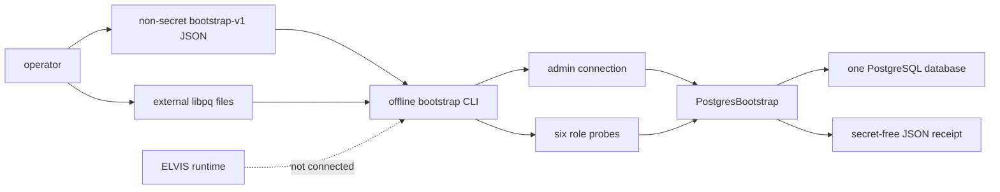
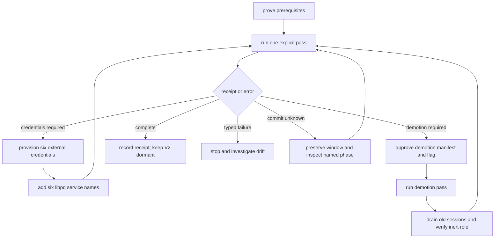

# ELVIS V2 offline PostgreSQL bootstrap

This runbook describes the **dormant, one-shot operator CLI** that exposes the
existing V2 least-authority PostgreSQL bootstrap. It can reconcile roles,
packaged migrations, ownership, ACLs, credential probes, and an explicitly
declared old-runtime demotion. It does **not** deploy credentials, start ELVIS,
activate the V2 paper runtime, terminate sessions, retry itself, or run from a
container startup hook.

> **No deployment or cut-over is authorised.** A successful `COMPLETE` receipt
> proves only the catalog checked by that invocation. V2 remains dormant and
> `ACTIVE` remains a **NO-GO** until all gates in the
> [migration roadmap](architecture_migration/04-migration-roadmap.md) close.

## Trust boundary

The JSON file contains intent and libpq service names only. Connection details
and secrets stay in operator-controlled libpq files outside the repository.



[Mermaid source](../diagrams/v2-bootstrap-trust-boundary.mmd) ·
[SVG](../diagrams/v2-bootstrap-trust-boundary.svg) ·
[PNG](../diagrams/v2-bootstrap-trust-boundary.png) ·
[editable Excalidraw](../diagrams/v2-bootstrap-trust-boundary.excalidraw)

The configuration contains declared database and role intent, but neither it
nor stdout may contain connection endpoints, a DSN, a password, or secret-file
contents. `PGSERVICEFILE` and `PGPASSFILE` are process environment references
to files managed outside Git. On Unix, keep the passfile at mode `0600`; libpq
ignores a passfile with permissive permissions.

## Command contract

Run the command manually from the repository root during an exclusive database
administration window:

```bash
PGSERVICEFILE=/secure/operator/pg_service.conf \
PGPASSFILE=/secure/operator/pgpass \
python -m scripts.postgres_bootstrap \
  --config /secure/operator/bootstrap-v1.json \
  --apply \
  --confirm-exclusive-ddl-role-window
```

The complete command shape is:

```text
python -m scripts.postgres_bootstrap \
  --config <bootstrap-v1.json> \
  --apply \
  --confirm-exclusive-ddl-role-window \
  [--confirm-old-runtime-demotion]
```

- `--config` selects the exact version-1 JSON document described below.
- `--apply` is mandatory. There is no plan, check, or implicit apply mode.
- `--confirm-exclusive-ddl-role-window` records the operator's assertion that
  concurrent DDL and role administration have been stopped. The PostgreSQL
  advisory lock serializes cooperating bootstrap calls only; it cannot fence a
  superuser that ignores the workflow.
- `--confirm-old-runtime-demotion` is an additional one-way confirmation. It is
  required when the adoption manifest requests demotion, but does not request
  demotion by itself.

The CLI is one-shot and has no automatic retry. It is never invoked by
`main.py`, Docker Compose, Ansible, a health probe, or an application startup
path.

## Exact configuration schema

Unknown or missing keys are rejected. The top-level object has exactly these
keys:

```json
{
  "schema_version": 1,
  "expected_database": "elvis_paper",
  "admin_role": "elvis_bootstrap_admin",
  "roles": {
    "schema_owner": "elvis_schema_owner",
    "migrator": "elvis_migrator",
    "legacy_runtime": "elvis_legacy_runtime",
    "atomic_runtime": "elvis_atomic_runtime",
    "activation": "elvis_activation",
    "readiness": "elvis_readiness",
    "trainer": "elvis_trainer"
  },
  "services": {
    "admin": "elvis_bootstrap_admin",
    "schema_owner": null,
    "migrator": null,
    "legacy_runtime": null,
    "atomic_runtime": null,
    "activation": null,
    "readiness": null,
    "trainer": null
  },
  "adoption": null
}
```

The contract is deliberately narrow:

- `schema_version` is the integer `1`.
- `expected_database` is the single database to admit and reconcile.
- `admin_role` is the independently authenticated database owner and bootstrap
  administrator. It must differ from every managed and old shared-runtime role.
- `roles` contains exactly seven pairwise-distinct, lowercase PostgreSQL role
  identifiers. `schema_owner` is `NOLOGIN`; the other six are separate login
  identities.
- `services.admin` is a required libpq service identifier.
- `services.schema_owner` is always `null` because that role cannot log in.
- The other six service entries are either a libpq service identifier or
  `null`. A `null` entry is reported as a pending credential; it is not filled,
  generated, or inferred by the CLI.
- A service identifier is resolved through the operator's `PGSERVICEFILE`.
  Apart from the explicit `expected_database` and role-intent fields above, the
  JSON cannot contain connection parameters such as a DSN, password, host,
  port, or libpq user override.
  Each role service must ultimately authenticate the exact declared role to
  the exact expected database; the bootstrap verifies that identity and its
  catalog attributes before continuing.
- `adoption` is either `null` for a fresh database or the exact object below.

For an existing-volume adoption, replace `null` with:

```json
{
  "migration_authority_role": "elvis_old_runtime",
  "allowed_historical_owner_roles": ["elvis_old_runtime"],
  "old_shared_runtime_role": "elvis_old_runtime",
  "demote_old_shared_runtime": false
}
```

`allowed_historical_owner_roles` must contain only the declared migration
authority. When present, `old_shared_runtime_role` must be that same role. Set
`demote_old_shared_runtime` to `true` only for the separately approved demotion
pass, and supply `--confirm-old-runtime-demotion` on that pass.

## Preconditions

All modes require:

1. an operator-enforced exclusive DDL and role-administration window;
2. a fresh, idle admin connection authenticated as `admin_role`;
3. an admin-owned target database whose name equals `expected_database`;
4. external, access-controlled `PGSERVICEFILE` and `PGPASSFILE` files; and
5. a backup and a rehearsed recovery path appropriate to the target volume.

### Fresh database

The target must be closed and empty apart from the exact admitted PostgreSQL
built-ins. In particular, the bootstrap rejects unexpected `public`, `np`, or
`pg_catalog` objects, database-scoped hooks, settings, grants, security labels,
large objects, or managed-role drift. The built-in PL/pgSQL extension,
languages, and their referenced handlers must belong to the independent admin.

The first pass normally leaves all six login service entries `null`. It stages
the exact seven managed roles as `NOLOGIN` with null passwords, creates no `np`
schema, applies no migration, and returns `CREDENTIALS_REQUIRED`.

### Existing-volume adoption

Adoption is not a generic import or repair mode. The existing volume must have
the complete checksummed packaged migration ledger and one declared historical
migration authority owning the admitted catalog. Partial history, unledgered
objects, mixed ownership, surplus authority, or a different built-in baseline
fails closed.

If the old shared superuser owns the built-in PL/pgSQL baseline, do not run this
workflow against that volume. Rehearse and remediate the ownership transition
offline on a clone, or provision a fresh admin-owned target. The bootstrap does
not silently repair that authority boundary.

### Old shared-runtime demotion

Demotion is a separate barrier, not an adoption side effect. Before requesting
it, remove every membership involving the old role and plan a maintenance
window in which its sessions can drain. The demotion pass removes login,
password, inheritance, and cluster-level privileges, then returns
`DEMOTION_REQUIRED`. A later explicit pass may complete the catalog transition
only after all old backends are gone and the role remains exactly inert.

## Operator state flow



[Mermaid source](../diagrams/v2-bootstrap-operator-flow.mmd) ·
[SVG](../diagrams/v2-bootstrap-operator-flow.svg) ·
[PNG](../diagrams/v2-bootstrap-operator-flow.png) ·
[editable Excalidraw](../diagrams/v2-bootstrap-operator-flow.excalidraw)

Do not loop automatically around any arrow. Every repeated invocation is a new
operator decision after the previous receipt and current database evidence have
been reviewed.

## Receipts and exit codes

Successful and resumable outcomes write one compact JSON object to stdout with
exactly these keys:

```json
{
  "status": "CREDENTIALS_REQUIRED",
  "migration_versions": [],
  "verified_role_probes": [],
  "pending_role_credentials": ["elvis_migrator"],
  "old_shared_runtime_demoted": false
}
```

The tuple-like values are serialized as JSON arrays. The object contains no
connection data or exception text.

| Exit | `status` / `code` | Meaning and next action |
|---:|---|---|
| `0` | `COMPLETE` | Exact terminal catalog proved. Record the receipt; do not activate V2. |
| `10` | `CREDENTIALS_REQUIRED` | Provision the listed role credentials externally, add their service identifiers, then make a new explicit pass. |
| `11` | `DEMOTION_REQUIRED` | Review the demotion barrier, drain the old role when required, then make a new explicit pass. |
| `2` | `ERROR` / `INPUT` | Invocation or configuration is invalid. Correct the command or non-secret manifest before retrying. |
| `20` | `ERROR` / `STORAGE` | Connectivity or safe catalog inspection failed. Restore observability before deciding whether to rerun. |
| `21` | `ERROR` / `DRIFT` | Catalog, identity, ownership, role, membership, or ACL evidence is not admitted. Stop and investigate; do not auto-repair. |
| `22` | `ERROR` / `MIGRATION` | Packaged history or migration reconciliation failed. Stop and preserve the database for review. |
| `23` | `ERROR` / `COMMIT_UNKNOWN` | A phase commit could not be proven. Preserve the window and follow the recovery procedure below. |
| `70` | `ERROR` / `INTERNAL` | Unexpected CLI failure. Stop; treat the database outcome as unproven. |

Typed errors also write one compact, message-free JSON object to stdout:

```json
{"status":"ERROR","code":"DRIFT"}
```

`COMMIT_UNKNOWN` includes only the affected durable phase in addition to those
fields:

```json
{"status":"ERROR","code":"COMMIT_UNKNOWN","phase":"CATALOG"}
```

The possible phases are `ROLES`, `MIGRATIONS`, `CATALOG`, and `DEMOTION`.
The CLI keeps stderr empty and never echoes configuration or secret values.

## Commit-unknown recovery

The library already attempts an independent, phase-specific catalog readback
after a failed commit. Exit `23` means that readback could not prove the exact
durable target; it does not mean that PostgreSQL rolled the transaction back.

1. Keep the exclusive DDL and role-administration window closed.
2. Record the secret-free error object and its `phase`.
3. Restore reliable PostgreSQL connectivity and independently inspect the
   named phase. Do not infer success from a disconnected client.
4. Do not edit the ledger, roles, ownership, or ACLs ad hoc to force progress.
5. After the database is readable and the evidence has been reviewed, make a
   new explicit invocation with the same approved intent. The reconciliation is
   resumable and either proves the durable phase or fails closed on drift.
6. Escalate an unexplained or repeated unknown outcome before any further
   mutation.

There is no automatic retry, startup retry, or activation fallback.

## What `COMPLETE` does not mean

`COMPLETE` does not prove that:

- Compose, Ansible, HBA, network policy, or secret rotation is deployed;
- application services use the dedicated runtime identities;
- runtime DDL has been removed;
- startup or health checks fail closed;
- replay, reconciliation, rollback, shadow, or soak gates passed; or
- an operator approved `ACTIVE`.

Those remain separate V2 migration slices. The application target is Python
3.14. Python 3.10 remains a temporary compatibility floor and the isolated
TensorFlow/ML trainer runtime; retiring it requires a separate migration.

## Verification status

The pull-request snapshot passed the CLI contract suite under Python 3.10 and
3.14 (29 tests on each interpreter), plus the two disposable PostgreSQL 15 CLI
scenarios on each interpreter. The adjacent bootstrap-library and CLI unit
suites passed 116 tests on each interpreter. Black, isort, fatal Flake8 rules,
Python compilation, relative-link validation, and `git diff --check` were
green. The broader Python 3.14 gates passed 465 PostgreSQL tests and 2,591
non-PostgreSQL tests, with 50 expected skips. The
[migration roadmap](architecture_migration/04-migration-roadmap.md) records the
evidence. These are implementation checks, not deployment, secret-rotation,
HBA, runtime-readiness, or cut-over proof.
