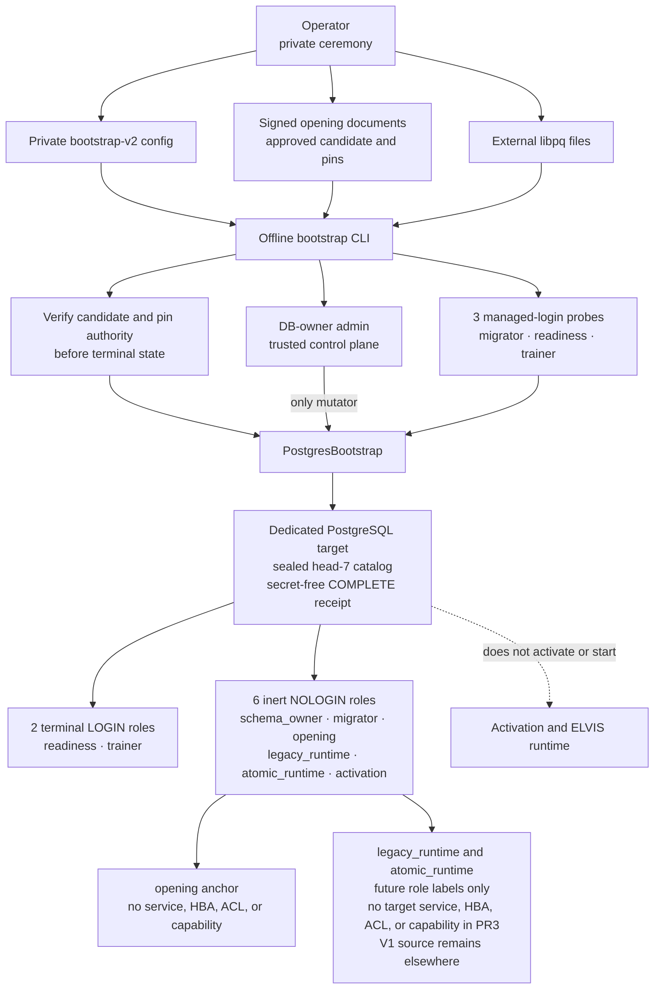
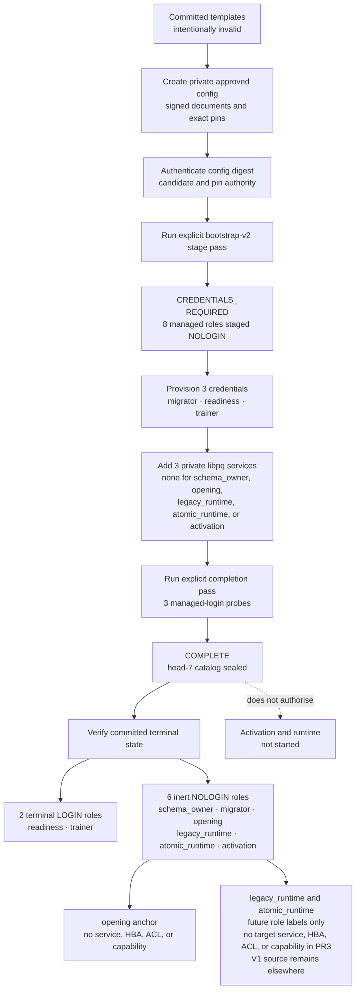

# ELVIS V2 offline PostgreSQL bootstrap

This runbook describes the **dormant, one-shot operator CLI** that exposes the
V2 PostgreSQL bootstrap for a dedicated fresh database. It can reconcile roles,
packaged migrations, ownership, ACLs, credential probes, a candidate-specific
fresh-opening admission, and an explicitly declared old-runtime demotion. It
does **not** deploy credentials, open the paper account, start ELVIS, activate
the V2 paper runtime, terminate sessions, retry itself, or run from a container
startup hook.

> **No deployment or cut-over is authorised.** A successful `COMPLETE` receipt
> proves only the catalog checked by that invocation. V2 remains dormant and
> `ACTIVE` remains a **NO-GO** until all gates in the
> [migration roadmap](architecture_migration/04-migration-roadmap.md) close.

## Trust boundary

The JSON file contains intent and libpq service names only. Connection details
and secrets stay in operator-controlled libpq files outside the repository.



[Mermaid source](../diagrams/v2-bootstrap-trust-boundary.mmd) ·
[SVG](../diagrams/v2-bootstrap-trust-boundary.svg) ·
[PNG](../diagrams/v2-bootstrap-trust-boundary.png) ·
[editable Excalidraw](../diagrams/v2-bootstrap-trust-boundary.excalidraw)

The configuration contains declared database and role intent, but neither it
nor stdout may contain connection endpoints, a DSN, a password, or secret-file
contents. `PGSERVICEFILE` and `PGPASSFILE` are process environment references
to files managed outside Git. On Unix, keep the passfile at mode `0600`; libpq
ignores a passfile with permissive permissions.

## Command contract

Run the command manually from the repository root during an exclusive database
administration window:

```bash
PGSERVICEFILE=/secure/operator/pg_service.conf \
PGPASSFILE=/secure/operator/pgpass \
python3.14 -m scripts.postgres_bootstrap \
  --config /secure/operator/bootstrap-v2.json \
  --pinned-config-sha256 <authenticated-lowercase-sha256> \
  --opening-intent /secure/operator/intent.json \
  --opening-approval /secure/operator/approval.json \
  --opening-trust-policy /secure/operator/trust-policy.json \
  --pinned-trust-policy-sha256 <authenticated-lowercase-sha256> \
  --pinned-signer-public-key-sha256 <authenticated-lowercase-sha256> \
  --apply \
  --confirm-exclusive-ddl-role-window
```

The complete command shape is:

```text
python3.14 -m scripts.postgres_bootstrap \
  --config <bootstrap-v2.json> \
  --pinned-config-sha256 <authenticated-lowercase-sha256> \
  --opening-intent <intent.json> \
  --opening-approval <approval.json> \
  --opening-trust-policy <trust-policy.json> \
  --pinned-trust-policy-sha256 <authenticated-lowercase-sha256> \
  --pinned-signer-public-key-sha256 <authenticated-lowercase-sha256> \
  --apply \
  --confirm-exclusive-ddl-role-window \
  [--confirm-old-runtime-demotion]
```

- `--config` selects the exact version-2 JSON document described below;
  `--pinned-config-sha256` must independently authenticate its canonical bytes.
- The three opening documents and two pins must resolve to the exact signed
  candidate named by `opening_admission`. Current authority is required before
  a missing admission can be installed; an exact durable admission is read
  before that freshness check on a later pass.
- `--apply` is mandatory. There is no plan, check, or implicit apply mode.
- `--confirm-exclusive-ddl-role-window` records the operator's assertion that
  concurrent DDL and role administration have been stopped. The PostgreSQL
  advisory lock serializes cooperating bootstrap calls only; it cannot fence a
  superuser that ignores the workflow.
- `--confirm-old-runtime-demotion` is an additional one-way confirmation. It is
  required when the adoption manifest requests demotion, but does not request
  demotion by itself.

The CLI is one-shot and has no automatic retry. It is never invoked by
`main.py`, retired deployment experiments, a health probe, or an application
startup path. The isolated
fresh-cluster rehearsal may invoke it only through an explicit one-shot
operator `docker compose run`; no Compose startup or service dependency calls
it automatically.

## Exact configuration schema

Unknown or missing keys are rejected. The top-level object has exactly these
keys:

```json
{
  "schema_version": 2,
  "expected_database": "elvis_paper",
  "admin_role": "elvis_bootstrap_admin",
  "roles": {
    "schema_owner": "elvis_schema_owner",
    "migrator": "elvis_migrator",
    "opening": "elvis_opening",
    "legacy_runtime": "elvis_legacy_runtime",
    "atomic_runtime": "elvis_atomic_runtime",
    "activation": "elvis_activation",
    "readiness": "elvis_readiness",
    "trainer": "elvis_trainer"
  },
  "services": {
    "admin": "elvis_bootstrap_admin",
    "schema_owner": null,
    "migrator": null,
    "opening": null,
    "legacy_runtime": null,
    "atomic_runtime": null,
    "activation": null,
    "readiness": null,
    "trainer": null
  },
  "opening_admission": {
    "candidate_sha256": "0000000000000000000000000000000000000000000000000000000000000000",
    "pin_authority_record_sha256": "0000000000000000000000000000000000000000000000000000000000000000",
    "deployment_incarnation_id": "EXAMPLE_INVALID_REPLACE_WITH_APPROVED_VALUE"
  },
  "adoption": null
}
```

Those admission values are deliberate sentinels and are rejected before any
database access. The committed `bootstrap-*-v2.example.json` files are
non-operational templates. Build a private manifest with the exact signed
candidate digest, the independently approved pre-bootstrap pin-authority record
digest and deployment incarnation, then authenticate the canonical manifest
digest supplied to `--pinned-config-sha256`.

The contract is deliberately narrow:

- `schema_version` is the integer `2`. The committed
  `bootstrap-stage-v1.example.json` and `bootstrap-complete-v1.example.json`
  files are immutable historical evidence for migration head 6; the current
  head-7 bootstrap accepts only version 2 and never rewrites or relabels them.
- `expected_database` is the single database to admit and reconcile.
- `admin_role` is the independently authenticated database owner and bootstrap
  administrator. It must differ from every managed and old shared-runtime role.
- `roles` contains exactly eight pairwise-distinct, lowercase PostgreSQL role
  identifiers. At terminal state `schema_owner`, `migrator`, `opening`,
  `legacy_runtime`, `atomic_runtime`, and `activation` are inert `NOLOGIN`
  roles. `opening` is an admission-bound label, not a credential or callable
  capability. Only `readiness` and `trainer` remain managed logins.
- `services.admin` is a required libpq service identifier.
- `services.schema_owner`, `services.opening`, `services.legacy_runtime`,
  `services.atomic_runtime`, and `services.activation` are always `null`. No
  HBA or libpq entry may exist for those roles.
- `services.migrator`, `services.readiness`, and `services.trainer` are either a
  libpq service identifier or `null`. A `null` entry is reported as a pending
  credential; it is not filled, generated, or inferred by the CLI.
  `migrator` is needed only during bootstrap and is retired to `NOLOGIN` before
  the terminal fingerprint is sealed.
- A service identifier is resolved through the operator's `PGSERVICEFILE`.
  Apart from the explicit `expected_database` and role-intent fields above, the
  JSON cannot contain connection parameters such as a DSN, password, host,
  port, or libpq user override.
  Each role service must ultimately authenticate the exact declared role to
  the exact expected database; the bootstrap verifies that identity and its
  catalog attributes before continuing.
- `opening_admission` is mandatory and has exactly the three fields shown. Both
  digests must be nonzero lowercase SHA-256 values, the deployment incarnation
  must be approved bounded ASCII, and the candidate digest must equal the
  candidate derived from the supplied signed documents.
- `adoption` is either `null` for a fresh database or the exact object below.

For an existing-volume adoption, replace `null` with:

```json
{
  "migration_authority_role": "elvis_old_runtime",
  "allowed_historical_owner_roles": ["elvis_old_runtime"],
  "old_shared_runtime_role": "elvis_old_runtime",
  "demote_old_shared_runtime": false
}
```

`allowed_historical_owner_roles` must contain only the declared migration
authority. When present, `old_shared_runtime_role` must be that same role. Set
`demote_old_shared_runtime` to `true` only for the separately approved demotion
pass, and supply `--confirm-old-runtime-demotion` on that pass.

## Preconditions

All modes require:

1. an operator-enforced exclusive DDL and role-administration window;
2. a fresh, idle admin connection authenticated as `admin_role`;
3. an admin-owned target database whose name equals `expected_database`;
4. external, access-controlled `PGSERVICEFILE` and `PGPASSFILE` files;
5. a backup and a rehearsed recovery path appropriate to the target volume;
6. `max_prepared_transactions=0` and zero prepared transactions for the target
   database; and
7. before any managed role becomes `LOGIN`, no `PUBLIC` or managed-role
   `EXECUTE` authority on `lo_create(oid)`, `lo_creat(integer)`,
   `lo_from_bytea(oid,bytea)`, or either `pg_logical_emit_message` overload.

### Fresh database

The target must be closed and empty apart from the exact admitted PostgreSQL
built-ins. In particular, the bootstrap rejects unexpected `public`, `np`, or
`pg_catalog` objects, database-scoped hooks, settings, grants, security labels,
large objects, prepared-transaction authority, persistent-mutation built-in
authority, or managed-role drift. The built-in PL/pgSQL extension, languages,
and their referenced handlers must belong to the independent admin.

The staging transaction revokes the five persistent-mutation built-ins before
credentials can activate any managed login. A rerun refuses to repair this
authority if a managed login is already active. The terminal fingerprint binds
those exact revocations, `max_prepared_transactions=0`, and the zero prepared
transaction count; changing any of them invalidates terminal readiness.

The first pass normally leaves the three bootstrap-login service entries `null`.
It stages the exact eight managed roles as `NOLOGIN` with null passwords,
creates no `np` schema, applies no migration, and returns
`CREDENTIALS_REQUIRED`.

The `opening` anchor stays `NOLOGIN` with a null password, no membership and no
database, schema, relation, sequence or function ACL. Fresh opening is a
short-lived offline operation executed by the independently authenticated
database-owner admin after the Python control plane verifies current signed
authority. PostgreSQL proves candidate admission, target identity, catalog,
nonce, time window and atomicity; it does not verify Ed25519 or an external live
revocation service. Both `legacy_runtime` and `atomic_runtime` are also
`NOLOGIN`, with no service, HBA admission, membership, database connection
privilege, schema usage, or relation/function ACL. `LEGACY/0` is only the
dormant authority value on this `NO_V1_CONTINUITY` target; the V1 source is not
a writer here. A later activation slice must deliberately grant the exact V2
runtime authority and reseal the terminal fingerprint. None of the six inert
roles can be used as a dormant mutation or lock capability in PR3.

This integrity boundary does not make the two read-only logins immune to every
PostgreSQL availability primitive. A compromised `readiness` or `trainer`
credential can still consume connections or contend on public session/advisory
facilities, and PostgreSQL still permits a login to change its own password or
settings, default privileges, and owned grants. Those self-mutations cannot
forge `np` economic or authority state, but they can create detected catalog
drift or deny service; bootstrap/opening use bounded lock acquisition and fail
closed. Connection limits, monitoring, credential rotation and backend
termination are operational availability controls, not claims made by the
terminal receipt.

The terminal schema comment is an exact V2 admission marker of the form
`elvis-postgres-bootstrap-schema:v2:<database>:<terminal-catalog-sha256>`.
Bootstrap obtains the digest from the database's internal live-catalog
fingerprint capability only after migrations, ownership, roles, and ACLs are
exact, then writes the marker in the same catalog transaction. A later opening
operation recomputes that fingerprint under its protective lock and compares
it with the marker; a caller-supplied digest or the marker alone is never
accepted as proof.

### Existing-volume adoption

Adoption is not a generic import, repair, or head-6-to-head-7 upgrade mode. The
existing volume must already have the complete checksummed packaged head-7
migration ledger and one declared historical migration authority owning the
admitted catalog. Partial history, a terminal head-6 catalog, unledgered
objects, mixed ownership, surplus authority, or a different built-in baseline
fails closed. The legacy preflight/import/reconciliation tools use the separate
frozen read-only head-6 inspector; they never call this V2 reconciler.

If the old shared superuser owns the built-in PL/pgSQL baseline, do not run this
workflow against that volume. Rehearse and remediate the ownership transition
offline on a clone, or provision a fresh admin-owned target. The bootstrap does
not silently repair that authority boundary.

### Old shared-runtime demotion

Demotion is a separate barrier, not an adoption side effect. Before requesting
it, remove every membership involving the old role and plan a maintenance
window in which its sessions can drain. The demotion pass removes login,
password, inheritance, and cluster-level privileges, then returns
`DEMOTION_REQUIRED`. A later explicit pass may complete the catalog transition
only after all old backends are gone and the role remains exactly inert.

## Operator state flow



[Mermaid source](../diagrams/v2-bootstrap-operator-flow.mmd) ·
[SVG](../diagrams/v2-bootstrap-operator-flow.svg) ·
[PNG](../diagrams/v2-bootstrap-operator-flow.png) ·
[editable Excalidraw](../diagrams/v2-bootstrap-operator-flow.excalidraw)

Do not loop automatically around any arrow. Every repeated invocation is a new
operator decision after the previous receipt and current database evidence have
been reviewed.

## Receipts and exit codes

When standard output is writable, successful and resumable outcomes write one
compact JSON object to stdout with exactly these keys:

```json
{
  "status": "CREDENTIALS_REQUIRED",
  "migration_versions": [],
  "verified_role_probes": [],
  "pending_role_credentials": ["elvis_migrator"],
  "old_shared_runtime_demoted": false
}
```

The tuple-like values are serialized as JSON arrays. The object contains no
connection data or exception text.

| Exit | `status` / `code` | Meaning and next action |
|---:|---|---|
| `0` | `COMPLETE` | Exact terminal catalog proved. Record the receipt; do not activate V2. |
| `10` | `CREDENTIALS_REQUIRED` | Provision the listed role credentials externally, add their service identifiers, then make a new explicit pass. |
| `11` | `DEMOTION_REQUIRED` | Review the demotion barrier, drain the old role when required, then make a new explicit pass. |
| `2` | `ERROR` / `INPUT` | Invocation or configuration is invalid. Correct the command or non-secret manifest before retrying. |
| `20` | `ERROR` / `STORAGE` | Connectivity or safe catalog inspection failed. Restore observability before deciding whether to rerun. |
| `21` | `ERROR` / `DRIFT` | Catalog, identity, ownership, role, membership, or ACL evidence is not admitted. Stop and investigate; do not auto-repair. |
| `22` | `ERROR` / `MIGRATION` | Packaged history or migration reconciliation failed. Stop and preserve the database for review. |
| `23` | `ERROR` / `COMMIT_UNKNOWN` | A phase commit could not be proven. Preserve the window and follow the recovery procedure below. |
| `70` | `ERROR` / `INTERNAL` | Unexpected CLI failure. Stop; treat the database outcome as unproven. |

Typed errors also write one compact, message-free JSON object to stdout:

```json
{"status":"ERROR","code":"DRIFT"}
```

`COMMIT_UNKNOWN` includes only the affected durable phase in addition to those
fields:

```json
{"status":"ERROR","code":"COMMIT_UNKNOWN","phase":"CATALOG"}
```

The possible phases are `ROLES`, `MIGRATIONS`, `CATALOG`, and `DEMOTION`.
The CLI keeps stderr empty and never echoes configuration or secret values.
If stdout is broken, the CLI returns `70` without attempting a second write.
The database outcome may already be durable; preserve the operator window,
inspect current catalog evidence, and use only the exact same invocation for
reconciliation.

## Commit-unknown recovery

The library already attempts an independent, phase-specific catalog readback
after a failed commit. Exit `23` means that readback could not prove the exact
durable target; it does not mean that PostgreSQL rolled the transaction back.

1. Keep the exclusive DDL and role-administration window closed.
2. Record the secret-free error object and its `phase`.
3. Restore reliable PostgreSQL connectivity and independently inspect the
   named phase. Do not infer success from a disconnected client.
4. Do not edit the ledger, roles, ownership, or ACLs ad hoc to force progress.
5. After the database is readable and the evidence has been reviewed, make a
   new explicit invocation with the same approved intent. The reconciliation is
   resumable and either proves the durable phase or fails closed on drift.
6. Escalate an unexplained or repeated unknown outcome before any further
   mutation.

There is no automatic retry, startup retry, or activation fallback.

## What `COMPLETE` does not mean

`COMPLETE` does not prove that:

- runtime composition, HBA, network policy, or secret rotation is deployed;
- application services use the dedicated runtime identities;
- runtime DDL has been removed;
- startup or health checks fail closed;
- replay, reconciliation, rollback, shadow, or soak gates passed; or
- an operator approved `ACTIVE`.

Those remain separate V2 migration slices. Python 3.14 is the only supported
application and operator interpreter.

The disposable fresh-cluster composition that exercises this CLI without
touching the active runtime is documented in the
[V2 PostgreSQL rehearsal runbook](V2_POSTGRES_REHEARSAL.md).

## Verification requirement

Acceptance requires the focused Python 3.14 contracts, disposable PostgreSQL
15 scenarios, full regression gates, formatting, compilation, link checks, and
cleanup to pass on one frozen commit. The pull request and release record the
immutable evidence. Passing checks are not deployment, secret-rotation, HBA,
runtime-readiness, or cut-over proof.
