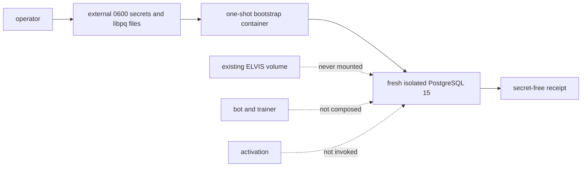
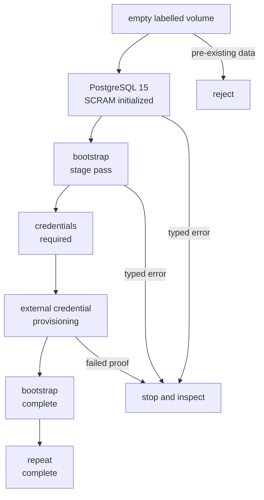
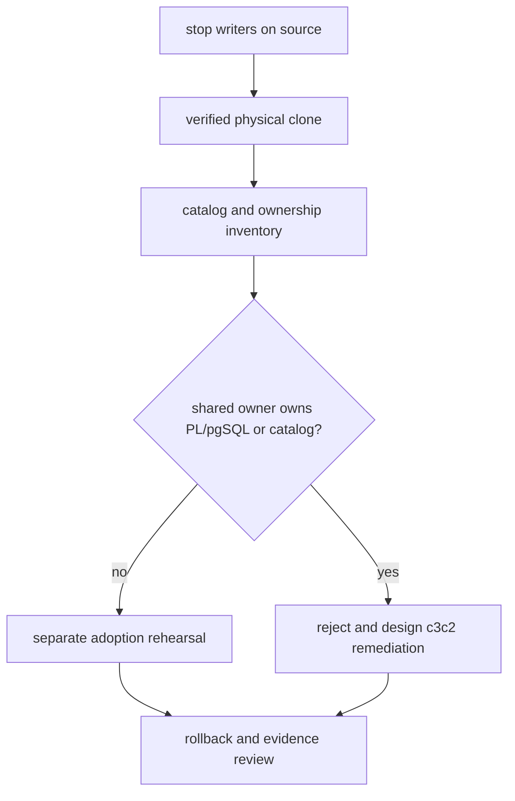

# ELVIS V2 isolated PostgreSQL rehearsal

This runbook defines M9b.14c3c1: a disposable, fresh PostgreSQL 15 rehearsal
for the dormant ELVIS V2 bootstrap. It is deliberately separate from the
current runtime Compose stack and its persistent volume.

> **No deployment or cut-over is authorised.** This composition contains no
> bot, trainer, activation service, runtime startup hook, or application health
> signal. `ACTIVE` remains a **NO-GO**.

## Rehearsal boundary



Graph artefacts: [Mermaid source](../diagrams/v2-c3c1-rehearsal-boundary.mmd),
[SVG](../diagrams/v2-c3c1-rehearsal-boundary.svg),
[PNG](../diagrams/v2-c3c1-rehearsal-boundary.png), and
[editable Excalidraw](../diagrams/v2-c3c1-rehearsal-boundary.excalidraw).

The composition uses only `deploy/v2/compose.bootstrap.yml`. It does not extend
or override the root `docker-compose.yml`. PostgreSQL has no host-published
port, runs on an internal subnet, uses a pinned PostgreSQL 15 image digest, and
loads an explicit SCRAM-only HBA allowlist followed by IPv4 and IPv6 rejects.

## External operator material

Create a directory outside Git with mode `0700`. Every file in it must use mode
`0600`:

- `postgres_admin_password` for first initialization;
- `pg_service.conf`, based on `deploy/v2/pg_service.conf.example`;
- `pgpass`, containing the admin and later three bootstrap-login credentials;
- private, approved copies of the bootstrap manifest and the signed opening
  intent, detached approval and trust policy; and
- the independently authenticated SHA-256 pins for the canonical bootstrap
  manifest, trust policy and signer public key.

Do not place passwords, a populated pgpass, or endpoint overrides in the
repository. The committed JSON and service files are non-secret examples only.

Use one unique, rehearsal-only project name and the external directory on every
command:

```bash
export ELVIS_V2_OPERATOR_DIR=/absolute/path/to/elvis-v2-rehearsal-operator
export ELVIS_V2_REHEARSAL_PROJECT=elvis-v2-rehearsal-review
export ELVIS_V2_OPERATOR_UID="$(id -u)"
export ELVIS_V2_OPERATOR_GID="$(id -g)"

docker compose \
  --project-name "$ELVIS_V2_REHEARSAL_PROJECT" \
  --file deploy/v2/compose.bootstrap.yml \
  --profile v2-rehearsal \
  --profile v2-operator \
  config --quiet
```

The operator directory path must be absolute and must not be a repository
directory. The explicit UID/GID makes the read-only operator container run as
the owner of those mode-0600 files; never replace them with root or relax the
file modes. Replace the example project name with a collision-free name. The
fixed internal subnet deliberately permits only one rehearsal at a time; stop
and clean the first project before starting another.

## Fresh state flow



Graph artefacts: [Mermaid source](../diagrams/v2-c3c1-fresh-state-flow.mmd),
[SVG](../diagrams/v2-c3c1-fresh-state-flow.svg),
[PNG](../diagrams/v2-c3c1-fresh-state-flow.png), and
[editable Excalidraw](../diagrams/v2-c3c1-fresh-state-flow.excalidraw).

### Procedure

1. Confirm that the project name and volume belong only to this rehearsal.
2. Render the isolated file with `docker compose ... config --quiet`.
3. Start only the `postgres` service under the `v2-rehearsal` profile.
4. Verify PostgreSQL 15, `password_encryption=scram-sha-256`,
   `max_prepared_transactions=0`, zero target prepared transactions, and zero
   HBA parser errors.
5. Copy `bootstrap-stage-v2.example.json` outside Git and replace every invalid
   admission sentinel with the exact approved candidate, pin-authority record
   and deployment incarnation. Authenticate the resulting canonical manifest
   digest independently; the committed template is intentionally rejected.
6. Run the one-shot CLI with that private manifest and the exact opening
   documents/pins; require exit `10`, `CREDENTIALS_REQUIRED`, no `np` schema,
   eight staged `NOLOGIN` roles, and the five persistent-mutation built-ins
   already revoked from `PUBLIC` and every managed role.
7. Provision only the three bootstrap credentials (`migrator`, `readiness`,
   `trainer`) externally using
   parameterized SQL over the admin channel. No production credential writer
   is included in this slice.
8. Add those three entries to the external libpq files and use a private,
   identically admitted copy of `bootstrap-complete-v2.example.json`.
9. Run the CLI; require exit `0`, migrations 1 through 7, and `COMPLETE`.
10. Repeat once and require the same terminal result even if the signed
    approval has since expired, because the durable admission is replayed
    before freshness evaluation.
11. Prove the two terminal managed logins with their own credentials and reject
    crossed credentials. Prove that `schema_owner`, `migrator`, `opening`,
    `legacy_runtime`, `atomic_runtime`, and `activation` cannot log in, and that
    `opening`, `legacy_runtime`, and `atomic_runtime` have no ACL. From both the
    `readiness` and `trainer` sessions, require `has_function_privilege(...,
    'EXECUTE') = false` for `lo_create(oid)`, `lo_creat(integer)`,
    `lo_from_bytea(oid,bytea)`, and both `pg_logical_emit_message` overloads.
    Recheck `max_prepared_transactions=0`, zero target rows in
    `pg_prepared_xacts`, and zero rows in `pg_largeobject_metadata`.
12. Preserve only secret-free receipts and test evidence, then stop the
    rehearsal services.

The full command syntax, receipt taxonomy, and commit-unknown recovery remain
in the [bootstrap runbook](V2_POSTGRES_BOOTSTRAP.md).

Using the environment from the command block above, the explicit service
operations are:

```bash
docker compose \
  --project-name "$ELVIS_V2_REHEARSAL_PROJECT" \
  --file deploy/v2/compose.bootstrap.yml \
  --profile v2-rehearsal \
  --profile v2-operator \
  up --detach --wait postgres

docker compose \
  --project-name "$ELVIS_V2_REHEARSAL_PROJECT" \
  --file deploy/v2/compose.bootstrap.yml \
  --profile v2-rehearsal \
  --profile v2-operator \
  run --rm --no-deps bootstrap \
  --config /run/operator/bootstrap.json \
  --pinned-config-sha256 <authenticated-lowercase-sha256> \
  --opening-intent /run/operator/intent.json \
  --opening-approval /run/operator/approval.json \
  --opening-trust-policy /run/operator/trust-policy.json \
  --pinned-trust-policy-sha256 <authenticated-lowercase-sha256> \
  --pinned-signer-public-key-sha256 <authenticated-lowercase-sha256> \
  --apply \
  --confirm-exclusive-ddl-role-window
```

## Existing-volume decision



Graph artefacts:
[Mermaid source](../diagrams/v2-c3c1-existing-volume-decision.mmd),
[SVG](../diagrams/v2-c3c1-existing-volume-decision.svg),
[PNG](../diagrams/v2-c3c1-existing-volume-decision.png), and
[editable Excalidraw](../diagrams/v2-c3c1-existing-volume-decision.excalidraw).

The current ELVIS volume was initialized by the shared runtime superuser. The
official image's initialization variables and HBA defaults apply only to an
empty data directory, so c3c1 must never mount, rename, delete, or demote that
volume. The next slice must use a stopped, verified clone and make an
explicitly reviewed ownership-remediation or fresh-target decision.

M9b.14c3c2 now chooses the fresh-target branch without copying data. Its
[read-only cut-over preflight](V2_FRESH_TARGET_CUTOVER.md) inspects a stopped
source clone and a separately bootstrapped target, requires distinct cluster
system identifiers, and emits only stale-on-return evidence for the next
bounded importer. M9b.14c3c3a now supplies that dormant, independently
revalidated [raw snapshot import](V2_LEGACY_SNAPSHOT_IMPORT.md) without mounting
the active source volume, synthesizing V2 ledger history, or changing runtime
authority. The active source volume remains outside c3c1, c3c2, and c3c3a.

## Rollback and cleanup

Rollback for this slice means removing only the fresh rehearsal project after
capturing secret-free evidence. Verify the exact Compose project and volume
label before any volume deletion. Never use the root project name or its
volume. Credential rotation is not rollback; if a credential result is
uncertain, rotate to a new set in a separately approved operation.

After verifying the project name literally, cleanup is:

```bash
docker compose \
  --project-name "$ELVIS_V2_REHEARSAL_PROJECT" \
  --file deploy/v2/compose.bootstrap.yml \
  --profile v2-rehearsal \
  --profile v2-operator \
  down --volumes --remove-orphans --rmi local
```

## Remaining blockers

- the current bot still performs runtime DDL;
- bot and trainer still share a privileged credential in legacy manifests;
- the root compatibility composition is not a V2 deployment path;
- runtime startup and health are not fail-closed on the V2 catalog;
- replay, reconciliation, rollback rehearsal, soak, and operator activation
  approval remain pending.
- the raw fresh-target import is dormant and non-authoritative; V2 replay and
  semantic reconciliation of that history remain later slices.

## Verification requirement

Acceptance requires the Python 3.14 contract, opt-in PostgreSQL 15 scenarios,
the `10 -> 0 -> 0` flow, three bootstrap SCRAM identities, two terminal managed
logins, six inert `NOLOGIN` roles, exact HBA/catalog evidence,
marker-preserving restart, non-mutating rejection, redaction, cleanup, static
checks, Compose rendering, links, and diagrams to pass on one frozen commit.
The pull request and release are the immutable acceptance record; none of this
authorises deployment or `ACTIVE`.
