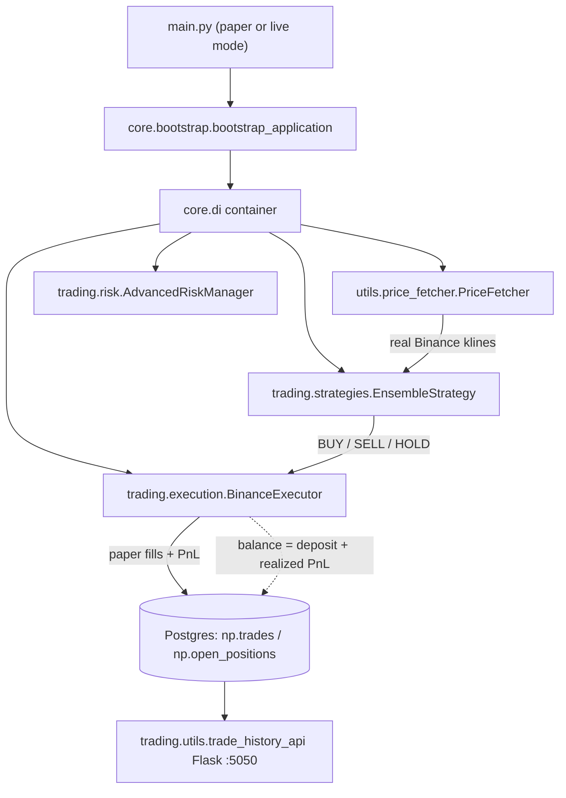
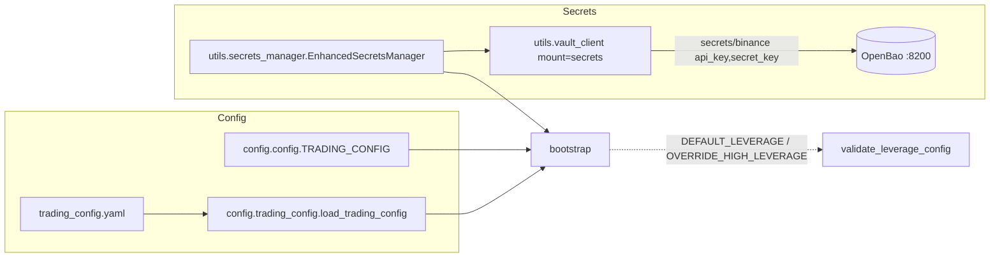
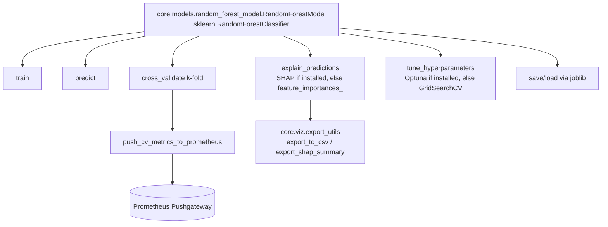

# ELVIS Architecture (verified 2026-07-02)

Diagrams below reflect the **actual** code after the doc-audit fixes — every
module, class, and path shown exists and is import-verified.

## System / runtime flow

## Configuration & secrets

## RandomForest model capabilities

## Notes on optional dependencies

- `shap` and `optuna` have no Python 3.14 wheels yet; `explain_predictions` and
  `tune_hyperparameters` **degrade gracefully** (feature-importance export and
  `GridSearchCV` respectively) so the documented interface works everywhere.
- `ydf` / `tensorflow` are likewise absent on 3.14; the ensemble skips those
  members via import guards. Install the `[ml]` extra on Python 3.13 for the
  full stack.
