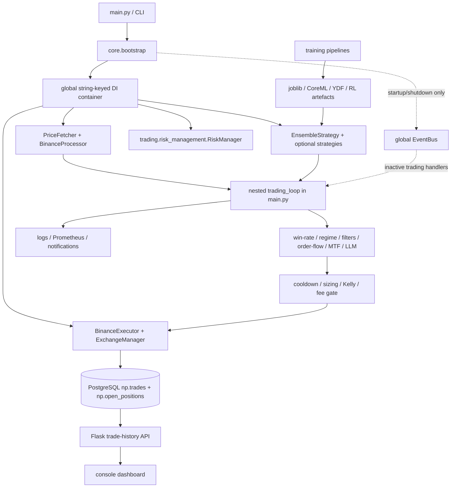

# ELVIS repository analysis

## Scope and method

This audit covers every first-party Python package, the entry point, tests,
container configuration, CI, model artefacts, and existing architecture
documentation at ELVIS revision
`1ffd723a05907ea9e5c2512092f5cf8505cc2725`.

The review combined:

- a complete file and line inventory;
- Python AST import, cycle, size, and control-flow analysis;
- targeted source review of every runtime boundary;
- model artefact inspection with `joblib`;
- a local Python 3.14 test run matching CI's supported runtime;
- the latest GitHub Actions result for the audited revision; and
- Docker Compose configuration validation.

Generated files, model binaries, caches, logs, vendored artefacts, and UI assets
were inventoried but were not treated as executable architecture.

## Quantitative baseline

| Measure | Result |
|---|---:|
| Repository files, excluding generated/runtime output | 592 |
| Python files | 315 |
| Python lines | 82,605 |
| First-party runtime modules parsed by AST | 283 |
| First-party import edges | 438 |
| Static import cycles | 0 |
| Test files | 107 |
| `main.py` lines | 2,861 |
| Nested `trading_loop` span | 2,351 lines |
| Estimated `trading_loop` cyclomatic complexity | 240 |
| Broad `except Exception` blocks in `trading_loop` | 39 |

Lines by major area:

| Area | Python files | Lines |
|---|---:|---:|
| `core/` | 36 | 11,111 |
| `trading/` | 85 | 27,001 |
| `training/` | 26 | 6,970 |
| `utils/` | 21 | 7,888 |
| `config/` | 3 | 313 |
| `drl_agents/` | 10 | 2,587 |
| `tests/` | 107 | 15,896 |

The absence of static import cycles is positive, but package-level direction is
not clean. `core` imports `trading`, `trading` imports `core`, and both runtime
packages depend on `utils`; `utils` in turn imports both `core` and `config`.
The dependency graph therefore has architectural cycles even though individual
module imports happen not to form an AST cycle.

## Current runtime map



### Actual control flow

The production path is a polling loop, not an event-driven engine:

1. bootstrap registers services in a global container by string name;
2. `main()` resolves services and starts a background risk thread;
3. the nested `trading_loop()` fetches frames for each symbol;
4. strategy output is normalised ad hoc into `BUY`, `SELL`, or `HOLD`;
5. several optional filters mutate the signal and confidence in sequence;
6. sizing, fee checks, and exchange calls happen inline;
7. the same loop queries open positions and performs exit checks; and
8. database, API, dashboard, logging, notification, and model-feedback work is
   interleaved with the trading path.

The global `EventBus` publishes system startup and shutdown events. The trading
path does not publish `MarketDataEvent` or `TradingSignalEvent`, and the provided
trading handlers call methods that are absent from the current risk manager.
`OrderEvent` has no active execution consumer. This subsystem is therefore not
a safe foundation for the migration.

## Component findings

### Bootstrap and dependency injection

`core/bootstrap.py` is an 800-line composition root which imports concrete
adapters, registers them in a mutable global container, contains fallback mock
classes, creates demonstration portfolio data, and performs external work while
constructing services. Consumers resolve dependencies by untyped strings.

Useful behaviour to preserve:

- one visible application composition point;
- optional dependency degradation for unsupported ML packages; and
- paper/live mode selection at startup.

Changes required:

- constructor injection at application boundaries;
- immutable, validated runtime configuration;
- no fabricated trading state or mock service in a production bootstrap; and
- explicit startup failure for mandatory dependencies.

### Market data

Market-data responsibilities are split across `utils.price_fetcher`,
`trading.data.price_fetcher`, processors, direct HTTP calls in `main.py`, and
exchange methods. On fetch failures, the current loop can fabricate flat or
random BTC data and continue through the trading path. This is fail-open and
can convert an infrastructure fault into an order.

The target must make data provenance and freshness explicit. Synthetic data is
valid only in a named simulator or test adapter and must never enter paper/live
execution implicitly.

### Strategies and feature contracts

`BaseStrategy.generate_signals(DataFrame)` documents a tuple return, while
concrete strategies also expose dictionary-based multi-symbol results and a
`generate_signal(symbol, mapping)` tuple. `main.py` contains compatibility
branches for all of these shapes.

Feature ownership is similarly scattered:

- `EnsembleStrategy.REQUIRED_FEATURES` contains 20 CoreML inputs;
- research and Bonenkamp strategies construct either 9 or 11 inputs;
- the locally present research model and scaler report 11 inputs, but both are
  ignored by Git (`*.pkl`), can be rewritten by procedural tests, and are not
  versioned deployable artefacts;
- `tests/test_feature_fix.py` still claims that 9 is the only correct shape and
  returns booleans instead of asserting, so pytest does not enforce the claim;
- the trade-learned model stores `feature_names` when produced by its current
  trainer, but old direct-model artefacts are accepted without a schema; and
- multiple feature pipelines and configuration files declare other dimensions
  such as 50 and 64.

This is model/feature contract drift, not merely a shape bug. Artefacts need a
versioned schema identifier, ordered feature names, preprocessing version,
training-data identifier, and compatibility validation before activation.

### Signal qualification and risk

Signal qualification is a long sequence of mutable local variables. Several
gate exceptions log an error and retain the original actionable signal. The fee
gate behaves the same way. A failed control therefore permits rather than
rejects a trade.

There are several incompatible risk implementations. The runtime uses
`trading/risk_management.py::RiskManager`, which owns executor and persistence
concerns as well as risk state, while other `RiskManager` and
`AdvancedRiskManager` classes exist under `trading/risk/`. Position management
also runs in both a background thread and the main loop. This makes order/exit
ownership and race behaviour unclear.

The target must have one pre-trade risk port and one position-lifecycle owner.
All invalid, stale, unavailable, or exceptional risk inputs reject the order.

### Execution and persistence

`BinanceExecutor` combines venue access, paper simulation, balances, position
management, and PostgreSQL persistence. Executor results are untyped mappings
or truthy/falsy values. `BaseExecutor` cannot express accepted, rejected,
partially filled, filled, cancelled, or indeterminate outcomes.

More importantly, the active `BinanceExecutor.execute_buy()` and
`execute_sell()` methods always call `_execute_paper_trade()`. In `live` mode,
bootstrap can initialise an authenticated spot client, but that client is not
used for order submission. The CLI mode therefore does not currently represent
a working live-execution capability. The migration must preserve this safe
non-submission behaviour and make unsupported live startup fail explicitly; it
must not accidentally turn the architectural refactor into a live-trading
activation.

Database consumers depend on positional tuples. For example, Kelly sizing pins
PnL to tuple index 6. The initial schema is not guaranteed to create the `np`
schema before tables are queried. Repositories should return named records and
own schema migrations.

### Operations and observability

The API, dashboard, Prometheus/Grafana/Loki assets, logging setup, and health
checks provide useful operational visibility. They should remain outside the
decision path and consume snapshots or post-commit domain notifications.

`ExchangeManager` exposes `exchanges`, while shutdown code checks for
`executors`; this can skip intended close logic. Shutdown and state transitions
need a small explicit lifecycle state machine.

## Largest maintenance hotspots

| Hotspot | Approximate size | Main concern |
|---|---:|---|
| `main.py::trading_loop` | 2,351 lines | all runtime concerns and mutable state |
| `utils.console_dashboard.ConsoleDashboard` | 2,338 lines | UI, I/O, formatting, polling mixed |
| `EnsembleStrategy` | 1,976 lines | model loading, features, voting, networking, sizing |
| `BinanceExecutor` | 1,003 lines | exchange, paper broker, DB, position lifecycle |
| `ApplicationBootstrapper` | 772 lines | global service locator and runtime fallbacks |
| `trading.risk_management.RiskManager` | 678 lines | risk, execution access, state, background lifecycle |

Large files are not automatically defects. Here they coincide with multiple
reasons to change, hidden dependencies, and tests that often reconstruct source
fragments rather than exercise a stable application API.

## Duplicate or competing concepts

- three market-regime detector modules;
- multiple risk-manager implementations;
- two price-fetcher locations;
- two monitoring modules;
- two trade-history API modules;
- two primary configuration mechanisms plus direct environment reads; and
- several feature-pipeline implementations with different contracts.

These should be retired only after call sites move to the selected owner. A
bulk deletion would make the migration harder to verify.

## Baseline verification

### Local Python 3.14 run

Command:

```bash
.venv/bin/python -m pytest tests/ -q -m 'not perf'
```

Result at the audited revision:

```text
663 passed, 9 skipped, 2 deselected, 1 failed, 2623 warnings in 53.39s
```

The one failure is
`tests/test_model_feedback.py::test_sql_zero_pnl_close_is_returned_not_skipped`:
the local PostgreSQL server is reachable but the `np.trades` relation is absent.
The test skips when PostgreSQL is unavailable, which is why this defect can be
hidden in CI. Several tests also start real Binance WebSocket threads and emit
logs after pytest has closed its capture stream. Unit tests therefore have
uncontrolled external side effects.

### Continuous integration

At the audited revision, the Python 3.14 test and security jobs passed. The
workflow failed because Black would reformat `main.py`; the dependent Docker job
was skipped. CI success of the test job does not establish Docker-runtime or
database-schema health.

### Docker Compose

`docker compose config` cannot render a fresh checkout without the ignored
`.env.container`. Secrets should not be copied into an analysis worktree.
Migration verification must use an explicit non-secret test environment and an
ephemeral PostgreSQL instance.

## Root causes, ordered by architectural impact

1. **No stable application boundary.** Runtime orchestration lives inside one
   nested function and is not directly testable.
2. **No canonical domain contracts.** Signals, orders, positions, executions,
   and feature vectors are dictionaries, tuples, or incompatible conventions.
3. **Controls fail open.** Exceptions in data, signal, fee, and sizing paths can
   preserve or manufacture an actionable order.
4. **Runtime mode is not a capability contract.** `live` can initialise an
   exchange client while buy/sell still execute the paper implementation.
5. **Ownership is duplicated.** Main loop, risk thread, executor, and database
   code can all manage positions.
6. **Dependency direction is implicit.** Global service lookup and cross-package
   imports hide required collaborators.
7. **Research/live drift is ungoverned.** Model metadata and feature ordering
   are not a mandatory deployment contract.
8. **Tests do not isolate the network and database by default.** Green unit
   tests are not consistently deterministic.

## Assets worth keeping

- a strong and growing pytest suite around individual filters, sizing, exits,
  exchange behaviour, and model feedback;
- explicit paper mode and a visible warning that live mode is not unattended;
- model fallback support across Python 3.14 and a separate Python 3.10 ML image;
- existing fee, cooldown, order-flow, multi-timeframe, and exit modules;
- central logging, metrics, dashboard, and OpenBao/Vault integration; and
- recent discipline around targeted fixes and source-backed documentation.

The migration should wrap these assets behind contracts, not replace working
algorithms merely to produce a cleaner directory tree.
