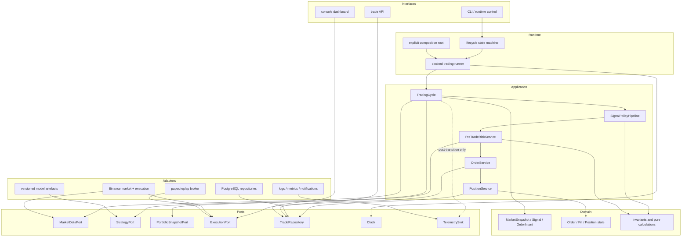
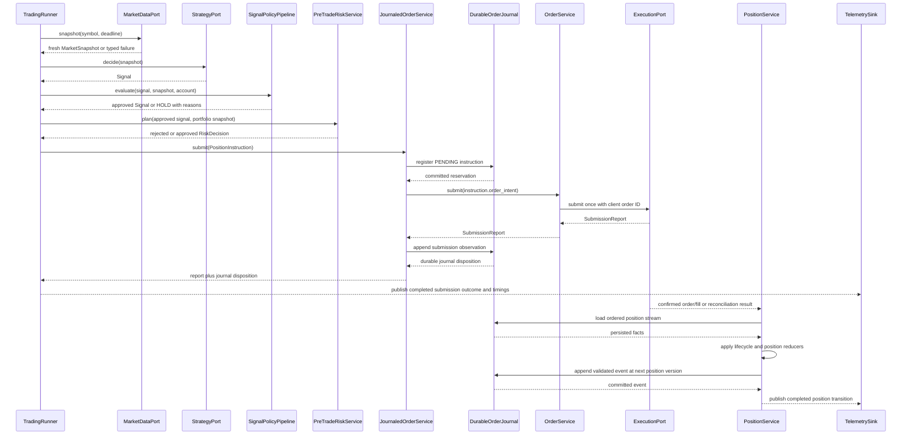

# ELVIS target architecture

## Decision

ELVIS will evolve into a **modular monolith with a synchronous, deterministic
trading path**. Domain and application code will depend on small ports;
Binance, PostgreSQL, model files, clocks, notifications, and dashboards will be
adapters. Events will describe completed state transitions for observability,
not control whether an order is safe to submit.

This is intentionally smaller than NautilusTrader's actor system, Hummingbot's
connector estate, or OpenMarket's service topology. ELVIS currently trades a
small symbol set through one process. Network service boundaries would add
serialization, deployment, and failure modes without removing the immediate
coupling inside the process.

## Design principles

1. **Fail closed.** Missing, stale, non-finite, invalid, or exceptional inputs
   produce `HOLD` or a rejected order, never synthetic live data or fallback
   leverage.
2. **One owner per state transition.** A single application service owns each
   decision, order submission, fill reconciliation, and position exit.
3. **Typed boundaries.** Domain objects replace ad hoc dictionaries and
   positional tuples at module boundaries.
4. **Direct hot path.** The decision and risk path uses ordinary synchronous
   calls with no global bus, reflection, or unnecessary queues.
5. **Ports at I/O boundaries.** Protocols exist for behaviour with multiple
   implementations or external effects, not for every function.
6. **Research/live parity.** Paper, replay, and live modes invoke the same
   application services; only adapters and clocks change.
7. **Progressive replacement.** Legacy adapters keep current functionality
   running while one vertical slice moves at a time.
8. **Measured performance.** Optimise only a measured hot path. Prefer fewer
   network calls, cached immutable snapshots, and bounded allocations before a
   language rewrite.

## Logical component map

Dependency direction is inward: domain imports no ELVIS infrastructure;
application imports domain and port definitions; adapters implement ports;
runtime composes them. UI and observability never call the exchange executor.

## Canonical trading cycle

No exception crosses the cycle boundary without becoming a typed failure and a
non-actionable outcome. If execution times out after a possible submission, the
`SubmissionReport` is `AMBIGUOUS`, not a definite rejection; reconciliation
must resolve it before any retry. A `SUBMITTED` report records an acknowledgment,
not a fill. Only `PositionService` applies confirmed fill and position
transitions.

## Domain contracts

Successive migration slices introduce small immutable values:

- `SignalAction`: `BUY`, `SELL`, or `HOLD`;
- `OrderSide`: `BUY` or `SELL`, so `HOLD` is unrepresentable in an order;
- `Signal`: symbol, action, confidence, reference price, timestamp, strategy ID,
  and reasons;
- `OrderIntent`: client order ID, decision ID, symbol, order side, quantity,
  order type, reference
  price, leverage, and decision timestamp;
- `RiskDecision`: approved/rejected plus reasons and optional order intent;
- `SubmissionReport`: `NOT_SENT`, `VENUE_REJECTED`, `SUBMITTED`, or `AMBIGUOUS`,
  with client/venue IDs and a retry-safety decision kept separate from outcome;
- `OrderLifecycleState`: pending/reconciling/open/partial/filled,
  cancel-pending/cancelled/failed, projected only through validated immutable
  events;
- `PositionEffect`: explicit `OPEN` or `REDUCE_ONLY`, coupled to one approved
  order intent before submission;
- `PositionSide`: `LONG` or `SHORT`, deliberately distinct from order direction;
- `TakeProfitProfile` and `PositionExitContext`: the resolved entry-time exit
  policy retained for the lifetime of a position key;
- `Position`: an immutable projection of confirmed fills with exact opened,
  reduced, and remaining quantities;
- `PaperAccount`: an immutable, account-global projection of exact balances,
  per-position margin reservations, applied settlements, and solvency state; and
- `CycleOutcome`: terminal result and per-stage timings.

M2 implements `SignalAction`, `OrderSide`, `Signal`, the market-only
`OrderIntent`, and `SubmissionReport`. M7a adds the correlated `RiskDecision`
contract. M8a adds the pure `OrderLifecycle` reducer without wiring it into the
runtime. M8b adds pure `PositionInstruction`, `PositionFill`, and `Position`
transitions without a runtime consumer. M9b.1 prepares the durable journal
schema, M9b.2 adds its pure, lossless persistence codec, and M9b.3 adds the
unwired transactional repository and reducer-based replay boundary. M9b.4 adds
the application-level `JournaledOrderService`, still with no runtime consumer.
M9b.7 adds a pure durable-submission owner contract for the next transaction
boundary, without implementing SQL, a repository, or runtime composition.
M9b.8 adds the pure FIFO paper-economics slice: exact lot, open-cost,
gross-realised-PnL, and per-fee-asset projections from causally versioned
confirmed fills, still without SQL or runtime composition.
M9b.9 adds the pure, linear quote-settled transition from one such confirmed
fill to explicitly denominated realised-PnL, fee-debit, and cash deltas. It
still adds no account state, SQL, or runtime composition.
M9b.10a adds the pure terminal paper-submission plan consumed by the future
transaction owner: one acknowledgement followed by one or more correlated
fills whose exact quantities sum to the complete order quantity. Candidate
facts remain non-durable, precomputed inputs; this slice still adds no SQL,
repository, clock, price source, or runtime composition.
M9b.10b adds the unwired concrete
`trading.persistence.atomic_paper_submission_owner.PostgresAtomicPaperSubmissionOwner`.
For a genuinely new immediate terminal paper order, it commits the instruction,
acknowledgement, and exact full-fill suffix in one PostgreSQL transaction; an
exact prior terminal batch is replayed without planning. It uses migration
`0002_order_position_journal.sql` unchanged and adds no account/economic
projection or runtime composition.
M9b.11 adds the pure `trading.domain.paper_accounting` account fold: global
settlement ordering, exact available/reserved balances, quantum-ceiling margin,
derived postings, admission, replay, and insolvency semantics. It adds no SQL,
durable account owner, or runtime composition.
`PositionService`, the pre-trade service, and `CycleOutcome` remain later
slices; they are not placeholder classes in the current package.

Constructors validate symbol presence, finite positive prices and quantities,
confidence bounds, non-negative fees, legal state transitions, and timezone-
aware timestamps. Invalid values raise before reaching an adapter.

Model features and confidence may remain ordinary `float`. At the order,
balance, fee, and realised-PnL boundaries, values use `Decimal` constructed from
strings and quantised against venue tick/lot rules. This is a narrow conversion
at the safety boundary, not a broad rewrite of pandas and model calculations.

## Application services

### `TradingCycle`

Owns one symbol decision from a market snapshot to a terminal outcome. It has no
loop, sleeps, environment reads, database globals, or UI calls. It is cheap to
construct and deterministic under injected ports and clock.

### `SignalPolicyPipeline`

Applies named policies in a fixed order and records every reason. A policy may
approve, adjust confidence, or veto to `HOLD`. An unexpected exception vetoes
the trade. Expensive optional policies have explicit deadlines and cannot block
the core loop indefinitely.

### `PreTradeRiskService`

Reads one coherent portfolio snapshot and produces either a rejection or one
fully specified `OrderIntent`. It owns leverage limits, exposure, cooldown,
stake sizing, fee viability, stale-account checks, and portfolio kill switches.
It never submits an order. `PortfolioSnapshotPort` is only its read boundary to
account and position state; risk policy remains inside this application service,
not in a second interchangeable `RiskPort`.

### `OrderService`

Makes one execution-adapter call per invocation for an already-approved intent,
using a stable client order ID, and never retries internally. It distinguishes
proof that nothing was sent, a definite venue rejection, a submission
acknowledgment, and an ambiguous outcome. Ambiguous submissions are reconciled
and never blindly retried. Durable idempotency and restart reconciliation are
added with the order repository; an in-memory deduplication cache would provide
false safety. The service does not invent quantity, leverage, price, or balance
fallbacks.

M9b.5 closes only the transport-correlation gap in the still-authoritative
paper path. `LegacyPaperExecutionAdapter` passes the stable client order ID as
a keyword-only argument to `BinanceExecutor`, and accepts a nominal paper
`FILLED` response as a submission acknowledgement only when the response echoes
that exact ID. The mock venue order ID is opaque and collision-resistant rather
than derived from wall-clock seconds. This echo proves which invocation
produced one response; it is not a durable receipt, a fill fact, deduplication,
or a query-by-client-ID implementation. Legacy executor callers that do not
provide a client ID remain supported but cannot satisfy the typed adapter's
correlation check.

M9b.6 adds the first restart-facing read boundary without changing schema or
runtime composition. The repository can replay one exact order by
`(execution_scope, client_order_id)` and can enumerate submission work whose
lifecycle is exactly `PENDING` or `RECONCILING`. Both operations rebuild whole
position streams from one repeatable-read, read-only snapshot; corrupt history
fails the whole request rather than producing a partial recovery list. This is
an inventory, not permission to retry: a legacy `PENDING` reservation still
cannot distinguish a crash before transport from a crash after an external
effect but before its observation was journaled.

### Durable submission ownership contract

M9b.7 defines the pure application contract that a future durable paper
submission owner must implement. One attempt context fixes the complete
instruction, execution scope, timezone-aware observation time, and durable
submission event identity before any side effect. Those values are stable
inputs, not regenerated during retry, commit-unknown recovery, or replay.

The result distinguishes facts committed by the current call from exact facts
replayed from durable history. Both outcomes expose the same canonical
submission event and report semantics, so a caller cannot mistake a replay for
permission to execute again. Canonical reconstruction deliberately cannot
retain the transport-only raw `venue_status`: the durable lifecycle event does
not store that field, and the contract does not pretend that it does. A durable
`SubmissionAcknowledged` remains proof of acceptance only; it is never a fill.
Only a separate `ConfirmedFill` can change order quantity or position state.

M9b.10b now implements that transaction boundary for one deliberately narrow
paper case. It validates the stable attempt context, acquires the relevant
stream lock, validates the immediate terminal paper effect, and persists the
canonical submission facts in one transaction before returning `COMMITTED`.
An exact previously committed attempt returns `REPLAYED`; any unsupported,
mismatched, or unresolved history fails closed for reconciliation. M9b.7 itself
remains a pure contract, while the concrete M9b.10b owner is intentionally
unwired. Neither slice performs a venue call, projects balances, fees, realised
PnL, trades, or account/open-position compatibility rows, establishes a
sole-writer mechanism, or fences the legacy writers. Those economic projections
and ownership gates remain mandatory before cut-over.

M9b.10a narrows the candidate-fact boundary consumed by the first atomic paper
owner in M9b.10b. `PaperPlannedFill(event_id, fill)` binds each non-durable
`ConfirmedFill` candidate to its future durable event identity.
`PaperSubmissionPlan(attempt, submission, fills)` accepts the exact
`SubmissionAttemptContext`, exactly one `SubmissionAcknowledged`, and a
non-empty tuple of exact `PaperPlannedFill` values. It requires the
acknowledgement to preserve the attempt's client order ID and observation time;
all event IDs, including the attempt ID, must be distinct. Every fill must
preserve the intent's client order ID, symbol, and side, must not predate the
acknowledgement, and must share the acknowledgement's venue order ID. Trade IDs
are unique and the exact-`Decimal` fill quantities must sum to exactly the
intent quantity. Empty, partial, and over-filled plans fail before persistence.

`PaperSubmissionPlanner.plan(attempt, /) -> PaperSubmissionPlan` is a narrow
source for those candidate facts. The future composition root must bind it to
stable, precomputed data for the attempt; planning must not sample a clock,
randomness, network or database state, manufacture a fill price from
`OrderIntent.reference_price`, or make any fact durable. The protocol alone
does not prove those operational properties, so the concrete owner and its
composition tests remain responsible for them. Candidate facts become durable
only if the M9b.10b owner commits the reservation, acknowledgement, and all
fills in one PostgreSQL transaction.

M9b.10a itself remains a pure, unwired contract. It adds no SQL, repository,
schema migration, transaction owner, paper simulator, venue or price I/O,
account state, or runtime consumer. Migration
`0002_order_position_journal.sql` supports only the narrow journal batch now
implemented by M9b.10b: one new order reservation followed by an ACK and its
terminal exact full fills at consecutive stream versions. It does not encode a
batch manifest or any balance, posting, margin, instrument-snapshot, or
compatibility-projection invariant. Therefore, an existing `PENDING`, ACK-only,
partial-fill, mismatched, interleaved, or corrupt history is reconciliation
work; it is never permission to invoke the planner, append a guessed suffix, or
resubmit.

### Atomic terminal paper-submission owner

M9b.10b adds
`trading.persistence.atomic_paper_submission_owner.PostgresAtomicPaperSubmissionOwner`.
Its exact entry point is
`execute(attempt: SubmissionAttemptContext, /) -> DurableSubmissionReceipt`.
The constructor receives an injected connection factory and the M9b.10a
`PaperSubmissionPlanner`; no application or runtime module constructs this
owner.

Each call obtains one fresh connection, starts one write transaction, inserts
or locks the position stream, and replays the complete locked stream before it
can plan or append. For a genuinely new order, every existing sibling must
already be an exact supported terminal ACK/full-fill batch. Only then does the
owner reserve the instruction, call the planner once under the same stream
lock, require the plan to retain the exact attempt object, validate the order
lifecycle and resulting position transition, assign consecutive stream
versions to the ACK and every fill, and commit once. It does not compose
`PostgresOrderPositionJournal.reserve_instruction()` and `append_event()`:
those public methods each own a separate transaction and cannot provide this
atomicity.

If the exact instruction and exact attempt already identify a supported
terminal batch, `execute()` reconstructs a canonical `REPLAYED` receipt from
the durable rows without calling the planner or changing any row. Existing
`PENDING`, ACK-only, partial, interleaved, contradictory, gapped, or corrupt
histories raise a reconciliation or journal error before planning. A commit
whose acknowledgement is lost raises `SubmissionCommitUnknown(attempt)`; a
fresh call locks and replays first, so a transaction that actually committed is
returned as `REPLAYED` without another plan.

Migration `0002` stores no owner generation or batch-provenance marker. The
owner therefore recognizes replay by exact terminal shape, not by proving that
the historical rows originated in one earlier atomic-owner transaction. An
ACK and exact full-fill suffix written by separate legacy journal commits is
adopted as `REPLAYED` once the complete shape is durable; incomplete or
contradictory shapes still reconcile. This is safe for the journal-only no-op
path, but it is not activation provenance. Runtime cut-over still requires a
durable generation/scope fence that separates eligible atomic-owner history
from legacy effects and compatibility projections.

This is a journal-only owner for immediate terminal full fills. It writes only
the unchanged M9b.1 `np.position_streams`, `np.orders`, and `np.order_events`
contract and required transaction state. It performs no venue execution,
market or price discovery, clock sampling, FIFO economics, settlement, balance,
posting, margin, legacy trade/open-position write, telemetry, startup, or
runtime composition. Migration `0002_order_position_journal.sql` is unchanged;
the PostgreSQL tests prove the narrow transaction against that existing schema,
not a new migration or an activation claim.

### `JournaledOrderService`

M9b.4 supplies the unwired durable wrapper. It accepts one
`PositionInstruction`, asks a storage-neutral `OrderJournalPort` to commit its
reservation, and treats an exact boolean `is_created=True` receipt as the only
permission to call `OrderService`. Any existing reservation returns a
conservative reconciliation-required result without reading the clock,
submitting, or appending. A registration failure also makes no adapter call.

After a new reservation is committed, the service reads and validates one
injected aware timestamp before the external effect, delegates the embedded
`OrderIntent` exactly once, translates the `SubmissionReport` into the matching
M8a submission event, and appends it under the stable per-client identity
`submission-attempt-1`. `SUBMITTED` remains an acknowledgement even if a legacy
`venue_status` string says `FILLED`; only an independent `ConfirmedFill` may
advance position quantity. The service returns `RECORDED` only after the event
receipt confirms the expected identity and a positive position-stream version.
If append fails or its commit acknowledgement is unknown, the typed
`SubmissionObservationNotRecorded` preserves the exact report, event, event ID,
and original cause for reconciliation. It never retries the venue call.

The application module depends only on domain values and structural ports; it
does not import the PostgreSQL repository. Its package facade re-exports the
contract, so another `trading.application` import may load the pure module, but
no runtime, adapter, startup, or composition-root module references or invokes
it. M9b.1 supplies the tables, M9b.2 the typed codec, and M9b.3 the committed
reservation and append implementation. Activation still requires a truthful
pre-submit `PositionInstruction`, stable client-order propagation through the
side-effect owner, fill observation, unresolved-order inventory,
reconciliation, durable quarantine, and startup readiness.

### `PositionService`

Is the sole owner of open-position transitions, stop loss, take profit,
trailing stop, partial fill, and close reconciliation. The background risk
thread and inline exit loop are retired only after this service covers their
behaviour. M8b supplies its pure confirmed-fill transition contract: an `OPEN`
fill can create or scale a stable position key, while `REDUCE_ONLY` can only
reduce the opposite side and can never create or flip a position. That reducer
does not yet constitute this service, select an exit, calculate cost basis or
PnL, or perform runtime I/O. The persistence codec and repository replay these
instruction and event values, but no runtime module applies the reducer yet.

M9b.8 adds the smallest missing economic reducer under
`trading.domain.paper_economics`. `PaperFillRecord` couples one already
validated `PositionFill` to its positive durable `position_version` and exact
per-order `(client_order_id, event_id)` identity; `PaperEconomics` retains those
records and the corresponding
`Position`, `PaperCostLot`, exact open quantity and cost, gross-PnL, and
`PaperFeeTotal` projections. The reducer must not use the identity-sorted
`Position.fills` tuple, fill timestamp, database row ID, or query return order
as a substitute for causality. Economic fill versions increase strictly. Gaps
between economic fills are valid because submission and other non-fill
lifecycle events occupy versions in the complete position stream; the
repository remains responsible for proving that complete stream is the exact
contiguous prefix `1..stream_version`. Reapplying the exact same
`PaperFillRecord` is an idempotent no-op. A changed payload at an existing
version or composite event identity, a fill identity at another version, or a
regressed new version fails closed. The same bare `event_id` may validly recur
under another client order.

`PaperLotMethod` admits only `FIFO`. Each `OPEN` fill creates one immutable lot
at the exact confirmed fill price and quantity. A scale-in appends another lot
instead of manufacturing an average entry. `REDUCE_ONLY` consumes lots in
ascending `position_version`; a partial reduction leaves an exact remainder on
the partially consumed lot, and an exact reduction of all remaining quantity
closes the projection. Open cost is the exact sum of `remaining_quantity *
entry_price` for the surviving lots. Gross realised PnL is the exact sum of
`(exit_price - entry_price) * matched_quantity` for a long and
`(entry_price - exit_price) * matched_quantity` for a short. The calculation
uses `ConfirmedFill.price`, `ConfirmedFill.quantity`, and exact `Decimal`
arithmetic. `OrderIntent.reference_price`, mock/current prices, tolerances, and
binary floats are not economic facts. Leverage remains position metadata: for a
fixed base/contract quantity it changes margin, not fill notional, exchange fee,
or gross PnL.

The projection preserves positive confirmed fees as exact totals grouped by
their explicit `fee_asset`; zero fees are omitted. It does not convert fee
assets or subtract them from gross PnL, so it exposes no synthetic cross-asset
net PnL. Balance, cash, margin reservation, liquidation, funding, borrowing,
mark-to-market PnL, exit selection, price simulation,
tick/lot quantisation, and legacy table shapes remain outside this reducer.
Those require separate policies rather than hidden defaults in arithmetic.

M9b.9 adds `trading.domain.paper_settlement` without turning the economic
projection into an account. `PaperLinearInstrument` explicitly binds a symbol
to distinct base and quote assets and admits only multiplier-one linear
settlement in the quote asset. `settle_paper_fill(instrument, before, record)`
accepts an already confirmed `PaperFillRecord` and an optional compact
factory-created `PaperSettlementCheckpoint` that binds the prior FIFO economics
to its instrument. A change of instrument or denomination therefore fails
closed without retaining a recursive chain of earlier settlement results. It
does not submit an order, manufacture an acknowledgement or fill, sample a
price, or infer an instrument from the symbol spelling. Its
`PaperSettlement.after.economics` projection is the exact M9b.8 FIFO result
after applying that record.

For an applied fill, `gross_realized_pnl_delta` is the change in cumulative
gross realised PnL and is always denominated in the instrument's quote asset.
Each positive confirmed fee is exposed separately as a positive `fee_debits`
amount in the fill's exact `fee_asset`. `cash_deltas` then contains the signed
per-asset combination: gross realised PnL in quote and the fee as a negative
amount in its own asset. When the fee asset is the quote asset those terms may
combine; otherwise they remain separate. Zero asset deltas are omitted. No FX,
token, mark-price, or implicit one-to-one conversion is performed, so these
deltas cannot be presented as a cross-asset net PnL or an account balance.

`PaperSettlementDisposition.APPLIED` means the causal fill was newly applied,
even when it realises no PnL and charges no fee. An exact replay returns
`REPLAYED`, the unchanged `PaperEconomics` object, a zero quote-denominated
gross-PnL delta, and no repeated fee or cash delta. A mismatched symbol or a
conflicting economic history fails closed as `InvalidPaperSettlement`.
`PaperSettlement` re-derives its after-state, disposition, and exact-Decimal
deltas on direct construction so callers cannot forge a posting-like result.
The causal value graph also rejects the mutable `__setstate__` hook that Python
otherwise generates for frozen slotted dataclasses. Copy and pickle restoration
remain supported only onto a new object and rerun every domain invariant before
the value becomes observable.

This contract does not maintain balances, reserve or release margin, decide
admission, model collateral, funding, borrowing, liquidation, or unrealised
PnL. It adds no ledger table, SQL repository, PostgreSQL transaction owner,
legacy projection, runtime consumer, or writer fence. Those stateful and
operational boundaries require later contracts and persistence work.

M9b.11 adds that next semantic layer under
`trading.domain.paper_accounting`, without making it durable or active.
`PaperAccountPolicy(account_key, collateral_asset, margin_quantum)` fixes one
isolated account's collateral denomination and exact positive margin quantum.
`PaperAccountBalance` exposes exact `available` and non-negative `reserved`
amounts per asset; `PaperMarginReservation` binds the current positive
collateral reservation to one position. `PaperAccount` retains canonical
opening balances, current balances, sorted reservations, exact settlement
records, and derived `ACTIVE` or `INSOLVENT` state. Opening balances are a
unique asset-sorted tuple, include the collateral asset, start non-negative and
unreserved, and are not disguised as synthetic settlement records.

`new_paper_account(policy, opening_balances) -> PaperAccount` is the canonical
empty-account factory. `admit_paper_settlement(account, account_version,
settlement) -> PaperAccountAdmission` folds one exact, newly `APPLIED` M9b.9
settlement.
Each accepted `PaperAccountSettlementRecord` consumes the next positive
`account_version` in the exact contiguous account-global prefix. This sequence
is deliberately distinct from `PaperFillRecord.position_version`: position
versions establish order/position-stream causality, while account versions
serialize settlements from every position sharing collateral. An account
version therefore must never be inferred from a position version. That global
order prevents two positions from spending the same projected collateral only
when a future durable owner serializes it; the pure function alone is not a
concurrency lock.

For each position, the first account settlement must begin a new settlement
chain and every later settlement must continue the exact prior checkpoint.
Account records have unique composite event and fill identities. Reusing an
existing account version with the exact same settlement yields
`PaperAccountAdmissionDisposition.REPLAYED`, the current account object, no
postings, and no repeated economic effect, even when later account records
already exist. A conflicting payload at that version, the same fill/event
identity at another account version, a sequence gap, or a broken position
chain raises `InvalidPaperAccountTransition`. A rejected admission returns
`REJECTED`, the unchanged account, no postings, and does not consume the
candidate account version.

The target margin for a position is calculated from the complete after-
settlement FIFO projection as
`ceil(open_cost / leverage / margin_quantum) * margin_quantum`. The implementation
uses an exact integer ratio rather than ambient `Decimal` precision or rounding,
so every non-zero requirement rounds upward to the explicit policy quantum.
Scale-in and reduction recompute that target; their delta reserves or releases
margin without incremental rounding drift, and a fully closed position removes
its reservation.

`PaperAccountPosting` records a non-zero signed movement in either
`AVAILABLE` or `RESERVED_MARGIN`. Settlement cash deltas affect `AVAILABLE` in
their explicit asset; a margin delta produces equal and opposite collateral
postings between the two buckets. Consequently, the sum of postings for each
asset equals that settlement's cash delta for the asset, while margin movement
has zero per-asset net effect. Foreign-asset fees debit their own balance and
are never converted. Zero postings are omitted, reserved balances cannot become
negative, and every returned posting, balance, reservation, disposition, and
reason is re-derived by `PaperAccountAdmission`, so callers cannot forge an
approved result.

An `OPEN` settlement is `APPLIED` only if all resulting available asset
balances remain non-negative and the prior account is `ACTIVE`; otherwise it
is rejected with explicit reasons. `REDUCE_ONLY` remains applicable so that a
position can close and its exact loss/fees can be recognized even when this
makes an available balance negative. Any negative available balance derives
`PaperAccountState.INSOLVENT`, which blocks later `OPEN` exposure. This is an
admission projection over already explicit candidate settlement facts, not
permission to call a venue or a pre-trade authorization until it is composed
inside the future atomic owner.

M9b.11 is pure and unwired. It imports only standard-library and domain code
and adds no SQL, migration, account/posting repository, PostgreSQL lock,
transaction, execution call, price/fee source, clock, legacy projection,
telemetry, or runtime consumer. Persistence must later store and atomically
advance the account-global version, balances/reservations/postings, instrument
provenance, and the order/fill journal in one owned transaction. Funding,
borrowing, liquidation, unrealised mark-to-market PnL, durable opening-capital
provenance, reconciliation/quarantine, sole-writer fencing, shadow parity, and
cut-over remain outside this slice.

## Runtime and configuration

The runner has explicit `STARTING`, `RUNNING`, `PAUSED`, `DEGRADED`, `STOPPING`,
and `STOPPED` states. It uses an injected monotonic clock for deadlines and a
wall clock only for exchange timestamps.

Environment and YAML inputs are parsed once into a frozen configuration object.
Validation includes mode, symbols, thresholds, leverage ceiling, database
settings, model schema, and required adapter credentials. Code below the
composition root does not call `os.getenv`.

Paper is the default. Live startup requires an explicit mode, validated
credentials, a healthy account snapshot, a compatible model artefact, and no
active migration shadow mismatch. It also requires an execution adapter that
explicitly declares and passes a live-submission capability check; the current
paper-only Binance executor cannot satisfy this gate.

## Model and feature contract

Every deployable model artefact must carry:

- `schema_id` and schema version;
- ordered feature names and dtypes;
- preprocessing/scaler version;
- model kind and library version;
- training source identifier and source commit;
- training window and random seed;
- evaluation metrics and acceptance thresholds; and
- creation timestamp and content hash.

Inference resolves features by the artefact's declared schema, validates all
values, and rejects incompatible artefacts at load time. Padding/truncating an
unknown schema is not permitted. A deliberate optional feature set, such as the
9-versus-11 social-feature variants, receives distinct schema IDs.

## Storage

Repositories return named records, not positional tuples. Schema migrations
create the namespace and tables before health is declared ready. Order, fill,
and position transitions share a transaction where needed. Client order IDs
are globally stable, while venue order IDs are unique only within an explicit
execution scope and symbol; a bare venue ID is not a cross-account identity.

M9a introduces the packaged, checksummed, forward-only migration runner and an
additive, schema-only baseline for the existing legacy tables. It neither seeds
paper capital nor accepts an incompatible pre-existing layout as migrated. It
also rejects migration-owned transaction control and verifies the durable ledger
write before commit. It is deliberately not wired to startup yet; the isolated
PostgreSQL harness now validates the boundary, while an operator migration
command must still be in place before it can become a readiness prerequisite.
Order and position repositories remain later slices.

M9b.1 adds a separate, schema-only version 2 without altering or backfilling
the legacy `trades` and `open_positions` tables. `position_streams` provides a
globally unique stable key and future per-position lock/version boundary.
`orders` stores a versioned `PositionInstruction` envelope and its payload hash
before external submission. One decision ID may reserve only one order within
an execution scope. `order_events` reserves a positive, per-position version
key for future causal allocation; `(client_order_id, trade_id)` remains the
confirmed-fill identity. The schema scopes venue identities by execution scope
and symbol, and stores versioned payloads as JSON objects.

The bounded indexed columns are a persistence representability contract, not a
new domain invariant. SQL rejects empty and ordinary space-padded identifiers;
the persistence boundary remains responsible for the domain's complete clean-
text and storage-length rules.

M9b.2 supplies a pure, version-1 codec for `PositionInstruction` and all seven
M8a lifecycle events. `trading.persistence.journal_codec` exposes immutable
`EncodedPositionInstruction` and `EncodedOrderLifecycleEvent` records plus
their explicit encode/decode functions. It serializes exact `Decimal` values
and leverage as strings, aware timestamps in canonical UTC with a `+00:00`
offset and six fractional digits, and enums and optional values under an exact
JSON object shape. Canonical JSON uses sorted keys, compact separators, and
ASCII escaping; its UTF-8 bytes determine the stored SHA-256 payload digest.
That digest is evidence of corruption or inconsistency, not an authenticity
guarantee or MAC. Unknown versions, malformed envelopes, and payload/hash or
duplicated-column conflicts fail closed with `JournalQuarantineError`; they are
quarantine inputs and are never coerced into domain values. Version 1 is
immutable. Any change to its keys, types, canonicalization, or hash contract
requires a new envelope version and a matching schema migration.

M9b.3 adds `PostgresOrderPositionJournal` as the only database consumer of the
codec and reducers. Each public operation obtains a fresh connection from an
injected factory and owns its transaction. Registration and append return only
after PostgreSQL acknowledges commit; an unacknowledged commit becomes the
typed `JournalCommitUnknown` outcome and is never reported as success. Exact
retries compare the complete canonical version-1 envelopes rather than domain
numeric equality, so `Decimal("1.0")` and `Decimal("1.00")` cannot silently
change a durable fact. Writers lock one `position_streams` row, replay and
validate the complete stream, resolve duplicate event and fill identities,
allocate `stream_version + 1`, update historical venue correlation, and append
the event in one transaction. Public replay uses one repeatable-read, read-only
snapshot and requires event versions to equal exactly `1..stream_version`.
Every event is decoded and applied first to its `OrderLifecycle`, then every
confirmed fill is applied to the M8b position reducer in global
`position_version` order. Corrupt, gapped, or reducer-invalid history fails the
whole replay with no partial projection.

The concrete repository remains an unwired persistence boundary. M9b.4 now
provides the single register-before-submit application owner through structural
ports, but no runtime module composes it and no startup readiness or
reconciliation path exists. Failed replay is detected and typed, but it is not
yet durably quarantined because the schema and operational workflow for
quarantine are deliberately deferred. Each append currently replays the
complete stream before validation and again after insertion; that cost is
acceptable for an unwired correctness slice, but bounded replay or snapshots
are required before activation. M9b.5 prevalidates and echoes the domain-sourced
client order ID at the legacy paper transport boundary and emits a bounded
opaque mock venue order ID. A future fill source must still guarantee clean
Unicode and the schema limit of 255 characters for every trade ID it emits;
detecting an unrepresentable identifier only after an external effect is not an
acceptable activation boundary. The codec rejects NUL characters, isolated
Unicode surrogates, and over-length identifiers, but this validation cannot
retroactively make an already accepted venue identifier safe. M9b.10b now
supplies the atomic PostgreSQL transaction owner only for an immediate terminal
paper ACK/full-fill batch. New batches are committed atomically; an exact
terminal shape already present is adopted without claiming provenance. It uses
migration `0002` without extension, and its rollback, commit-unknown/replay,
exact-replay, and concurrency behaviours are covered against PostgreSQL 15.
M9b.6's query and
unresolved-submission inventory make other cases observable but do not resolve
them or authorize automatic resubmission. M9b.7 fixes the pure attempt/result
vocabulary consumed by the owner. M9b.8 defines the pure FIFO economic fold
over the exact journal facts and requires no SQL or schema migration of its own.
M9b.9 defines only exact quote-settled deltas over that fold and likewise
requires no SQL or schema migration of its own. M9b.10a supplies the stable
candidate ACK/full-fill plan, while M9b.10b makes only that plan durable. An
existing `PENDING`, ACK-only, partial, interleaved, or otherwise unsupported
stream remains mandatory reconciliation rather than a planner or append input.
M9b.11 adds the pure account-global sequence, margin/admission, posting,
balance, replay, and insolvency rules over exact M9b.9 settlements, but does not
persist or transact them. None of these slices activates runtime ownership or
fences the legacy writers.

Cut-over still requires: durable account-version, balance, reservation, and
posting storage atomically owned with the journal batch; persisted instrument
identity and version plus price, fee, tick, lot, and opening-capital provenance;
funding, borrowing, liquidation, and unrealised mark-to-market rules;
generation and execution-scope provenance; atomic legacy compatibility
projections where they remain necessary; durable reconciliation and quarantine
for unsupported, unresolved, or incompatible pre-atomic histories; startup
migration/readiness checks and an explicit repository factory; bounded replay
or snapshots; a proved sole-writer fence over every legacy executor and
database writer; side-effect-free shadow parity; and an explicit cut-over
decision.

Read models for API/dashboard use separate repository methods or immutable
snapshots so presentation queries cannot mutate trading state.

## Events and observability

The current global event bus is not extended. During migration, a narrow
`TelemetrySink` receives immutable post-transition notifications. Failures in
metrics, logging, dashboard, or notification adapters are visible but cannot
change a completed trading decision or trigger a second submission.

If later profiling proves that multi-process isolation or an actor runtime is
needed, the typed domain messages and ports provide a clean boundary. That
decision is deferred until ELVIS has a measured throughput or fault-isolation
need.

## Test architecture

| Layer | Scope | External I/O |
|---|---|---|
| Domain unit | invariants, state transitions, pure calculations | none |
| Application unit | cycle, policy, risk, idempotency with fakes | none |
| Adapter contract | each exchange/repository/model against shared contract tests | controlled |
| Integration | PostgreSQL migration, paper broker, model artefact loading | ephemeral local services |
| Replay | same cycle over frozen market fixtures | none |
| Live canary | read-only market/account health, then owner-approved paper/live scope | explicit only |

Tests default to blocked network access. Time, IDs, model outputs, venue replies,
and database state are injected. Source-text tripwires are replaced gradually
with behaviour tests at the new application boundary.

## Performance budget

Initial budgets are tripwires, not marketing claims:

- domain validation and application orchestration overhead: p99 below 1 ms in
  an explicit 10,000-iteration warmed run against no-op in-memory adapters,
  excluding model and I/O work;
- no more than one account snapshot and one market snapshot per symbol cycle;
- no network or database call inside a pure policy;
- all external calls have explicit deadlines;
- per-stage monotonic timings on every cycle; and
- optimisation or Rust extraction only after a recorded profile identifies a
  CPU-bound stage whose cost matters relative to network latency.

This targets low latency by reducing I/O and uncertainty first, rather than by
introducing concurrency that makes order ownership harder to reason about.
Every recorded result includes CPU model, operating system, Python version,
sample count, warm-up count, clock (`perf_counter_ns`), and whether garbage
collection was enabled; it is a regression tripwire, not a cross-machine claim.

## Explicit non-goals

- no wholesale Rust rewrite;
- no microservice split during the current migration;
- no generic framework or plugin system for hypothetical exchanges;
- no replacement of working strategies solely for stylistic consistency;
- no automatic activation of live trading; and
- no claim that architectural quality creates trading alpha.
