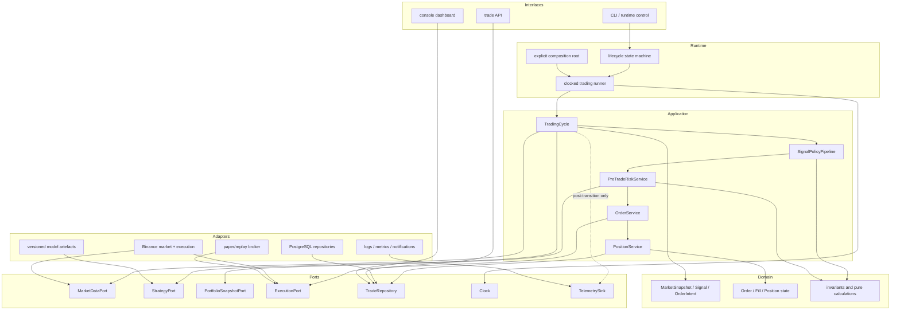
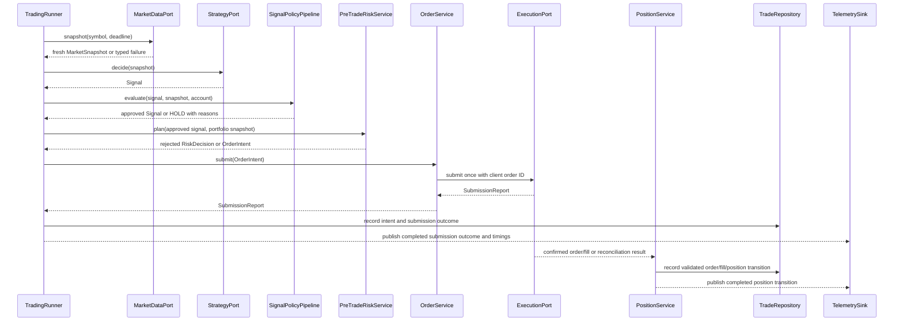

# ELVIS target architecture

## Decision

ELVIS will evolve into a **modular monolith with a synchronous, deterministic
trading path**. Domain and application code will depend on small ports;
Binance, PostgreSQL, model files, clocks, notifications, and dashboards will be
adapters. Events will describe completed state transitions for observability,
not control whether an order is safe to submit.

This is intentionally smaller than NautilusTrader's actor system, Hummingbot's
connector estate, or OpenMarket's service topology. ELVIS currently trades a
small symbol set through one process. Network service boundaries would add
serialization, deployment, and failure modes without removing the immediate
coupling inside the process.

## Design principles

1. **Fail closed.** Missing, stale, non-finite, invalid, or exceptional inputs
   produce `HOLD` or a rejected order, never synthetic live data or fallback
   leverage.
2. **One owner per state transition.** A single application service owns each
   decision, order submission, fill reconciliation, and position exit.
3. **Typed boundaries.** Domain objects replace ad hoc dictionaries and
   positional tuples at module boundaries.
4. **Direct hot path.** The decision and risk path uses ordinary synchronous
   calls with no global bus, reflection, or unnecessary queues.
5. **Ports at I/O boundaries.** Protocols exist for behaviour with multiple
   implementations or external effects, not for every function.
6. **Research/live parity.** Paper, replay, and live modes invoke the same
   application services; only adapters and clocks change.
7. **Progressive replacement.** Legacy adapters keep current functionality
   running while one vertical slice moves at a time.
8. **Measured performance.** Optimise only a measured hot path. Prefer fewer
   network calls, cached immutable snapshots, and bounded allocations before a
   language rewrite.

## Logical component map

Dependency direction is inward: domain imports no ELVIS infrastructure;
application imports domain and port definitions; adapters implement ports;
runtime composes them. UI and observability never call the exchange executor.

## Canonical trading cycle

No exception crosses the cycle boundary without becoming a typed failure and a
non-actionable outcome. If execution times out after a possible submission, the
`SubmissionReport` is `AMBIGUOUS`, not a definite rejection; reconciliation
must resolve it before any retry. A `SUBMITTED` report records an acknowledgment,
not a fill. Only `PositionService` applies confirmed fill and position
transitions.

## Domain contracts

Successive migration slices introduce small immutable values:

- `SignalAction`: `BUY`, `SELL`, or `HOLD`;
- `OrderSide`: `BUY` or `SELL`, so `HOLD` is unrepresentable in an order;
- `Signal`: symbol, action, confidence, reference price, timestamp, strategy ID,
  and reasons;
- `OrderIntent`: client order ID, decision ID, symbol, order side, quantity,
  order type, reference
  price, leverage, and decision timestamp;
- `RiskDecision`: approved/rejected plus reasons and optional order intent;
- `SubmissionReport`: `NOT_SENT`, `VENUE_REJECTED`, `SUBMITTED`, or `AMBIGUOUS`,
  with client/venue IDs and a retry-safety decision kept separate from outcome;
- `OrderState`: pending/open/partial/filled/cancel-pending/cancelled/failed,
  changed only through validated transitions; and
- `CycleOutcome`: terminal result and per-stage timings.

M2 implements `SignalAction`, `OrderSide`, `Signal`, the market-only
`OrderIntent`, and `SubmissionReport`. `RiskDecision`, the order state machine,
and `CycleOutcome` remain later slices; they are not placeholder classes in the
current package.

Constructors validate symbol presence, finite positive prices and quantities,
confidence bounds, non-negative fees, legal state transitions, and timezone-
aware timestamps. Invalid values raise before reaching an adapter.

Model features and confidence may remain ordinary `float`. At the order,
balance, fee, and realised-PnL boundaries, values use `Decimal` constructed from
strings and quantised against venue tick/lot rules. This is a narrow conversion
at the safety boundary, not a broad rewrite of pandas and model calculations.

## Application services

### `TradingCycle`

Owns one symbol decision from a market snapshot to a terminal outcome. It has no
loop, sleeps, environment reads, database globals, or UI calls. It is cheap to
construct and deterministic under injected ports and clock.

### `SignalPolicyPipeline`

Applies named policies in a fixed order and records every reason. A policy may
approve, adjust confidence, or veto to `HOLD`. An unexpected exception vetoes
the trade. Expensive optional policies have explicit deadlines and cannot block
the core loop indefinitely.

### `PreTradeRiskService`

Reads one coherent portfolio snapshot and produces either a rejection or one
fully specified `OrderIntent`. It owns leverage limits, exposure, cooldown,
stake sizing, fee viability, stale-account checks, and portfolio kill switches.
It never submits an order. `PortfolioSnapshotPort` is only its read boundary to
account and position state; risk policy remains inside this application service,
not in a second interchangeable `RiskPort`.

### `OrderService`

Makes one execution-adapter call per invocation for an already-approved intent,
using a stable client order ID, and never retries internally. It distinguishes
proof that nothing was sent, a definite venue rejection, a submission
acknowledgment, and an ambiguous outcome. Ambiguous submissions are reconciled
and never blindly retried. Durable idempotency and restart reconciliation are
added with the order repository; an in-memory deduplication cache would provide
false safety. The service does not invent quantity, leverage, price, or balance
fallbacks.

### `PositionService`

Is the sole owner of open-position transitions, stop loss, take profit,
trailing stop, partial fill, and close reconciliation. The background risk
thread and inline exit loop are retired only after this service covers their
behaviour.

## Runtime and configuration

The runner has explicit `STARTING`, `RUNNING`, `PAUSED`, `DEGRADED`, `STOPPING`,
and `STOPPED` states. It uses an injected monotonic clock for deadlines and a
wall clock only for exchange timestamps.

Environment and YAML inputs are parsed once into a frozen configuration object.
Validation includes mode, symbols, thresholds, leverage ceiling, database
settings, model schema, and required adapter credentials. Code below the
composition root does not call `os.getenv`.

Paper is the default. Live startup requires an explicit mode, validated
credentials, a healthy account snapshot, a compatible model artefact, and no
active migration shadow mismatch. It also requires an execution adapter that
explicitly declares and passes a live-submission capability check; the current
paper-only Binance executor cannot satisfy this gate.

## Model and feature contract

Every deployable model artefact must carry:

- `schema_id` and schema version;
- ordered feature names and dtypes;
- preprocessing/scaler version;
- model kind and library version;
- training source identifier and source commit;
- training window and random seed;
- evaluation metrics and acceptance thresholds; and
- creation timestamp and content hash.

Inference resolves features by the artefact's declared schema, validates all
values, and rejects incompatible artefacts at load time. Padding/truncating an
unknown schema is not permitted. A deliberate optional feature set, such as the
9-versus-11 social-feature variants, receives distinct schema IDs.

## Storage

Repositories return named records, not positional tuples. Schema migrations
create the namespace and tables before health is declared ready. Order, fill,
and position transitions share a transaction where needed. A unique client
order ID and venue order ID provide idempotency and reconciliation.

Read models for API/dashboard use separate repository methods or immutable
snapshots so presentation queries cannot mutate trading state.

## Events and observability

The current global event bus is not extended. During migration, a narrow
`TelemetrySink` receives immutable post-transition notifications. Failures in
metrics, logging, dashboard, or notification adapters are visible but cannot
change a completed trading decision or trigger a second submission.

If later profiling proves that multi-process isolation or an actor runtime is
needed, the typed domain messages and ports provide a clean boundary. That
decision is deferred until ELVIS has a measured throughput or fault-isolation
need.

## Test architecture

| Layer | Scope | External I/O |
|---|---|---|
| Domain unit | invariants, state transitions, pure calculations | none |
| Application unit | cycle, policy, risk, idempotency with fakes | none |
| Adapter contract | each exchange/repository/model against shared contract tests | controlled |
| Integration | PostgreSQL migration, paper broker, model artefact loading | ephemeral local services |
| Replay | same cycle over frozen market fixtures | none |
| Live canary | read-only market/account health, then owner-approved paper/live scope | explicit only |

Tests default to blocked network access. Time, IDs, model outputs, venue replies,
and database state are injected. Source-text tripwires are replaced gradually
with behaviour tests at the new application boundary.

## Performance budget

Initial budgets are tripwires, not marketing claims:

- domain validation and application orchestration overhead: p99 below 1 ms in
  an explicit 10,000-iteration warmed run against no-op in-memory adapters,
  excluding model and I/O work;
- no more than one account snapshot and one market snapshot per symbol cycle;
- no network or database call inside a pure policy;
- all external calls have explicit deadlines;
- per-stage monotonic timings on every cycle; and
- optimisation or Rust extraction only after a recorded profile identifies a
  CPU-bound stage whose cost matters relative to network latency.

This targets low latency by reducing I/O and uncertainty first, rather than by
introducing concurrency that makes order ownership harder to reason about.
Every recorded result includes CPU model, operating system, Python version,
sample count, warm-up count, clock (`perf_counter_ns`), and whether garbage
collection was enabled; it is a regression tripwire, not a cross-machine claim.

## Explicit non-goals

- no wholesale Rust rewrite;
- no microservice split during the current migration;
- no generic framework or plugin system for hypothetical exchanges;
- no replacement of working strategies solely for stylistic consistency;
- no automatic activation of live trading; and
- no claim that architectural quality creates trading alpha.
