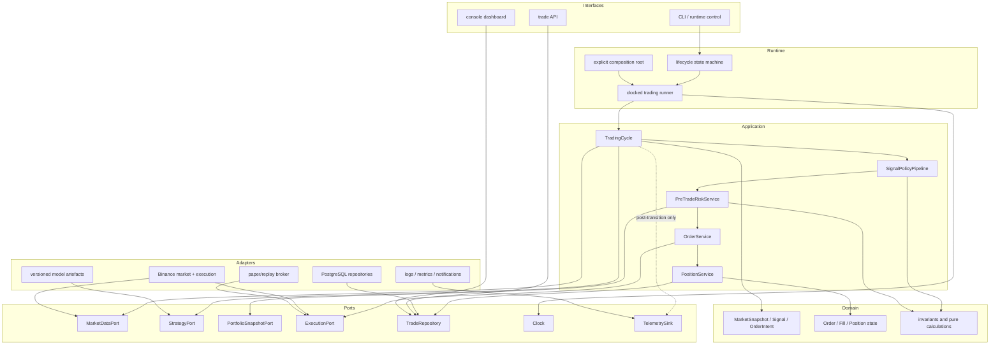
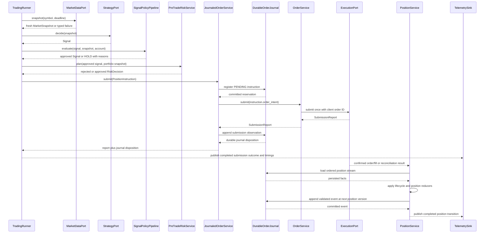

# ELVIS V2 target architecture

> **Design authority, not deployment proof.** This document defines the
> detailed V2 contracts. Some components are implemented and active at narrow
> compatibility boundaries; the durable owners, fence, activation, and
> least-authority bootstrap remain dormant. The
> [migration roadmap](04-migration-roadmap.md) is authoritative for current
> implementation state. `ACTIVE` remains a **NO-GO**.

## Decision

ELVIS will evolve into a **modular monolith with a synchronous, deterministic
trading path**. Domain and application code will depend on small ports;
Binance, PostgreSQL, model files, clocks, notifications, and dashboards will be
adapters. Events will describe completed state transitions for observability,
not control whether an order is safe to submit.

This is intentionally smaller than NautilusTrader's actor system, Hummingbot's
connector estate, or OpenMarket's service topology. ELVIS currently trades a
small symbol set through one process. Network service boundaries would add
serialization, deployment, and failure modes without removing the immediate
coupling inside the process.

## Design principles

1. **Fail closed.** Missing, stale, non-finite, invalid, or exceptional inputs
   produce `HOLD` or a rejected order, never synthetic live data or fallback
   leverage.
2. **One owner per state transition.** A single application service owns each
   decision, order submission, fill reconciliation, and position exit.
3. **Typed boundaries.** Domain objects replace ad hoc dictionaries and
   positional tuples at module boundaries.
4. **Direct hot path.** The decision and risk path uses ordinary synchronous
   calls with no global bus, reflection, or unnecessary queues.
5. **Ports at I/O boundaries.** Protocols exist for behaviour with multiple
   implementations or external effects, not for every function.
6. **Research/live parity.** Paper, replay, and live modes invoke the same
   application services; only adapters and clocks change.
7. **Progressive replacement.** Legacy adapters keep current functionality
   running while one vertical slice moves at a time.
8. **Measured performance.** Optimise only a measured hot path. Prefer fewer
   network calls, cached immutable snapshots, and bounded allocations before a
   language rewrite.

## Logical component map

Dependency direction is inward: domain imports no ELVIS infrastructure;
application imports domain and port definitions; adapters implement ports;
runtime composes them. UI and observability never call the exchange executor.

## Canonical trading cycle

No exception crosses the cycle boundary without becoming a typed failure and a
non-actionable outcome. If execution times out after a possible submission, the
`SubmissionReport` is `AMBIGUOUS`, not a definite rejection; reconciliation
must resolve it before any retry. A `SUBMITTED` report records an acknowledgment,
not a fill. Only `PositionService` applies confirmed fill and position
transitions.

## Domain contracts

Successive migration slices introduce small immutable values:

- `SignalAction`: `BUY`, `SELL`, or `HOLD`;
- `OrderSide`: `BUY` or `SELL`, so `HOLD` is unrepresentable in an order;
- `Signal`: symbol, action, confidence, reference price, timestamp, strategy ID,
  and reasons;
- `OrderIntent`: client order ID, decision ID, symbol, order side, quantity,
  order type, reference
  price, leverage, and decision timestamp;
- `RiskDecision`: approved/rejected plus reasons and optional order intent;
- `SubmissionReport`: `NOT_SENT`, `VENUE_REJECTED`, `SUBMITTED`, or `AMBIGUOUS`,
  with client/venue IDs and a retry-safety decision kept separate from outcome;
- `OrderLifecycleState`: pending/reconciling/open/partial/filled,
  cancel-pending/cancelled/failed, projected only through validated immutable
  events;
- `PositionEffect`: explicit `OPEN` or `REDUCE_ONLY`, coupled to one approved
  order intent before submission;
- `PositionSide`: `LONG` or `SHORT`, deliberately distinct from order direction;
- `TakeProfitProfile` and `PositionExitContext`: the resolved entry-time exit
  policy retained for the lifetime of a position key;
- `Position`: an immutable projection of confirmed fills with exact opened,
  reduced, and remaining quantities;
- `PaperAccount`: an immutable, account-global projection of exact balances,
  per-position margin reservations, applied settlements, and solvency state; and
- `CycleOutcome`: terminal result and per-stage timings.

M2 implements `SignalAction`, `OrderSide`, `Signal`, the market-only
`OrderIntent`, and `SubmissionReport`. M7a adds the correlated `RiskDecision`
contract. M8a adds the pure `OrderLifecycle` reducer without wiring it into the
runtime. M8b adds pure `PositionInstruction`, `PositionFill`, and `Position`
transitions without a runtime consumer. M9b.1 prepares the durable journal
schema, M9b.2 adds its pure, lossless persistence codec, and M9b.3 adds the
unwired transactional repository and reducer-based replay boundary. M9b.4 adds
the application-level `JournaledOrderService`, still with no runtime consumer.
M9b.7 adds a pure durable-submission owner contract for the next transaction
boundary, without implementing SQL, a repository, or runtime composition.
M9b.8 adds the pure FIFO paper-economics slice: exact lot, open-cost,
gross-realised-PnL, and per-fee-asset projections from causally versioned
confirmed fills, still without SQL or runtime composition.
M9b.9 adds the pure, linear quote-settled transition from one such confirmed
fill to explicitly denominated realised-PnL, fee-debit, and cash deltas. It
still adds no account state, SQL, or runtime composition.
M9b.10a adds the pure terminal paper-submission plan consumed by the future
transaction owner: one acknowledgement followed by one or more correlated
fills whose exact quantities sum to the complete order quantity. Candidate
facts remain non-durable, precomputed inputs; this slice still adds no SQL,
repository, clock, price source, or runtime composition.
M9b.10b adds the unwired concrete
`trading.persistence.atomic_paper_submission_owner.PostgresAtomicPaperSubmissionOwner`.
For a genuinely new immediate terminal paper order, it commits the instruction,
acknowledgement, and exact full-fill suffix in one PostgreSQL transaction; an
exact prior terminal batch is replayed without planning. It uses migration
`0002_order_position_journal.sql` unchanged and adds no account/economic
projection or runtime composition.
M9b.11 adds the pure `trading.domain.paper_accounting` account fold: global
settlement ordering, exact available/reserved balances, quantum-ceiling margin,
derived postings, admission, replay, and insolvency semantics. It adds no SQL,
durable account owner, or runtime composition.
M9b.12a adds the pure, unwired
`trading.persistence.paper_account_journal_codec` boundary. It defines compact,
version-1 envelopes for an explicitly scoped empty-account opening, one newly
applied settlement, and the ACK/full-fill batch that binds journal facts to
account facts. M9b.12b adds dormant migration `0003` with six account-ledger
relations. M9b.12c adds the strict, still-unwired
`PostgresPaperAccountJournal`: one-commit empty-opening provision plus exact
retry, and complete account replay or scoped listing from a read-only stable
snapshot. It does not write a settlement, own an order/account transaction, or
enter runtime composition. M9b.12d fixes the application contract for one
accounted paper submission and adds the still-unwired concrete
`PostgresAtomicPaperAccountOwner`. That owner must lock the provisioned account
before the position and either replay one exact manifest, reject with no durable
mutation, or commit the journal batch and every account fact together.
M9b.13 adds the pure readiness vocabulary and its dormant global PostgreSQL
assessment. M9b.14a adds migration `0004`, whose default-`LEGACY` singleton and
seven database triggers prepare the global legacy-writer fence without exposing
an activation API or changing runtime authority. M9b.14b1 adds dormant
migration `0005`, an empty append-only activation-epoch registry, version-2
manifest stamping, backward-compatible replay, and exact readiness evidence;
it still exposes no owner, transition, or runtime path. M9b.14b2 makes the
dormant atomic owner generation-aware, M9b.14b3 adds the dormant activation
contract, and M9b.14c1 moves that adapter behind two narrowly callable database
capabilities. M9b.14c2 adds the dormant, operator-driven role and catalog
bootstrap around those capabilities. M9b.14c3b exposes that library through a
dormant, one-shot offline CLI; none of these slices is wired into production.
`PositionService`, the pre-trade service, and `CycleOutcome` remain later
slices; they are not placeholder classes in the current package.

Constructors validate symbol presence, finite positive prices and quantities,
confidence bounds, non-negative fees, legal state transitions, and timezone-
aware timestamps. Invalid values raise before reaching an adapter.

Model features and confidence may remain ordinary `float`. At the order,
balance, fee, and realised-PnL boundaries, values use `Decimal` constructed from
strings and quantised against venue tick/lot rules. This is a narrow conversion
at the safety boundary, not a broad rewrite of pandas and model calculations.

## Application services

### `TradingCycle`

Owns one symbol decision from a market snapshot to a terminal outcome. It has no
loop, sleeps, environment reads, database globals, or UI calls. It is cheap to
construct and deterministic under injected ports and clock.

### `SignalPolicyPipeline`

Applies named policies in a fixed order and records every reason. A policy may
approve, adjust confidence, or veto to `HOLD`. An unexpected exception vetoes
the trade. Expensive optional policies have explicit deadlines and cannot block
the core loop indefinitely.

### `PreTradeRiskService`

Reads one coherent portfolio snapshot and produces either a rejection or one
fully specified `OrderIntent`. It owns leverage limits, exposure, cooldown,
stake sizing, fee viability, stale-account checks, and portfolio kill switches.
It never submits an order. `PortfolioSnapshotPort` is only its read boundary to
account and position state; risk policy remains inside this application service,
not in a second interchangeable `RiskPort`.

### `OrderService`

Makes one execution-adapter call per invocation for an already-approved intent,
using a stable client order ID, and never retries internally. It distinguishes
proof that nothing was sent, a definite venue rejection, a submission
acknowledgment, and an ambiguous outcome. Ambiguous submissions are reconciled
and never blindly retried. Durable idempotency and restart reconciliation are
added with the order repository; an in-memory deduplication cache would provide
false safety. The service does not invent quantity, leverage, price, or balance
fallbacks.

M9b.5 closes only the transport-correlation gap in the still-authoritative
paper path. `LegacyPaperExecutionAdapter` passes the stable client order ID as
a keyword-only argument to `BinanceExecutor`, and accepts a nominal paper
`FILLED` response as a submission acknowledgement only when the response echoes
that exact ID. The mock venue order ID is opaque and collision-resistant rather
than derived from wall-clock seconds. This echo proves which invocation
produced one response; it is not a durable receipt, a fill fact, deduplication,
or a query-by-client-ID implementation. Legacy executor callers that do not
provide a client ID remain supported but cannot satisfy the typed adapter's
correlation check.

M9b.6 adds the first restart-facing read boundary without changing schema or
runtime composition. The repository can replay one exact order by
`(execution_scope, client_order_id)` and can enumerate submission work whose
lifecycle is exactly `PENDING` or `RECONCILING`. Both operations rebuild whole
position streams from one repeatable-read, read-only snapshot; corrupt history
fails the whole request rather than producing a partial recovery list. This is
an inventory, not permission to retry: a legacy `PENDING` reservation still
cannot distinguish a crash before transport from a crash after an external
effect but before its observation was journaled.

### Durable submission ownership contract

M9b.7 defines the pure application contract that a future durable paper
submission owner must implement. One attempt context fixes the complete
instruction, execution scope, timezone-aware observation time, and durable
submission event identity before any side effect. Those values are stable
inputs, not regenerated during retry, commit-unknown recovery, or replay.

The result distinguishes facts committed by the current call from exact facts
replayed from durable history. Both outcomes expose the same canonical
submission event and report semantics, so a caller cannot mistake a replay for
permission to execute again. Canonical reconstruction deliberately cannot
retain the transport-only raw `venue_status`: the durable lifecycle event does
not store that field, and the contract does not pretend that it does. A durable
`SubmissionAcknowledged` remains proof of acceptance only; it is never a fill.
Only a separate `ConfirmedFill` can change order quantity or position state.

M9b.10b now implements that transaction boundary for one deliberately narrow
paper case. It validates the stable attempt context, acquires the relevant
stream lock, validates the immediate terminal paper effect, and persists the
canonical submission facts in one transaction before returning `COMMITTED`.
An exact previously committed attempt returns `REPLAYED`; any unsupported,
mismatched, or unresolved history fails closed for reconciliation. M9b.7 itself
remains a pure contract, while the concrete M9b.10b owner is intentionally
unwired. Neither slice performs a venue call, projects balances, fees, realised
PnL, trades, or account/open-position compatibility rows, establishes a
sole-writer mechanism, or fences the legacy writers. Those economic projections
and ownership gates remain mandatory before cut-over.

M9b.10a narrows the candidate-fact boundary consumed by the first atomic paper
owner in M9b.10b. `PaperPlannedFill(event_id, fill)` binds each non-durable
`ConfirmedFill` candidate to its future durable event identity.
`PaperSubmissionPlan(attempt, submission, fills)` accepts the exact
`SubmissionAttemptContext`, exactly one `SubmissionAcknowledged`, and a
non-empty tuple of exact `PaperPlannedFill` values. It requires the
acknowledgement to preserve the attempt's client order ID and observation time;
all event IDs, including the attempt ID, must be distinct. Every fill must
preserve the intent's client order ID, symbol, and side, must not predate the
acknowledgement, and must share the acknowledgement's venue order ID. Trade IDs
are unique and the exact-`Decimal` fill quantities must sum to exactly the
intent quantity. Empty, partial, and over-filled plans fail before persistence.

`PaperSubmissionPlanner.plan(attempt, /) -> PaperSubmissionPlan` is a narrow
source for those candidate facts. The future composition root must bind it to
stable, precomputed data for the attempt; planning must not sample a clock,
randomness, network or database state, manufacture a fill price from
`OrderIntent.reference_price`, or make any fact durable. The protocol alone
does not prove those operational properties, so the concrete owner and its
composition tests remain responsible for them. Candidate facts become durable
only if the M9b.10b owner commits the reservation, acknowledgement, and all
fills in one PostgreSQL transaction.

M9b.10a itself remains a pure, unwired contract. It adds no SQL, repository,
schema migration, transaction owner, paper simulator, venue or price I/O,
account state, or runtime consumer. Migration
`0002_order_position_journal.sql` supports only the narrow journal batch now
implemented by M9b.10b: one new order reservation followed by an ACK and its
terminal exact full fills at consecutive stream versions. It does not encode a
batch manifest or any balance, posting, margin, instrument-snapshot, or
compatibility-projection invariant. Therefore, an existing `PENDING`, ACK-only,
partial-fill, mismatched, interleaved, or corrupt history is reconciliation
work; it is never permission to invoke the planner, append a guessed suffix, or
resubmit.

### Atomic terminal paper-submission owner

M9b.10b adds
`trading.persistence.atomic_paper_submission_owner.PostgresAtomicPaperSubmissionOwner`.
Its exact entry point is
`execute(attempt: SubmissionAttemptContext, /) -> DurableSubmissionReceipt`.
The constructor receives an injected connection factory and the M9b.10a
`PaperSubmissionPlanner`; no application or runtime module constructs this
owner.

Each call obtains one fresh connection, starts one write transaction, inserts
or locks the position stream, and replays the complete locked stream before it
can plan or append. For a genuinely new order, every existing sibling must
already be an exact supported terminal ACK/full-fill batch. Only then does the
owner reserve the instruction, call the planner once under the same stream
lock, require the plan to retain the exact attempt object, validate the order
lifecycle and resulting position transition, assign consecutive stream
versions to the ACK and every fill, and commit once. It does not compose
`PostgresOrderPositionJournal.reserve_instruction()` and `append_event()`:
those public methods each own a separate transaction and cannot provide this
atomicity.

If the exact instruction and exact attempt already identify a supported
terminal batch, `execute()` reconstructs a canonical `REPLAYED` receipt from
the durable rows without calling the planner or changing any row. Existing
`PENDING`, ACK-only, partial, interleaved, contradictory, gapped, or corrupt
histories raise a reconciliation or journal error before planning. A commit
whose acknowledgement is lost raises `SubmissionCommitUnknown(attempt)`; a
fresh call locks and replays first, so a transaction that actually committed is
returned as `REPLAYED` without another plan.

Migration `0002` stores no owner generation or batch-provenance marker. The
owner therefore recognizes replay by exact terminal shape, not by proving that
the historical rows originated in one earlier atomic-owner transaction. An
ACK and exact full-fill suffix written by separate legacy journal commits is
adopted as `REPLAYED` once the complete shape is durable; incomplete or
contradictory shapes still reconcile. This is safe for the journal-only no-op
path, but it is not activation provenance. Runtime cut-over still requires a
durable generation/scope fence that separates eligible atomic-owner history
from legacy effects and compatibility projections.

This is a journal-only owner for immediate terminal full fills. It writes only
the unchanged M9b.1 `np.position_streams`, `np.orders`, and `np.order_events`
contract and required transaction state. It performs no venue execution,
market or price discovery, clock sampling, FIFO economics, settlement, balance,
posting, margin, legacy trade/open-position write, telemetry, startup, or
runtime composition. Migration `0002_order_position_journal.sql` is unchanged;
the PostgreSQL tests prove the narrow transaction against that existing schema,
not a new migration or an activation claim.

### `JournaledOrderService`

M9b.4 supplies the unwired durable wrapper. It accepts one
`PositionInstruction`, asks a storage-neutral `OrderJournalPort` to commit its
reservation, and treats an exact boolean `is_created=True` receipt as the only
permission to call `OrderService`. Any existing reservation returns a
conservative reconciliation-required result without reading the clock,
submitting, or appending. A registration failure also makes no adapter call.

After a new reservation is committed, the service reads and validates one
injected aware timestamp before the external effect, delegates the embedded
`OrderIntent` exactly once, translates the `SubmissionReport` into the matching
M8a submission event, and appends it under the stable per-client identity
`submission-attempt-1`. `SUBMITTED` remains an acknowledgement even if a legacy
`venue_status` string says `FILLED`; only an independent `ConfirmedFill` may
advance position quantity. The service returns `RECORDED` only after the event
receipt confirms the expected identity and a positive position-stream version.
If append fails or its commit acknowledgement is unknown, the typed
`SubmissionObservationNotRecorded` preserves the exact report, event, event ID,
and original cause for reconciliation. It never retries the venue call.

The application module depends only on domain values and structural ports; it
does not import the PostgreSQL repository. Its package facade re-exports the
contract, so another `trading.application` import may load the pure module, but
no runtime, adapter, startup, or composition-root module references or invokes
it. M9b.1 supplies the tables, M9b.2 the typed codec, and M9b.3 the committed
reservation and append implementation. Activation still requires a truthful
pre-submit `PositionInstruction`, stable client-order propagation through the
side-effect owner, fill observation, unresolved-order inventory,
reconciliation, durable quarantine, and startup readiness.

### `PositionService`

Is the sole owner of open-position transitions, stop loss, take profit,
trailing stop, partial fill, and close reconciliation. The background risk
thread and inline exit loop are retired only after this service covers their
behaviour. M8b supplies its pure confirmed-fill transition contract: an `OPEN`
fill can create or scale a stable position key, while `REDUCE_ONLY` can only
reduce the opposite side and can never create or flip a position. That reducer
does not yet constitute this service, select an exit, calculate cost basis or
PnL, or perform runtime I/O. The persistence codec and repository replay these
instruction and event values, but no runtime module applies the reducer yet.

M9b.8 adds the smallest missing economic reducer under
`trading.domain.paper_economics`. `PaperFillRecord` couples one already
validated `PositionFill` to its positive durable `position_version` and exact
per-order `(client_order_id, event_id)` identity; `PaperEconomics` retains those
records and the corresponding
`Position`, `PaperCostLot`, exact open quantity and cost, gross-PnL, and
`PaperFeeTotal` projections. The reducer must not use the identity-sorted
`Position.fills` tuple, fill timestamp, database row ID, or query return order
as a substitute for causality. Economic fill versions increase strictly. Gaps
between economic fills are valid because submission and other non-fill
lifecycle events occupy versions in the complete position stream; the
repository remains responsible for proving that complete stream is the exact
contiguous prefix `1..stream_version`. Reapplying the exact same
`PaperFillRecord` is an idempotent no-op. A changed payload at an existing
version or composite event identity, a fill identity at another version, or a
regressed new version fails closed. The same bare `event_id` may validly recur
under another client order.

`PaperLotMethod` admits only `FIFO`. Each `OPEN` fill creates one immutable lot
at the exact confirmed fill price and quantity. A scale-in appends another lot
instead of manufacturing an average entry. `REDUCE_ONLY` consumes lots in
ascending `position_version`; a partial reduction leaves an exact remainder on
the partially consumed lot, and an exact reduction of all remaining quantity
closes the projection. Open cost is the exact sum of `remaining_quantity *
entry_price` for the surviving lots. Gross realised PnL is the exact sum of
`(exit_price - entry_price) * matched_quantity` for a long and
`(entry_price - exit_price) * matched_quantity` for a short. The calculation
uses `ConfirmedFill.price`, `ConfirmedFill.quantity`, and exact `Decimal`
arithmetic. `OrderIntent.reference_price`, mock/current prices, tolerances, and
binary floats are not economic facts. Leverage remains position metadata: for a
fixed base/contract quantity it changes margin, not fill notional, exchange fee,
or gross PnL.

The projection preserves positive confirmed fees as exact totals grouped by
their explicit `fee_asset`; zero fees are omitted. It does not convert fee
assets or subtract them from gross PnL, so it exposes no synthetic cross-asset
net PnL. Balance, cash, margin reservation, liquidation, funding, borrowing,
mark-to-market PnL, exit selection, price simulation,
tick/lot quantisation, and legacy table shapes remain outside this reducer.
Those require separate policies rather than hidden defaults in arithmetic.

M9b.9 adds `trading.domain.paper_settlement` without turning the economic
projection into an account. `PaperLinearInstrument` explicitly binds a symbol
to distinct base and quote assets and admits only multiplier-one linear
settlement in the quote asset. `settle_paper_fill(instrument, before, record)`
accepts an already confirmed `PaperFillRecord` and an optional compact
factory-created `PaperSettlementCheckpoint` that binds the prior FIFO economics
to its instrument. A change of instrument or denomination therefore fails
closed without retaining a recursive chain of earlier settlement results. It
does not submit an order, manufacture an acknowledgement or fill, sample a
price, or infer an instrument from the symbol spelling. Its
`PaperSettlement.after.economics` projection is the exact M9b.8 FIFO result
after applying that record.

For an applied fill, `gross_realized_pnl_delta` is the change in cumulative
gross realised PnL and is always denominated in the instrument's quote asset.
Each positive confirmed fee is exposed separately as a positive `fee_debits`
amount in the fill's exact `fee_asset`. `cash_deltas` then contains the signed
per-asset combination: gross realised PnL in quote and the fee as a negative
amount in its own asset. When the fee asset is the quote asset those terms may
combine; otherwise they remain separate. Zero asset deltas are omitted. No FX,
token, mark-price, or implicit one-to-one conversion is performed, so these
deltas cannot be presented as a cross-asset net PnL or an account balance.

`PaperSettlementDisposition.APPLIED` means the causal fill was newly applied,
even when it realises no PnL and charges no fee. An exact replay returns
`REPLAYED`, the unchanged `PaperEconomics` object, a zero quote-denominated
gross-PnL delta, and no repeated fee or cash delta. A mismatched symbol or a
conflicting economic history fails closed as `InvalidPaperSettlement`.
`PaperSettlement` re-derives its after-state, disposition, and exact-Decimal
deltas on direct construction so callers cannot forge a posting-like result.
The causal value graph also rejects the mutable `__setstate__` hook that Python
otherwise generates for frozen slotted dataclasses. Copy and pickle restoration
remain supported only onto a new object and rerun every domain invariant before
the value becomes observable.

This contract does not maintain balances, reserve or release margin, decide
admission, model collateral, funding, borrowing, liquidation, or unrealised
PnL. It adds no ledger table, SQL repository, PostgreSQL transaction owner,
legacy projection, runtime consumer, or writer fence. Those stateful and
operational boundaries require later contracts and persistence work.

M9b.11 adds that next semantic layer under
`trading.domain.paper_accounting`, without making it durable or active.
`PaperAccountPolicy(account_key, collateral_asset, margin_quantum)` fixes one
isolated account's collateral denomination and exact positive margin quantum.
`PaperAccountBalance` exposes exact `available` and non-negative `reserved`
amounts per asset; `PaperMarginReservation` binds the current positive
collateral reservation to one position. `PaperAccount` retains canonical
opening balances, current balances, sorted reservations, exact settlement
records, and derived `ACTIVE` or `INSOLVENT` state. Opening balances are a
unique asset-sorted tuple, include the collateral asset, start non-negative and
unreserved, and are not disguised as synthetic settlement records.

`new_paper_account(policy, opening_balances) -> PaperAccount` is the canonical
empty-account factory. `admit_paper_settlement(account, account_version,
settlement) -> PaperAccountAdmission` folds one exact, newly `APPLIED` M9b.9
settlement.
Each accepted `PaperAccountSettlementRecord` consumes the next positive
`account_version` in the exact contiguous account-global prefix. This sequence
is deliberately distinct from `PaperFillRecord.position_version`: position
versions establish order/position-stream causality, while account versions
serialize settlements from every position sharing collateral. An account
version therefore must never be inferred from a position version. That global
order prevents two positions from spending the same projected collateral only
when a future durable owner serializes it; the pure function alone is not a
concurrency lock.

For each position, the first account settlement must begin a new settlement
chain and every later settlement must continue the exact prior checkpoint.
Account records have unique composite event and fill identities. Reusing an
existing account version with the exact same settlement yields
`PaperAccountAdmissionDisposition.REPLAYED`, the current account object, no
postings, and no repeated economic effect, even when later account records
already exist. A conflicting payload at that version, the same fill/event
identity at another account version, a sequence gap, or a broken position
chain raises `InvalidPaperAccountTransition`. A rejected admission returns
`REJECTED`, the unchanged account, no postings, and does not consume the
candidate account version.

The target margin for a position is calculated from the complete after-
settlement FIFO projection as
`ceil(open_cost / leverage / margin_quantum) * margin_quantum`. The implementation
uses an exact integer ratio rather than ambient `Decimal` precision or rounding,
so every non-zero requirement rounds upward to the explicit policy quantum.
Scale-in and reduction recompute that target; their delta reserves or releases
margin without incremental rounding drift, and a fully closed position removes
its reservation.

`PaperAccountPosting` records a non-zero signed movement in either
`AVAILABLE` or `RESERVED_MARGIN`. Settlement cash deltas affect `AVAILABLE` in
their explicit asset; a margin delta produces equal and opposite collateral
postings between the two buckets. Consequently, the sum of postings for each
asset equals that settlement's cash delta for the asset, while margin movement
has zero per-asset net effect. Foreign-asset fees debit their own balance and
are never converted. Zero postings are omitted, reserved balances cannot become
negative, and every returned posting, balance, reservation, disposition, and
reason is re-derived by `PaperAccountAdmission`, so callers cannot forge an
approved result.

An `OPEN` settlement is `APPLIED` only if all resulting available asset
balances remain non-negative and the prior account is `ACTIVE`; otherwise it
is rejected with explicit reasons. `REDUCE_ONLY` remains applicable so that a
position can close and its exact loss/fees can be recognized even when this
makes an available balance negative. Any negative available balance derives
`PaperAccountState.INSOLVENT`, which blocks later `OPEN` exposure. This is an
admission projection over already explicit candidate settlement facts, not
permission to call a venue or a pre-trade authorization until it is composed
inside the future atomic owner.

M9b.11 is pure and unwired. It imports only standard-library and domain code
and adds no SQL, migration, account/posting repository, PostgreSQL lock,
transaction, execution call, price/fee source, clock, legacy projection,
telemetry, or runtime consumer. Persistence must later store and atomically
advance the account-global version, balances/reservations/postings, instrument
provenance, and the order/fill journal in one owned transaction. Funding,
borrowing, liquidation, unrealised mark-to-market PnL, durable opening-capital
provenance, reconciliation/quarantine, sole-writer fencing, shadow parity, and
cut-over remain outside this slice.

M9b.12a fixes the lossless payload contract needed before that schema can be
made immutable. The module is consumed directly rather than re-exported from
the lightweight `trading.persistence` migration facade. Its frozen, slotted
encoded values are:

- `EncodedPaperAccountOpening`, with indexed execution scope, account key,
  positive owner generation, collateral asset, envelope version, canonical
  payload, and payload SHA-256;
- `EncodedPaperAccountSettlement`, with indexed account/position/fill and
  instrument identity, independent account and position versions, envelope
  versions, canonical payload, and payload SHA-256; and
- `EncodedPaperAccountBatch`, whose indexed owner/order/ACK identity and exact
  account/position version ranges mirror a canonical
  `PaperAccountBatchManifest` containing one or more
  `PaperAccountBatchFill` references.

`encode_paper_account_opening(execution_scope, owner_generation, account)`
accepts only an empty `PaperAccount`: current balances must equal the explicit
opening balances, and there may be no settlement record or margin reservation.
The version-1 payload binds `execution_scope` and `owner_generation` to the
complete account policy (`account_key`, `collateral_asset`, and exact
`margin_quantum`) and the asset-sorted opening balances. Opening capital is
therefore explicit provenance, not a synthetic settlement, implicit database
default, seed, or backfill. `decode_paper_account_opening(...)` reconstructs the
domain account and rejects any hash, version, payload-shape, domain, or
denormalized-column mismatch.

`encode_paper_account_settlement(admission)` accepts only a newly `APPLIED`
`PaperAccountAdmission`. Its compact payload stores the account identity; the
account/position version and fill/event reference; the versioned linear quote
instrument identity; exact realised-PnL, fee-debit, and cash deltas; derived
postings; resulting account state; and that position's resulting margin, if
non-zero. It deliberately does not serialize `before`, the complete
`PaperSettlement`, FIFO lots, the cumulative economic projection, all prior
settlements, or a recursive `after` account. Consequently, history remains
linear rather than growing quadratically. To decode a row,
`decode_paper_account_settlement(before, settlement, ...)` requires the already
validated prior account and exact settlement candidate, re-runs M9b.11
admission, requires a newly applied result, regenerates the compact payload,
and cross-checks every indexed identity. A row is not authority to invent a
settlement or skip causal replay.

`PaperAccountBatchManifest` is the provenance bridge that migration `0002`
lacks. It binds `execution_scope`, `account_key`, a positive
`owner_generation`, `position_key`, `client_order_id`, and the instruction
payload SHA-256 to the ACK event ID, position version, observed time, and event
payload SHA-256. Every `PaperAccountBatchFill` then binds the same order and
position to its event ID, trade ID, position version, account version, journal
event-payload SHA-256, and account-settlement-payload SHA-256. Fill position
versions must immediately and contiguously follow the ACK; fill account
versions must be contiguous; and event and trade identities must be unique.
The encoded batch duplicates the first/last account versions, last position
version, and fill count so the M9b.12c repository can index and cross-check the
complete range. This marker distinguishes eligible owner-produced accounting
facts from a merely shape-compatible terminal history in migration `0002`; it
does not retroactively confer atomic provenance on that older history.

All three codecs use strict canonical JSON: sorted keys, compact separators,
ASCII escaping, finite exact `Decimal` strings, and canonical UTC timestamps
with six fractional digits where time is present. In particular, the manifest
ACK `observed_at` is normalized to UTC in both its indexed value and canonical
payload. Lowercase SHA-256 values bind the canonical UTF-8 bytes, while
decoders accept a PostgreSQL JSON object or JSON text and then recanonicalize
it. Duplicate keys, JSON constants, unknown or missing keys, unknown versions,
non-canonical scalars, invalid domain data, hash drift, and indexed-column drift
raise `JournalQuarantineError`. SHA-256 is an integrity and identity check, not
a MAC or proof of who wrote a row.

M9b.12a still performs no I/O and adds no SQL, migration, table, repository,
lock, transaction, writer, account provisioning command, venue action, legacy
projection, runtime consumer, readiness check, reconciliation workflow, or
sole-writer fence. It does not add funding, borrowing, liquidation, unrealised
mark-to-market, price/tick/lot discovery, or automatic adoption of pre-codec
history.

M9b.12b maps those fixed envelopes to dormant storage through immutable
migration `0003_paper_account_ledger.sql`. The migration contains only `CREATE
TABLE` and `CREATE UNIQUE INDEX` statements. It adds four composite reference
indexes to the version-2 order journal and exactly six account relations:

- `paper_account_streams` stores the provisioned version-1 opening envelope,
  its execution scope, owner generation, collateral asset, and the current
  account version/state;
- `paper_account_balances` and `paper_margin_reservations` store the current
  exact-text projections, with reservations tied to an account/position in the
  same execution scope;
- `paper_account_batch_manifests` binds one client order to the exact opening
  version/hash and `(execution_scope, account_key, owner_generation)`, the
  instruction hash, exact ACK identity/type/time/hash, and declared account and
  position ranges;
- `paper_account_settlements` is both the compact settlement envelope and the
  relational manifest-fill row; there is deliberately no seventh batch-fill
  table; and
- `paper_account_postings` stores each settlement's exact-text available or
  reserved-margin posting projection.

The `owner_generation` on the opening is immutable provisioning provenance; it
is not a rotating runtime generation or a sole-writer fence. A settlement
copies its manifest range and fill ordinal. SQL checks the account and position
ordinal arithmetic, requires its deferred manifest membership, binds the exact
`CONFIRMED_FILL` journal identity and event hash through a deferred composite
foreign key, binds the order symbol, requires the quote asset to equal the
account collateral, and rejects equal base/quote assets. Unique keys prevent a
client order from being claimed by two account manifests and prevent duplicate
account versions, manifest ordinals, journal position versions, event IDs, or
trade IDs among settlement rows. Deferral permits one future transaction to
insert the mutually dependent journal/account facts; it does not weaken these
row-level invariants at commit.

SQL intentionally does not prove that a manifest has exactly `fill_count`
settlement rows or no missing ordinal, nor that its JSON fill members and hashes
match those rows. A manifest without settlements is therefore structurally
valid at this schema-only boundary. SQL also does not recanonicalize JSON or
exact `Decimal` strings, replay settlement causality, prove cross-batch account
version contiguity, equate the stream version/state with the settlement tail,
or prove balance/reservation/posting conservation. M9b.12c supplies that strict
read-side proof and quarantines mismatches before returning an account. The
future integrated writer must additionally lock the account before the
position and commit journal plus account facts atomically.

M9b.12b creates no seed, opening-capital default, backfill, trigger, DML,
destructive or legacy-table statement. It adds no repository, transaction
owner, provisioning command, runtime consumer, readiness gate, reconciliation
workflow, legacy projection, generation control, or sole-writer fence. It does
not confer account provenance on older version-2 histories, which still require
reconciliation.

M9b.12c consumes that dormant schema through the direct, deliberately
non-facade module `trading.persistence.paper_account_journal`. Its public
surface is intentionally narrow:

- `provision_account(*, execution_scope, owner_generation, account)` returns a
  `ProvisionedPaperAccount` only after commit, with a `CREATED` or `EXISTING`
  `ProvisionDisposition` and the complete `ReplayedPaperAccount`;
- `replay_account(*, execution_scope, account_key)` reconstructs one exact
  account; and
- `list_accounts(*, execution_scope)` returns account-key-sorted replay results
  all-or-nothing from the same database snapshot.

`ReplayedPaperAccount` carries the durable execution scope, immutable opening
generation and opening hash, the reconstructed `PaperAccount`, and its ordered
`PaperAccountBatchManifest` tuple. `ProvisionedPaperAccount` exposes the
disposition and current replay, with convenience accessors for the created
flag, account, scope, and generation. Failures are explicit:
`PaperAccountInputError` rejects invalid or non-empty openings before I/O;
`PaperAccountStorageError` means the operation is known not to have committed;
`PaperAccountCommitUnknown` carries scope, account key, and generation and
requires reconciliation after a lost commit acknowledgement;
`PaperAccountNotFoundError` reports an absent account;
`PaperAccountConflictError` classifies `EXECUTION_SCOPE`, `OWNER_GENERATION`,
or `OPENING_IDENTITY`; and `PaperAccountReplayError` quarantines durable facts
that cannot reconstruct exactly. All derive from `PaperAccountJournalError`.

Provision is the only write in this slice. It accepts only the explicit empty
M9b.11 account, inserts the immutable stream and opening-balance projection in
one `READ COMMITTED` transaction, then strictly replays them before one commit.
An exact retry locks the existing account row, replays the same opening, and
returns `EXISTING` without changing durable facts; concurrent exact callers
therefore converge on one opening. A scope, generation, or opening-envelope
conflict rolls back. If commit acknowledgement itself fails, the repository
does not guess whether the commit landed: it raises `PaperAccountCommitUnknown`
and an exact retry/replay is the reconciliation path.

Both read methods use one `REPEATABLE READ READ ONLY` transaction and return no
partial projection. Replay decodes and rehashes the opening, every owner-batch,
and every compact settlement; requires a contiguous account-version prefix and
complete manifest fill ordinals/ranges; and cross-checks instruction, ACK, and
confirmed-fill identity and hashes against a full replay of the referenced
version-2 order/position journal. It then rebuilds `PositionFill`, FIFO paper
economics, quote settlement, and M9b.11 admission in causal order. Stored
settlement payloads and derived postings must equal that replay, while the
materialized stream version/state, exact canonical-Decimal balances, and margin
reservations must equal the resulting account. Every order in a referenced
position history must belong to the account's manifests, so an older unclaimed
history is rejected rather than silently adopted. `list_accounts` applies the
same proof to every account in one stable snapshot and fails the whole result
if any account is corrupt.

This remains a dormant correctness boundary. It has no settlement or posting
write API, no integrated account-first/position-second owner, no execution or
legacy write, no runtime consumer, no readiness or cut-over gate, and no
durable quarantine workflow. `owner_generation` remains immutable provisioning
provenance, not a rotating fence. Provision cannot adopt existing order history
or create a non-empty account. Full referenced-position replay and the current
N+1 query shape are acceptable while the repository is unwired; bounded replay,
snapshots, and measured optimization remain later work.

M9b.12d defines the application boundary that can consume that repository and
schema without weakening their provenance rules. The frozen application values
exported by `trading.application` are:

- `PaperAccountSubmissionContext(attempt, account_key, instrument)`, which binds
  the exact `SubmissionAttemptContext` to one durable account key and one
  `PaperLinearInstrument` snapshot whose symbol must match the instruction;
- `DurablePaperAccountSubmissionReceipt(context, submission, account_versions)`,
  which carries the exact `DurableSubmissionReceipt` plus one positive,
  consecutive account version for every durable fill and derives its committed
  or replayed disposition from that submission receipt; and
- `PaperAccountSubmissionRejected(context, rejected_event_id, reasons)`, which
  identifies the first derived fill admission that failed and preserves the
  non-empty rejection reasons after the transaction leaves no durable batch
  mutation.

`PaperAccountSubmissionResult` is exactly the receipt-or-rejection union, and
`PaperAccountSubmissionOwner.execute(context, /)` is the positional-only port.
`PaperAccountSubmissionCommitUnknown` and
`PaperAccountSubmissionReconciliationRequired` retain the complete context,
expose its client-order ID, and explicitly require reconciliation. A commit
acknowledgement loss is therefore not reported as either a receipt or a
rejection, while incompatible durable history is not sent back through the
planner.

The concrete boundary is the direct, non-facade
`trading.persistence.atomic_paper_account_owner.PostgresAtomicPaperAccountOwner`.
It accepts an injected fresh-connection factory and the existing pure
`PaperSubmissionPlanner`, and exposes only `execute(context, /)`. The account
must already have been explicitly provisioned. One `READ COMMITTED` transaction
locks and strictly replays its `paper_account_streams` row first, then creates or
locks and replays the target `position_streams` row. This account-before-position
order is mandatory for every new accounted writer; the older position-only
owner is not composed beneath it.

While both locks are held, an exact target manifest is decoded and fully replayed
through the M9b.12c repository rules. It returns a replay receipt without
calling the planner or executing DML only when the stored opening generation,
attempt/instruction, instrument, ACK, fills, account-version range, settlement
hashes, postings, and projections all match the requested context. Any order
history from migration `0002` that has no account manifest -- including a
shape-compatible terminal ACK/full-fill batch -- remains unowned and raises
`PaperAccountSubmissionReconciliationRequired`. Missing, incomplete, corrupt,
or context-incompatible manifest history does the same; it is never adopted,
replanned, or repaired automatically.

For a genuinely new order, the planner runs once under both locks and all
position, FIFO-economics, quote-settlement, and account-admission transitions
are derived in memory first. If any fill admission is `REJECTED`, the complete
transaction rolls back and returns `PaperAccountSubmissionRejected`; no order,
event, manifest, settlement, posting, balance, reservation, or stream-version
change may survive. If every admission is `APPLIED`, the same transaction writes
the instruction and consecutive ACK/fill events, one exact batch manifest, each
compact settlement and posting, the complete balance/reservation projections,
and the new account and position stream tails. It forces deferred constraints
immediate and strictly replays the final journal/account state before one commit.
A failure before commit is known not to have committed; loss of the commit
acknowledgement raises `PaperAccountSubmissionCommitUnknown(context)`, and an
exact subsequent call resolves only by manifest replay.

M9b.12d remains dormant. It performs no venue or legacy-table call, is not
exported from the lightweight persistence facade, and has no runtime consumer,
readiness gate, rotating generation, durable quarantine workflow, compatibility
projection, sole-writer fence, shadow activation, or cut-over authority. Its
application-contract, owner-unit, PostgreSQL concurrency/fault matrix, adjacent
regression, and full non-PostgreSQL gates are complete; those proofs do not make
the dormant adapter runtime-ready.

M9b.13a defines the pure evidence vocabulary for the first pre-fence assessment.
`PaperAccountReadinessContext` binds one approved execution scope, account key,
immutable provisioning generation, and exact opening-envelope SHA-256 rather
than trusting whichever provenance happens to be stored. `MigrationIdentity`
captures an exact contiguous migration-ledger prefix, while
`LegacyRelationWatermark` records the row count and maximum integer identity for
each of the seven migration-`0001` relations.

`PaperAccountReadinessAssessment` canonicalizes those values and stable typed
findings. Matching migrations, one proven account at a non-negative version,
all seven legacy watermarks, zero legacy open positions, and no findings derive
`PREPARED_FOR_FENCE`. Missing, pending, or drifted migrations and other
preconditions derive `BLOCKED`; failed account or position replay, unresolved
submissions, or unaccounted orders derive `RECONCILIATION_REQUIRED`, which takes
priority when both classes are present. A non-empty `np.open_positions`
watermark always derives its own blocker.
If a raw migration row is malformed and therefore cannot become a valid
`MigrationIdentity`, the applied tuple retains only its decodable prefix and an
explicit `MIGRATION_DRIFT` finding becomes the single canonical ledger blocker;
no invalid row is synthesized into apparently valid evidence.

The assessment is explicitly non-authoritative and stale as soon as its source
snapshot ends. `PREPARED_FOR_FENCE` is not `READY`, does not grant a runtime
lease, and cannot activate an owner. M9b.13a contains no database access,
readiness endpoint, startup wiring, fence row, role or trigger, writer shutdown,
shadow path, or cut-over. M9b.13b below obtains all evidence from one
repeatable-read, read-only snapshot; a still later activation boundary must
repeat the assessment under its own fence, account, and position locks.

M9b.13b supplies that dormant PostgreSQL evidence adapter as the direct,
non-facade
`trading.persistence.paper_account_readiness.PostgresPaperAccountReadiness`.
Its constructor accepts an injected fresh-connection factory and its only
operation is positional-only `assess(context, /)`. The public error boundary is
`PaperAccountReadinessError`, with `PaperAccountReadinessInputError` for a
non-exact context rejected before connection and
`PaperAccountReadinessStorageError` when PostgreSQL, packaged migration loading,
or snapshot completion cannot produce one complete assessment. A storage error
never returns partial findings.

One assessment uses one connection and one cursor. Its transaction is
`REPEATABLE READ` and `READ ONLY`. It loads the packaged migration identities,
then validates the physical authority of `np.schema_migrations` before trusting
any ledger row. That relation must be one ordinary permanent table with exactly,
in order, `version integer NOT NULL`, `name text NOT NULL`,
`checksum character(64) NOT NULL`, and
`applied_at timestamp with time zone NOT NULL DEFAULT now()`; its only
constraint must be the non-deferrable, initially immediate, validated primary
key on `version`. Rules, triggers, row-level security, forced row-level
security, inheritance, and policies are forbidden.
It then compares the applied contiguous prefix with the packaged identities.
An absent ledger, a pending prefix, checksum or name drift, malformed raw row,
physical metadata drift, or behavior drift returns only migration evidence and
stops before account, position, raw claim, or legacy-watermark queries. A
malformed row retains only the valid decoded prefix and carries the canonical
`MIGRATION_DRIFT` finding rather than being misreported as merely pending.

Even an exact ledger is not sufficient authority for business reads. The
adapter next verifies all seventeen durable business relations as ordinary,
permanent PostgreSQL tables with no rules, row-level security, forced row-level
security, inheritance, or policies. The exact inventory is
`np.account_balances`, `np.liquidations`, `np.margin_history`,
`np.model_predictions`, `np.open_positions`, `np.trades`,
`np.trading_session_resets`, `np.order_events`, `np.orders`,
`np.position_streams`, `np.paper_account_streams`,
`np.paper_account_balances`, `np.paper_margin_reservations`,
`np.paper_account_batch_manifests`, `np.paper_account_settlements`, and
`np.paper_account_postings`, plus M9b.14a's `np.paper_runtime_control`.
User triggers are forbidden on every non-legacy relation; the seven legacy
relations must carry only the exact M9b.14a guards validated below. A missing
table, view or foreign-table substitution, temporary or unlogged persistence,
or behavior overlay is canonical `MIGRATION_DRIFT` and stops before any
business relation is read.

The M9b.14a legacy fence covers seven shared tables with no execution-scope
column. Readiness therefore cannot be established from a caller-local subset.
After exact migration proof, M9b.13b inventories every
`paper_account_streams` and `position_streams` identity across every execution
scope. It strictly replays each account and position through the existing
M9b.12c and M9b.3 replay functions, using the same read-only cursor and each
row's stored scope, with no nested public repository call or second connection.
The requested `(account_key, execution_scope)` must exist exactly; every other
account, including one in another scope, is `UNEXPECTED_ACCOUNT`. Missing,
wrong-scope, corrupt, insolvent, provenance-mismatched, reserved-margin, and
open-position evidence remains explicit and fail-closed.

Before replay, the adapter inventories raw rows globally, retaining full
relational identity and multiplicity. An order claim is
`(position_key, execution_scope, client_order_id)`; a manifest claim is
`(account_key, execution_scope, position_key, client_order_id)`. It rejects a
repeated globally unique client-order claim instead of collapsing duplicates
into a set. After strict replay, raw order rows must equal replayed order rows
with the same multiplicity, and raw manifest rows must equal replayed manifest
rows with the same multiplicity. Thus an orphan raw row, duplicate claim, row
outside every stream/account, or replay omission cannot disappear behind a
valid-looking projection.

The adapter then compares the raw global order claims with the raw global
manifest claims after the manifest's account key is removed. Exact relational
and multiplicity equality is the required order-to-manifest bijection. An order
claim without a manifest claim is `UNACCOUNTED_ORDER`; a manifest claim without
an order claim is `ACCOUNT_REPLAY_FAILED`. A raw-versus-replayed order mismatch
also derives `POSITION_REPLAY_FAILED` for `np.orders`; a raw-versus-replayed
manifest mismatch derives `ACCOUNT_REPLAY_FAILED` for
`np.paper_account_batch_manifests`. Every `PENDING`, `RECONCILING`, `OPEN`,
`PARTIAL`, or `CANCEL_PENDING` lifecycle is `UNRESOLVED_SUBMISSION`, while any
replayed open position is `DURABLE_OPEN_POSITION`. An empty, orphaned, corrupt,
or otherwise unreplayable position stream is `POSITION_REPLAY_FAILED`;
foreign-scope state is not ignored.

Only after those reads does the adapter capture exact `(row_count, max_id)`
watermarks for `np.account_balances`, `np.liquidations`, `np.margin_history`,
`np.model_predictions`, `np.open_positions`, `np.trades`, and
`np.trading_session_resets`. These watermarks inventory the snapshot; they do
not adopt, reconcile, or semantically account for legacy rows. The pure
contract derives `LEGACY_OPEN_POSITION` from a non-empty
`np.open_positions` watermark.

The adapter executes only reads, takes no explicit or row lock, performs no
DML, never commits, and ends the snapshot with rollback. It is not exported by
the persistence facade and has no production runtime consumer. Its returned
assessment still has `snapshot_authoritative == False`: a concurrent legacy
commit may become visible immediately after the snapshot began or ended.
M9b.13b adds no schema migration, fence record, rotating runtime generation,
trigger, database-role restriction, legacy-writer shutdown, health/startup gate,
reconciliation mutation, shadow execution, or cut-over decision.

A future activation transaction must first lock the database-enforced global
legacy-writer fence installed by M9b.14a, then repeat this evidence under the
lock order `fence -> account -> position`; it cannot reuse an earlier
`PREPARED_FOR_FENCE` result.
That transition must wait out in-flight legacy writes, prevent stale binaries
from writing after activation, and retain an explicit rollback policy. The
current global full-history replay is also unbounded and requires measured soak,
operational timeouts, and a bounded replay or snapshot strategy before runtime
activation.

M9b.14a installs the first database-enforced, but still dormant, paper-runtime
control through forward migration `0004_paper_runtime_control.sql`. The migration
creates the singleton `np.paper_runtime_control` relation with `control_key =
TRUE`, one of `LEGACY`, `SHADOW`, `PAUSED`, or `ACTIVE`, a non-negative
`runtime_generation`, and an update timestamp. It seeds exactly one row in
`LEGACY` at generation `0`. This dedicated runtime generation is deliberately
separate from the immutable `owner_generation` stored in each paper-account
opening and batch manifest; neither value can stand in for the other.

The migration also creates the zero-argument trigger function
`np.enforce_legacy_paper_runtime_fence()`. It is `SECURITY DEFINER`, fixes its
`search_path` to `pg_catalog`, and reads the singleton `FOR SHARE`. An absent,
ambiguous, or invalid control row fails closed with SQLSTATE `55000`.
`LEGACY` and `SHADOW` permit legacy writes; `PAUSED` and `ACTIVE` reject them
with SQLSTATE `55000`. Seven exact `BEFORE ... FOR EACH STATEMENT` triggers cover
`INSERT`, `UPDATE`, `DELETE`, and `TRUNCATE` on
`np.account_balances`, `np.liquidations`, `np.margin_history`,
`np.model_predictions`, `np.open_positions`, `np.trades`, and
`np.trading_session_resets`. Their canonical names are
`legacy_paper_runtime_fence_<table>`, and every trigger is `ENABLE ALWAYS` so a
stale writer cannot bypass the fence merely by changing session replication
role.

The default remains behavior-preserving: migration application alone leaves the
legacy runtime authoritative and able to mutate all seven tables. `SHADOW` also
leaves those writes enabled; it reserves a later parity phase in which only the
legacy path may act. `PAUSED` and `ACTIVE` have database-level legacy-DML
semantics now, but this slice exposes no transition API and no runtime code can
select either mode.

M9b.13b readiness now treats the control relation and fence implementation as
authority-bearing schema. Its durable-relation inventory contains seventeen
tables and permits user triggers only on the seven legacy tables. It then proves
the exact control columns, defaults, validated constraints, singleton row,
trigger-function identity and source, `SECURITY DEFINER`/volatile/zero-argument
properties, safe `search_path`, shared ownership with the control table, and all
seven exact `ENABLE ALWAYS` trigger identities and event masks. No additional
user trigger is tolerated. Missing, repeated, malformed, or negative-generation
control state is canonical `MIGRATION_DRIFT` and stops before business reads.
A valid non-`LEGACY` mode instead adds
`RUNTIME_CONTROL_NOT_LEGACY` while still collecting the complete global
assessment; only valid `LEGACY` state can yield `PREPARED_FOR_FENCE` in this
slice. The returned assessment remains stale-on-return and non-authoritative.

M9b.14a does not grant runtime authority. It adds no activation or rollback API,
role or privilege separation, runtime/startup/health wiring, active-owner
generation check, shadow executor, compatibility projection, reconciliation
mutation, or cut-over. Before `ACTIVE` is reachable, a migration/admin role must
own schema objects while a non-superuser runtime role has neither ownership nor
DDL/`CREATE` privileges. A locked transition must wait out in-flight legacy
writes, repeat readiness in the global order `fence -> account -> position`,
advance and bind `runtime_generation` atomically to the sole durable owner, and
leave a tested fail-closed `PAUSED`/rollback procedure. Bounded replay or
snapshots, operational timeouts, reconciliation/quarantine, shadow parity,
restart recovery, compatibility-projection policy, soak evidence, and removal
of every legacy writer remain explicit `ACTIVE` blockers.

M9b.14b1 adds only the dormant durable provenance needed to distinguish those
future runtime epochs. Forward migration
`0005_paper_runtime_generation.sql`, with immutable SHA-256
`ac995eae0477697dc5517cc377d9af6f2411a53c0fd342e4773964c74d2a3358`,
creates an initially empty `np.paper_runtime_generations` registry. One row
binds a positive `runtime_generation` to a unique, trimmed, non-empty
`activation_id`, the exact `execution_scope`, `account_key`, positive immutable
`owner_generation`, version-1 opening envelope and opening-payload SHA-256, and
a finite `activated_at`. Its opening identity has an exact foreign key to
`np.paper_account_streams`. The registry's generation plus that same opening
identity is unique and is the only provenance target accepted from a stamped
batch manifest. `activation_id` is the future idempotency identity for resolving
a commit-unknown activation; it is not a second generation or an owner token.

The registry is append-only. The zero-argument, `SECURITY DEFINER`
`np.reject_paper_runtime_generation_mutation()` function fixes its `search_path`
to `pg_catalog` and the `ENABLE ALWAYS`, statement-level
`paper_runtime_generations_append_only` trigger covers `UPDATE`, `DELETE`, and
`TRUNCATE`. Mutating statements that reach the trigger fail with SQLSTATE
`55000` and `paper runtime generations are append-only`. The inbound manifest
foreign key also prevents an epoch referenced by a manifest from being
removed. PostgreSQL can reject a plain `TRUNCATE` with SQLSTATE `0A000` while it
checks that dependency before firing the trigger; `TRUNCATE ... CASCADE`
reaches the trigger and fails with `55000`. Neither path can erase an epoch.

Migration `0005` also appends nullable `runtime_generation bigint` to
`np.paper_account_batch_manifests`. Its strict version constraint admits only
version 1 with `NULL`, or version 2 with an explicitly non-`NULL`, positive
generation; the explicit null predicate closes PostgreSQL's three-valued
`CHECK` hole. A version-2 manifest has a composite foreign key from its
generation and full opening identity to the matching epoch row. The version-1
codec remains byte-for-byte and hash-for-hash unchanged, so existing version-1
history still decodes and replays with `runtime_generation is None`. Supplying
a positive generation selects version 2, adds `runtime_generation` to the
canonical payload, and therefore binds it into the payload SHA-256 as well as
the indexed column. Replay exposes that optional generation without upgrading,
rewriting, or silently adopting a version-1 manifest.

Readiness treats the epoch registry, its append-only function and trigger, the
new manifest column, both foreign keys, and every named constraint as exact
catalog authority. Its data evidence separately requires generations `1..N`
without a gap for control generation `N`, with every row bound to the requested
account opening. Every manifest in the raw inventory must be version 2, carry a
real integer generation in `1..N`, and match that epoch's full opening
provenance. Boolean lookalikes are not integers. `LEGACY/0` is prepared only
when both the registry and manifest inventory are empty; version-1 history
remains replay-compatible but yields the blocking
`RUNTIME_GENERATION_MISMATCH` finding rather than being adopted. `ACTIVE/0` is
always a mismatch, while `SHADOW/0` and `PAUSED/0` remain structurally valid
control states and retain their ordinary non-legacy mode finding.

`runtime_generation` means an entry into `ACTIVE`, not an account provision and
not every control-state change. A later pause retains epoch `N`; a later
reactivation must append epoch `N+1`. M9b.14b1 does not perform either action:
it seeds no epoch, changes no owner, transition, runtime composition, role,
grant, secret, policy, or readiness digest, and leaves the singleton control at
`LEGACY/0`. Delivery remains ordered as M9b.14b2's dormant generation-aware
atomic owner, M9b.14b3's dormant locked transition and same-cursor readiness
re-check, M9b.14c's migration/bootstrap entrypoint plus separated
roles, grants, and secret rotation, and M9b.14d's startup composition and
side-effect-free shadow operation. Only after those slices and the remaining
reconciliation, bounded-replay, compatibility, stale-writer, rollback, and soak
gates may an explicit cut-over make `ACTIVE` reachable.

M9b.14b2 makes only the dormant `PostgresAtomicPaperAccountOwner` generation
aware. `PaperAccountSubmissionContext` now requires a positive PostgreSQL
bigint `runtime_generation`, and the owner's constructor requires its own
positive pinned generation. A context generation later than that pin fails
before encoding or connection I/O with the typed
`PaperAccountSubmissionRuntimeUnavailable(context)`. This exception preserves
the complete context and stable client identity but reports
`requires_reconciliation == False`: the owner knows it has performed no
durable mutation. A lost commit acknowledgement continues to raise
`PaperAccountSubmissionCommitUnknown`; its retained context now also carries
the exact generation needed to resolve that batch.

Once a fresh transaction starts, the lock order is exact: runtime control,
current pinned epoch, account, then position. The first query after `SET
TRANSACTION` selects the singleton control `FOR SHARE` and requires `ACTIVE`
at the constructor pin. The next query selects that pin's epoch `FOR SHARE`.
Only then does the owner lock and replay the account, prove the epoch's exact
scope, account key, immutable provisioning generation, opening version and
opening hash, and inspect its manifests. Every existing account manifest must
be V2 with a non-null generation no later than the pin; V1 or future-stamped
history requires reconciliation. This order prevents a concurrent transition
from changing the active generation until the owner transaction finishes.

A new order is admissible only when its context generation equals the pinned
generation. The owner then plans as before and inserts a V2 manifest whose
indexed `runtime_generation` is also inside its canonical payload and hash.
Admission rejection still rolls back without writing any batch fact. Missing,
non-`ACTIVE`, stale, malformed, or provenance-incompatible runtime state raises
`PaperAccountSubmissionRuntimeUnavailable` before planner or durable-owner DML.
An existing target must instead have exactly the context generation; V1 or a
different generation is reconciliation evidence, never an adoptable retry.

The one deliberate rollover rule is exact replay of an older batch. An owner
pinned to `N+1` may accept a context for `N` only if the matching V2 manifest
already exists at `N` and the full journal/account replay agrees. It returns
the original context in the replay receipt and performs no DML. This resolves a
generation-`N` commit-unknown outcome after the runtime has advanced without
allowing a new generation-`N` write. If that older target is absent, the owner
returns runtime-unavailable before planner, position creation, or other DML. An
owner still pinned to `N` becomes unavailable once control advances to `N+1`.

M9b.14b2 remains unreachable from production composition. It creates no epoch,
changes no control mode, exposes no activation or pause API, wires no startup,
health, executor, CLI, or shadow path, and changes no role, grant, credential,
legacy projection, or readiness authority. The database remains at `LEGACY/0`
through production composition; only direct use of the dormant adapter can
change it. M9b.14b3 supplies the locked same-cursor readiness and transition
contract; M9b.14c must install role-separated bootstrap and grants; M9b.14d
must compose fail-closed startup and shadow operation before any cut-over is
considered.

M9b.14b3 now implements that transition boundary as dormant application and
persistence contracts. `PaperRuntimeActivationContext` retains the exact
`PaperAccountReadinessContext`, a clean `activation_id` of at most 255
characters, `PaperRuntimeActivationSource.LEGACY` or `.PAUSED`, and the
expected control generation. `LEGACY` requires generation `0`; `PAUSED`
requires a positive generation; and `target_runtime_generation` is the
representable PostgreSQL bigint `expected_runtime_generation + 1`. The
application facade exports the context, source, `ACTIVATED | REPLAYED`
disposition, receipt, blocked result, result union, positional-only
`PaperRuntimeActivationPort.activate(context, /)`, and the frozen typed `Busy`,
`Conflict`, and `CommitUnknown` failures. Those exceptions preserve the whole
context and activation identity through copy and pickle while still permitting
Python's internal traceback, cause, context, suppression, and notes state.
`Busy.requires_reconciliation` is false; `Conflict` and `CommitUnknown` require
reconciliation by the retained activation identity.

`PostgresPaperRuntimeActivation` accepts only a connection factory and one
validated context. It opens a fresh transaction, sets `REPEATABLE READ`, sets a
one-second local lock timeout, and takes one canonical `SHARE MODE NOWAIT`
table lock before reading authority. Every target is qualified with `ONLY` so
inheritance drift cannot recursively widen the lock set. The nineteen targets
are `np.schema_migrations` plus all eighteen durable business relations:
`np.account_balances`, `np.liquidations`, `np.margin_history`,
`np.model_predictions`, `np.open_positions`, `np.order_events`, `np.orders`,
`np.paper_account_balances`, `np.paper_account_batch_manifests`,
`np.paper_account_postings`, `np.paper_account_settlements`,
`np.paper_account_streams`, `np.paper_margin_reservations`,
`np.paper_runtime_control`, `np.paper_runtime_generations`,
`np.position_streams`, `np.trades`, and `np.trading_session_resets`. This
single fence blocks concurrent migration-ledger, legacy, journal, manifest,
control, and epoch writers while allowing the same transaction to promote its
own locks for the epoch insert and control update.

After the table fence, the adapter validates the exact migration, relation,
control, generation, function, trigger, constraint, and foreign-key catalogs;
locks the singleton control row `FOR UPDATE NOWAIT`; and validates the catalog
again under that row lock. A new transition must match the context's exact
source and expected generation. The same cursor then repeats readiness for the
requested `LEGACY` or `PAUSED` mode, locks and replays the sole account, and
locks and replays position streams in sorted identity order. An assessment
that is not `PREPARED_FOR_FENCE` becomes
`PaperRuntimeActivationBlocked(context, assessment)` and the transaction rolls
back. The embedded assessment deliberately keeps
`snapshot_authoritative == False`: its locked evidence was sufficient to
refuse mutation inside that transaction, but it is stale and grants no
capability after rollback. A missing relation that prevents establishing the
initial nineteen-table boundary is instead a storage failure.

When readiness is prepared, the adapter inserts exactly target epoch `N+1`
with the activation ID and complete account-opening provenance, compare-and-
swaps control from the exact `LEGACY/0` or `PAUSED/N` source to `ACTIVE/N+1`,
forces deferred constraints, and commits once. No receipt is returned before
that commit succeeds. A `55P03` lock timeout or `40P01` deadlock before commit
is typed `PaperRuntimeActivationBusy`; a stale source/generation, reused
activation identity, failed CAS, or unique collision is
`PaperRuntimeActivationConflict`; all such paths roll back without a partial
epoch or control change. Only an exception from the final commit becomes
`PaperRuntimeActivationCommitUnknown`. Retrying its exact activation ID can
resolve the outcome without creating another epoch.

Exact activation-ID replay is read-only. The immutable epoch must match the
context's target generation and complete opening provenance, current control
must be valid `PAUSED` or `ACTIVE` at least as advanced as that target, and the
complete current control/registry/manifest evidence must remain exact. Thus a
generation-1 activation may still replay after a valid later generation, but a
stray row under `LEGACY/0`, a gap, wrong account, reused ID, or corrupted
manifest cannot. `REPLAYED` and `Blocked` both finish with explicit rollback;
neither calls commit and neither can yield `CommitUnknown`.

M9b.14b3 remains deliberately unwired. Its persistence adapter is not exported
by the persistence facade and has no production consumer, startup hook,
operator command, health gate, executor, pause API, rollback API, or shadow
path. It changes no database role, object ownership, grant, credential, or
legacy compatibility policy, so `ACTIVE` remains unreachable through
production composition. M9b.14c must provide the migration/bootstrap
entrypoint and a dedicated least-privilege activation capability able to
lock/read the nineteen authority relations, insert epochs, and update control,
separately from migration ownership and ordinary runtime credentials.
PostgreSQL 15 has no standalone table `LOCK` grant: a `SHARE` lock requires a
non-`SELECT` table privilege. Role design must therefore use a narrowly
callable owner/`SECURITY DEFINER` boundary or another audited mechanism rather
than accidentally granting general DML over all nineteen tables. M9b.14d must
add fail-closed startup/composition and side-effect-free shadow operation.
Bounded replay or snapshots, reconciliation/quarantine, stale-writer removal,
compatibility policy, tested pause/rollback, soak evidence, and explicit
operator cut-over remain blockers beyond those slices.

M9b.14c1 supersedes only M9b.14b3's direct-lock mechanism while preserving its
application contract, readiness semantics, exact replay, rollback, and
commit-unknown behavior. Forward migration
`0006_paper_runtime_activation_capabilities.sql`, with immutable SHA-256
`e01c02d1e64b8b136e80dcf2fe365dc85df72d4e1cfa58a8a13b14e4b3f6449d`,
creates two `SECURITY DEFINER` functions with `search_path = pg_catalog` and
revokes every `PUBLIC` execution privilege from both. The migration grants no
runtime or activator role access, changes no prior object owner, creates no
epoch, and leaves the singleton in `LEGACY/0`.

`np.acquire_paper_runtime_activation_fence()` is the zero-argument lock
capability. It takes `SHARE MODE NOWAIT` on the same nineteen authority
relations as M9b.14b3, with every relation qualified by `ONLY` and retained in
canonical lexical order. It then drains pre-existing row owners in the global
order control, accounts, positions: the singleton control row is selected
`FOR UPDATE NOWAIT`, followed by every account stream ordered by `account_key`
and every position stream ordered by `position_key`, also `FOR UPDATE NOWAIT`.
The table locks prevent new durable DML while those row locks detect an older
transaction that already entered either stream. All locks remain owned by the
calling transaction after the function returns.

The adapter now uses `READ COMMITTED`, not M9b.14b3's original direct-lock
`REPEATABLE READ` design. Calling a PL/pgSQL function establishes the outer SQL
statement's snapshot before the function body takes its locks. Under
`REPEATABLE READ`, a commit completed before the fence was acquired could
therefore remain invisible to the readiness reads that follow. Under
`READ COMMITTED`, the fence call is the first data-bearing statement after the
transaction and local lock-timeout settings; the next statement receives a
fresh snapshot after all table and row locks are held. Those locks then prevent
the nineteen relations from changing, so account and position replay uses
plain reads without requesting direct locks from the Python caller.

`np.activate_paper_runtime_generation(text, bigint, bigint, text, text, text,
bigint, text)` is the mutation capability. It reacquires the same fence,
accepts only `LEGACY/0 -> ACTIVE/1` or `PAUSED/N -> ACTIVE/N+1` for positive
`N`, checks the PostgreSQL-bigint successor and canonical activation/opening
argument shapes, inserts that exact epoch under the existing opening foreign
key, and compare-and-swaps the singleton. Invalid argument shapes fail with
SQLSTATE `22023`; relational provenance still fails through the existing
constraints. A zero-row CAS raises the dedicated SQLSTATE `PT001`; the failed
statement cannot leave its preceding epoch insert committable. The adapter maps
`PT001` and unique collisions to its typed conflict result.

Readiness treats both functions as authority-bearing catalog. It verifies the
exact names, identity arguments, result types, PL/pgSQL source, volatility,
strictness, set-return shape, `SECURITY DEFINER` flag, safe search path, and
common function owner. Each ACL must contain exactly one non-grantable
`EXECUTE` entry from that owner to itself: `PUBLIC` or any third-party grant is
catalog drift. The gate also proves that the owner has effective schema usage,
one PostgreSQL table-lock-enabling privilege on each of the exact nineteen
relations, the select/update privileges needed for the three row-drain
queries, generation insert, and control update. The functions need not share
ownership with relations created by older migrations, so a legitimate
distinct-owner upgrade is not classified as drift.

This owner-only capability is deliberately offline and trusted. Its mutation
function performs the exact database transition but cannot itself reproduce
the Python readiness replay; invoking it directly can therefore bypass that
application policy. At a successful M9b.14c2 `COMPLETE`, both function
ownerships belong to one isolated offline activation authority and retain the
owner-only ACL in the reconciled catalog. Credential values, rotation, and
removal of the currently composed runtime DDL paths remain later operator work.
M9b.14c1 itself
still adds no role, bootstrap entrypoint, credential, startup or health gate,
operator command, runtime composition, pause/rollback workflow, or shadow
execution. `ACTIVE` remains an explicit **NO-GO** until deployment and
composition, credential rotation, reconciliation, bounded replay, stale-writer
removal, rollback, soak, and operator-approval gates are complete.

M9b.14c2 adds the dormant `trading.persistence.postgres_bootstrap` operator
boundary. Its context, receipts, and typed errors are secret-free values: one
expected database, an independently authenticated admin, an exact seven-role
manifest, and an optional explicit adoption manifest. Connection factories may
close over operator-provided credentials but are excluded from value repr and
error graphs. The managed roles are one
`NOLOGIN` schema owner plus separate migrator, legacy-runtime, atomic-runtime,
activation, readiness, and trainer login identities. Every role is marked for
that database, has no role or database settings, and has no superuser,
`CREATEROLE`, `CREATEDB`, replication, or row-security-bypass authority. The
only membership is migrator to schema owner, used through explicit `SET ROLE`;
ordinary runtime roles cannot inherit migration ownership.

Reconciliation is intentionally resumable across operator passes. On a fresh
database, the first pass creates all seven roles as `NOLOGIN` with null
passwords and returns `CREDENTIALS_REQUIRED` without creating `np` or applying
a migration. Credentials and `LOGIN` are provisioned outside this component.
Before that first cluster-global role mutation, the same advisory-locked
transaction performs a read-only catalog admission. It accepts only a closed,
empty fresh database, the exact prepared fresh-resume state, an exact
checksummed historical adoption, or the exact final catalog. A missing or
partial ledger, hostile pre-existing schema, mixed authority, or catalog drift
raises a typed error and creates no managed role.
The closed-database evidence includes the exact built-in PL/pgSQL extension,
all built-in language rows, referenced PL/pgSQL and access-method handler
routines, and the PL/pgSQL dependency graph. Their authority-bearing owners
must be the independently authenticated admin. It also requires an empty
`public` object namespace, no unexpected `np` or `pg_catalog` roots, and no
event trigger, foreign-data wrapper/server/mapping, publication/subscription,
user cast/transform, default ACL, security label, relevant setting/parameter
ACL, or large object. This prevents a database-level hook or schema-scoped
object from surviving into the migration transaction under an otherwise
plausible ledger. An existing volume whose old shared superuser owns the
built-in PL/pgSQL baseline is rejected rather than silently repaired; its
ownership transition requires a separately reviewed offline rehearsal on a
clone or a fresh admin-owned target.
This ordering assumes the c3 operator has established an exclusive DDL and
role-administration window. PostgreSQL's advisory lock serializes cooperating
bootstrap calls only; it cannot prevent a concurrent superuser from changing
the catalog. Without that external quiescence the bootstrap must not be run.
The next pass authenticates six fresh, idle connections as the declared
backend identities, requires a non-null and non-expired PostgreSQL password
state, applies the exact packaged migration ledger through the
migrator/schema-owner boundary, and then
installs the final catalog. Existing-volume adoption accepts only the complete,
checksummed migration history owned by the one declared migration authority;
unledgered legacy objects, mixed ownership, or surplus authority are drift.
When an old shared runtime must be retired, its memberships must already be
absent. One pass removes `LOGIN`, password, inheritance, and every cluster-level
privilege and returns `DEMOTION_REQUIRED`. A later pass may transfer authority
only after all old backends have drained and the role remains membership-free
and exactly inert.
`COMPLETE` is therefore evidence of the terminal catalog, never a request to
provision credentials or to terminate sessions.

The terminal authority and structural core use an exact allowlist, not a
best-effort grant script; additional ordinary non-unique B-tree indexes are
allowed only under a narrow safe-shape policy. The final catalog binds the
database to the independent admin; `np`, its relations and sequences to the
schema owner; and the two activation functions to the isolated activation
role. It checks the migration ledger and schema marker, relation columns
including typmods and collations, constraints, canonical indexes and their
security-relevant properties, owned sequences, functions, owners, grants,
column/default ACLs, database/schema ACLs, unexpected schemas or public
routines or standalone catalog roots, database-scoped hooks, and large objects.
In the reconciled catalog, legacy runtime receives only the legacy-table matrix.
Atomic runtime receives the journal/account matrix plus the narrow
runtime-control/generation read and row-lock column privileges required by its
transaction protocol. Readiness has read-only authority, trainer has `SELECT`
on `trades`, and activation alone owns and can execute the two c1 capabilities.
Every durable phase—roles, migration
authority, packaged migrations, old-role demotion, and final catalog—resolves a
failed commit through an independent phase-specific readback. Any non-exact or
unreadable result is a typed commit-unknown or drift failure, never an inferred
success.

M9b.14c3b adds only the offline invocation boundary. The command is
`python -m scripts.postgres_bootstrap --config <bootstrap-v1.json> --apply
--confirm-exclusive-ddl-role-window`, with the separate
`--confirm-old-runtime-demotion` flag required for an adoption manifest that
requests old-role demotion. The version-1 JSON schema is exact: database and
admin identity, the seven-role manifest, an optional exact adoption manifest,
and a service map. That map contains one required admin libpq service name,
`null` for the `NOLOGIN` schema owner, and a service name or `null` for each of
the six login roles. It cannot contain a DSN, host, user, password, or other
connection value. `PGSERVICEFILE` and `PGPASSFILE` remain external,
operator-controlled inputs.

The CLI serializes only the five secret-free receipt fields. `COMPLETE`,
`CREDENTIALS_REQUIRED`, and `DEMOTION_REQUIRED` use exits `0`, `10`, and `11`;
input, storage, drift, migration, commit-unknown, and unexpected internal
failures use `2`, `20`, `21`, `22`, `23`, and `70`. A commit-unknown error
reports only its durable phase. There is no automatic retry: an operator must
preserve the exclusive window, restore readback, inspect the named phase, and
make a new explicit invocation only after reviewing the evidence. The exact
configuration, flow, receipts, and recovery procedure are in the
[offline bootstrap runbook](../V2_POSTGRES_BOOTSTRAP.md).

This slice still has no credential writer, session terminator, activation call,
startup hook, container wiring, or runtime consumer. The remaining c3
deployment workflow must supply Compose/Ansible role and SCRAM-secret
provisioning, restrictive HBA/network policy, credential rotation,
real-volume rehearsal, and removal of migration or other DDL authority from
runtime processes. M9b.14d must then compose the dedicated runtime identities
with fail-closed startup and health gates while keeping bootstrap and activation
offline. Reconciliation, bounded replay, side-effect-free shadow comparison,
stale-writer removal, tested pause/rollback, soak evidence, and explicit
operator approval still block cut-over. `ACTIVE` remains a **NO-GO**.

## Runtime and configuration

The runner has explicit `STARTING`, `RUNNING`, `PAUSED`, `DEGRADED`, `STOPPING`,
and `STOPPED` states. It uses an injected monotonic clock for deadlines and a
wall clock only for exchange timestamps.

Environment and YAML inputs are parsed once into a frozen configuration object.
Validation includes mode, symbols, thresholds, leverage ceiling, database
settings, model schema, and required adapter credentials. Code below the
composition root does not call `os.getenv`.

Paper is the default. Live startup requires an explicit mode, validated
credentials, a healthy account snapshot, a compatible model artefact, and no
active migration shadow mismatch. It also requires an execution adapter that
explicitly declares and passes a live-submission capability check; the current
paper-only Binance executor cannot satisfy this gate.

## Model and feature contract

Every deployable model artefact must carry:

- `schema_id` and schema version;
- ordered feature names and dtypes;
- preprocessing/scaler version;
- model kind and library version;
- training source identifier and source commit;
- training window and random seed;
- evaluation metrics and acceptance thresholds; and
- creation timestamp and content hash.

Inference resolves features by the artefact's declared schema, validates all
values, and rejects incompatible artefacts at load time. Padding/truncating an
unknown schema is not permitted. A deliberate optional feature set, such as the
9-versus-11 social-feature variants, receives distinct schema IDs.

## Storage

Repositories return named records, not positional tuples. Schema migrations
create the namespace and tables before health is declared ready. Order, fill,
and position transitions share a transaction where needed. Client order IDs
are globally stable, while venue order IDs are unique only within an explicit
execution scope and symbol; a bare venue ID is not a cross-account identity.

M9a introduces the packaged, checksummed, forward-only migration runner and an
additive, schema-only baseline for the existing legacy tables. It neither seeds
paper capital nor accepts an incompatible pre-existing layout as migrated. It
also rejects migration-owned transaction control and verifies the durable ledger
write before commit. It is deliberately not wired to startup yet; the isolated
PostgreSQL harness now validates the boundary, while an operator migration
command must still be in place before it can become a readiness prerequisite.
Order and position repositories remain later slices.

M9b.1 adds a separate, schema-only version 2 without altering or backfilling
the legacy `trades` and `open_positions` tables. `position_streams` provides a
globally unique stable key and future per-position lock/version boundary.
`orders` stores a versioned `PositionInstruction` envelope and its payload hash
before external submission. One decision ID may reserve only one order within
an execution scope. `order_events` reserves a positive, per-position version
key for future causal allocation; `(client_order_id, trade_id)` remains the
confirmed-fill identity. The schema scopes venue identities by execution scope
and symbol, and stores versioned payloads as JSON objects.

The bounded indexed columns are a persistence representability contract, not a
new domain invariant. SQL rejects empty and ordinary space-padded identifiers;
the persistence boundary remains responsible for the domain's complete clean-
text and storage-length rules.

M9b.2 supplies a pure, version-1 codec for `PositionInstruction` and all seven
M8a lifecycle events. `trading.persistence.journal_codec` exposes immutable
`EncodedPositionInstruction` and `EncodedOrderLifecycleEvent` records plus
their explicit encode/decode functions. It serializes exact `Decimal` values
and leverage as strings, aware timestamps in canonical UTC with a `+00:00`
offset and six fractional digits, and enums and optional values under an exact
JSON object shape. Canonical JSON uses sorted keys, compact separators, and
ASCII escaping; its UTF-8 bytes determine the stored SHA-256 payload digest.
That digest is evidence of corruption or inconsistency, not an authenticity
guarantee or MAC. Unknown versions, malformed envelopes, and payload/hash or
duplicated-column conflicts fail closed with `JournalQuarantineError`; they are
quarantine inputs and are never coerced into domain values. Version 1 is
immutable. Any change to its keys, types, canonicalization, or hash contract
requires a new envelope version and a matching schema migration.

M9b.3 adds `PostgresOrderPositionJournal` as the only database consumer of the
codec and reducers. Each public operation obtains a fresh connection from an
injected factory and owns its transaction. Registration and append return only
after PostgreSQL acknowledges commit; an unacknowledged commit becomes the
typed `JournalCommitUnknown` outcome and is never reported as success. Exact
retries compare the complete canonical version-1 envelopes rather than domain
numeric equality, so `Decimal("1.0")` and `Decimal("1.00")` cannot silently
change a durable fact. Writers lock one `position_streams` row, replay and
validate the complete stream, resolve duplicate event and fill identities,
allocate `stream_version + 1`, update historical venue correlation, and append
the event in one transaction. Public replay uses one repeatable-read, read-only
snapshot and requires event versions to equal exactly `1..stream_version`.
Every event is decoded and applied first to its `OrderLifecycle`, then every
confirmed fill is applied to the M8b position reducer in global
`position_version` order. Corrupt, gapped, or reducer-invalid history fails the
whole replay with no partial projection.

The concrete repository remains an unwired persistence boundary. M9b.4 now
provides the single register-before-submit application owner through structural
ports, but no runtime module composes it and no startup readiness or
reconciliation path exists. Failed replay is detected and typed, but it is not
yet durably quarantined because the schema and operational workflow for
quarantine are deliberately deferred. Each append currently replays the
complete stream before validation and again after insertion; that cost is
acceptable for an unwired correctness slice, but bounded replay or snapshots
are required before activation. M9b.5 prevalidates and echoes the domain-sourced
client order ID at the legacy paper transport boundary and emits a bounded
opaque mock venue order ID. A future fill source must still guarantee clean
Unicode and the schema limit of 255 characters for every trade ID it emits;
detecting an unrepresentable identifier only after an external effect is not an
acceptable activation boundary. The codec rejects NUL characters, isolated
Unicode surrogates, and over-length identifiers, but this validation cannot
retroactively make an already accepted venue identifier safe. M9b.10b now
supplies the atomic PostgreSQL transaction owner only for an immediate terminal
paper ACK/full-fill batch. New batches are committed atomically; an exact
terminal shape already present is adopted without claiming provenance. It uses
migration `0002` without extension, and its rollback, commit-unknown/replay,
exact-replay, and concurrency behaviours are covered against PostgreSQL 15.
M9b.6's query and
unresolved-submission inventory make other cases observable but do not resolve
them or authorize automatic resubmission. M9b.7 fixes the pure attempt/result
vocabulary consumed by the owner. M9b.8 defines the pure FIFO economic fold
over the exact journal facts and requires no SQL or schema migration of its own.
M9b.9 defines only exact quote-settled deltas over that fold and likewise
requires no SQL or schema migration of its own. M9b.10a supplies the stable
candidate ACK/full-fill plan, while M9b.10b makes only that plan durable. An
existing `PENDING`, ACK-only, partial, interleaved, or otherwise unsupported
stream remains mandatory reconciliation rather than a planner or append input.
M9b.11 adds the pure account-global sequence, margin/admission, posting,
balance, replay, and insolvency rules over exact M9b.9 settlements, but does not
persist or transact them. None of these slices activates runtime ownership or
fences the legacy writers.
M9b.12a adds compact version-1 opening, applied-settlement, and owner-batch
envelopes. The opening binds explicit capital and policy to execution scope and
provisioned owner generation. Each applied-settlement row is re-derived from
its prior account and journal-sourced settlement, while the batch manifest
hashes the instruction, ACK, every fill event, and every account settlement
across exact contiguous position/account ranges. M9b.12b's dormant migration
`0003` stores those envelopes and projections in six account relations. Its
manifest points to the exact opening version/hash, instruction, and ACK; each
settlement row is its manifest-fill row and points to the exact confirmed-fill
journal fact. M9b.12c's dormant `PostgresPaperAccountJournal` provisions only
an empty opening and strictly proves manifest completeness, codec/journal/
settlement replay, and every materialized account projection before replay or
listing returns. It does not append those settlement facts. M9b.12d adds the
dormant integrated writer contract and concrete `PostgresAtomicPaperAccountOwner`:
one account-first/position-second transaction can replay an exact manifest,
return a zero-mutation account rejection, or commit journal, manifest,
settlement, posting, and materialized account facts together. M9b.14b2 adds the
dormant constructor pin, transaction control/epoch locks, V2 generation stamps,
and exact older-generation replay described above. It still does not establish
active runtime authority, create or advance an epoch, transition control, wire
startup, or change the legacy fence.

Cut-over still requires: completion and soak evidence for the dormant integrated
owner; persisted instrument identity and version plus price, fee, tick, lot, and
opening-capital provenance;
funding, borrowing, liquidation, and unrealised mark-to-market rules;
the dormant generation-aware owner must be composed only behind the future
locked transition; atomic legacy compatibility
projections where they remain necessary; durable reconciliation and quarantine
for unsupported, unresolved, or incompatible pre-atomic histories; startup
composition of the non-authoritative assessment plus its same-cursor locked
activation re-check; bounded replay or snapshots; separated database roles and
a proved sole-writer fence over every legacy executor and database writer;
side-effect-free shadow parity; and an explicit cut-over decision.

Read models for API/dashboard use separate repository methods or immutable
snapshots so presentation queries cannot mutate trading state.

## Events and observability

The current global event bus is not extended. During migration, a narrow
`TelemetrySink` receives immutable post-transition notifications. Failures in
metrics, logging, dashboard, or notification adapters are visible but cannot
change a completed trading decision or trigger a second submission.

If later profiling proves that multi-process isolation or an actor runtime is
needed, the typed domain messages and ports provide a clean boundary. That
decision is deferred until ELVIS has a measured throughput or fault-isolation
need.

## Test architecture

| Layer | Scope | External I/O |
|---|---|---|
| Domain unit | invariants, state transitions, pure calculations | none |
| Application unit | cycle, policy, risk, idempotency with fakes | none |
| Adapter contract | each exchange/repository/model against shared contract tests | controlled |
| Integration | PostgreSQL migration, paper broker, model artefact loading | ephemeral local services |
| Replay | same cycle over frozen market fixtures | none |
| Live canary | read-only market/account health, then owner-approved paper/live scope | explicit only |

Tests default to blocked network access. Time, IDs, model outputs, venue replies,
and database state are injected. Source-text tripwires are replaced gradually
with behaviour tests at the new application boundary.

## Performance budget

Initial budgets are tripwires, not marketing claims:

- domain validation and application orchestration overhead: p99 below 1 ms in
  an explicit 10,000-iteration warmed run against no-op in-memory adapters,
  excluding model and I/O work;
- no more than one account snapshot and one market snapshot per symbol cycle;
- no network or database call inside a pure policy;
- all external calls have explicit deadlines;
- per-stage monotonic timings on every cycle; and
- optimisation or Rust extraction only after a recorded profile identifies a
  CPU-bound stage whose cost matters relative to network latency.

This targets low latency by reducing I/O and uncertainty first, rather than by
introducing concurrency that makes order ownership harder to reason about.
Every recorded result includes CPU model, operating system, Python version,
sample count, warm-up count, clock (`perf_counter_ns`), and whether garbage
collection was enabled; it is a regression tripwire, not a cross-machine claim.

## Explicit non-goals

- no wholesale Rust rewrite;
- no microservice split during the current migration;
- no generic framework or plugin system for hypothetical exchanges;
- no replacement of working strategies solely for stylistic consistency;
- no automatic activation of live trading; and
- no claim that architectural quality creates trading alpha.
