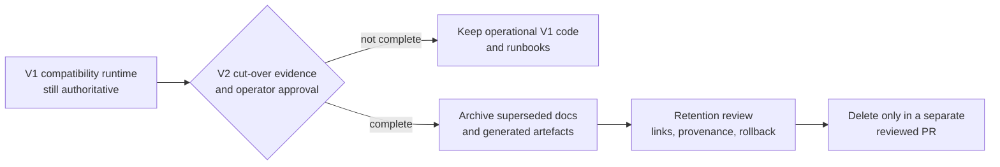

# ELVIS V1 documentation archive

This directory contains historical ELVIS V1 documents that no longer guide
development or operations. They remain in Git for provenance and recovery.

The compatibility paper runtime is still authoritative. Its source code,
deployment files, database baseline and operational runbooks remain outside
this archive until the V2 cut-over, rollback rehearsal and explicit operator
approval are complete. Moving a document here does not disable a runtime.

## Archived in this slice

| Previous path | Archived path | Reason | Current reference |
|---|---|---|---|
| `docs/RELEASE_NOTES.md` | [RELEASE_NOTES.md](RELEASE_NOTES.md) | Historical v0.2.0 release snapshot | [Changelog](../../../CHANGELOG.md) |
| `docs/test_suite_fixes.md` | [test_suite_fixes.md](test_suite_fixes.md) | Historical 2025 test repair report with obsolete counts | [V2 migration roadmap](../../architecture_migration/04-migration-roadmap.md) |
| `docs/bot_architecture_mermaid.md` | [bot_architecture_mermaid.md](bot_architecture_mermaid.md) | Simplified topology superseded by verified architecture | [Compatibility architecture](../../architecture.md) |

One dead credential-copying helper was removed rather than archived:
`scripts/setup_secure_config.sh` contained machine-specific absolute paths,
read plaintext credential files, rewrote `.env`, and patched a nonexistent
`your_bot_script.py`. Git history remains the recovery source.

## Retirement boundary

Graph artefacts: [Mermaid source](../../../diagrams/v1-retirement-boundary.mmd),
[editable Excalidraw](../../../diagrams/v1-retirement-boundary.excalidraw),
[SVG](../../../diagrams/v1-retirement-boundary.svg), and
[PNG](../../../diagrams/v1-retirement-boundary.png).

## Archive policy

1. Archive only an explicit, reviewed allowlist. A search for `V1` or `legacy`
   is unsafe because those names also identify active migration contracts,
   database relations, roles and API versions.
2. Repair every incoming link and every relative link inside a moved document.
3. Keep operational compatibility-runtime material in its current location
   until the V2 authority transition is proven and approved.
4. Treat `deploy/v2/*-v1.example.json` as versioned V2 manifests, not V1 debris.
5. Delete archived material only in a separate reviewed change after retention,
   provenance and rollback needs have been checked.

Git preserves every move. To inspect the history of an archived document, run
`git log --follow -- docs/archive/v1/<name>.md`.
