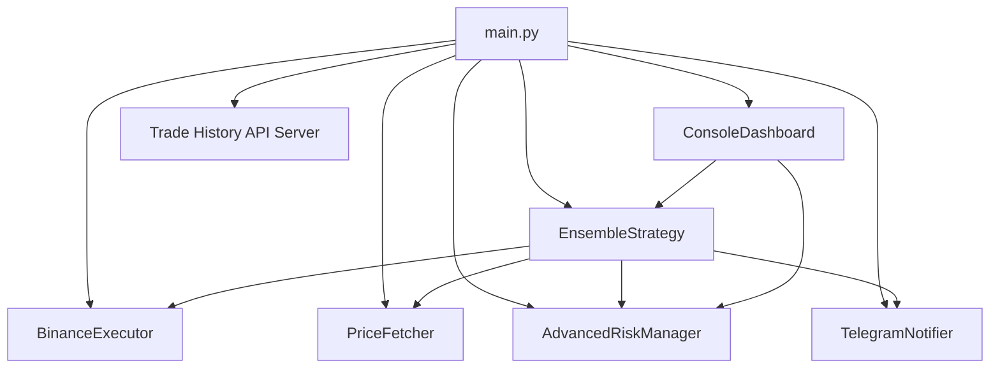
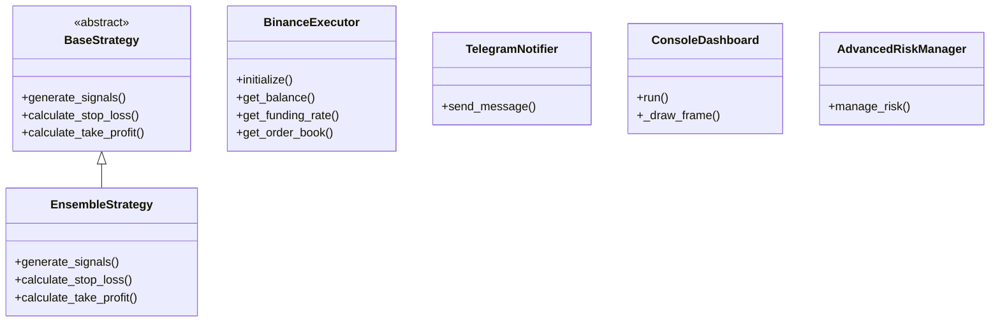

## Executor market-data methods

`BinanceExecutor` exposes two read-only market-data helpers referenced in the
class diagram above.

**How it works**

- `get_funding_rate(symbol)` — in live futures mode it queries the UMFutures
  `funding_rate` endpoint (wrapped with the rate-limit retry) and returns the
  latest entry as `{'symbol', 'fundingRate', 'ts'}`. In paper mode (no client,
  or a spot client) it returns the same shape with `fundingRate: 0.0` and a
  current millisecond `ts`, so it never touches the network.
- `get_order_book(symbol, limit=100)` — in live futures mode it uses the
  UMFutures `depth` endpoint; in live spot mode it uses the spot client's
  `get_order_book`. Both return `{'symbol', 'bids', 'asks', 'timestamp'}`. In
  paper mode (no client) it returns that shape with empty `bids`/`asks`.

The `binance` futures imports are optional and guarded, so both methods (and
their paper-mode fallbacks) work in environments where the futures connector is
not installed.

**How to use**

```python
executor = BinanceExecutor(logger=logger)  # paper mode, no client
funding = executor.get_funding_rate("BTCUSDT")   # {'symbol':.., 'fundingRate':0.0, 'ts':..}
book = executor.get_order_book("BTCUSDT", limit=10)  # {'symbol':.., 'bids':[], 'asks':[], 'timestamp':..}
```
