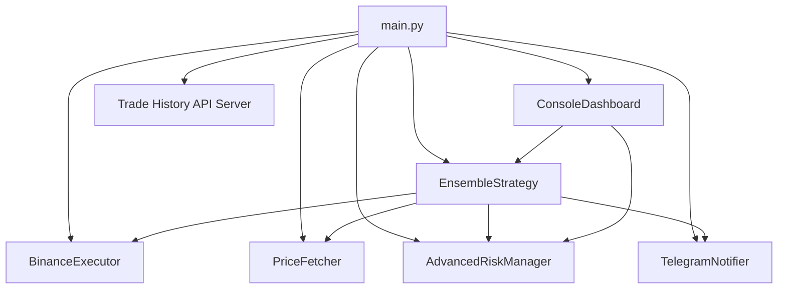

# Bot Architecture Mermaid Diagrams

## Component Interaction Flowchart



## Class Diagram

```mermaid
classDiagram
    class BaseStrategy {
        <<abstract>>
        +generate_signals()
        +calculate_stop_loss()
        +calculate_take_profit()
    }

    class EnsembleStrategy {
        +generate_signals()
        +calculate_stop_loss()
        +calculate_take_profit()
    }

    BaseStrategy <|-- EnsembleStrategy

    class BinanceExecutor {
        +initialize()
        +get_balance()
        +get_funding_rate()
        +get_order_book()
    }

    class TelegramNotifier {
        +send_message()
    }

    class ConsoleDashboard {
        +run()
        +_draw_frame()
    }

    class PriceFetcher {
        +get_price()
        +get_order_book()
    }

    class AdvancedRiskManager {
        +manage_risk()
    }
