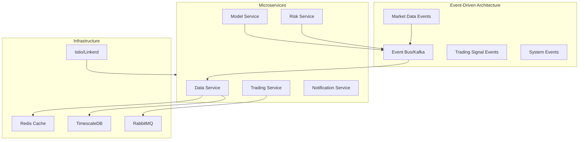
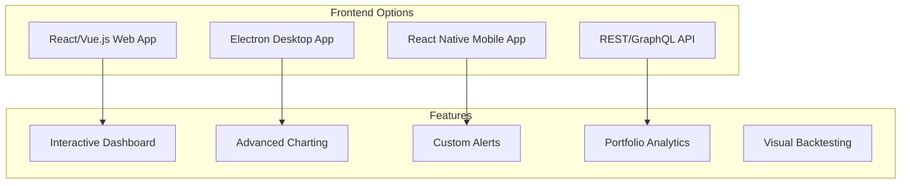

# ELVIS Trading Bot - Comprehensive Improvement Recommendations

## Executive Summary
This document provides a detailed analysis of improvement opportunities for the ELVIS Trading Bot project, covering technical debt, architectural enhancements, and feature additions that would significantly enhance the system's robustness, scalability, and maintainability.

## 1. Testing & Quality Assurance

### Current State
- Limited test coverage with only basic unit tests
- Missing tests for core components (neural network, transformer, ensemble models)
- No integration or end-to-end testing

### Recommendations
```yaml
Testing Strategy:
  Unit Tests:
    - Add tests for all model implementations
    - Test coverage for dashboard, notifier, and API components
    - Mock external dependencies (Binance API, Telegram)
    - Target: >80% code coverage
  
  Integration Tests:
    - Full trading pipeline tests
    - Model training to deployment flow
    - Risk management integration
  
  Performance Tests:
    - Load testing for API endpoints
    - Model inference latency benchmarks
    - Memory usage profiling
  
  Chaos Engineering:
    - Network failure scenarios
    - API rate limit handling
    - Market volatility stress tests
```

## 2. Architecture & Design Patterns

### Current Issues
- Tight coupling between components
- No dependency injection
- Synchronous execution bottlenecks
- Monolithic structure

### Proposed Architecture


### Implementation Steps
1. **Introduce Dependency Injection**
   - Use `dependency-injector` or similar framework
   - Decouple components for better testability
   - Enable easy mocking and configuration

2. **Event-Driven Architecture**
   - Implement event bus (Apache Kafka/RabbitMQ)
   - Async communication between components
   - Better scalability and fault tolerance

3. **Microservices Migration**
   - Start with data service separation
   - Containerize each service
   - Use service mesh for communication

## 3. Machine Learning Operations (MLOps)

### Current Gaps
- No model versioning
- Manual model deployment
- No experiment tracking
- Missing model monitoring

### MLOps Pipeline
```yaml
MLOps Components:
  Experiment Tracking:
    - MLflow/Weights & Biases integration
    - Hyperparameter tracking
    - Model performance comparison
  
  Model Registry:
    - Version control for models
    - Model metadata storage
    - Deployment approval workflow
  
  Model Monitoring:
    - Drift detection (data & concept drift)
    - Performance degradation alerts
    - Automated retraining triggers
  
  Feature Store:
    - Centralized feature management
    - Feature versioning
    - Online/offline serving
```

### Implementation Tools
- **MLflow**: Experiment tracking and model registry
- **Feast**: Feature store
- **Evidently AI**: Model monitoring and drift detection
- **DVC**: Data version control

## 4. Data Engineering

### Current Limitations
- Single data source (Binance)
- No data quality monitoring
- Missing historical data management
- No real-time stream processing

### Enhanced Data Architecture
```mermaid
flowchart LR
    subgraph "Data Sources"
        Binance[Binance API]
        CoinGecko[CoinGecko API]
        NewsAPI[News API]
        SocialMedia[Social Media APIs]
        OnChain[On-chain Data]
    end
    
    subgraph "Data Pipeline"
        Ingestion[Apache Airflow]
        Streaming[Apache Kafka]
        Processing[Apache Spark]
        Quality[Great Expectations]
    end
    
    subgraph "Storage"
        DataLake[S3/MinIO]
        DataWarehouse[Snowflake/BigQuery]
        TimeSeries[TimescaleDB]
        Cache[Redis]
    end
    
    Data Sources --> Ingestion
    Data Sources --> Streaming
    Ingestion --> Processing
    Streaming --> Processing
    Processing --> Quality
    Quality --> Storage
```

### Key Improvements
1. **Multi-Source Data Integration**
   - Additional exchanges (Kraken, Coinbase)
   - On-chain metrics
   - Social sentiment data
   - News and market events

2. **Data Quality Framework**
   - Automated data validation
   - Anomaly detection
   - Data lineage tracking
   - Schema evolution management

3. **Real-time Processing**
   - Stream processing with Kafka Streams
   - Low-latency feature engineering
   - Real-time aggregations

## 5. Security Enhancements

### Security Vulnerabilities
- API keys in configuration files
- No encryption for sensitive data
- Missing authentication/authorization
- No audit logging

### Security Implementation
```yaml
Security Measures:
  Secrets Management:
    - HashiCorp Vault integration
    - Environment-specific encryption
    - Automated key rotation
  
  Authentication & Authorization:
    - OAuth2/JWT implementation
    - Role-based access control (RBAC)
    - API key management
  
  Data Protection:
    - Encryption at rest (AES-256)
    - TLS for all communications
    - Database encryption
  
  Audit & Compliance:
    - Comprehensive audit logging
    - GDPR compliance for user data
    - Security scanning in CI/CD
```

## 6. Infrastructure & DevOps

### Current State
- No containerization
- Manual deployment
- Limited monitoring
- No infrastructure as code

### Modern Infrastructure
```yaml
Infrastructure Components:
  Containerization:
    - Docker for all services
    - Docker Compose for local development
    - Kubernetes for production
  
  CI/CD Pipeline:
    - GitHub Actions/GitLab CI
    - Automated testing
    - Blue-green deployments
    - Rollback capabilities
  
  Monitoring Stack:
    - Prometheus + Grafana
    - ELK Stack for logs
    - Jaeger for distributed tracing
    - PagerDuty for alerting
  
  Infrastructure as Code:
    - Terraform for cloud resources
    - Helm charts for Kubernetes
    - Ansible for configuration
```

## 7. Performance Optimization

### Performance Bottlenecks
- Synchronous API calls
- No caching strategy
- Single-threaded execution
- Missing connection pooling

### Optimization Strategy
```python
# Example: Async execution pattern
import asyncio
from concurrent.futures import ThreadPoolExecutor
import aioredis

class OptimizedTradingEngine:
    def __init__(self):
        self.redis_pool = aioredis.create_pool('redis://localhost')
        self.executor = ThreadPoolExecutor(max_workers=10)
    
    async def fetch_market_data(self, symbols):
        """Parallel market data fetching with caching"""
        tasks = []
        for symbol in symbols:
            task = self._fetch_with_cache(symbol)
            tasks.append(task)
        return await asyncio.gather(*tasks)
    
    async def _fetch_with_cache(self, symbol):
        # Check cache first
        cached = await self.redis_pool.get(f"price:{symbol}")
        if cached:
            return json.loads(cached)
        
        # Fetch from API
        data = await self._fetch_from_api(symbol)
        
        # Cache with TTL
        await self.redis_pool.setex(
            f"price:{symbol}", 
            60,  # 1 minute TTL
            json.dumps(data)
        )
        return data
```

### Key Optimizations
1. **Caching Strategy**
   - Redis for hot data
   - Multi-level caching
   - Cache invalidation policies

2. **Async Processing**
   - AsyncIO for I/O operations
   - Parallel model inference
   - Non-blocking API calls

3. **Database Optimization**
   - Connection pooling
   - Query optimization
   - Proper indexing

## 8. User Experience

### Current Limitations
- Terminal-only interface
- Limited customization
- No mobile support
- Basic visualization

### Modern UI/UX


### Implementation Roadmap
1. **Web Dashboard**
   - React with Material-UI
   - Real-time WebSocket updates
   - Interactive charts (TradingView)
   - Responsive design

2. **Mobile Application**
   - React Native cross-platform
   - Push notifications
   - Biometric authentication
   - Offline capabilities

3. **API Development**
   - RESTful API with OpenAPI spec
   - GraphQL for flexible queries
   - WebSocket for real-time data
   - Rate limiting and throttling

## 9. Advanced Trading Features

### Missing Capabilities
- Limited order types
- No portfolio management
- Basic risk models
- Single exchange support

### Enhanced Trading Features
```yaml
Trading Enhancements:
  Order Management:
    - OCO (One-Cancels-Other) orders
    - Iceberg orders
    - Time-weighted average price (TWAP)
    - Volume-weighted average price (VWAP)
  
  Portfolio Management:
    - Multi-asset allocation
    - Rebalancing strategies
    - Risk parity approach
    - Kelly criterion sizing
  
  Risk Management:
    - Value at Risk (VaR) models
    - Conditional VaR (CVaR)
    - Monte Carlo simulations
    - Stress testing framework
  
  Market Making:
    - Spread trading
    - Arbitrage detection
    - Liquidity provision
    - Order book analysis
```

### Kelly Criterion Sizing (implemented)

The "Kelly criterion sizing" item above is now implemented as an opt-in
sizing helper in `trading/risk_management.py`.

**How it works**

The core is the pure function `kelly_fraction(win_rate, payoff_ratio,
cap=0.2)`, which applies the standard Kelly formula:

```
f* = W - (1 - W) / R
```

where `W` is the win probability (in `[0, 1]`) and `R` is the payoff ratio
(average win / average loss). The result is clamped to `[0, cap]`:

- Negative edges floor to `0` (skip the trade rather than size negative).
- The `cap` (default `0.2`) enforces *fractional Kelly* so a single trade
  never risks more than the configured share of capital.

Examples: `W=0.6, R=2 -> 0.4`; `W=0.4, R=1 -> 0` (floored); `W=0.9, R=5`
raw `0.88` but returns `0.2` at the default cap.

**How to use**

`RiskManager.calculate_kelly_position_size(...)` wires the fraction into a
BTC quantity. It is *not* the default path — `calculate_dynamic_position_size`
remains the built-in sizer; call the Kelly method explicitly when you want
edge-based sizing:

```python
from trading.risk_management import RiskManager, kelly_fraction

# Standalone fraction
f = kelly_fraction(win_rate=0.6, payoff_ratio=2.0)  # -> 0.2 (default cap)

# Full position size (BTC), leverage- and price-aware.
# win_rate defaults to the manager's tracked self.win_rate when omitted.
size = risk_manager.calculate_kelly_position_size(
    available_capital=1000.0,
    current_price=65000.0,
    payoff_ratio=2.0,
    win_rate=0.6,   # optional
    leverage=50.0,  # subject to enforce_minimum_leverage
    cap=0.2,
)
```

Invalid inputs (`win_rate` outside `[0, 1]`, non-positive `payoff_ratio`,
negative `cap`, or non-positive `current_price`) raise `ValueError`.

## 10. Backtesting Framework

### Current Gap
No comprehensive backtesting capability

### Backtesting Architecture
```python
class BacktestingEngine:
    """
    Comprehensive backtesting framework with:
    - Historical data replay
    - Realistic order execution
    - Slippage and fees modeling
    - Performance analytics
    """
    
    def __init__(self, strategy, data_source):
        self.strategy = strategy
        self.data_source = data_source
        self.performance_tracker = PerformanceTracker()
    
    def run_backtest(self, start_date, end_date, initial_capital):
        """Run backtest with realistic constraints"""
        # Implementation with:
        # - Order book simulation
        # - Market impact modeling
        # - Transaction costs
        # - Portfolio tracking
        pass
    
    def generate_report(self):
        """Generate comprehensive backtest report"""
        return {
            'returns': self.calculate_returns(),
            'sharpe_ratio': self.calculate_sharpe(),
            'max_drawdown': self.calculate_drawdown(),
            'win_rate': self.calculate_win_rate(),
            'profit_factor': self.calculate_profit_factor()
        }
```

## Implementation Priority Matrix

| Feature | Impact | Effort | Priority |
|---------|--------|--------|----------|
| Testing Framework | High | Medium | 1 |
| Security Enhancements | High | Medium | 1 |
| Containerization | High | Low | 1 |
| MLOps Pipeline | High | High | 2 |
| Caching Layer | High | Low | 2 |
| Web Dashboard | Medium | High | 2 |
| Multi-Exchange Support | Medium | Medium | 3 |
| Advanced Risk Models | Medium | High | 3 |
| Mobile App | Low | High | 4 |
| Microservices | Medium | Very High | 4 |

## Conclusion

These improvements would transform ELVIS from a functional trading bot into a professional-grade trading platform. The key is to implement changes incrementally, starting with high-impact, low-effort improvements while maintaining system stability.

### Next Steps
1. Create detailed technical specifications for each improvement
2. Set up a proper project roadmap with milestones
3. Establish metrics to measure improvement impact
4. Begin with testing and security enhancements
5. Gradually introduce architectural improvements

---
*This document should be reviewed quarterly and updated based on project progress and changing requirements.*
