# ELVIS Trading System - Data Processing Documentation

## Overview

This document provides comprehensive documentation of the data processing pipeline in the ELVIS trading system. It covers data acquisition, cleaning, feature engineering, technical indicators, and data transformation processes that feed into the machine learning models and trading strategies.

---

## Data Processing Architecture

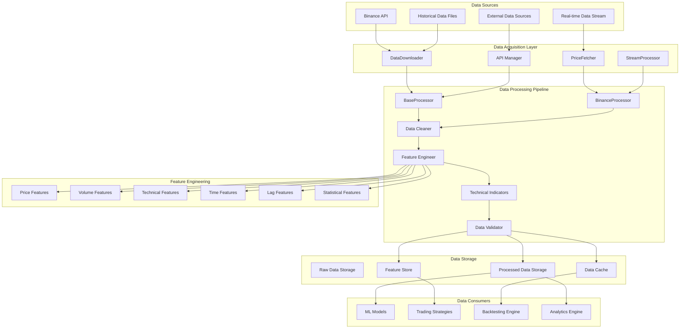
```mermaid
graph TB
    subgraph "Data Sources"
        BinanceAPI[Binance API]
        HistoricalData[Historical Data Files]
        RealTimeStream[Real-time Data Stream]
        ExternalData[External Data Sources]
    end
    
    subgraph "Data Acquisition Layer"
        DataDownloader[DataDownloader]
        PriceFetcher[PriceFetcher]
        StreamProcessor[StreamProcessor]
        APIManager[API Manager]
    end
    
    subgraph "Data Processing Pipeline"
        BaseProcessor[BaseProcessor]
        BinanceProcessor[BinanceProcessor]
        DataCleaner[Data Cleaner]
        FeatureEngineer[Feature Engineer]
        TechnicalIndicators[Technical Indicators]
        DataValidator[Data Validator]
    end
    
    subgraph "Feature Engineering"
        PriceFeatures[Price Features]
        VolumeFeatures[Volume Features]
        TechnicalFeatures[Technical Features]
        TimeFeatures[Time Features]
        LagFeatures[Lag Features]
        StatisticalFeatures[Statistical Features]
    end
    
    subgraph "Data Storage"
        RawData[Raw Data Storage]
        ProcessedData[Processed Data Storage]
        FeatureStore[Feature Store]
        Cache[Data Cache]
    end
    
    subgraph "Data Consumers"
        MLModels[ML Models]
        TradingStrategies[Trading Strategies]
        BacktestingEngine[Backtesting Engine]
        Analytics[Analytics Engine]
    end
    
    BinanceAPI --> DataDownloader
    HistoricalData --> DataDownloader
    RealTimeStream --> PriceFetcher
    ExternalData --> APIManager
    
    DataDownloader --> BaseProcessor
    PriceFetcher --> BinanceProcessor
    StreamProcessor --> BinanceProcessor
    APIManager --> BaseProcessor
    
    BaseProcessor --> DataCleaner
    BinanceProcessor --> DataCleaner
    DataCleaner --> FeatureEngineer
    FeatureEngineer --> TechnicalIndicators
    TechnicalIndicators --> DataValidator
    
    FeatureEngineer --> PriceFeatures
    FeatureEngineer --> VolumeFeatures
    FeatureEngineer --> TechnicalFeatures
    FeatureEngineer --> TimeFeatures
    FeatureEngineer --> LagFeatures
    FeatureEngineer --> StatisticalFeatures
    
    DataValidator --> ProcessedData
    DataValidator --> FeatureStore
    DataValidator --> Cache
    
    ProcessedData --> MLModels
    FeatureStore --> TradingStrategies
    Cache --> BacktestingEngine
    ProcessedData --> Analytics
```

---

## Core Data Processing Components

### 1. Base Processor Interface

The foundation for all data processors:

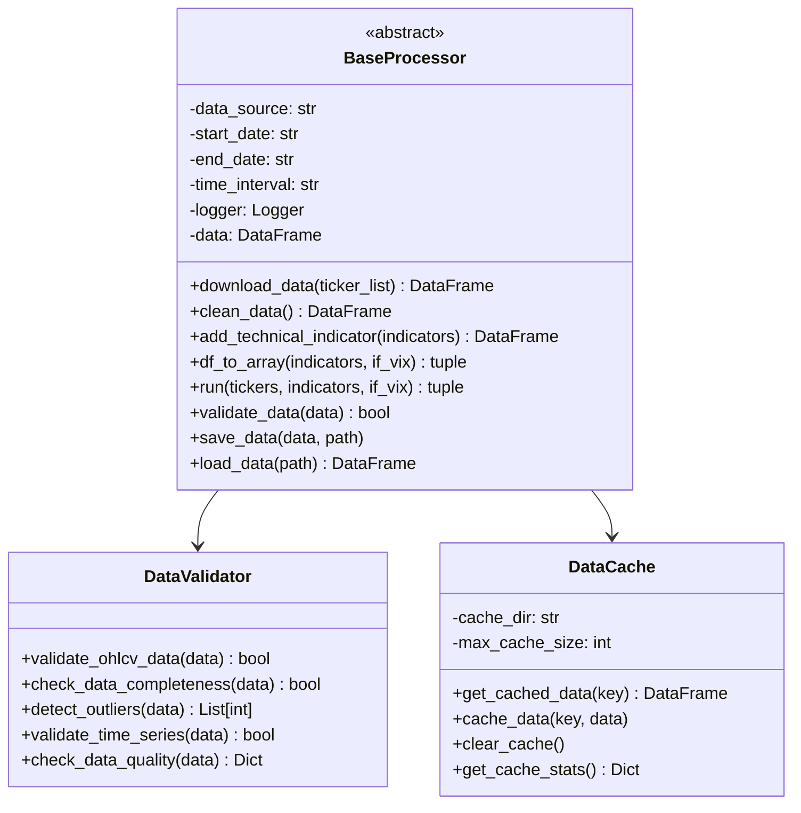
```mermaid
classDiagram
    class BaseProcessor {
        <<abstract>>
        -data_source: str
        -start_date: str
        -end_date: str
        -time_interval: str
        -logger: Logger
        -data: DataFrame
        +download_data(ticker_list) DataFrame
        +clean_data() DataFrame
        +add_technical_indicator(indicators) DataFrame
        +df_to_array(indicators, if_vix) tuple
        +run(tickers, indicators, if_vix) tuple
        +validate_data(data) bool
        +save_data(data, path)
        +load_data(path) DataFrame
    }
    
    class DataValidator {
        +validate_ohlcv_data(data) bool
        +check_data_completeness(data) bool
        +detect_outliers(data) List[int]
        +validate_time_series(data) bool
        +check_data_quality(data) Dict
    }
    
    class DataCache {
        -cache_dir: str
        -max_cache_size: int
        +get_cached_data(key) DataFrame
        +cache_data(key, data)
        +clear_cache()
        +get_cache_stats() Dict
    }
    
    BaseProcessor --> DataValidator
    BaseProcessor --> DataCache
```

### 2. Binance Data Processor

Specialized processor for Binance exchange data:

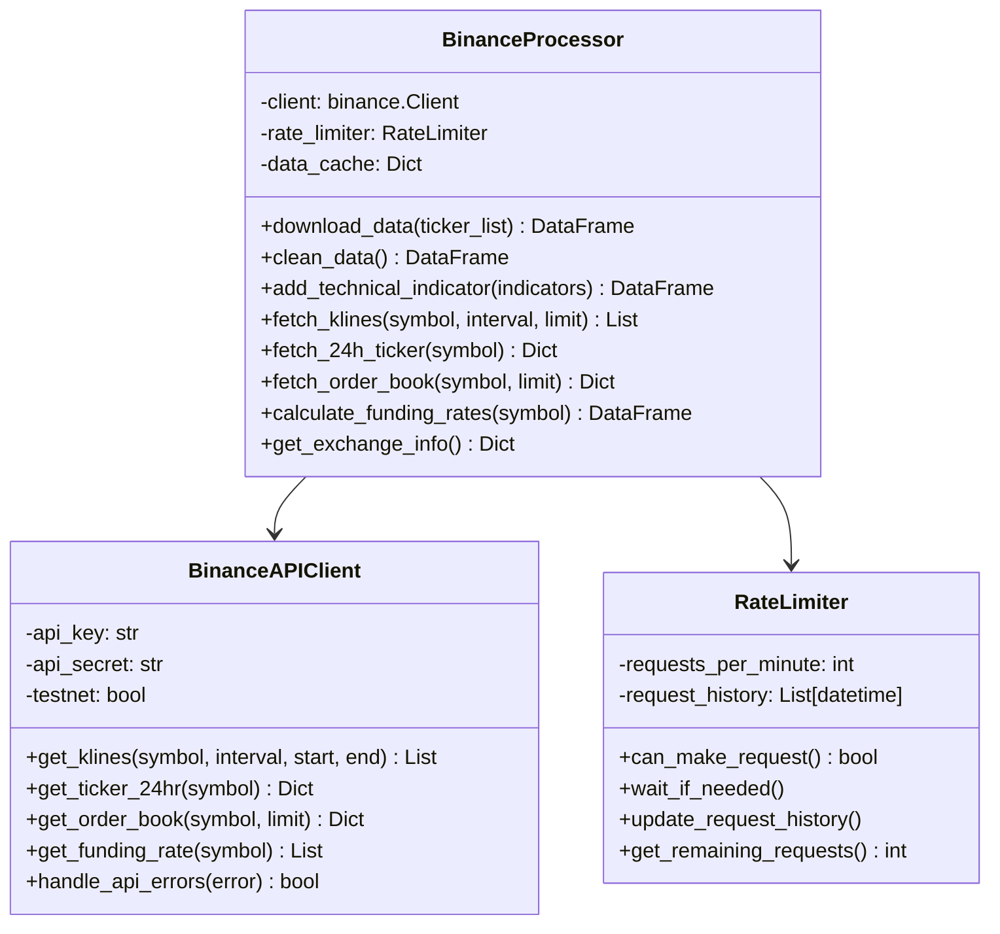
```mermaid
classDiagram
    class BinanceProcessor {
        -client: binance.Client
        -rate_limiter: RateLimiter
        -data_cache: Dict
        +download_data(ticker_list) DataFrame
        +clean_data() DataFrame
        +add_technical_indicator(indicators) DataFrame
        +fetch_klines(symbol, interval, limit) List
        +fetch_24h_ticker(symbol) Dict
        +fetch_order_book(symbol, limit) Dict
        +calculate_funding_rates(symbol) DataFrame
        +get_exchange_info() Dict
    }
    
    class BinanceAPIClient {
        -api_key: str
        -api_secret: str
        -testnet: bool
        +get_klines(symbol, interval, start, end) List
        +get_ticker_24hr(symbol) Dict
        +get_order_book(symbol, limit) Dict
        +get_funding_rate(symbol) List
        +handle_api_errors(error) bool
    }
    
    class RateLimiter {
        -requests_per_minute: int
        -request_history: List[datetime]
        +can_make_request() bool
        +wait_if_needed()
        +update_request_history()
        +get_remaining_requests() int
    }
    
    BinanceProcessor --> BinanceAPIClient
    BinanceProcessor --> RateLimiter
```

### 3. Data Downloader

Handles bulk data acquisition and storage:

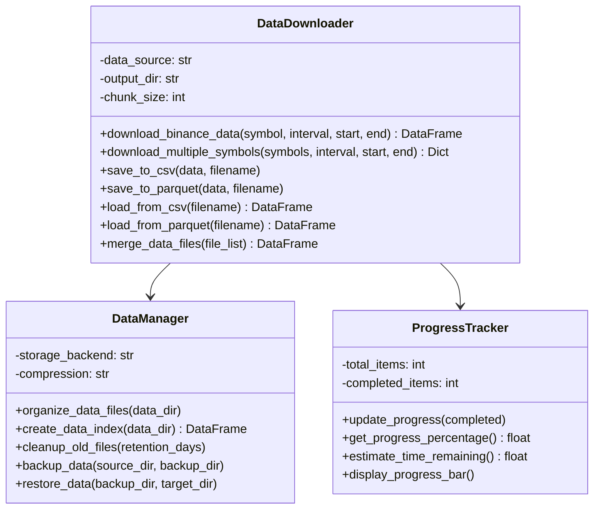
```mermaid
classDiagram
    class DataDownloader {
        -data_source: str
        -output_dir: str
        -chunk_size: int
        +download_binance_data(symbol, interval, start, end) DataFrame
        +download_multiple_symbols(symbols, interval, start, end) Dict
        +save_to_csv(data, filename)
        +save_to_parquet(data, filename)
        +load_from_csv(filename) DataFrame
        +load_from_parquet(filename) DataFrame
        +merge_data_files(file_list) DataFrame
    }
    
    class DataManager {
        -storage_backend: str
        -compression: str
        +organize_data_files(data_dir)
        +create_data_index(data_dir) DataFrame
        +cleanup_old_files(retention_days)
        +backup_data(source_dir, backup_dir)
        +restore_data(backup_dir, target_dir)
    }
    
    class ProgressTracker {
        -total_items: int
        -completed_items: int
        +update_progress(completed)
        +get_progress_percentage() float
        +estimate_time_remaining() float
        +display_progress_bar()
    }
    
    DataDownloader --> DataManager
    DataDownloader --> ProgressTracker
```

---

## Feature Engineering Pipeline

### 1. Feature Engineering Framework

Comprehensive feature creation and management:

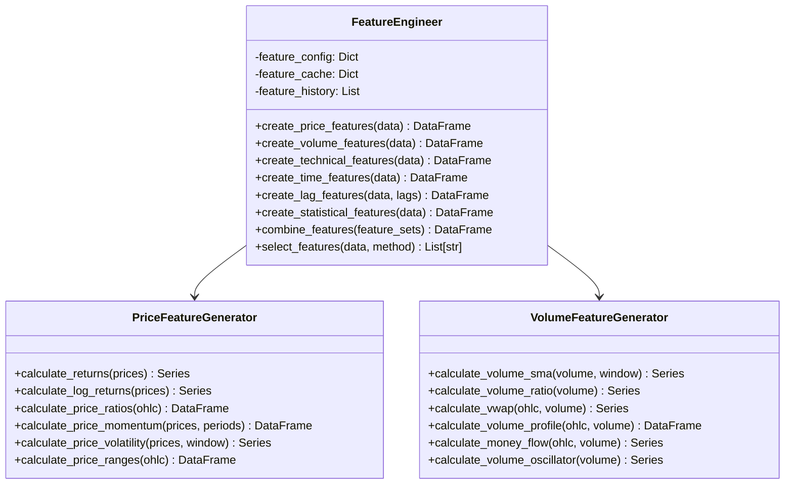
```mermaid
classDiagram
    class FeatureEngineer {
        -feature_config: Dict
        -feature_cache: Dict
        -feature_history: List
        +create_price_features(data) DataFrame
        +create_volume_features(data) DataFrame
        +create_technical_features(data) DataFrame
        +create_time_features(data) DataFrame
        +create_lag_features(data, lags) DataFrame
        +create_statistical_features(data) DataFrame
        +combine_features(feature_sets) DataFrame
        +select_features(data, method) List[str]
    }
    
    class PriceFeatureGenerator {
        +calculate_returns(prices) Series
        +calculate_log_returns(prices) Series
        +calculate_price_ratios(ohlc) DataFrame
        +calculate_price_momentum(prices, periods) DataFrame
        +calculate_price_volatility(prices, window) Series
        +calculate_price_ranges(ohlc) DataFrame
    }
    
    class VolumeFeatureGenerator {
        +calculate_volume_sma(volume, window) Series
        +calculate_volume_ratio(volume) Series
        +calculate_vwap(ohlc, volume) Series
        +calculate_volume_profile(ohlc, volume) DataFrame
        +calculate_money_flow(ohlc, volume) Series
        +calculate_volume_oscillator(volume) Series
    }
    
    FeatureEngineer --> PriceFeatureGenerator
    FeatureEngineer --> VolumeFeatureGenerator
```

### 2. Technical Indicators Engine

Comprehensive technical analysis indicators:

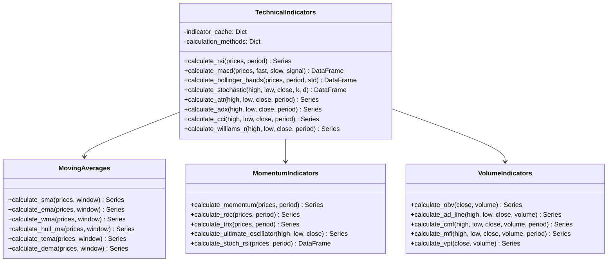
```mermaid
classDiagram
    class TechnicalIndicators {
        -indicator_cache: Dict
        -calculation_methods: Dict
        +calculate_rsi(prices, period) Series
        +calculate_macd(prices, fast, slow, signal) DataFrame
        +calculate_bollinger_bands(prices, period, std) DataFrame
        +calculate_stochastic(high, low, close, k, d) DataFrame
        +calculate_atr(high, low, close, period) Series
        +calculate_adx(high, low, close, period) Series
        +calculate_cci(high, low, close, period) Series
        +calculate_williams_r(high, low, close, period) Series
    }
    
    class MovingAverages {
        +calculate_sma(prices, window) Series
        +calculate_ema(prices, window) Series
        +calculate_wma(prices, window) Series
        +calculate_hull_ma(prices, window) Series
        +calculate_tema(prices, window) Series
        +calculate_dema(prices, window) Series
    }
    
    class MomentumIndicators {
        +calculate_momentum(prices, period) Series
        +calculate_roc(prices, period) Series
        +calculate_trix(prices, period) Series
        +calculate_ultimate_oscillator(high, low, close) Series
        +calculate_stoch_rsi(prices, period) DataFrame
    }
    
    class VolumeIndicators {
        +calculate_obv(close, volume) Series
        +calculate_ad_line(high, low, close, volume) Series
        +calculate_cmf(high, low, close, volume, period) Series
        +calculate_mfi(high, low, close, volume, period) Series
        +calculate_vpt(close, volume) Series
    }
    
    TechnicalIndicators --> MovingAverages
    TechnicalIndicators --> MomentumIndicators
    TechnicalIndicators --> VolumeIndicators
```

### 3. Statistical Features

Advanced statistical feature extraction:

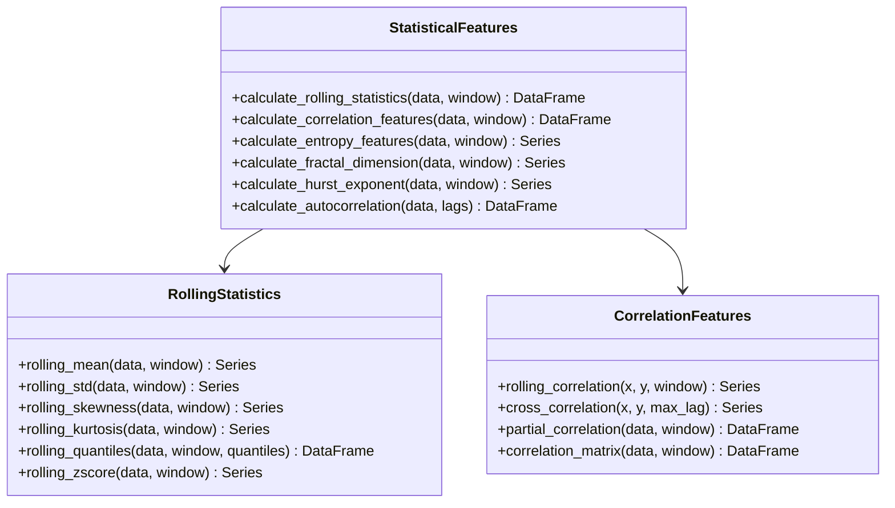
```mermaid
classDiagram
    class StatisticalFeatures {
        +calculate_rolling_statistics(data, window) DataFrame
        +calculate_correlation_features(data, window) DataFrame
        +calculate_entropy_features(data, window) Series
        +calculate_fractal_dimension(data, window) Series
        +calculate_hurst_exponent(data, window) Series
        +calculate_autocorrelation(data, lags) DataFrame
    }
    
    class RollingStatistics {
        +rolling_mean(data, window) Series
        +rolling_std(data, window) Series
        +rolling_skewness(data, window) Series
        +rolling_kurtosis(data, window) Series
        +rolling_quantiles(data, window, quantiles) DataFrame
        +rolling_zscore(data, window) Series
    }
    
    class CorrelationFeatures {
        +rolling_correlation(x, y, window) Series
        +cross_correlation(x, y, max_lag) Series
        +partial_correlation(data, window) DataFrame
        +correlation_matrix(data, window) DataFrame
    }
    
    StatisticalFeatures --> RollingStatistics
    StatisticalFeatures --> CorrelationFeatures
```

---

## Data Processing Workflow

### Complete Data Pipeline

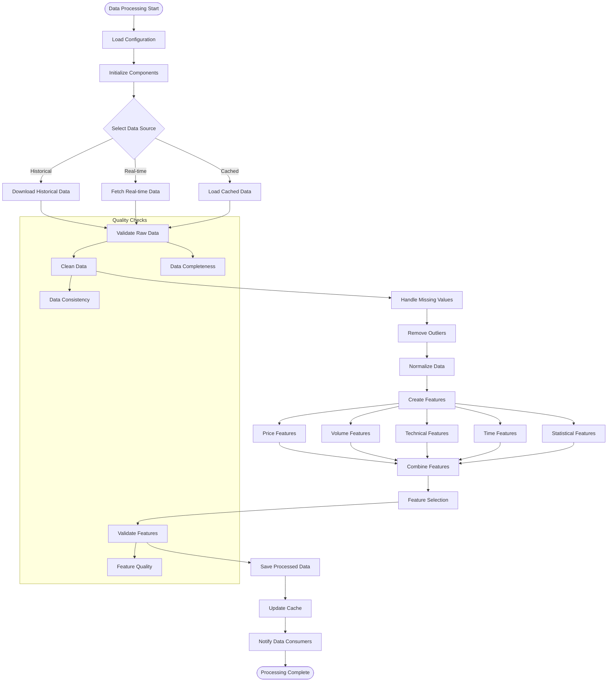
```mermaid
flowchart TD
    Start([Data Processing Start]) --> ConfigLoad[Load Configuration]
    ConfigLoad --> InitComponents[Initialize Components]
    InitComponents --> DataSource{Select Data Source}
    
    DataSource --> |Historical| DownloadHistorical[Download Historical Data]
    DataSource --> |Real-time| FetchRealTime[Fetch Real-time Data]
    DataSource --> |Cached| LoadCached[Load Cached Data]
    
    DownloadHistorical --> ValidateRaw[Validate Raw Data]
    FetchRealTime --> ValidateRaw
    LoadCached --> ValidateRaw
    
    ValidateRaw --> CleanData[Clean Data]
    CleanData --> HandleMissing[Handle Missing Values]
    HandleMissing --> RemoveOutliers[Remove Outliers]
    RemoveOutliers --> NormalizeData[Normalize Data]
    
    NormalizeData --> CreateFeatures[Create Features]
    CreateFeatures --> PriceFeats[Price Features]
    CreateFeatures --> VolumeFeats[Volume Features]
    CreateFeatures --> TechFeats[Technical Features]
    CreateFeatures --> TimeFeats[Time Features]
    CreateFeatures --> StatFeats[Statistical Features]
    
    PriceFeats --> CombineFeatures[Combine Features]
    VolumeFeats --> CombineFeatures
    TechFeats --> CombineFeatures
    TimeFeats --> CombineFeatures
    StatFeats --> CombineFeatures
    
    CombineFeatures --> SelectFeatures[Feature Selection]
    SelectFeatures --> ValidateFeatures[Validate Features]
    ValidateFeatures --> SaveProcessed[Save Processed Data]
    
    SaveProcessed --> UpdateCache[Update Cache]
    UpdateCache --> NotifyConsumers[Notify Data Consumers]
    NotifyConsumers --> End([Processing Complete])
    
    subgraph "Quality Checks"
        ValidateRaw --> QualityCheck1[Data Completeness]
        CleanData --> QualityCheck2[Data Consistency]
        ValidateFeatures --> QualityCheck3[Feature Quality]
    end
```

### Real-time Data Processing

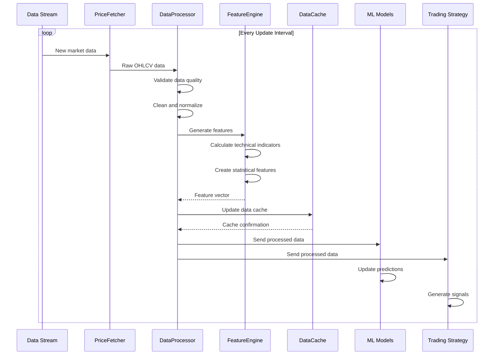
```mermaid
sequenceDiagram
    participant Stream as Data Stream
    participant Fetcher as PriceFetcher
    participant Processor as DataProcessor
    participant Features as FeatureEngine
    participant Cache as DataCache
    participant Models as ML Models
    participant Strategy as Trading Strategy
    
    loop Every Update Interval
        Stream->>Fetcher: New market data
        Fetcher->>Processor: Raw OHLCV data
        
        Processor->>Processor: Validate data quality
        Processor->>Processor: Clean and normalize
        
        Processor->>Features: Generate features
        Features->>Features: Calculate technical indicators
        Features->>Features: Create statistical features
        Features-->>Processor: Feature vector
        
        Processor->>Cache: Update data cache
        Cache-->>Processor: Cache confirmation
        
        Processor->>Models: Send processed data
        Processor->>Strategy: Send processed data
        
        Models->>Models: Update predictions
        Strategy->>Strategy: Generate signals
    end
```

---

## Data Quality Management

### Data Validation Framework

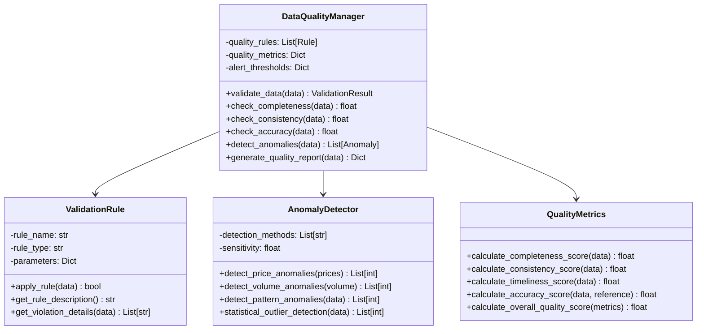
```mermaid
classDiagram
    class DataQualityManager {
        -quality_rules: List[Rule]
        -quality_metrics: Dict
        -alert_thresholds: Dict
        +validate_data(data) ValidationResult
        +check_completeness(data) float
        +check_consistency(data) float
        +check_accuracy(data) float
        +detect_anomalies(data) List[Anomaly]
        +generate_quality_report(data) Dict
    }
    
    class ValidationRule {
        -rule_name: str
        -rule_type: str
        -parameters: Dict
        +apply_rule(data) bool
        +get_rule_description() str
        +get_violation_details(data) List[str]
    }
    
    class AnomalyDetector {
        -detection_methods: List[str]
        -sensitivity: float
        +detect_price_anomalies(prices) List[int]
        +detect_volume_anomalies(volume) List[int]
        +detect_pattern_anomalies(data) List[int]
        +statistical_outlier_detection(data) List[int]
    }
    
    class QualityMetrics {
        +calculate_completeness_score(data) float
        +calculate_consistency_score(data) float
        +calculate_timeliness_score(data) float
        +calculate_accuracy_score(data, reference) float
        +calculate_overall_quality_score(metrics) float
    }
    
    DataQualityManager --> ValidationRule
    DataQualityManager --> AnomalyDetector
    DataQualityManager --> QualityMetrics
```

### Data Cleaning Pipeline

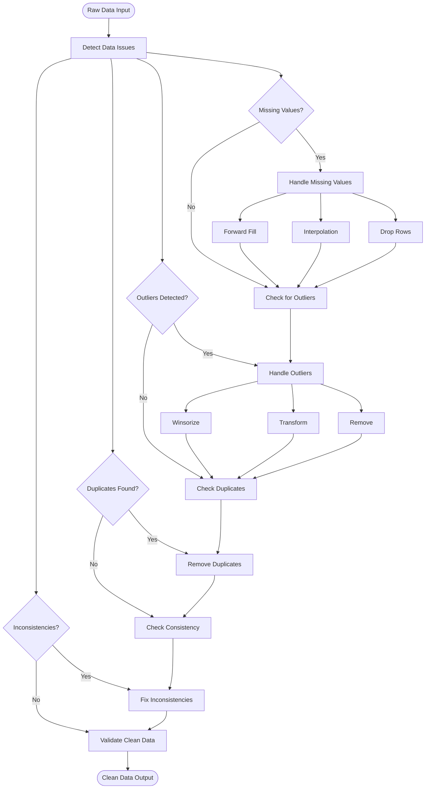
```mermaid
flowchart TD
    RawData([Raw Data Input]) --> DetectIssues[Detect Data Issues]
    DetectIssues --> MissingValues{Missing Values?}
    DetectIssues --> Outliers{Outliers Detected?}
    DetectIssues --> Duplicates{Duplicates Found?}
    DetectIssues --> Inconsistencies{Inconsistencies?}
    
    MissingValues --> |Yes| HandleMissing[Handle Missing Values]
    MissingValues --> |No| CheckOutliers[Check for Outliers]
    
    HandleMissing --> ForwardFill[Forward Fill]
    HandleMissing --> Interpolation[Interpolation]
    HandleMissing --> DropRows[Drop Rows]
    
    ForwardFill --> CheckOutliers
    Interpolation --> CheckOutliers
    DropRows --> CheckOutliers
    
    Outliers --> |Yes| HandleOutliers[Handle Outliers]
    Outliers --> |No| CheckDuplicates[Check Duplicates]
    CheckOutliers --> HandleOutliers
    
    HandleOutliers --> Winsorize[Winsorize]
    HandleOutliers --> Transform[Transform]
    HandleOutliers --> Remove[Remove]
    
    Winsorize --> CheckDuplicates
    Transform --> CheckDuplicates
    Remove --> CheckDuplicates
    
    Duplicates --> |Yes| RemoveDuplicates[Remove Duplicates]
    Duplicates --> |No| CheckConsistency[Check Consistency]
    CheckDuplicates --> RemoveDuplicates
    
    RemoveDuplicates --> CheckConsistency
    
    Inconsistencies --> |Yes| FixInconsistencies[Fix Inconsistencies]
    Inconsistencies --> |No| ValidateClean[Validate Clean Data]
    CheckConsistency --> FixInconsistencies
    
    FixInconsistencies --> ValidateClean
    ValidateClean --> CleanData([Clean Data Output])
```

---

## Feature Store Architecture

### Feature Management System

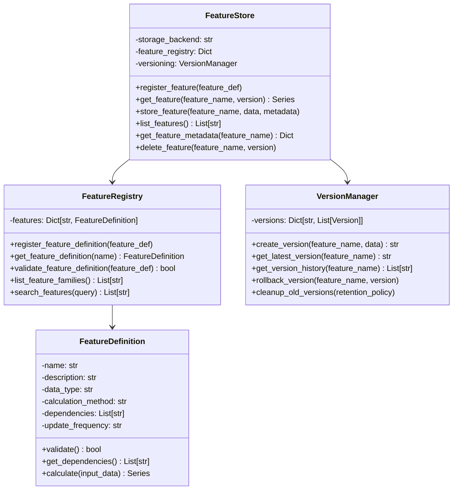
```mermaid
classDiagram
    class FeatureStore {
        -storage_backend: str
        -feature_registry: Dict
        -versioning: VersionManager
        +register_feature(feature_def)
        +get_feature(feature_name, version) Series
        +store_feature(feature_name, data, metadata)
        +list_features() List[str]
        +get_feature_metadata(feature_name) Dict
        +delete_feature(feature_name, version)
    }
    
    class FeatureRegistry {
        -features: Dict[str, FeatureDefinition]
        +register_feature_definition(feature_def)
        +get_feature_definition(name) FeatureDefinition
        +validate_feature_definition(feature_def) bool
        +list_feature_families() List[str]
        +search_features(query) List[str]
    }
    
    class FeatureDefinition {
        -name: str
        -description: str
        -data_type: str
        -calculation_method: str
        -dependencies: List[str]
        -update_frequency: str
        +validate() bool
        +get_dependencies() List[str]
        +calculate(input_data) Series
    }
    
    class VersionManager {
        -versions: Dict[str, List[Version]]
        +create_version(feature_name, data) str
        +get_latest_version(feature_name) str
        +get_version_history(feature_name) List[str]
        +rollback_version(feature_name, version)
        +cleanup_old_versions(retention_policy)
    }
    
    FeatureStore --> FeatureRegistry
    FeatureStore --> VersionManager
    FeatureRegistry --> FeatureDefinition
```

### Feature Pipeline Orchestration

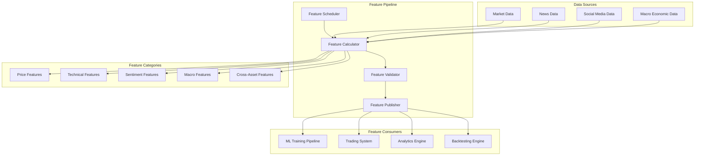
```mermaid
graph TB
    subgraph "Feature Pipeline"
        Scheduler[Feature Scheduler]
        Calculator[Feature Calculator]
        Validator[Feature Validator]
        Publisher[Feature Publisher]
    end
    
    subgraph "Data Sources"
        MarketData[Market Data]
        NewsData[News Data]
        SocialData[Social Media Data]
        MacroData[Macro Economic Data]
    end
    
    subgraph "Feature Categories"
        PriceFeats[Price Features]
        TechFeats[Technical Features]
        SentimentFeats[Sentiment Features]
        MacroFeats[Macro Features]
        CrossFeats[Cross-Asset Features]
    end
    
    subgraph "Feature Consumers"
        MLPipeline[ML Training Pipeline]
        TradingSystem[Trading System]
        Analytics[Analytics Engine]
        Backtesting[Backtesting Engine]
    end
    
    Scheduler --> Calculator
    Calculator --> Validator
    Validator --> Publisher
    
    MarketData --> Calculator
    NewsData --> Calculator
    SocialData --> Calculator
    MacroData --> Calculator
    
    Calculator --> PriceFeats
    Calculator --> TechFeats
    Calculator --> SentimentFeats
    Calculator --> MacroFeats
    Calculator --> CrossFeats
    
    Publisher --> MLPipeline
    Publisher --> TradingSystem
    Publisher --> Analytics
    Publisher --> Backtesting
```

---

## Performance Optimization

### Data Processing Optimization

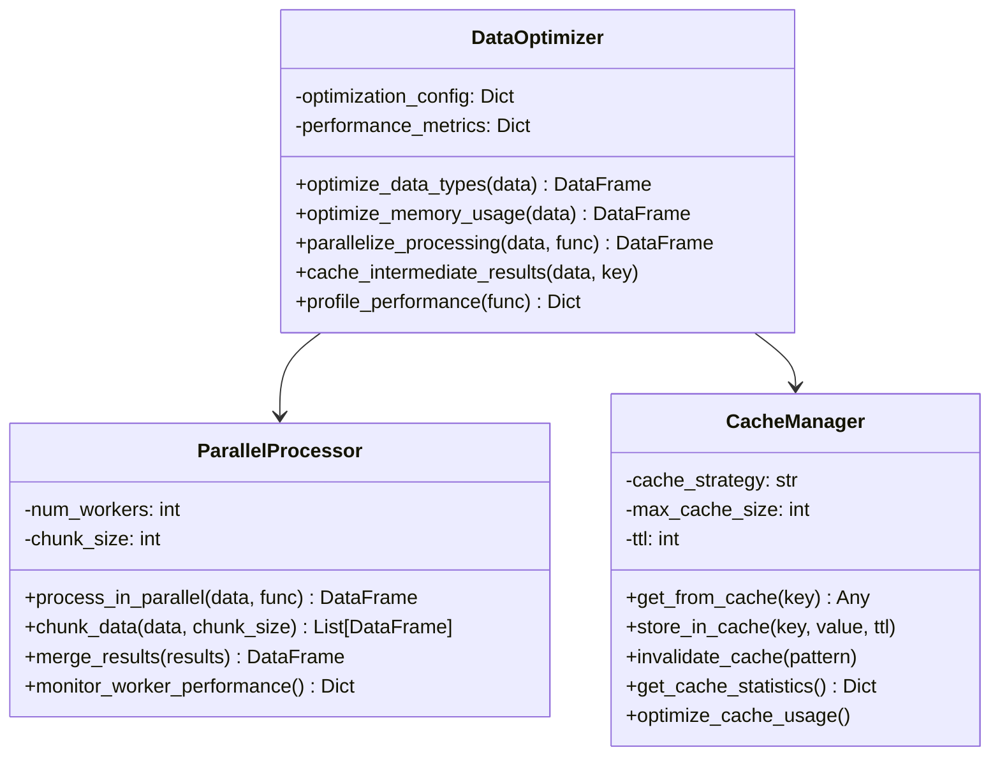
```mermaid
classDiagram
    class DataOptimizer {
        -optimization_config: Dict
        -performance_metrics: Dict
        +optimize_data_types(data) DataFrame
        +optimize_memory_usage(data) DataFrame
        +parallelize_processing(data, func) DataFrame
        +cache_intermediate_results(data, key)
        +profile_performance(func) Dict
    }
    
    class ParallelProcessor {
        -num_workers: int
        -chunk_size: int
        +process_in_parallel(data, func) DataFrame
        +chunk_data(data, chunk_size) List[DataFrame]
        +merge_results(results) DataFrame
        +monitor_worker_performance() Dict
    }
    
    class CacheManager {
        -cache_strategy: str
        -max_cache_size: int
        -ttl: int
        +get_from_cache(key) Any
        +store_in_cache(key, value, ttl)
        +invalidate_cache(pattern)
        +get_cache_statistics() Dict
        +optimize_cache_usage()
    }
    
    DataOptimizer --> ParallelProcessor
    DataOptimizer --> CacheManager
```

### Memory Management

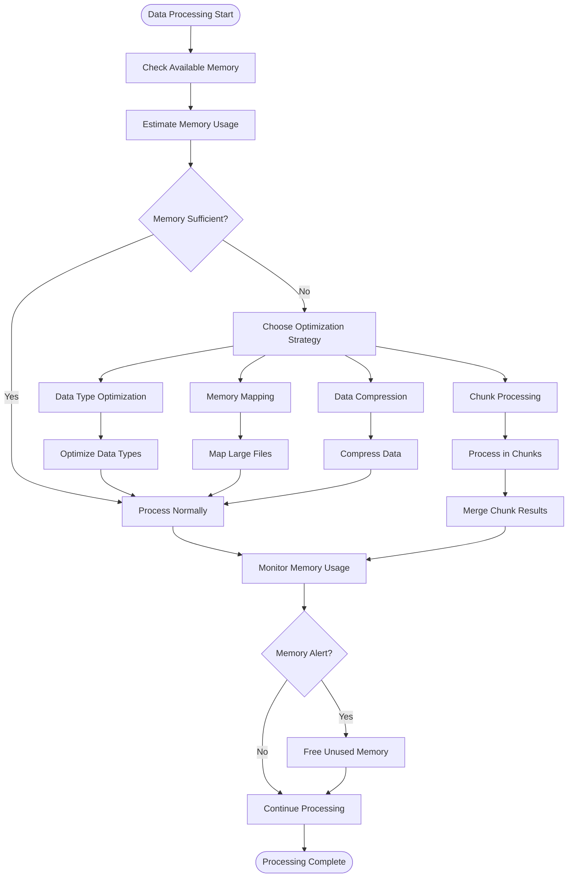
```mermaid
flowchart TD
    Start([Data Processing Start]) --> CheckMemory[Check Available Memory]
    CheckMemory --> EstimateUsage[Estimate Memory Usage]
    EstimateUsage --> MemoryOK{Memory Sufficient?}
    
    MemoryOK --> |Yes| ProcessNormal[Process Normally]
    MemoryOK --> |No| OptimizeStrategy[Choose Optimization Strategy]
    
    OptimizeStrategy --> ChunkProcessing[Chunk Processing]
    OptimizeStrategy --> DataTypeOpt[Data Type Optimization]
    OptimizeStrategy --> MemoryMapping[Memory Mapping]
    OptimizeStrategy --> Compression[Data Compression]
    
    ChunkProcessing --> ProcessChunks[Process in Chunks]
    DataTypeOpt --> OptimizeTypes[Optimize Data Types]
    MemoryMapping --> MapToMemory[Map Large Files]
    Compression --> CompressData[Compress Data]
    
    ProcessChunks --> MergeResults[Merge Chunk Results]
    OptimizeTypes --> ProcessNormal
    MapToMemory --> ProcessNormal
    CompressData --> ProcessNormal
    
    ProcessNormal --> MonitorMemory[Monitor Memory Usage]
    MergeResults --> MonitorMemory
    
    MonitorMemory --> MemoryAlert{Memory Alert?}
    MemoryAlert --> |Yes| FreeMemory[Free Unused Memory]
    MemoryAlert --> |No| ContinueProcessing[Continue Processing]
    
    FreeMemory --> ContinueProcessing
    ContinueProcessing --> End([Processing Complete])
```

---

## Configuration and Parameters

### Data Processing Configuration

```yaml
# data_processing_config.yaml
data_processing:
  sources:
    binance:
      enabled: true
      rate_limit: 1200  # requests per minute
      retry_attempts: 3
      timeout: 30
    
    historical:
      data_dir: "./data/historical"
      file_format: "parquet"  # csv, parquet
      compression: "gzip"
    
    cache:
      enabled: true
      cache_dir: "./data/cache"
      max_size_gb: 10
      ttl_hours: 24
  
  cleaning:
    missing_values:
      method: "forward_fill"  # forward_fill, interpolate, drop
      max_consecutive: 5
    
    outliers:
      method: "iqr"  # iqr, zscore, isolation_forest
      threshold: 3.0
      action: "winsorize"  # winsorize, remove, transform
    
    duplicates:
      remove: true
      keep: "last"  # first, last
  
  features:
    price_features:
      returns: [1, 5, 15, 30]  # periods
      volatility: [20, 50]  # windows
      momentum: [10, 20, 50]
    
    technical_indicators:
      rsi: [14, 21]
      macd: [[12, 26, 9]]
      bollinger_bands: [[20, 2]]
      moving_averages: [5, 10, 20, 50, 200]
    
    statistical_features:
      rolling_stats: [20, 50]
      correlation_window: 50
      entropy_window: 20
  
  optimization:
    parallel_processing: true
    num_workers: 4
    chunk_size: 10000
    memory_limit_gb: 8
    
  quality:
    validation_rules:
      - name: "completeness"
        threshold: 0.95
      - name: "consistency"
        threshold: 0.98
    
    anomaly_detection:
      enabled: true
      sensitivity: 0.05
      methods: ["statistical", "isolation_forest"]
```

### Feature Configuration Management

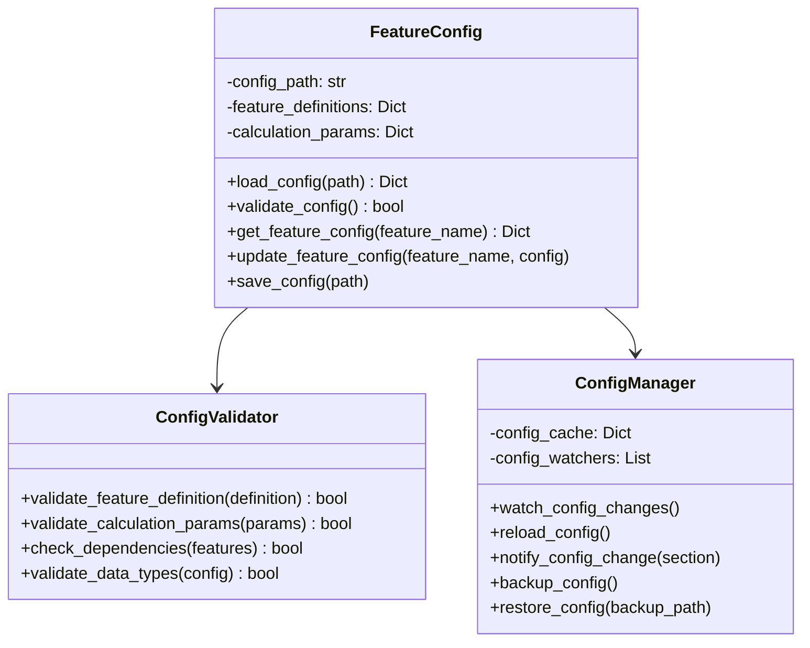
```mermaid
classDiagram
    class FeatureConfig {
        -config_path: str
        -feature_definitions: Dict
        -calculation_params: Dict
        +load_config(path) Dict
        +validate_config() bool
        +get_feature_config(feature_name) Dict
        +update_feature_config(feature_name, config)
        +save_config(path)
    }
    
    class ConfigValidator {
        +validate_feature_definition(definition) bool
        +validate_calculation_params(params) bool
        +check_dependencies(features) bool
        +validate_data_types(config) bool
    }
    
    class ConfigManager {
        -config_cache: Dict
        -config_watchers: List
        +watch_config_changes()
        +reload_config()
        +notify_config_change(section)
        +backup_config()
        +restore_config(backup_path)
    }
    
    FeatureConfig --> ConfigValidator
    FeatureConfig --> ConfigManager
```

---

## Testing and Validation

### Data Processing Tests

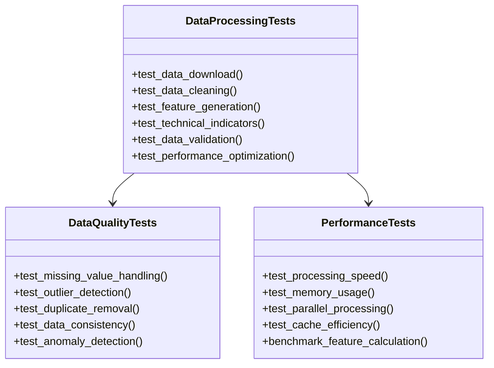
```mermaid
classDiagram
    class DataProcessingTests {
        +test_data_download()
        +test_data_cleaning()
        +test_feature_generation()
        +test_technical_indicators()
        +test_data_validation()
        +test_performance_optimization()
    }
    
    class DataQualityTests {
        +test_missing_value_handling()
        +test_outlier_detection()
        +test_duplicate_removal()
        +test_data_consistency()
        +test_anomaly_detection()
    }
    
    class PerformanceTests {
        +test_processing_speed()
        +test_memory_usage()
        +test_parallel_processing()
        +test_cache_efficiency()
        +benchmark_feature_calculation()
    }
    
    DataProcessingTests --> DataQualityTests
    DataProcessingTests --> PerformanceTests
```

---

## Error Handling and Recovery

### Data Processing Error Management

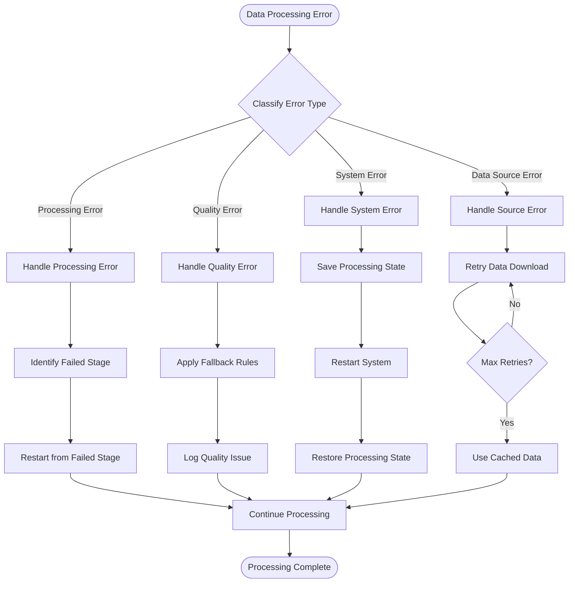
```mermaid
flowchart TD
    Error([Data Processing Error]) --> ClassifyError{Classify Error Type}
    
    ClassifyError --> |Data Source Error| SourceError[Handle Source Error]
    ClassifyError --> |Processing Error| ProcessingError[Handle Processing Error]
    ClassifyError --> |Quality Error| QualityError[Handle Quality Error]
    ClassifyError --> |System Error| SystemError[Handle System Error]
    
    SourceError --> RetryDownload[Retry Data Download]
    RetryDownload --> CheckRetries{Max Retries?}
    CheckRetries --> |No| RetryDownload
    CheckRetries --> |Yes| UseCachedData[Use Cached Data]
    
    ProcessingError --> IdentifyStage[Identify Failed Stage]
    IdentifyStage --> RestartFromStage[Restart from Failed Stage]
    RestartFromStage --> ContinueProcessing[Continue Processing]
    
    QualityError --> ApplyFallback[Apply Fallback Rules]
    ApplyFallback --> LogQualityIssue[Log Quality Issue]
    LogQualityIssue --> ContinueProcessing
    
    SystemError --> SaveState[Save Processing State]
    SaveState --> RestartSystem[Restart System]
    RestartSystem --> RestoreState[Restore Processing State]
    RestoreState --> ContinueProcessing
    
    UseCachedData --> ContinueProcessing
    ContinueProcessing --> Success([Processing Complete])
```

---

## Future Enhancements

### Planned Improvements

1. **Advanced Data Sources**
   - Alternative data integration (news, social media, satellite data)
   - Cross-exchange data aggregation
   - Real-time order book data processing
   - Blockchain and on-chain data integration

2. **Enhanced Feature Engineering**
   - Automated feature discovery
   - Deep learning-based feature extraction
   - Graph-based features for market relationships
   - Time-series decomposition features

3. **Improved Data Quality**
   - Machine learning-based anomaly detection
   - Automated data quality scoring
   - Real-time data quality monitoring
   - Predictive data quality alerts

4. **Performance Optimization**
   - GPU-accelerated feature calculation
   - Distributed data processing
   - Stream processing optimization
   - Advanced caching strategies

5. **Data Governance**
   - Data lineage tracking
   - Feature versioning and rollback
   - Data privacy and compliance
   - Automated data documentation

---

## References

### Core Files
- `core/data/processors/base_processor.py` - Base processor interface
- `core/data/processors/binance_processor.py` - Binance data processor
- `training/data/data_downloader.py` - Data download utilities
- `utils/price_fetcher.py` - Real-time price fetching
- `trading/data/data_processor.py` - Trading data processor

### Related Documentation
- [Architecture Overview](../README.md)
- [Training Pipeline](training.md)
- [Trading System](trading_system.md)
- [Utilities & Monitoring](utilities_monitoring.md)

---

This documentation will be continuously updated as new data processing
