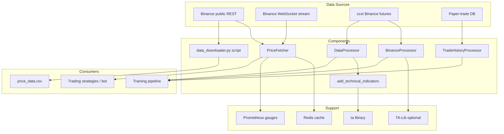
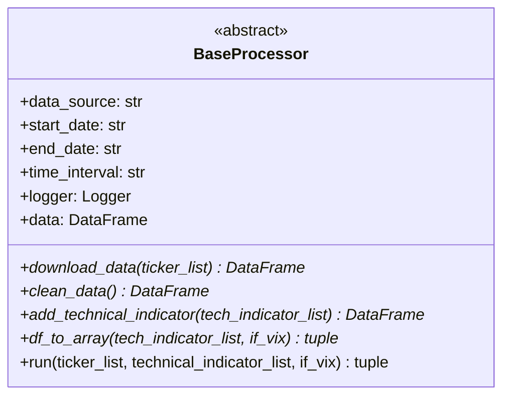
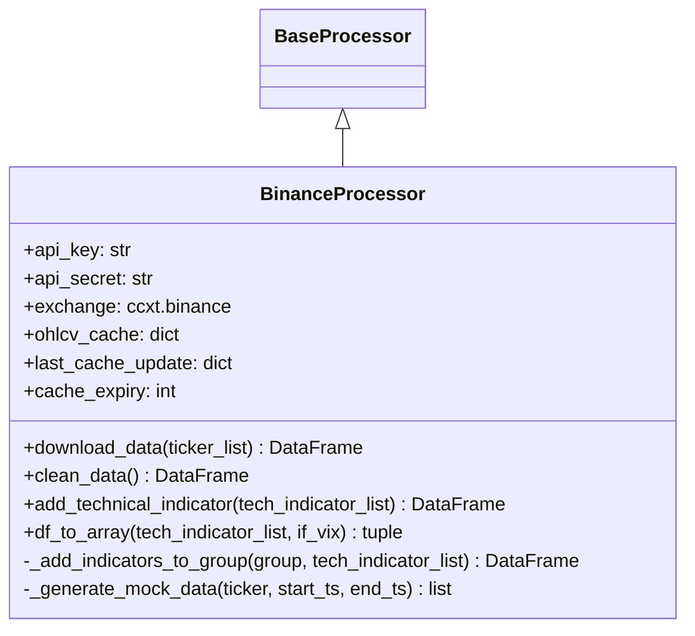
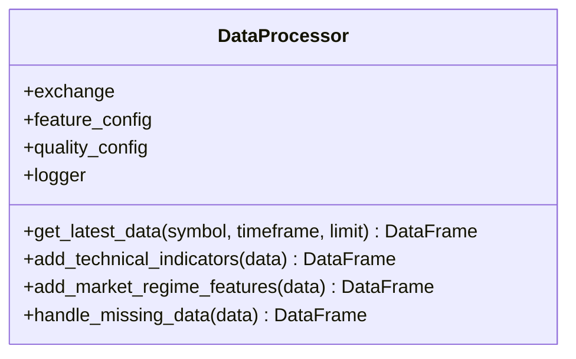
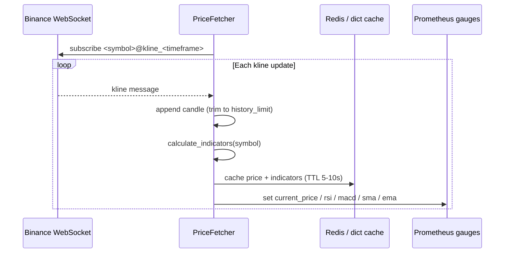

# ELVIS Trading System - Data Processing Documentation

## Overview

This document describes how the ELVIS trading system acquires and processes
market data. There is **no monolithic data-processing framework** in this
codebase. Instead there are a handful of small, independent components, each
built for a specific job:

| Component | File | Role |
| --- | --- | --- |
| `BaseProcessor` (abstract) | `core/data/processors/base_processor.py` | Interface all batch processors implement |
| `BinanceProcessor` | `core/data/processors/binance_processor.py` | Batch OHLCV download + TA-Lib indicators (with mock-data fallback) |
| `DataProcessor` | `trading/data/data_processor.py` | Real-time per-candle feature builder used by the training pipeline |
| `add_technical_indicators()` | `trading/analysis/technical_indicators.py` | Stateless helper that adds indicators using the `ta` library |
| `PriceFetcher` | `utils/price_fetcher.py` | Live REST + WebSocket price streaming, Redis caching, Prometheus gauges |
| `TradeHistoryProcessor` | `training/data/trade_history_processor.py` | Extracts training features from the paper-trade DB |
| `data_downloader.py` | `training/data/data_downloader.py` | One-shot script: dump BTCUSDT klines to a CSV |

Indicator math is done with third-party libraries, not hand-written engines:
`BinanceProcessor` uses **TA-Lib** (`talib`, guarded by an optional import),
while `DataProcessor` and `add_technical_indicators()` use the pure-Python
**`ta`** package. `PriceFetcher` computes RSI/MACD/SMA/EMA directly with pandas.

There is no `FeatureEngineer`, `FeatureStore`, `DataDownloader` class,
`DataQualityManager`, `TechnicalIndicators` engine, `DataOptimizer`, or
`FeatureConfig` class in the code — those do not exist.

---

## Data Processing Architecture



---

## Batch Processors (`core/data/processors/`)

### 1. `BaseProcessor` (abstract)

`core/data/processors/base_processor.py` defines the interface every batch
processor implements. It is an `abc.ABC`.

**Constructor** (`__init__`) takes positional arguments and stores them as
attributes:

- `data_source: str`
- `start_date: str`
- `end_date: str`
- `time_interval: str`
- `logger: logging.Logger`
- `**kwargs` (kept as `self.kwargs`)

It also initializes `self.data = None`.

**Abstract methods** (must be overridden):

- `download_data(ticker_list: List[str]) -> pd.DataFrame`
- `clean_data() -> pd.DataFrame`
- `add_technical_indicator(tech_indicator_list: List[str]) -> pd.DataFrame`
- `df_to_array(tech_indicator_list: List[str], if_vix: bool) -> tuple`

**Concrete method:**

- `run(ticker_list, technical_indicator_list, if_vix=False) -> tuple` — calls
  `download_data` → `clean_data` → `add_technical_indicator` → returns
  `df_to_array(...)`.

There is no `validate_data`, `save_data`, `load_data`, `DataValidator`, or
`DataCache` on this class — those were never implemented.



### 2. `BinanceProcessor`

`core/data/processors/binance_processor.py` is the only concrete subclass of
`BaseProcessor`.

Key facts about the real implementation:

- **Exchange client is `ccxt.binance`**, not `binance.Client`. It is created
  with `options={"defaultType": "future"}` and `enableRateLimit=True`. There
  is no custom `RateLimiter` class — rate limiting is delegated to ccxt.
- API credentials come from the **`config.API_CONFIG` dict** (keys
  `BINANCE_API_KEY` / `BINANCE_API_SECRET`). If keys are missing, `self.exchange`
  stays `None` and the processor falls back to generated mock data.
- OHLCV responses are cached in `self.ohlcv_cache` (a dict) with
  `self.last_cache_update` timestamps and a `self.cache_expiry` TTL
  (default 300 s, override with `cache_expiry=...` kwarg).
- **Indicators are computed with TA-Lib** (`import talib`, guarded by
  `HAS_TALIB`). `add_technical_indicator` dispatches on indicator name in
  `_add_indicators_to_group`. Supported names: `macd`, `rsi`, `cci`, `dx`,
  `obv`, `atr`, `adx`, `bbands`, `sma`. (`sma` adds columns
  `sma_5/10/20/50/100/200`; `bbands` adds `upperband/middleband/lowerband`.)
- **Mock-data fallback is a first-class feature**: `_generate_mock_data`
  produces random-walk OHLCV when the exchange is unavailable or returns
  nothing, and `add_technical_indicator` will synthesize a mock DataFrame
  (with `rsi/macd/dx/obv`) if `self.data` is empty.



`clean_data()` does exactly three things: `drop_duplicates()`, forward-fill
(`ffill()`), and filter rows to the `[start_date, end_date]` window. There is
no outlier removal, winsorization, or normalization step.

`df_to_array(tech_indicator_list, if_vix)` returns the 4-tuple
`(self.data, price_array, tech_array, time_array)`.

**How it is constructed** (see `core/bootstrap.py`
`_register_data_services`): the `data_processor` DI singleton is a
`BinanceProcessor` with `data_source="binance"`, a hard-coded date window, and
`time_interval="5m"`.

### 3. `data_downloader.py` (script, not a class)

`training/data/data_downloader.py` is a **top-level script**, not a
`DataDownloader` class. Running it:

1. Creates a keyless public `binance.Client()`.
2. Requests the last 1000 `BTCUSDT` 1h klines via `client.get_klines(...)`.
3. Writes `training/data/price_data.csv` with columns
   `timestamp, open, high, low, close, volume`.

There is no multi-symbol download, Parquet output, `DataManager`, or
`ProgressTracker` — those were never implemented.

---

## Real-time Feature Building (`trading/data/data_processor.py`)

`DataProcessor` builds a per-candle feature DataFrame for the training/backtest
pipeline. It is constructed with an exchange handle plus config objects:

```python
DataProcessor(exchange, feature_config, quality_config, logger)
```

(Instantiated in `training/training_main.py` and `training/train_models.py`.)

**`get_latest_data(symbol, timeframe="1m", limit=100)`** does the following:

1. `exchange.fetch_ohlcv(...)` → DataFrame indexed by timestamp.
2. `add_technical_indicators(df)` (method below).
3. Optionally `add_market_regime_features(df)` if
   `feature_config.market_regime_features`.
4. Optionally add order-book `bid`/`ask`/`spread` if
   `feature_config.orderbook_features` (via `exchange.fetch_order_book`).
5. Optionally add `funding_rate` if `feature_config.funding_features`
   (via `exchange.fetch_funding_rate`).
6. Backfill a fixed list of `required_features` expected by
   `EnsembleStrategy` (e.g. `price`, `atr`, `macd`, `signal_line`, `rsi`,
   `lower_bb`/`sma_bb`/`upper_bb`, plus placeholders like `news_sentiment`,
   `social_feature`, `order_book_depth` defaulted to `0.0`).
7. Optionally `handle_missing_data(df)` if `quality_config.handle_missing_data`.

**`add_technical_indicators(data)`** uses the **`ta`** library and adds:
`sma_20`, `sma_50`, `adx`, `rsi`, `macd` + `macd_signal`, Bollinger Bands
(`bb_low`/`bb_mid`/`bb_high`, aliased to `lowerband`/`middleband`/`upperband`),
and `atr`. It short-circuits and returns unchanged data if `len(data) < 50`.

**`add_market_regime_features(data)`** adds `volume_ma` (20-period mean) and
`volatility` (20-period std of pct-change).

**`handle_missing_data(data)`** forward-fills then fills remaining NaNs with 0.



---

## Stateless Indicator Helper (`trading/analysis/technical_indicators.py`)

`add_technical_indicators(data, logger=None)` is a **module-level function**
(no class). It uses the `ta` library and adds: `sma_20`, `sma_50`, `adx`,
`rsi`, `macd` + `signal_line`, Bollinger Bands (`lower_bb`/`sma_bb`/`upper_bb`),
and `atr`. It returns the input unchanged if `len(data) < 50` or if
`close`/`high`/`low` columns are missing.

---

## Real-time Streaming (`utils/price_fetcher.py`)

`PriceFetcher` is the live-data component. Signature:

```python
PriceFetcher(logger, client=None, symbols=["BTCUSDT"], timeframe="5m", history_limit=200)
```

Behavior:

- **Client selection**: if no `client` is passed, it reads
  `config.config.API_CONFIG` and prefers `BINANCE_FUTURES_TESTNET_*` keys, then
  `BINANCE_*`. With valid keys it uses `binance.um_futures.UMFutures` (falling
  back to spot `binance.client.Client`); with no/placeholder keys it uses a
  keyless public `Client()`. Some pairs in `spot_only_symbols`
  (`BNBBTC`, `ETHBTC`, `LTCBTC`, `XRPBTC`, `ADABTC`) are always fetched via a
  spot client.
- **Historical fetch**: `get_historical_data()` and
  `get_historical_klines(symbol, interval, limit=200)` pull klines and cache
  them.
- **WebSocket streaming**: `start()` opens
  `wss://stream.binance.com:9443/stream?streams=...` (via `websocket-client`)
  and subscribes to `<symbol>@kline_<timeframe>` streams. `on_message` appends
  each closed kline and recomputes indicators.
- **Indicators are hand-computed with pandas** (static methods), not TA-Lib or
  `ta`: `calculate_rsi(close, window=14)`, `calculate_macd(close, 12, 26, 9)`,
  `calculate_sma(close, window=20)`, `calculate_ema(close, window=20)`.
- **Caching**: uses `utils.redis_cache.get_cache()` with helpers
  `make_price_key` / `make_indicator_key`, and falls back to an in-memory dict
  if Redis is unavailable. Price TTL = 10 s, indicator TTL = 5 s.
- **Prometheus gauges** are exported: `elvis_current_price`, `elvis_rsi`,
  `elvis_macd`, `elvis_macd_signal`, `elvis_sma`, `elvis_ema_short`,
  `elvis_ema_long` (all labeled by `symbol`).
- **Accessors**: `get_current_price(symbol)`, `get_current_candle(symbol)`,
  `get_candle_history(symbol)`, `get_order_book(symbol, limit=100)`.

`PriceFetcher` is wired into DI in `core/bootstrap.py` (`price_fetcher`
singleton), using `SYMBOLS_CONFIG["PRIMARY_SYMBOLS"]`.



---

## Trade-History Features (`training/data/trade_history_processor.py`)

`TradeHistoryProcessor(logger=None)` extracts training features from the
paper-trade database, not from market data feeds.

- `load_trade_history(limit=None, exclude_test=True)` reads via
  `utils.paper_trade_db.get_all_trades` / `get_trade_count`.
- It exposes `self.trade_data` and `self.processed_features` for downstream
  feature extraction.

This is the component that turns realized paper trades into a training dataset;
it does not touch Binance directly.

---

## Configuration

Data-processing configuration lives in **`trading/config/data_config.yaml`**
(there is no `data_processing_config.yaml`). Relevant sections:

- `data_source` — `exchange`, `api_key`/`api_secret` (both `null` by default;
  real credentials come from the secrets/env layer, see below), `data_dir`,
  `cache_dir`.
- `feature_engineering` — `technical_indicators` list
  (`rsi, stoch, macd, bbands, atr, ema, vwap`) and boolean toggles consumed by
  `DataProcessor` (`market_regime_features`, `orderbook_features`,
  `funding_features`, `onchain_features`, `feature_selection`, `n_features`).
- `technical_indicators` — per-indicator parameters (windows, thresholds).
- `market_regime`, `onchain_data`, `orderbook`, `funding_rates` — parameters
  for the corresponding feature groups.
- `data_quality` — `handle_missing_data`, `detect_outliers`,
  `outlier_threshold`, and `validation_rules` bounds.
- `feature_selection` / `pipeline` — declarative feature-selection and
  preprocessing settings.

> Note: not every key in `data_config.yaml` is wired into the current code.
> `DataProcessor` reads `feature_config`/`quality_config` attributes
> (`market_regime_features`, `orderbook_features`, `funding_features`,
> `handle_missing_data`); the `onchain_*`, `feature_selection`, and `pipeline`
> sections describe intended behavior that is only partially implemented.

### API credentials

`BinanceProcessor` reads credentials from the `config.API_CONFIG` **dict**
(populated from environment variables in `config/__init__.py`).
`PriceFetcher` reads from the `config.config.API_CONFIG` **object**
(`APIConfig`), whose `BINANCE_API_KEY` etc. properties resolve secrets via the
secrets manager (`self._secrets.get_secret("BINANCE_API_KEY", "api_keys")`,
backed by Vault KV mount `secrets`) and fall back to env vars.
Missing/placeholder keys degrade gracefully to public/keyless clients (and, for
`BinanceProcessor`, to mock data).

---

## Dependency Notes (Python 3.14)

- **TA-Lib** (`talib`) is an **optional** import in `BinanceProcessor`; if the
  C library/wheel is unavailable it sets `HAS_TALIB = False` and logs a
  warning. Pin `ta-lib==0.6.3` lives only in `requirements/requirements_coreml.txt`.
- **`ta`** (pure-Python) is a hard dependency (`requirements.txt`) and backs
  `DataProcessor` and `trading/analysis/technical_indicators.py`.
- **`ccxt`** backs `BinanceProcessor`; **`python-binance`** (`binance.*`) backs
  `PriceFetcher` and `data_downloader.py`; **`websocket-client`** backs the live
  stream.
- `tensorflow` / `ydf` and similar have **no Python 3.14 wheels** and are not
  used by the data-processing path (they appear only in `requirements/requirements_coreml.txt`
  / `requirements/requirements_ydf.txt` for the CoreML/YDF training variants).

---

## Testing

Real tests that exercise this path:

- `tests/test_binance_processor.py` — unit tests for `BinanceProcessor`.
- `tests/test_integration.py` — imports `BinanceProcessor` as part of an
  integration flow.
- `tests/test_dashboard_market_depth.py` — instantiates `PriceFetcher`.

Run them with `pytest` (per-module, matching the project's test conventions).

---

## References

### Core files
- `core/data/processors/base_processor.py` — `BaseProcessor` abstract interface
- `core/data/processors/binance_processor.py` — `BinanceProcessor` (ccxt + TA-Lib, mock fallback)
- `trading/data/data_processor.py` — `DataProcessor` (real-time features via `ta`)
- `trading/analysis/technical_indicators.py` — `add_technical_indicators()` helper
- `utils/price_fetcher.py` — `PriceFetcher` (WebSocket + Redis + Prometheus)
- `training/data/trade_history_processor.py` — `TradeHistoryProcessor`
- `training/data/data_downloader.py` — one-shot BTCUSDT CSV dump script
- `trading/config/data_config.yaml` — data-processing configuration
- `core/bootstrap.py` — DI wiring for `price_fetcher` and `data_processor`

### Related documentation
- [Architecture Overview](../README.md)
- [Training Pipeline](training.md)
- [Trading System](trading_system.md)
- [Utilities & Monitoring](utilities_monitoring.md)
