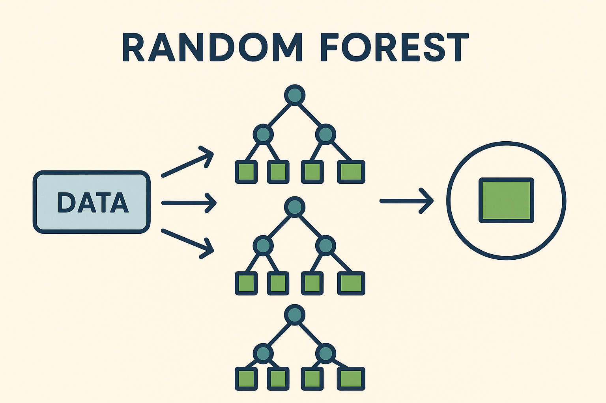

# Random Forest Model for Trading – ELVIS Project



---

## 📘 What is a Random Forest?

Random Forest is a **supervised machine learning algorithm** that is widely used for both **classification** and **regression** tasks. It belongs to the family of **ensemble learning methods**, which means it builds multiple models (in this case, decision trees) and combines their results to improve overall performance and robustness.

The core idea behind Random Forest is:
- Build many decision trees.
- Each tree is trained on a random subset of the data.
- During prediction, all trees vote (classification) or average their predictions (regression).

This strategy helps to **reduce overfitting** and improve **generalization** compared to single decision trees.

### 🌲 Why Use a Forest Instead of One Tree?

- Single decision trees are prone to overfitting and high variance.
- Random Forest introduces randomness in:
  - Data (bootstrap sampling)
  - Features (random subsets of features at each split)
- The aggregation of results leads to more stable and accurate predictions.

## 🎯 Use in the ELVIS Trading System

ELVIS ships **two** Random Forest implementations, both built on **scikit-learn's**
`RandomForestClassifier` and persisted with **joblib**. The unrelated synthetic
YDF placeholder and its Ensemble loader were retired; neither backs these
classes:

| Class | File | Purpose |
| --- | --- | --- |
| `RandomForestModel` | `core/models/random_forest_model.py` | Lean baseline classifier. Implements the `BaseModel` interface. |
| `EnhancedRandomForestModel` | `core/models/enhanced_random_forest_model.py` | Production variant with Optuna tuning, SHAP explainability, Prometheus monitoring, drift detection, and simulated incremental learning. |

Both extend `core.models.base_model.BaseModel`, which mandates
`train`, `predict`, `save`, `load`, `get_params`, and `set_params`.

The baseline `RandomForestModel` is what the rest of the system wires up:
`core/bootstrap.py` registers it, and `core/models/ensemble_model.py` composes
it into the ensemble. The `EnhancedRandomForestModel` is trained via
`scripts/train_enhanced_rf.py` and integrated through
`core/models/integration/enhanced_rf_integration.py`.

> **Optional dependencies.** SHAP and Optuna are not included in the minimal
> ELVIS installation. Their use is guarded, so these models keep their
> documented scikit-learn fallbacks when either is unavailable.

---

## 📦 `RandomForestModel` (baseline)

### ✅ Model architecture
- Wraps `sklearn.ensemble.RandomForestClassifier`.
- Constructor: `RandomForestModel(logger=None, n_estimators=100, max_depth=None)`.
- Saved/loaded as a single joblib artifact (`save(path)` → `joblib.dump`,
  `RandomForestModel.load(path)` → `joblib.load` wrapped in a fresh instance).

### 🧠 Training
- `train(X_train, y_train)` accepts pandas DataFrames/Series and calls
  `model.fit`. It stores `X_train` so `get_feature_importance()` can reuse the
  column names. Training is **not** auto-saved — call `save(path)` yourself.

### 📊 Evaluation
`evaluate(X_test, y_test)` returns a dict with:
- `accuracy`
- `loss` (scikit-learn `log_loss` over `predict_proba`)
- `precision`
- `recall`
- `f1`

(There is no ROC AUC key here — that is only in `EnhancedRandomForestModel`.)

### 📤 Prediction
`predict(X_test)` returns the scikit-learn prediction array directly
(`model.predict`). No custom batch/flatten layer.

### 🔁 Cross-validation
`cross_validate(X, y, n_splits=5)` uses a plain
`sklearn.model_selection.KFold(shuffle=True, random_state=42)` with
`scoring=["accuracy", "precision", "recall", "f1"]` and returns scikit-learn's
raw `cross_validate` score dict. It does **not** save plots or push metrics on
its own — see the standalone helper below.

### 📈 Explainability
`explain_predictions(X, path=None)`:
- Uses `shap.TreeExplainer` **if `shap` is importable**, returning a DataFrame of
  `feature → mean_abs_shap`.
- Otherwise falls back to `model.feature_importances_`
  (`feature → importance`).
- Writes a CSV to `path` when supplied.

`get_feature_importance()` returns a DataFrame of the fitted model's
`feature_importances_` keyed to the training columns.

### 🧪 Hyperparameter tuning
`tune_hyperparameters(X, y, n_trials=20)`:
- Uses **Optuna** if importable — searches `n_estimators` (50–300) and
  `max_depth` (3–20), scoring 3-fold `f1`.
- Otherwise falls back to `sklearn.model_selection.GridSearchCV` over
  `{n_estimators: [50,100,200], max_depth: [5,10,None]}`.
- Applies the best params to the model via `set_params` and returns them.

### 📡 Prometheus helper
The module-level function
`push_cv_metrics_to_prometheus(metrics, job_name="cv_metrics", gateway="localhost:9091")`
averages each metric list, registers a Gauge per metric with the `rf_` prefix
(e.g. `rf_accuracy`, `rf_f1`), and pushes to a Prometheus **Pushgateway**. It is
a free function, not a method — call it explicitly with the output of
`cross_validate`.

---

## ⚙️ `EnhancedRandomForestModel` (production variant)

This class adds MLOps machinery on top of the same
`sklearn.ensemble.RandomForestClassifier`. Constructor:

```python
EnhancedRandomForestModel(
    logger=None,
    model_path="models/rf_enhanced",
    enable_optuna=True,        # honored only if optuna is installed
    enable_shap=True,          # honored only if shap is installed
    enable_monitoring=True,
    prometheus_gateway="localhost:9091",
)
```

For the full walkthrough, see [`enhanced_random_forest_guide.md`](enhanced_random_forest_guide.md).
Highlights that differ from the baseline:

### 🧪 Optuna hyperparameter optimization
`train(X, y, trial=...)` accepts an Optuna `trial`. `_suggest_hyperparameters`
searches `n_estimators`, `max_depth`, `min_samples_split`, `min_samples_leaf`,
`max_features`, `bootstrap`, and `class_weight`. Without a trial it uses
tuned defaults (`n_estimators=150`, `max_depth=12`, `class_weight="balanced"`,
`n_jobs=-1`, …).

### 📊 Evaluation
`evaluate(X_test, y_test)` returns weighted `accuracy`, `precision`, `recall`,
`f1`, and — **for binary targets only** — `roc_auc` via `roc_auc_score` on the
positive-class probabilities.

### 🔁 Cross-validation
`cross_validate(X, y, cv_folds=5, scoring=None)` uses
`sklearn.model_selection.TimeSeriesSplit` (time-aware, no shuffling) and
defaults to weighted scoring. It logs per-fold means but does not export plots.

### 📈 Explainability
`explain_prediction(X, max_samples=10)` returns SHAP values from a
`shap.TreeExplainer` built at train time (`_initialize_shap_explainer`), or
`None` if SHAP is unavailable.

### 📡 Prometheus & Grafana
When `enable_monitoring` is on, `_setup_prometheus_metrics` registers
counters/gauges (`rf_predictions_total`, `rf_current_accuracy`,
`rf_feature_importance`, `rf_last_training_duration_seconds`) and
`evaluate` pushes them to the Pushgateway via `_push_metrics_to_prometheus`.

### 🔁 Incremental learning (simulated)
scikit-learn Random Forests do not support true online learning. As a workaround
`partial_fit(X_new, y_new)` buffers incoming rows and triggers a **full retrain**
on the buffer once it reaches `buffer_size` (default 1000) or when
`_should_retrain()` detects an accuracy drop greater than `retrain_threshold`
(default 0.05). This method exists **only** on `EnhancedRandomForestModel`.

### 💾 Persistence
`save(path=None)` writes two files into the target directory:
`rf_model.pkl` (joblib) and `rf_metadata.json` (feature names, training stats,
performance history, params). `load(path)` restores both.

---

## 🔌 Feature pipelines

Feature engineering lives under `core/models/features/` (note: the top-level
`core/features/feature_pipeline.py` is an empty placeholder — use the modules
below):

- **`core/models/features/feature_pipeline.py` — `FeaturePipeline`**
  A minimal, dependency-free pipeline. `transform(df)` derives a few OHLCV
  features (`price_diff`, `high_low_ratio`, `rolling_mean_5`, `rolling_std_5`),
  then computes an MD5 hash of the sorted feature columns and stores it as the
  feature-set **version** (`get_version()`), enabling reproducibility tracking.

- **`core/models/features/trading_feature_pipeline.py` — `TradingFeaturePipeline`**
  The full pipeline used for training. `transform(df)` builds grouped feature
  sets from OHLCV data: price, volume, volatility, momentum, technical
  indicators (via TA-Lib when available, basic fallbacks otherwise), market
  structure, time-of-day, and feature interactions, then cleans the result.
  `get_feature_names()` / `get_feature_count()` / `validate_features()` expose
  metadata about the generated set.

---

## 📁 Relevant files

```
core/
├── models/
│   ├── base_model.py                    # BaseModel ABC (train/predict/save/load/params)
│   ├── random_forest_model.py           # RandomForestModel (baseline) + push_cv_metrics_to_prometheus()
│   ├── enhanced_random_forest_model.py  # EnhancedRandomForestModel (MLOps variant)
│   ├── ensemble_model.py                # composes RandomForestModel into the ensemble
│   ├── integration/
│   │   └── enhanced_rf_integration.py   # wires EnhancedRandomForestModel into the app
│   └── features/
│       ├── feature_pipeline.py          # FeaturePipeline (OHLCV + MD5 version hash)
│       └── trading_feature_pipeline.py  # TradingFeaturePipeline (full feature set)
├── viz/
│   └── export_utils.py                  # export_to_csv / push_metrics_to_prometheus /
│                                        #   export_feature_importance / export_shap_summary
scripts/
└── train_enhanced_rf.py                 # training entrypoint for EnhancedRandomForestModel
```

### Export helpers (`core/viz/export_utils.py`)
- `export_to_csv(rows, path)` — write dict rows to CSV.
- `push_metrics_to_prometheus(metrics, job_name, gateway="localhost:9091", prefix="rf_")`
  — push a metric dict to the Pushgateway; returns success bool.
- `export_feature_importance(model, feature_names, path)` — dump
  `feature_importances_` to CSV.
- `export_shap_summary(model, X, path, feature_names=None)` — SHAP summary CSV,
  falling back to feature importances when `shap` is not installed.

---

## 📚 References

- [IBM Random Forest Explanation](https://www.ibm.com/think/topics/random-forest)
- [scikit-learn: RandomForestClassifier](https://scikit-learn.org/stable/modules/generated/sklearn.ensemble.RandomForestClassifier.html)
- [Optuna: Hyperparameter Optimization Framework](https://optuna.org/)
- [Prometheus Client for Python](https://github.com/prometheus/client_python)
- [SHAP: Explainable AI](https://shap.readthedocs.io/en/latest/)
