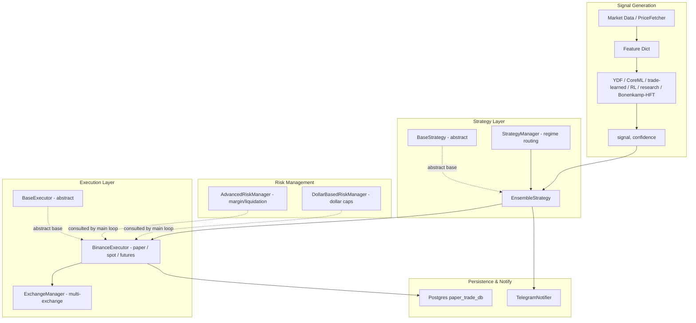
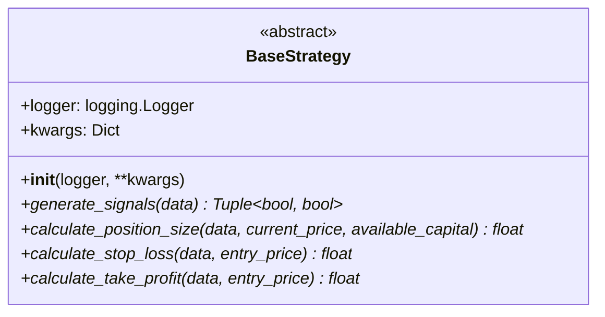
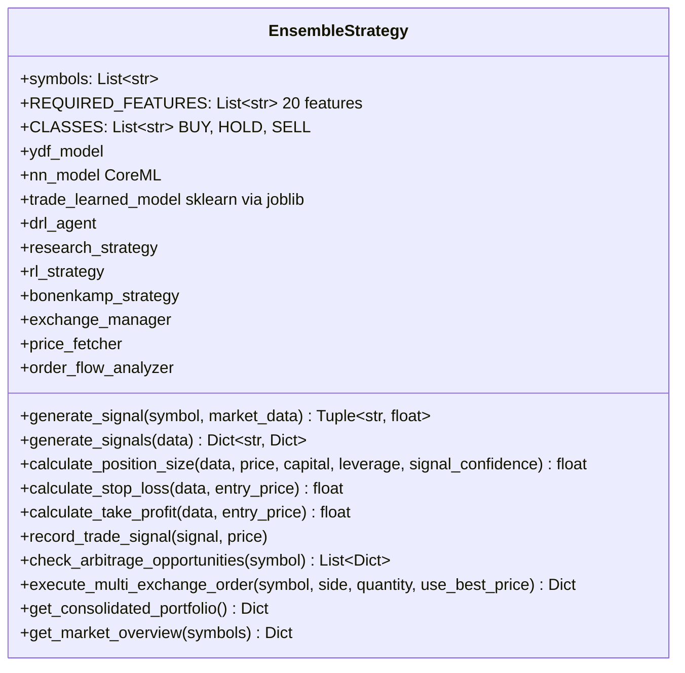
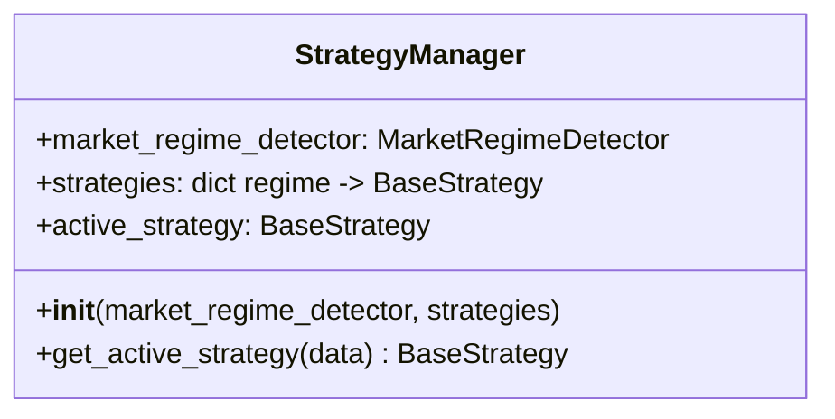
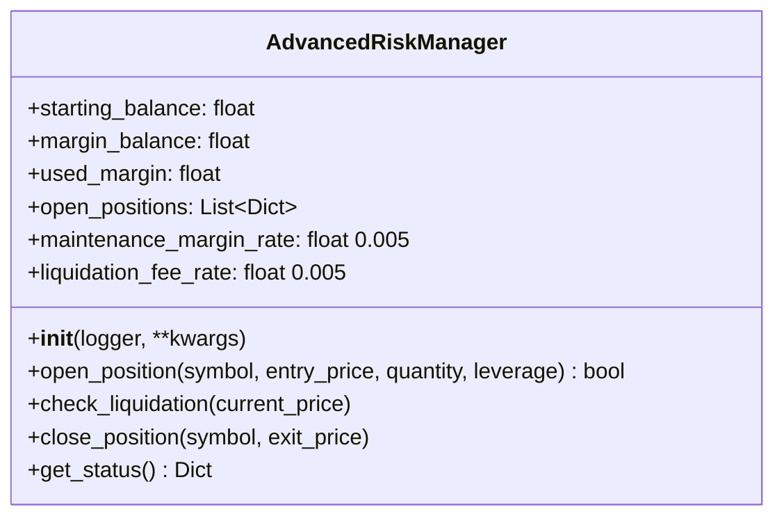
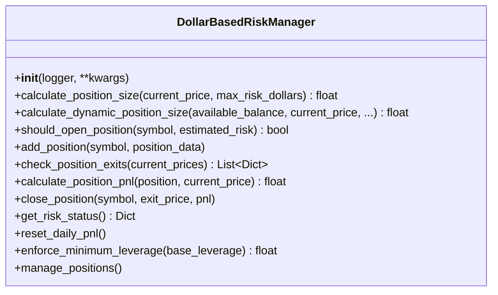
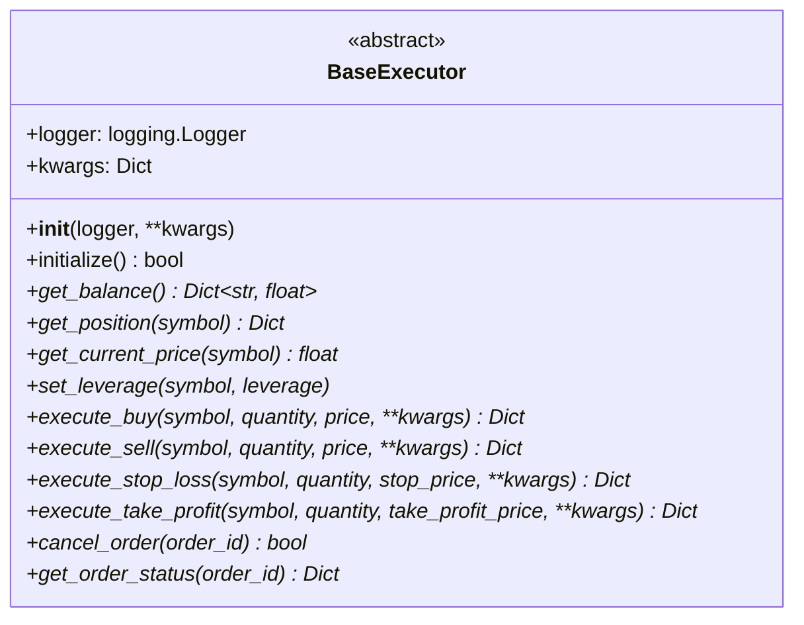
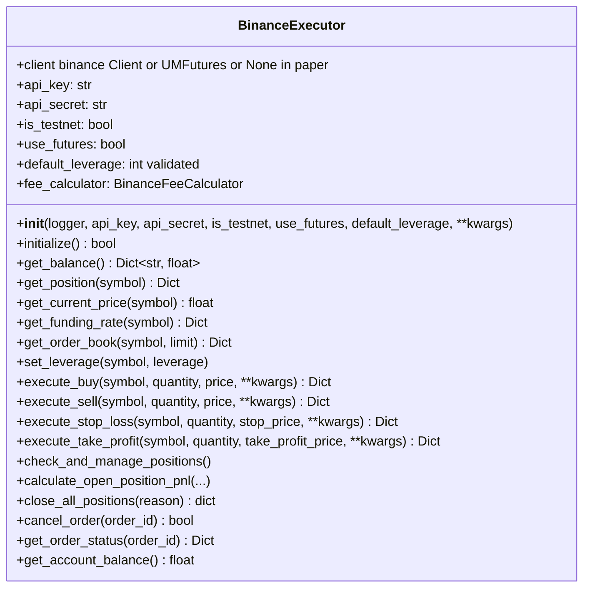

# ELVIS Trading System - Trading Components Documentation

## Overview

This document describes the core trading components in the ELVIS trading system:
strategies, order execution, risk management, and the configuration that wires
them together. Everything below is reconciled against the source under
`trading/` and `config/`.

The three concrete pieces most callers touch are:

- **`EnsembleStrategy`** (`trading/strategies/ensemble_strategy.py`) — the default
  strategy. It blends technical analysis with any ML models that happen to be
  available and returns a `(signal, confidence)` decision.
- **`BinanceExecutor`** (`trading/execution/binance_executor.py`) — the executor.
  It runs in paper mode (mock spot fills backed by a Postgres trade DB) or
  against Binance spot/futures.
- **`AdvancedRiskManager`** / **`DollarBasedRiskManager`** (`trading/risk/`) — two
  independent risk models (a margin/liquidation model and a dollar-cap model).

Operational knobs live in `trading_config.yaml` at the repo root, loaded via
`config.trading_config.load_trading_config()`.

---

## Trading System Architecture



The main trading loop lives in `main.py`; it constructs a strategy and an
executor, asks the strategy for a `(signal, confidence)`, and routes execution
through the executor. There is no separate `ExecutionEngine`/`OrderManager`
object — order lifecycle is handled inside `BinanceExecutor`.

---

## Trading Strategies

### 1. Base Strategy Interface

`trading/strategies/base_strategy.py` defines the abstract base every strategy
subclasses. It has exactly four abstract methods (all others in earlier versions
of this doc were fictional):



Notes:

- The constructor stores `logger` and `**kwargs`; there is no signal-validation
  or parameter-getter/setter API on the base class.
- The abstract `generate_signals` signature is `(data: pd.DataFrame) ->
  Tuple[bool, bool]`. `EnsembleStrategy` overrides it with a wider, dict-based
  signature (see below), which is what the running system actually uses.

Concrete strategies shipped under `trading/strategies/` include (non-exhaustive):
`ensemble_strategy`, `research_based_strategy`, `rl_strategy`,
`bonenkamp_hft_strategy`, `technical_strategy`, `ema_rsi_strategy`,
`mean_reversion_strategy`, `trend_following_strategy`, `grid_strategy`,
`sentiment_strategy`, `llm_enhanced_strategy`, `high_leverage_scalping_strategy`,
`balanced_starter`.

### 2. Ensemble Strategy Implementation

`EnsembleStrategy` (`trading/strategies/ensemble_strategy.py`) is the default
strategy. It loads whatever models are available and combines their predictions
with technical analysis into a weighted vote.



How it actually works:

- **Model sources (all optional).** On construction it tries to load a YDF
  Random Forest (`models/model_rf.ydf` native, else a TensorFlow-DF export at
  `models/model_rf_tf`), a CoreML neural net (`models/NNModel.mlpackage`), and a
  trade-learned scikit-learn classifier persisted with `joblib`
  (`training/models/trade_learned_model.pkl`). It also optionally wires in a DRL
  agent, a research strategy, an RL strategy, a Bonenkamp HFT strategy, and an
  MLX LLM endpoint (`MLX_URL`). Any source that fails to import or load is simply
  skipped — `ydf`, `tensorflow`, and `coremltools` have no Python 3.14 wheels and
  are guarded behind `try/except`, so on 3.14 the strategy runs on technical
  analysis plus whichever pure-Python sources are present.
- **`generate_signal(symbol, market_data)`** is the entry point the main loop
  calls. It builds a feature dict, gathers weighted predictions from each
  available source (technical, research, RL, Bonenkamp-HFT, model ensemble),
  takes a weighted average over the `[BUY, HOLD, SELL]` probability vectors, and
  returns `(signal, confidence)`. It applies an anti-HOLD conversion and a
  trend-following filter, and floors the confidence for actual BUY/SELL signals.
- **`generate_signals(data)`** takes a `Dict[str, pd.DataFrame]` and returns a
  `Dict[symbol -> {"signal", "confidence"}]` via straight ensemble averaging (no
  weighting/anti-HOLD). This is the batch variant.
- The DRL branch is currently disabled in code (`_get_drl_prediction` returns
  `"HOLD"`).

There is no `ModelEnsemble` or `ConsensusEngine` class, and no `run()` method —
consensus is just an in-line weighted mean of probability arrays.

### 3. Strategy Manager

`StrategyManager` (`trading/strategy_manager.py`) is a thin regime router, not a
performance-tracking orchestrator.



`get_active_strategy(data)` asks `MarketRegimeDetector.get_regime(data)` for the
current regime and returns the strategy registered under that regime key, falling
back to `strategies["default"]`. There is no `StrategySelector`,
`PerformanceTracker`, Sharpe/win-rate tracking, or dynamic strategy switching in
this class.

---

## Risk Management System

Two independent risk classes exist. Neither resembles the earlier "AdvancedRiskManager
with VaR/Kelly/drawdown" description — those methods and the `PositionSizer` /
`DrawdownProtection` / `RiskLimits` helper classes were fictional.

### 1. AdvancedRiskManager — margin & liquidation model

`AdvancedRiskManager` lives in `trading/risk/risk_manager.py`
(`trading/risk/advanced_risk_manager.py` is a one-line re-export shim so the
documented import path keeps working). It models a leveraged margin account:



- `open_position` reserves initial margin (`notional / leverage`) against
  `margin_balance`; it returns `False` if margin is insufficient.
- `check_liquidation` walks open positions and liquidates any whose free margin
  drops to/below the maintenance margin, charging a liquidation fee.
- `close_position` returns the reserved margin plus realized PnL to
  `margin_balance`.
- `get_status` returns `{"balance", "used_margin", "open_positions"}`.

### 2. DollarBasedRiskManager — fixed-dollar risk caps

`DollarBasedRiskManager` (`trading/risk/dollar_risk_manager.py`) sizes positions
against a per-trade dollar risk budget and daily-loss caps:



A plain `risk_manager.py` also exports `AdvancedRiskManager`; there is no separate
`RiskLimits`/VaR engine in the codebase. VaR/CVaR/correlation-limit checks
described in older revisions of this document are not implemented.

---

## Execution System

### 1. Base Executor Interface

`trading/execution/base_executor.py` is the abstract executor interface:



`initialize()` has a default implementation returning `True`; every other method
is abstract. There are no `OrderValidator` or `ExecutionMetrics` companion
classes.

### 2. Binance Executor Implementation

`BinanceExecutor` (`trading/execution/binance_executor.py`) is the concrete
executor. It supports paper trading (spot) with mock fills persisted to Postgres,
plus real Binance spot and USDⓈ-M futures.



Key behaviours:

- **Modes.** `is_testnet=True` + spot ⇒ paper trading with mock execution (no API
  keys needed). Futures uses the `binance-futures-connector` `UMFutures` client
  when available; spot uses `python-binance` `Client`. Live/testnet is chosen by
  `is_testnet`.
- **Leverage safety (Issue #14).** The default leverage is `3` (from
  `config.config.TRADING_CONFIG["DEFAULT_LEVERAGE"]`, overridable by the
  `DEFAULT_LEVERAGE` env var). `validate_leverage_config` rejects leverage above
  10x unless `OVERRIDE_HIGH_LEVERAGE=true` is set.
- **Rate limiting (Issue #12).** Live API calls are wrapped with `binance_retry`
  (exponential back-off) from `utils.binance_rate_limiter`.
- **Paper balance.** `_calculate_paper_balance()` computes equity as a single
  USDT deposit plus true cumulative realized P&L since the last session reset:
  `equity = max(0.0, starting_usdt + total_pnl)`, floored at 0 (liquidation). The
  deposit defaults to `$100` (`PAPER_START_USDT` env or
  `PAPER_TRADING_CONFIG["INITIAL_USDT_BALANCE"]`). The account is pure USDT — no
  pre-seeded crypto. Realized P&L is summed from the `trades` table in the paper
  trade DB (`utils.paper_trade_db`).
- **Fees.** `BinanceFeeCalculator` (`trading/fees/`) handles fee estimation.

There is no `BinanceAPIManager` or standalone `OrderManager` class; order
tracking and position management are methods on `BinanceExecutor`
(`check_and_manage_positions`, `close_all_positions`, etc.). For multi-exchange
routing, `ExchangeManager` (`trading/execution/exchange_manager.py`) coordinates
Binance/Coinbase/Kraken executors.

### 3. Execution Flow

```mermaid
sequenceDiagram
    participant Strategy as EnsembleStrategy
    participant Loop as main.py loop
    participant Executor as BinanceExecutor
    participant API as Binance API / paper DB
    participant Notify as TelegramNotifier

    Loop->>Strategy: generate_signal(symbol, market_data)
    Strategy-->>Loop: (signal, confidence)
    Loop->>Strategy: calculate_position_size(...)
    Strategy-->>Loop: position size (BTC)

    Loop->>Executor: execute_buy / execute_sell(symbol, qty, price)
    alt Paper mode (testnet spot)
        Executor->>API: record mock fill in paper_trade_db
    else Live / futures
        Executor->>API: submit order (binance_retry wrapped)
    end
    API-->>Executor: fill / order result
    Executor-->>Loop: execution result Dict

    Loop->>Notify: trade notification
    Loop->>Executor: check_and_manage_positions()
```

---

## Configuration and Parameters

### Unified trading config

Operational knobs live in `trading_config.yaml` at the repo root and are loaded
by `config.trading_config.load_trading_config()`. The file composes settings that
were previously split across `config/config.py` and `trading/config/*.yaml`.

```yaml
# trading_config.yaml
trading:
  symbol: BTCUSDT
  mode: paper                # only executable mode; live is rejected before bootstrap
  default_leverage: 3        # env DEFAULT_LEVERAGE overrides; >10x needs OVERRIDE_HIGH_LEVERAGE=true
  strategy: ensemble

risk_management:
  max_position_size: 0.1     # fraction of portfolio
  min_position_size: 0.01
  stop_loss_pct: 0.02
  take_profit_pct: 0.02
  max_daily_loss: 0.05       # fraction
  max_daily_loss_usd: 150.0
  max_drawdown: 0.2
  leverage_max: 125
  leverage_min: 1

execution:
  max_daily_trades: 8
  max_trades_per_day: 10
  trade_cooldown_minutes: 15
  taker_fee: 0.0004

monitoring:
  trade_history_port: 5050
  prometheus_pushgateway: localhost:9091
  grafana_port: 3001
```

`load_trading_config()` reads this file and applies the `DEFAULT_LEVERAGE` env
override to `trading.default_leverage` so the loaded config matches the runtime
behaviour enforced by `config.config.validate_leverage_config`.

Additional per-domain YAML lives under `trading/config/` (`data_config.yaml`,
`model_config.yaml`, `risk_config.yaml`, `validation_config.yaml`) and
`config/config.py` holds `TRADING_CONFIG` / `PAPER_TRADING_CONFIG` /
`API_CONFIG`.

### Notes on the `monitoring` block

- `trade_history_port: 5050` — the trade-history Flask API
  (`utils/trade_history_api.py`) binds `0.0.0.0:5050` and serves
  `/api/trade_history`.
- `grafana_port: 3001` — Grafana's host port in the compose stack.
- `prometheus_pushgateway: localhost:9091` — Prometheus Pushgateway target.

---

## Testing and Validation

The repo ships two real testing/validation components (both differ from the
earlier fictional `TradingSystemTests`/`PaperTradingSystem` sketch):

- **`BacktestEngine`** (`trading/backtesting/backtest_engine.py`) — with
  `BacktestConfig` and `Trade` dataclasses.
- **`StrategyValidator`** (`trading/testing/strategy_validator.py`) — statistical
  validation with `MonteCarloConfig`, `WalkForwardConfig`, and `StatisticalConfig`.

Paper trading is not a separate simulator class; it is the `is_testnet` spot path
of `BinanceExecutor`, backed by the Postgres paper trade DB (`utils.paper_trade_db`).
Unit tests live under `tests/`.

---

## References

### Core Files

- `trading/strategies/base_strategy.py` — abstract strategy interface
- `trading/strategies/ensemble_strategy.py` — default ensemble strategy
- `trading/strategy_manager.py` — regime-based strategy router
- `trading/execution/base_executor.py` — abstract executor interface
- `trading/execution/binance_executor.py` — Binance paper/spot/futures executor
- `trading/execution/exchange_manager.py` — multi-exchange coordinator
- `trading/risk/risk_manager.py` — `AdvancedRiskManager` (margin/liquidation)
- `trading/risk/advanced_risk_manager.py` — re-export shim for the above
- `trading/risk/dollar_risk_manager.py` — `DollarBasedRiskManager`
- `trading/backtesting/backtest_engine.py` — backtesting
- `trading/testing/strategy_validator.py` — statistical strategy validation
- `config/trading_config.py` + `trading_config.yaml` — unified config loader/file
- `config/config.py` — `TRADING_CONFIG`, `PAPER_TRADING_CONFIG`, `validate_leverage_config`
- `utils/paper_trade_db.py` — paper trade persistence (Postgres)
- `trading/utils/telegram_notifier.py` — `TelegramNotifier`

### Related Documentation

- [Architecture Overview](../README.md)
- [Training Pipeline](training.md)
- [Utilities & Monitoring](utilities_monitoring.md)
- [Random Forest Model](random_forest.md)
