# ELVIS Trading System - Trading Components Documentation

## Overview

This document provides comprehensive documentation of the core trading components in the ELVIS trading system. It covers trading strategies, execution modules, risk management, and the complete trading workflow from signal generation to order execution.

---

## Trading System Architecture

```mermaid
graph TB
    subgraph "Signal Generation"
        DataFeed[Market Data Feed]
        Indicators[Technical Indicators]
        MLModels[ML Models]
        Signals[Trading Signals]
    end
    
    subgraph "Strategy Layer"
        BaseStrategy[BaseStrategy]
        EnsembleStrategy[EnsembleStrategy]
        StrategyManager[StrategyManager]
    end
    
    subgraph "Risk Management"
        RiskManager[AdvancedRiskManager]
        PositionSizer[PositionSizer]
        RiskLimits[Risk Limits]
        DrawdownProtection[Drawdown Protection]
    end
    
    subgraph "Execution Layer"
        BaseExecutor[BaseExecutor]
        BinanceExecutor[BinanceExecutor]
        OrderManager[OrderManager]
        ExecutionEngine[ExecutionEngine]
    end
    
    subgraph "Portfolio Management"
        Portfolio[Portfolio]
        PositionTracker[Position Tracker]
        PnLCalculator[P&L Calculator]
        PerformanceAnalyzer[Performance Analyzer]
    end
    
    subgraph "External Interfaces"
        BinanceAPI[Binance API]
        TelegramBot[Telegram Notifications]
        Database[Trade Database]
        Monitoring[Monitoring System]
    end
    
    DataFeed --> Indicators
    Indicators --> MLModels
    MLModels --> Signals
    
    Signals --> EnsembleStrategy
    BaseStrategy <|-- EnsembleStrategy
    EnsembleStrategy --> StrategyManager
    
    StrategyManager --> RiskManager
    RiskManager --> PositionSizer
    RiskManager --> RiskLimits
    RiskManager --> DrawdownProtection
    
    RiskManager --> ExecutionEngine
    ExecutionEngine --> OrderManager
    OrderManager --> BinanceExecutor
    BaseExecutor <|-- BinanceExecutor
    
    BinanceExecutor --> BinanceAPI
    ExecutionEngine --> Portfolio
    Portfolio --> PositionTracker
    Portfolio --> PnLCalculator
    Portfolio --> PerformanceAnalyzer
    
    ExecutionEngine --> TelegramBot
    ExecutionEngine --> Database
    ExecutionEngine --> Monitoring
```

---

## Trading Strategies

### 1. Base Strategy Interface

The foundation for all trading strategies:

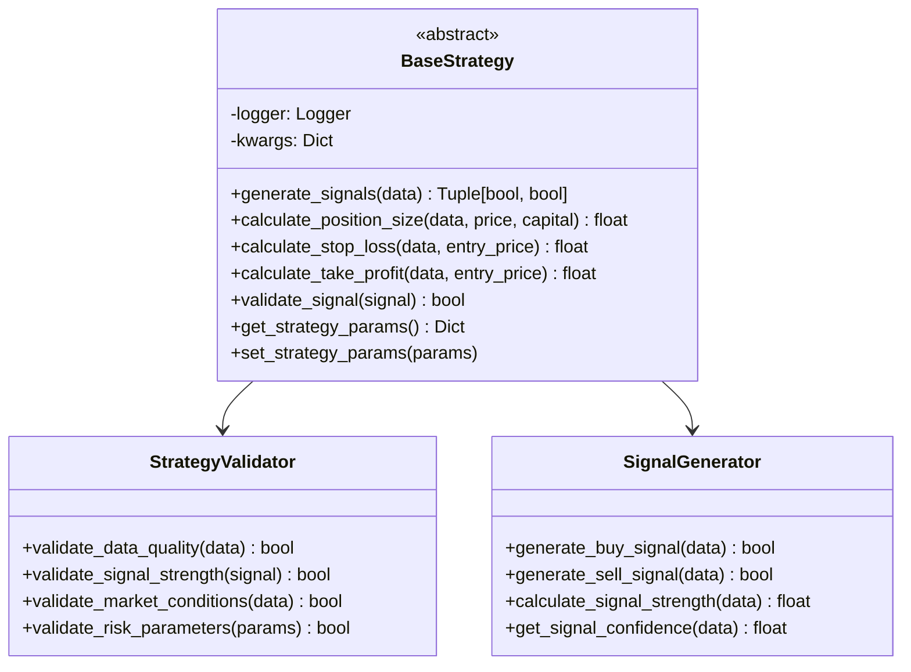
```mermaid
classDiagram
    class BaseStrategy {
        <<abstract>>
        -logger: Logger
        -kwargs: Dict
        +generate_signals(data) Tuple[bool, bool]
        +calculate_position_size(data, price, capital) float
        +calculate_stop_loss(data, entry_price) float
        +calculate_take_profit(data, entry_price) float
        +validate_signal(signal) bool
        +get_strategy_params() Dict
        +set_strategy_params(params)
    }
    
    class StrategyValidator {
        +validate_data_quality(data) bool
        +validate_signal_strength(signal) bool
        +validate_market_conditions(data) bool
        +validate_risk_parameters(params) bool
    }
    
    class SignalGenerator {
        +generate_buy_signal(data) bool
        +generate_sell_signal(data) bool
        +calculate_signal_strength(data) float
        +get_signal_confidence(data) float
    }
    
    BaseStrategy --> StrategyValidator
    BaseStrategy --> SignalGenerator
```

### 2. Ensemble Strategy Implementation

Multi-model consensus trading strategy:

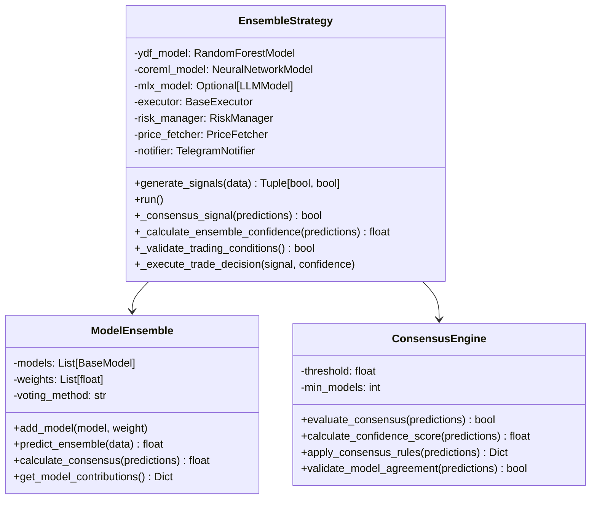
```mermaid
classDiagram
    class EnsembleStrategy {
        -ydf_model: RandomForestModel
        -coreml_model: NeuralNetworkModel
        -mlx_model: Optional[LLMModel]
        -executor: BaseExecutor
        -risk_manager: RiskManager
        -price_fetcher: PriceFetcher
        -notifier: TelegramNotifier
        +generate_signals(data) Tuple[bool, bool]
        +run()
        +_consensus_signal(predictions) bool
        +_calculate_ensemble_confidence(predictions) float
        +_validate_trading_conditions() bool
        +_execute_trade_decision(signal, confidence)
    }
    
    class ModelEnsemble {
        -models: List[BaseModel]
        -weights: List[float]
        -voting_method: str
        +add_model(model, weight)
        +predict_ensemble(data) float
        +calculate_consensus(predictions) float
        +get_model_contributions() Dict
    }
    
    class ConsensusEngine {
        -threshold: float
        -min_models: int
        +evaluate_consensus(predictions) bool
        +calculate_confidence_score(predictions) float
        +apply_consensus_rules(predictions) Dict
        +validate_model_agreement(predictions) bool
    }
    
    EnsembleStrategy --> ModelEnsemble
    EnsembleStrategy --> ConsensusEngine
```

### 3. Strategy Manager

Orchestrates multiple strategies and manages strategy selection:

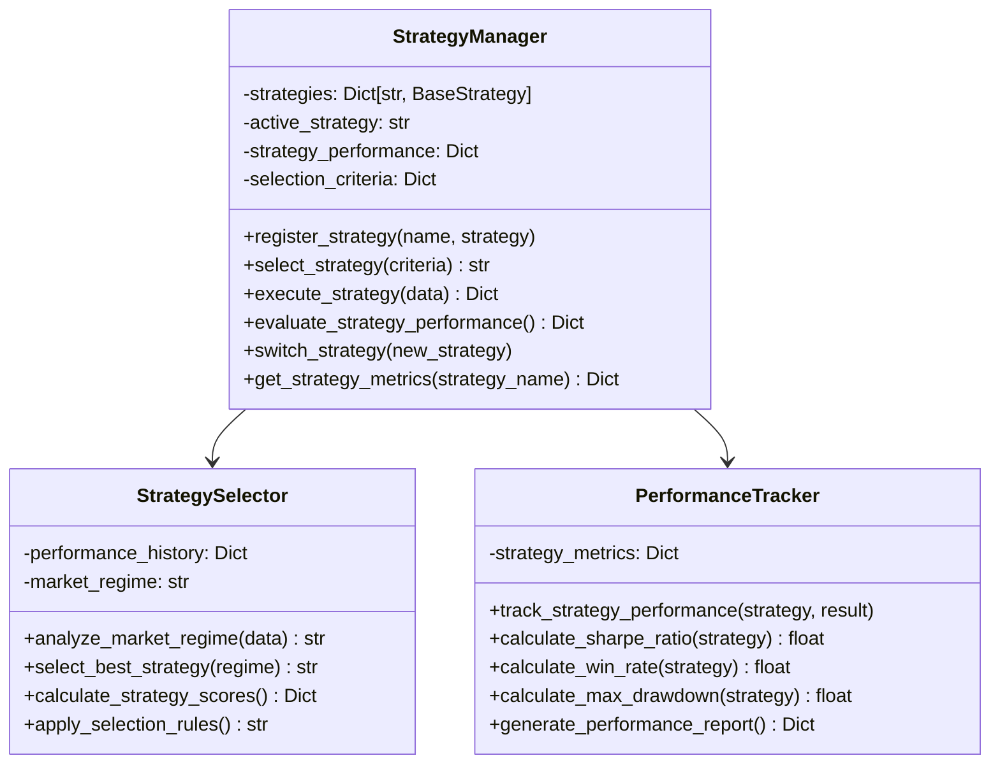
```mermaid
classDiagram
    class StrategyManager {
        -strategies: Dict[str, BaseStrategy]
        -active_strategy: str
        -strategy_performance: Dict
        -selection_criteria: Dict
        +register_strategy(name, strategy)
        +select_strategy(criteria) str
        +execute_strategy(data) Dict
        +evaluate_strategy_performance() Dict
        +switch_strategy(new_strategy)
        +get_strategy_metrics(strategy_name) Dict
    }
    
    class StrategySelector {
        -performance_history: Dict
        -market_regime: str
        +analyze_market_regime(data) str
        +select_best_strategy(regime) str
        +calculate_strategy_scores() Dict
        +apply_selection_rules() str
    }
    
    class PerformanceTracker {
        -strategy_metrics: Dict
        +track_strategy_performance(strategy, result)
        +calculate_sharpe_ratio(strategy) float
        +calculate_win_rate(strategy) float
        +calculate_max_drawdown(strategy) float
        +generate_performance_report() Dict
    }
    
    StrategyManager --> StrategySelector
    StrategyManager --> PerformanceTracker
```

---

## Risk Management System

### 1. Advanced Risk Manager

Comprehensive risk management with multiple protection layers:

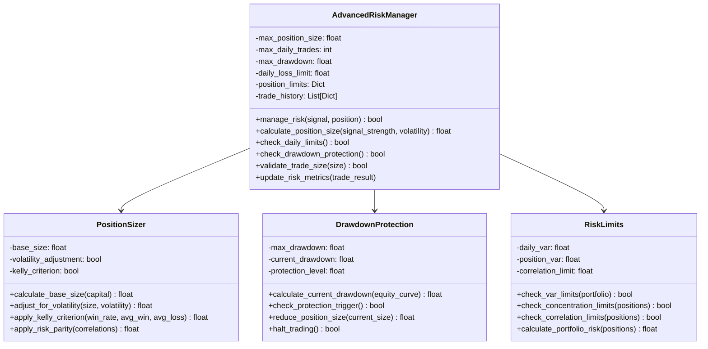
```mermaid
classDiagram
    class AdvancedRiskManager {
        -max_position_size: float
        -max_daily_trades: int
        -max_drawdown: float
        -daily_loss_limit: float
        -position_limits: Dict
        -trade_history: List[Dict]
        +manage_risk(signal, position) bool
        +calculate_position_size(signal_strength, volatility) float
        +check_daily_limits() bool
        +check_drawdown_protection() bool
        +validate_trade_size(size) bool
        +update_risk_metrics(trade_result)
    }
    
    class PositionSizer {
        -base_size: float
        -volatility_adjustment: bool
        -kelly_criterion: bool
        +calculate_base_size(capital) float
        +adjust_for_volatility(size, volatility) float
        +apply_kelly_criterion(win_rate, avg_win, avg_loss) float
        +apply_risk_parity(correlations) float
    }
    
    class DrawdownProtection {
        -max_drawdown: float
        -current_drawdown: float
        -protection_level: float
        +calculate_current_drawdown(equity_curve) float
        +check_protection_trigger() bool
        +reduce_position_size(current_size) float
        +halt_trading() bool
    }
    
    class RiskLimits {
        -daily_var: float
        -position_var: float
        -correlation_limit: float
        +check_var_limits(portfolio) bool
        +check_concentration_limits(positions) bool
        +check_correlation_limits(positions) bool
        +calculate_portfolio_risk(positions) float
    }
    
    AdvancedRiskManager --> PositionSizer
    AdvancedRiskManager --> DrawdownProtection
    AdvancedRiskManager --> RiskLimits
```

### 2. Risk Metrics and Monitoring

Real-time risk assessment and monitoring:

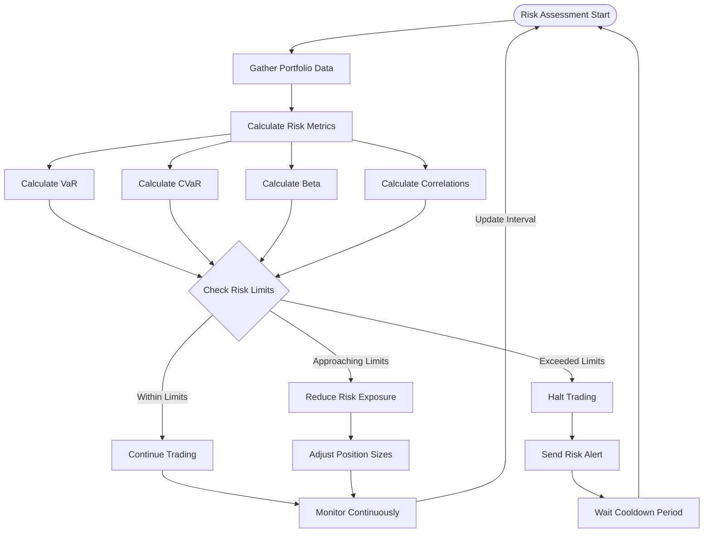
```mermaid
flowchart TD
    Start([Risk Assessment Start]) --> GatherData[Gather Portfolio Data]
    GatherData --> CalcMetrics[Calculate Risk Metrics]
    
    CalcMetrics --> VaR[Calculate VaR]
    CalcMetrics --> CVaR[Calculate CVaR]
    CalcMetrics --> Beta[Calculate Beta]
    CalcMetrics --> Correlation[Calculate Correlations]
    
    VaR --> CheckLimits{Check Risk Limits}
    CVaR --> CheckLimits
    Beta --> CheckLimits
    Correlation --> CheckLimits
    
    CheckLimits --> |Within Limits| ContinueTrading[Continue Trading]
    CheckLimits --> |Approaching Limits| ReduceRisk[Reduce Risk Exposure]
    CheckLimits --> |Exceeded Limits| HaltTrading[Halt Trading]
    
    ContinueTrading --> Monitor[Monitor Continuously]
    ReduceRisk --> AdjustPositions[Adjust Position Sizes]
    HaltTrading --> SendAlert[Send Risk Alert]
    
    AdjustPositions --> Monitor
    SendAlert --> WaitCooldown[Wait Cooldown Period]
    WaitCooldown --> Start
    
    Monitor --> |Update Interval| Start
```

---

## Execution System

### 1. Base Executor Interface

Abstract interface for all trading executors:

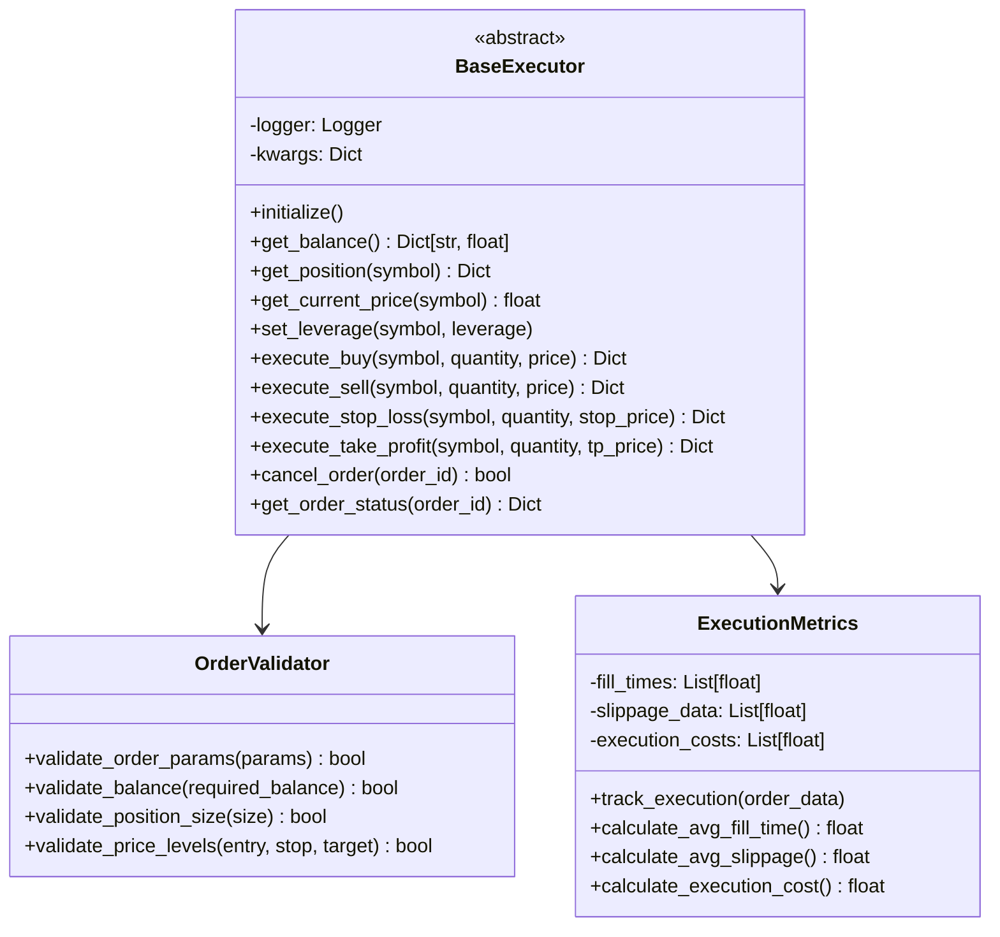
```mermaid
classDiagram
    class BaseExecutor {
        <<abstract>>
        -logger: Logger
        -kwargs: Dict
        +initialize()
        +get_balance() Dict[str, float]
        +get_position(symbol) Dict
        +get_current_price(symbol) float
        +set_leverage(symbol, leverage)
        +execute_buy(symbol, quantity, price) Dict
        +execute_sell(symbol, quantity, price) Dict
        +execute_stop_loss(symbol, quantity, stop_price) Dict
        +execute_take_profit(symbol, quantity, tp_price) Dict
        +cancel_order(order_id) bool
        +get_order_status(order_id) Dict
    }
    
    class OrderValidator {
        +validate_order_params(params) bool
        +validate_balance(required_balance) bool
        +validate_position_size(size) bool
        +validate_price_levels(entry, stop, target) bool
    }
    
    class ExecutionMetrics {
        -fill_times: List[float]
        -slippage_data: List[float]
        -execution_costs: List[float]
        +track_execution(order_data)
        +calculate_avg_fill_time() float
        +calculate_avg_slippage() float
        +calculate_execution_cost() float
    }
    
    BaseExecutor --> OrderValidator
    BaseExecutor --> ExecutionMetrics
```

### 2. Binance Executor Implementation

Concrete implementation for Binance exchange:

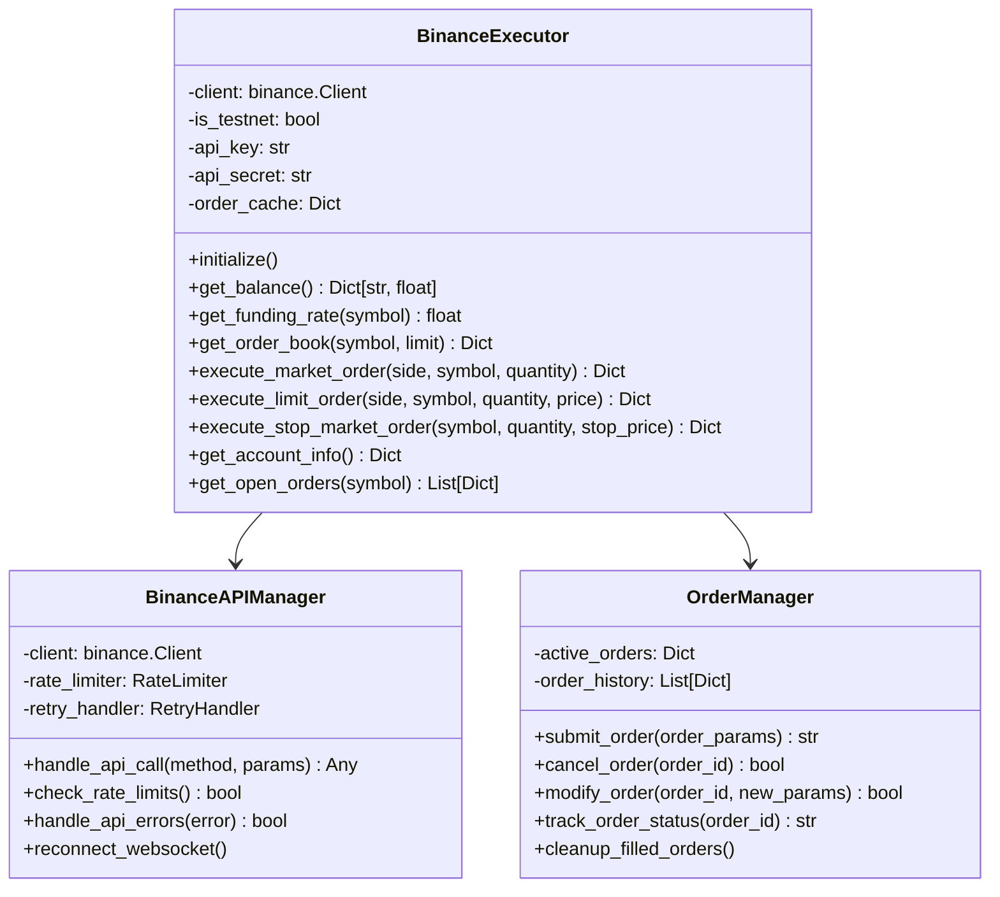
```mermaid
classDiagram
    class BinanceExecutor {
        -client: binance.Client
        -is_testnet: bool
        -api_key: str
        -api_secret: str
        -order_cache: Dict
        +initialize()
        +get_balance() Dict[str, float]
        +get_funding_rate(symbol) float
        +get_order_book(symbol, limit) Dict
        +execute_market_order(side, symbol, quantity) Dict
        +execute_limit_order(side, symbol, quantity, price) Dict
        +execute_stop_market_order(symbol, quantity, stop_price) Dict
        +get_account_info() Dict
        +get_open_orders(symbol) List[Dict]
    }
    
    class BinanceAPIManager {
        -client: binance.Client
        -rate_limiter: RateLimiter
        -retry_handler: RetryHandler
        +handle_api_call(method, params) Any
        +check_rate_limits() bool
        +handle_api_errors(error) bool
        +reconnect_websocket()
    }
    
    class OrderManager {
        -active_orders: Dict
        -order_history: List[Dict]
        +submit_order(order_params) str
        +cancel_order(order_id) bool
        +modify_order(order_id, new_params) bool
        +track_order_status(order_id) str
        +cleanup_filled_orders()
    }
    
    BinanceExecutor --> BinanceAPIManager
    BinanceExecutor --> OrderManager
```

### 3. Execution Engine

Coordinates order execution and management:

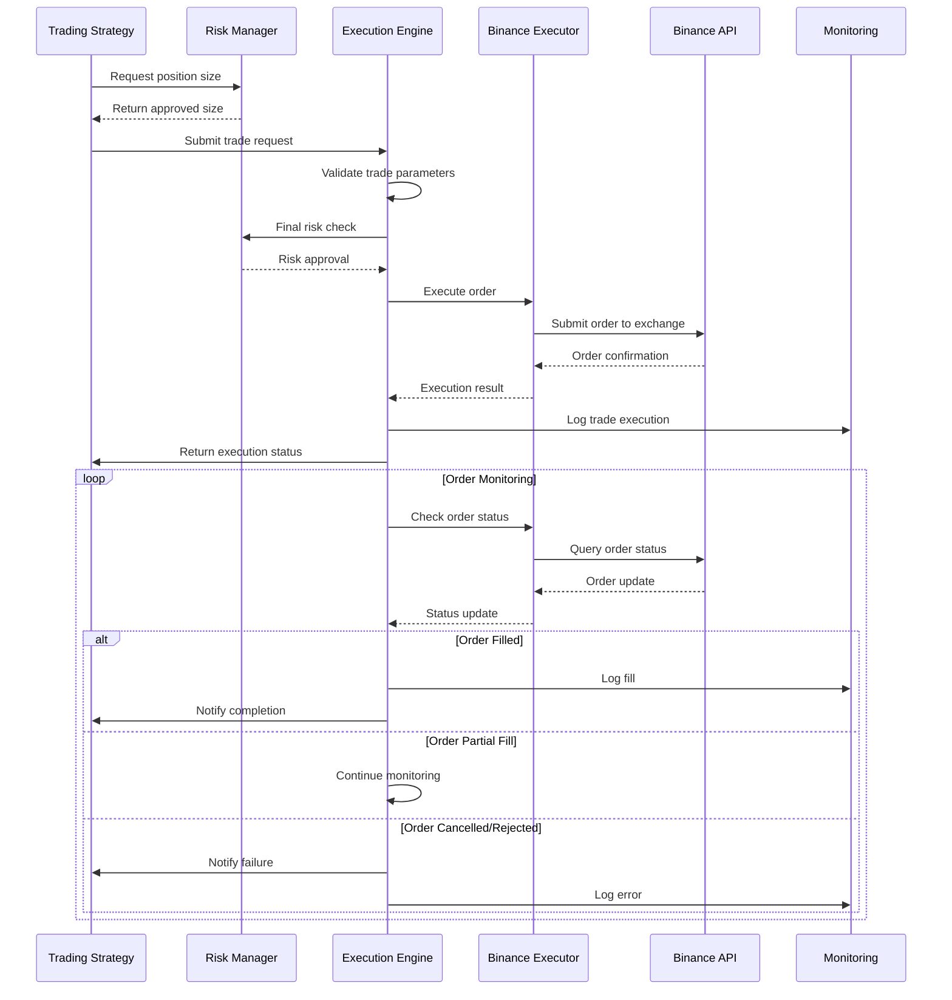
```mermaid
sequenceDiagram
    participant Strategy as Trading Strategy
    participant Risk as Risk Manager
    participant Engine as Execution Engine
    participant Executor as Binance Executor
    participant API as Binance API
    participant Monitor as Monitoring
    
    Strategy->>Risk: Request position size
    Risk-->>Strategy: Return approved size
    
    Strategy->>Engine: Submit trade request
    Engine->>Engine: Validate trade parameters
    Engine->>Risk: Final risk check
    Risk-->>Engine: Risk approval
    
    Engine->>Executor: Execute order
    Executor->>API: Submit order to exchange
    API-->>Executor: Order confirmation
    Executor-->>Engine: Execution result
    
    Engine->>Monitor: Log trade execution
    Engine->>Strategy: Return execution status
    
    loop Order Monitoring
        Engine->>Executor: Check order status
        Executor->>API: Query order status
        API-->>Executor: Order update
        Executor-->>Engine: Status update
        
        alt Order Filled
            Engine->>Monitor: Log fill
            Engine->>Strategy: Notify completion
        else Order Partial Fill
            Engine->>Engine: Continue monitoring
        else Order Cancelled/Rejected
            Engine->>Strategy: Notify failure
            Engine->>Monitor: Log error
        end
    end
```

---

## Portfolio Management

### 1. Portfolio Tracker

Manages positions and portfolio state:

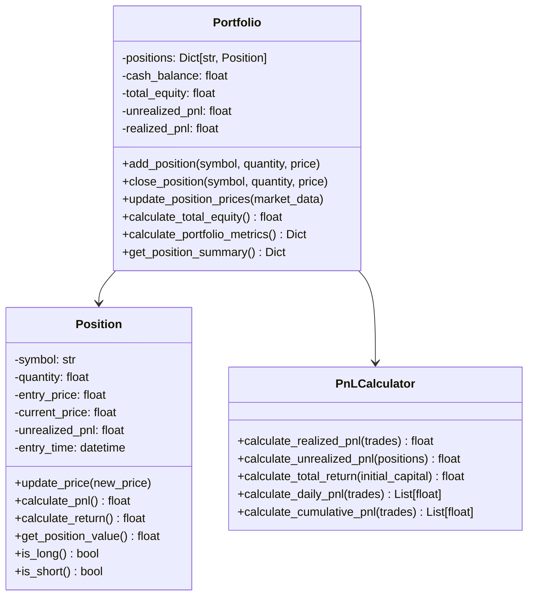
```mermaid
classDiagram
    class Portfolio {
        -positions: Dict[str, Position]
        -cash_balance: float
        -total_equity: float
        -unrealized_pnl: float
        -realized_pnl: float
        +add_position(symbol, quantity, price)
        +close_position(symbol, quantity, price)
        +update_position_prices(market_data)
        +calculate_total_equity() float
        +calculate_portfolio_metrics() Dict
        +get_position_summary() Dict
    }
    
    class Position {
        -symbol: str
        -quantity: float
        -entry_price: float
        -current_price: float
        -unrealized_pnl: float
        -entry_time: datetime
        +update_price(new_price)
        +calculate_pnl() float
        +calculate_return() float
        +get_position_value() float
        +is_long() bool
        +is_short() bool
    }
    
    class PnLCalculator {
        +calculate_realized_pnl(trades) float
        +calculate_unrealized_pnl(positions) float
        +calculate_total_return(initial_capital) float
        +calculate_daily_pnl(trades) List[float]
        +calculate_cumulative_pnl(trades) List[float]
    }
    
    Portfolio --> Position
    Portfolio --> PnLCalculator
```

### 2. Performance Analytics

Comprehensive performance analysis and reporting:

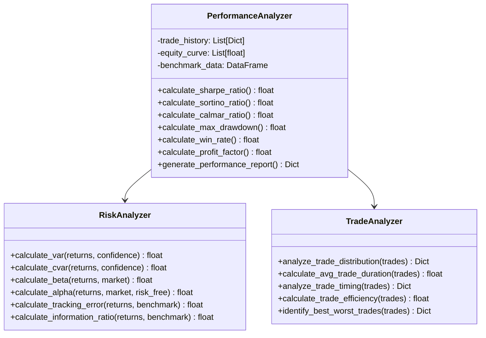
```mermaid
classDiagram
    class PerformanceAnalyzer {
        -trade_history: List[Dict]
        -equity_curve: List[float]
        -benchmark_data: DataFrame
        +calculate_sharpe_ratio() float
        +calculate_sortino_ratio() float
        +calculate_calmar_ratio() float
        +calculate_max_drawdown() float
        +calculate_win_rate() float
        +calculate_profit_factor() float
        +generate_performance_report() Dict
    }
    
    class RiskAnalyzer {
        +calculate_var(returns, confidence) float
        +calculate_cvar(returns, confidence) float
        +calculate_beta(returns, market) float
        +calculate_alpha(returns, market, risk_free) float
        +calculate_tracking_error(returns, benchmark) float
        +calculate_information_ratio(returns, benchmark) float
    }
    
    class TradeAnalyzer {
        +analyze_trade_distribution(trades) Dict
        +calculate_avg_trade_duration(trades) float
        +analyze_trade_timing(trades) Dict
        +calculate_trade_efficiency(trades) float
        +identify_best_worst_trades(trades) Dict
    }
    
    PerformanceAnalyzer --> RiskAnalyzer
    PerformanceAnalyzer --> TradeAnalyzer
```

---

## Trading Workflow

### Complete Trading Cycle

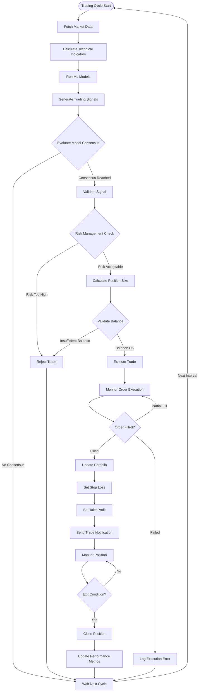
```mermaid
flowchart TD
    Start([Trading Cycle Start]) --> FetchData[Fetch Market Data]
    FetchData --> CalcIndicators[Calculate Technical Indicators]
    CalcIndicators --> RunModels[Run ML Models]
    RunModels --> GenerateSignals[Generate Trading Signals]
    
    GenerateSignals --> EvaluateConsensus{Evaluate Model Consensus}
    EvaluateConsensus --> |No Consensus| WaitNext[Wait Next Cycle]
    EvaluateConsensus --> |Consensus Reached| ValidateSignal[Validate Signal]
    
    ValidateSignal --> CheckRisk{Risk Management Check}
    CheckRisk --> |Risk Too High| RejectTrade[Reject Trade]
    CheckRisk --> |Risk Acceptable| CalcPositionSize[Calculate Position Size]
    
    CalcPositionSize --> ValidateBalance{Validate Balance}
    ValidateBalance --> |Insufficient Balance| RejectTrade
    ValidateBalance --> |Balance OK| ExecuteTrade[Execute Trade]
    
    ExecuteTrade --> MonitorExecution[Monitor Order Execution]
    MonitorExecution --> CheckFill{Order Filled?}
    CheckFill --> |Partial Fill| MonitorExecution
    CheckFill --> |Filled| UpdatePortfolio[Update Portfolio]
    CheckFill --> |Failed| LogError[Log Execution Error]
    
    UpdatePortfolio --> SetStopLoss[Set Stop Loss]
    SetStopLoss --> SetTakeProfit[Set Take Profit]
    SetTakeProfit --> SendNotification[Send Trade Notification]
    
    SendNotification --> MonitorPosition[Monitor Position]
    MonitorPosition --> CheckExit{Exit Condition?}
    CheckExit --> |No| MonitorPosition
    CheckExit --> |Yes| ClosePosition[Close Position]
    
    ClosePosition --> UpdateMetrics[Update Performance Metrics]
    UpdateMetrics --> WaitNext
    
    RejectTrade --> WaitNext
    LogError --> WaitNext
    WaitNext --> |Next Interval| Start
```

### Risk Management Integration

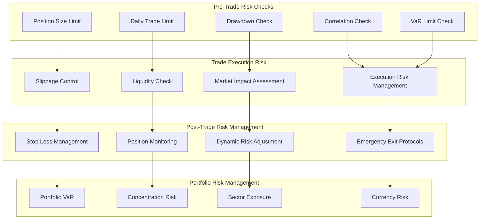
```mermaid
graph TB
    subgraph "Pre-Trade Risk Checks"
        PositionLimit[Position Size Limit]
        DailyTradeLimit[Daily Trade Limit]
        DrawdownCheck[Drawdown Check]
        CorrelationCheck[Correlation Check]
        VaRCheck[VaR Limit Check]
    end
    
    subgraph "Trade Execution Risk"
        SlippageControl[Slippage Control]
        LiquidityCheck[Liquidity Check]
        MarketImpact[Market Impact Assessment]
        ExecutionRisk[Execution Risk Management]
    end
    
    subgraph "Post-Trade Risk Management"
        StopLossManagement[Stop Loss Management]
        PositionMonitoring[Position Monitoring]
        RiskAdjustment[Dynamic Risk Adjustment]
        EmergencyExit[Emergency Exit Protocols]
    end
    
    subgraph "Portfolio Risk Management"
        PortfolioVaR[Portfolio VaR]
        ConcentrationRisk[Concentration Risk]
        SectorExposure[Sector Exposure]
        CurrencyRisk[Currency Risk]
    end
    
    PositionLimit --> SlippageControl
    DailyTradeLimit --> LiquidityCheck
    DrawdownCheck --> MarketImpact
    CorrelationCheck --> ExecutionRisk
    VaRCheck --> ExecutionRisk
    
    SlippageControl --> StopLossManagement
    LiquidityCheck --> PositionMonitoring
    MarketImpact --> RiskAdjustment
    ExecutionRisk --> EmergencyExit
    
    StopLossManagement --> PortfolioVaR
    PositionMonitoring --> ConcentrationRisk
    RiskAdjustment --> SectorExposure
    EmergencyExit --> CurrencyRisk
```

---

## Configuration and Parameters

### Trading Configuration

```yaml
# trading_config.yaml
trading:
  strategy:
    name: "ensemble_strategy"
    models:
      - name: "random_forest"
        weight: 0.4
        enabled: true
      - name: "neural_network"
        weight: 0.4
        enabled: true
      - name: "transformer"
        weight: 0.2
        enabled: false
    
    consensus:
      threshold: 0.6
      min_models: 2
      confidence_threshold: 0.7
  
  risk_management:
    max_position_size: 0.1  # 10% of portfolio
    max_daily_trades: 5
    max_drawdown: 0.15  # 15%
    daily_loss_limit: 0.05  # 5%
    stop_loss_pct: 0.02  # 2%
    take_profit_pct: 0.04  # 4%
    
    position_sizing:
      method: "kelly_criterion"  # fixed, volatility_adjusted, kelly_criterion
      base_size: 0.02  # 2% of portfolio
      volatility_adjustment: true
      max_leverage: 3
  
  execution:
    exchange: "binance"
    order_type: "market"  # market, limit
    slippage_tolerance: 0.001  # 0.1%
    execution_timeout: 30  # seconds
    
  monitoring:
    update_interval: 5  # seconds
    performance_tracking: true
    telegram_notifications: true
    risk_alerts: true
```

### Strategy Parameters

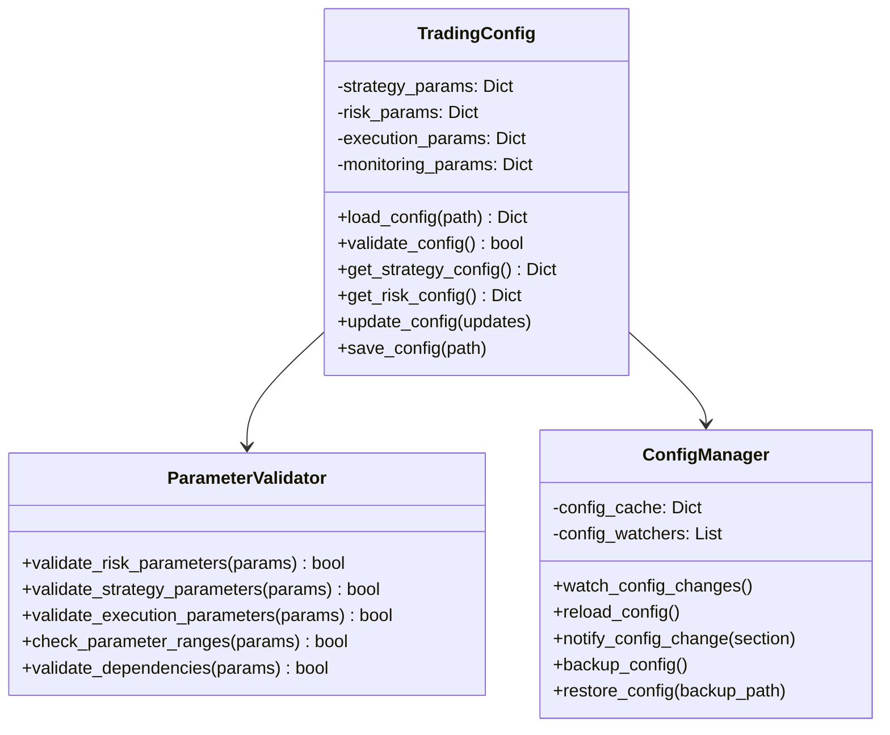
```mermaid
classDiagram
    class TradingConfig {
        -strategy_params: Dict
        -risk_params: Dict
        -execution_params: Dict
        -monitoring_params: Dict
        +load_config(path) Dict
        +validate_config() bool
        +get_strategy_config() Dict
        +get_risk_config() Dict
        +update_config(updates)
        +save_config(path)
    }
    
    class ParameterValidator {
        +validate_risk_parameters(params) bool
        +validate_strategy_parameters(params) bool
        +validate_execution_parameters(params) bool
        +check_parameter_ranges(params) bool
        +validate_dependencies(params) bool
    }
    
    class ConfigManager {
        -config_cache: Dict
        -config_watchers: List
        +watch_config_changes()
        +reload_config()
        +notify_config_change(section)
        +backup_config()
        +restore_config(backup_path)
    }
    
    TradingConfig --> ParameterValidator
    TradingConfig --> ConfigManager
```

---

## Error Handling and Recovery

### Error Management System

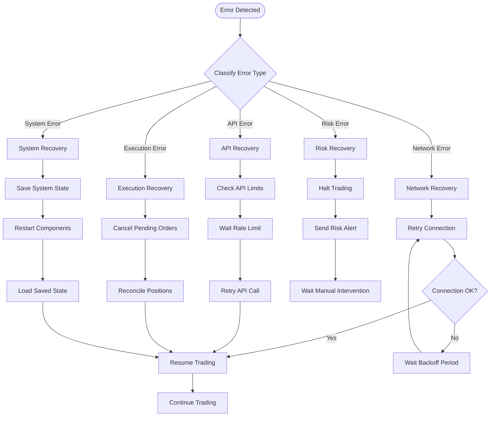
```mermaid
flowchart TD
    Error([Error Detected]) --> ClassifyError{Classify Error Type}
    
    ClassifyError --> |Network Error| NetworkRecovery[Network Recovery]
    ClassifyError --> |API Error| APIRecovery[API Recovery]
    ClassifyError --> |Execution Error| ExecutionRecovery[Execution Recovery]
    ClassifyError --> |Risk Error| RiskRecovery[Risk Recovery]
    ClassifyError --> |System Error| SystemRecovery[System Recovery]
    
    NetworkRecovery --> RetryConnection[Retry Connection]
    RetryConnection --> CheckConnection{Connection OK?}
    CheckConnection --> |Yes| Resume[Resume Trading]
    CheckConnection --> |No| WaitBackoff[Wait Backoff Period]
    WaitBackoff --> RetryConnection
    
    APIRecovery --> CheckAPILimits[Check API Limits]
    CheckAPILimits --> WaitRateLimit[Wait Rate Limit]
    WaitRateLimit --> RetryAPI[Retry API Call]
    RetryAPI --> Resume
    
    ExecutionRecovery --> CancelPendingOrders[Cancel Pending Orders]
    CancelPendingOrders --> ReconcilePositions[Reconcile Positions]
    ReconcilePositions --> Resume
    
    RiskRecovery --> HaltTrading[Halt Trading]
    HaltTrading --> SendAlert[Send Risk Alert]
    SendAlert --> WaitManualIntervention[Wait Manual Intervention]
    
    SystemRecovery --> SaveState[Save System State]
    SaveState --> RestartComponents[Restart Components]
    RestartComponents --> LoadState[Load Saved State]
    LoadState --> Resume
    
    Resume --> ContinueTrading[Continue Trading]
```

---

## Testing and Validation

### Trading System Tests

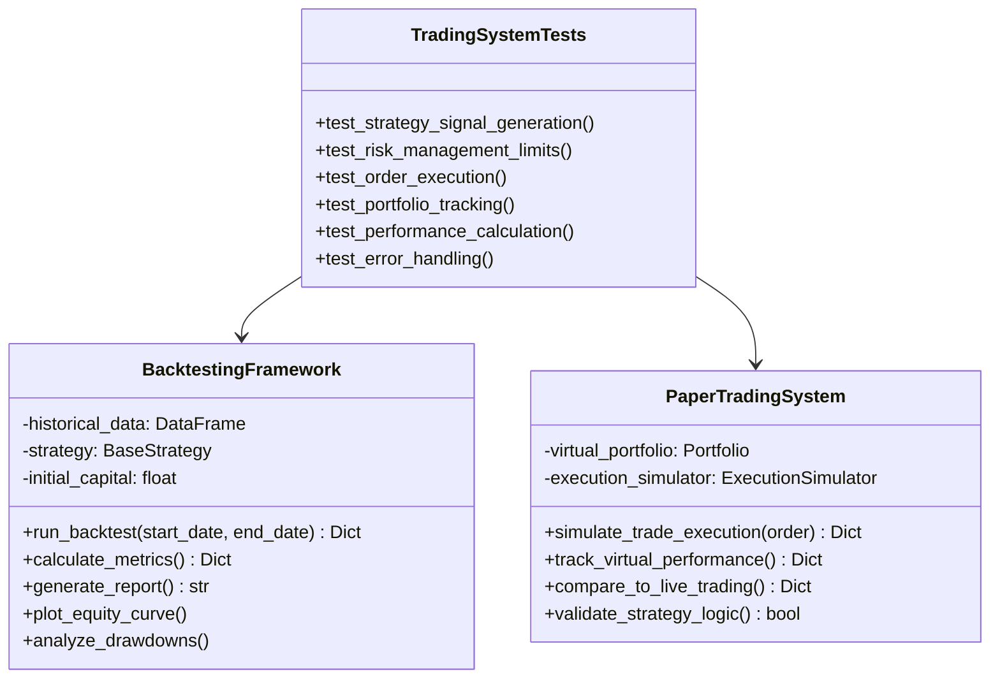
```mermaid
classDiagram
    class TradingSystemTests {
        +test_strategy_signal_generation()
        +test_risk_management_limits()
        +test_order_execution()
        +test_portfolio_tracking()
        +test_performance_calculation()
        +test_error_handling()
    }
    
    class BacktestingFramework {
        -historical_data: DataFrame
        -strategy: BaseStrategy
        -initial_capital: float
        +run_backtest(start_date, end_date) Dict
        +calculate_metrics() Dict
        +generate_report() str
        +plot_equity_curve()
        +analyze_drawdowns()
    }
    
    class PaperTradingSystem {
        -virtual_portfolio: Portfolio
        -execution_simulator: ExecutionSimulator
        +simulate_trade_execution(order) Dict
        +track_virtual_performance() Dict
        +compare_to_live_trading() Dict
        +validate_strategy_logic() bool
    }
    
    TradingSystemTests --> BacktestingFramework
    TradingSystemTests --> PaperTradingSystem
```

---

## Performance Optimization

### Optimization Strategies

1. **Execution Optimization**
   - Order routing optimization
   - Latency reduction techniques
   - Smart order management
   - Execution cost minimization

2. **Risk Optimization**
   - Dynamic risk adjustment
   - Portfolio optimization
   - Correlation-based position sizing
   - Regime-aware risk management

3. **Strategy Optimization**
   - Parameter optimization
   - Model ensemble optimization
   - Signal timing optimization
   - Multi-timeframe coordination

---

## Future Enhancements

### Planned Improvements

1. **Advanced Strategies**
   - Multi-asset strategies
   - Cross-exchange arbitrage
   - Options strategies integration
   - Futures and derivatives support

2. **Enhanced Risk Management**
   - Real-time stress testing
   - Scenario analysis
   - Dynamic hedging strategies
   - Regulatory compliance monitoring

3. **Execution Improvements**
   - Smart order routing
   - Dark pool integration
   - Algorithmic execution strategies
   - Transaction cost analysis

4. **Portfolio Management**
   - Multi-strategy allocation
   - Dynamic rebalancing
   - Factor-based investing
   - ESG integration

---

## References

### Core Files
- `trading/strategies/base_strategy.py` - Strategy interface
- `trading/strategies/ensemble_strategy.py` - Ensemble implementation
- `trading/execution/base_executor.py` - Execution interface
- `trading/execution/binance_executor.py` - Binance implementation
- `trading/risk/advanced_risk_manager.py` - Risk management

### Related Documentation
- [Architecture Overview](../README.md)
- [Training Pipeline](training.md)
- [Utilities & Monitoring](utilities_monitoring.md)
- [Random Forest Model](random_forest.md)

---

This documentation will be continuously updated as new trading features and strategies are added to the system.
