# ELVIS Trading System - Model Training Documentation

> ⚠️ **Partially outdated (audited 2026-07-02).** A large share of this document's concrete claims — file paths, class/param names, config files, and library choices (e.g. TFDF/Optuna/SHAP, `trading_config.yaml`) — no longer match the code. Treat the source under `core/`, `trading/`, and `training/` as the authority until this doc is rewritten.


## Overview

This document provides comprehensive documentation of the model training pipeline for the ELVIS trading system. It covers the architecture, components, data flow, training processes, evaluation methods, and configuration management for both traditional ML models and reinforcement learning agents.

---

## Training Architecture

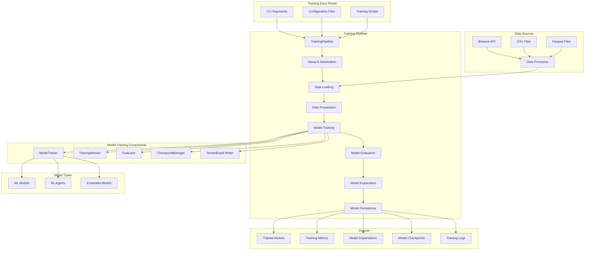

---

## Core Components

### 1. Training Pipeline (`training/train_models.py`)

The main orchestrator for the entire training process:

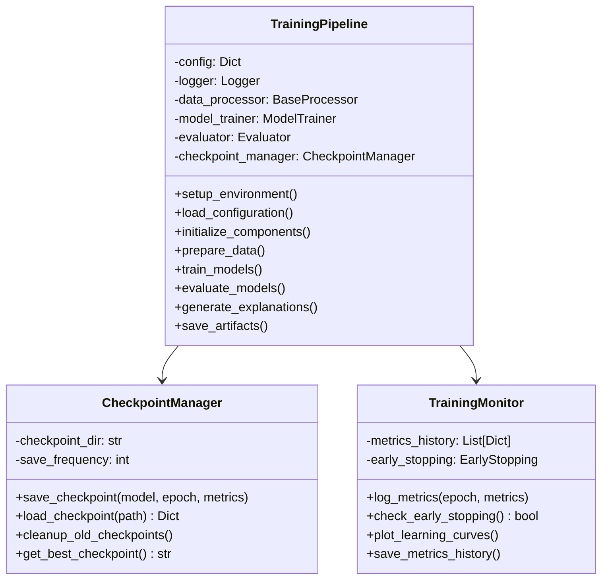

**Key Features:**
- Signal handlers for graceful interruption
- Distributed training support
- Comprehensive logging and monitoring
- Automatic directory creation for outputs
- Configuration validation and loading

### 2. Model Trainer (`training/models/model_trainer.py`)

Handles model-specific training logic:

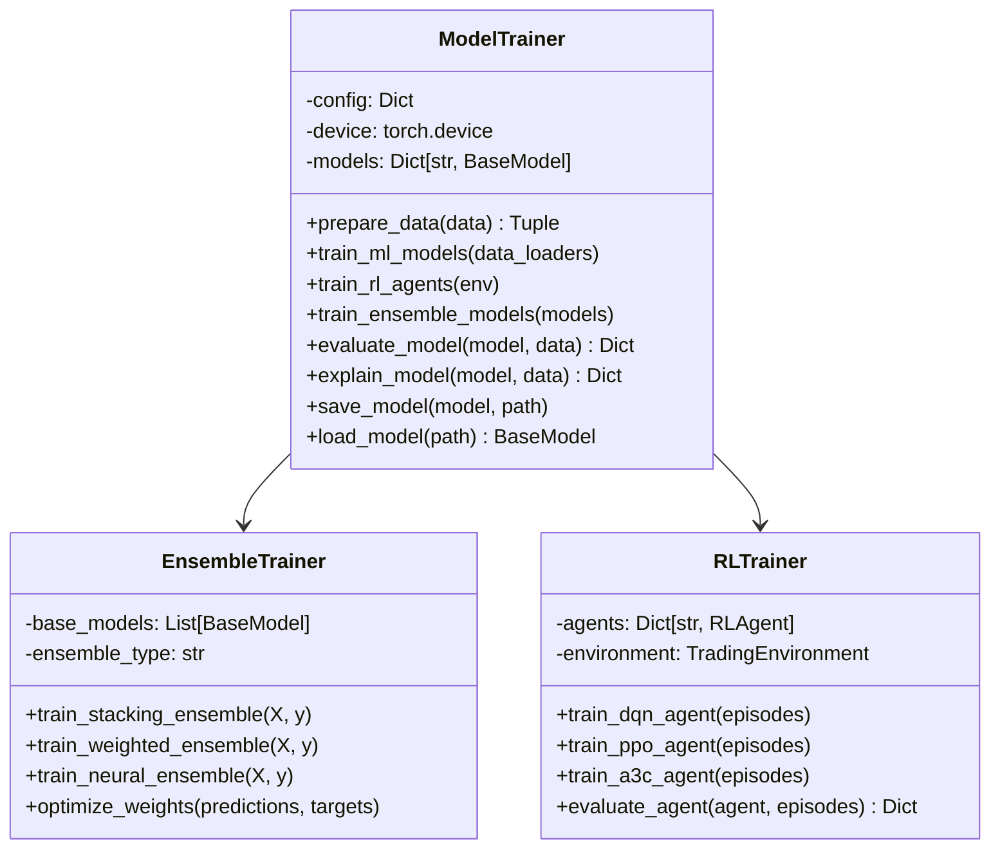

**Supported Models:**
- **Traditional ML:** Random Forest, Neural Networks, Transformers
- **Ensemble Methods:** Stacking, Weighted Voting, Neural Ensembles
- **Reinforcement Learning:** DQN, PPO, A3C agents

### 3. Evaluator (`training/models/evaluator.py`)

Monitors and evaluates model performance:

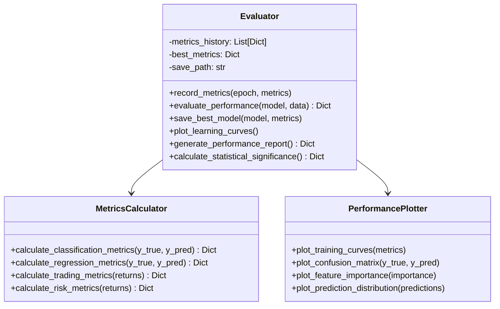

---

## Data Processing Pipeline

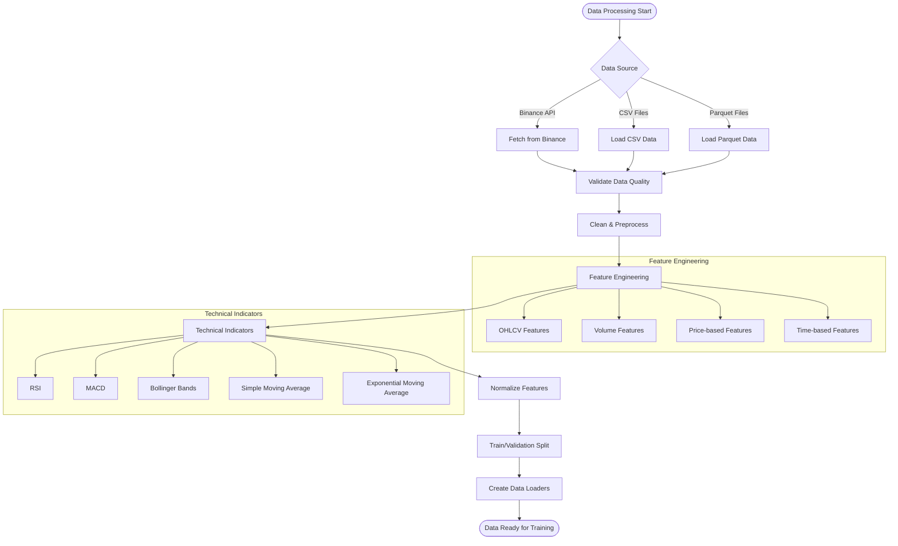

### Data Sources and Formats

- **Binance API:** Real-time and historical OHLCV data
- **CSV Files:** Processed training data with features and targets
- **Parquet Files:** Compressed columnar data format for large datasets

### Feature Engineering

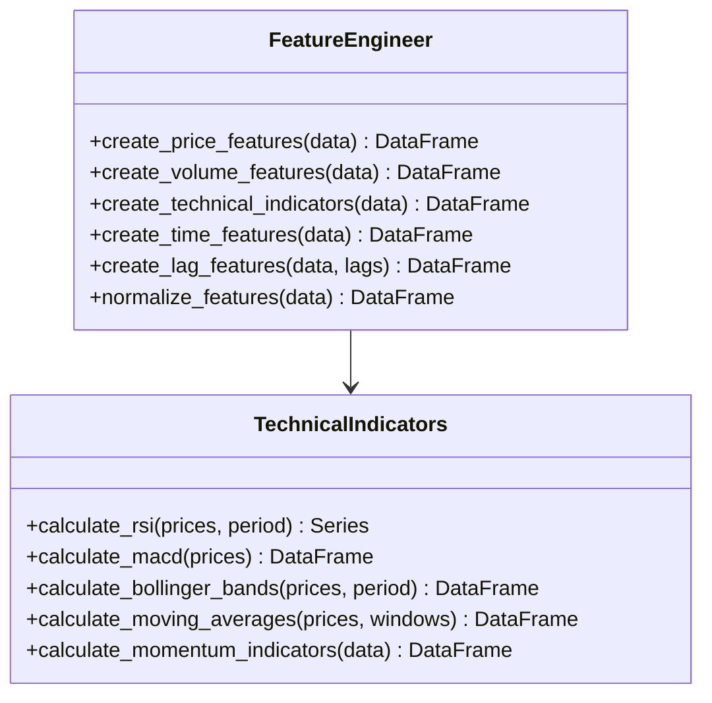

---

## Training Workflow

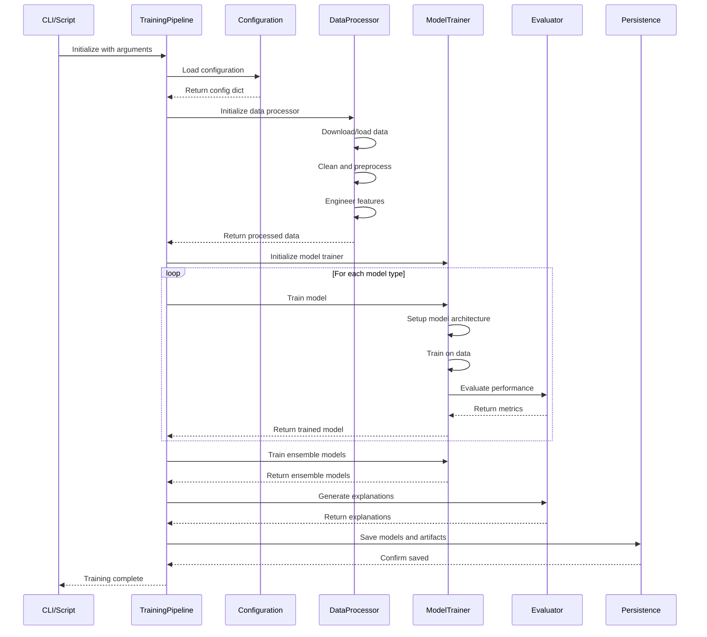

---

## Configuration Management

### Model Configuration (`training/config/model_config.yaml`)

```yaml
# Feature Configuration
features:
  feature_columns: ['feature1', 'feature2', 'feature3']
  target_column: 'price'
  normalization: 'standard'  # standard, minmax, robust

# Model Parameters
models:
  transformer:
    d_model: 512
    nhead: 8
    num_layers: 6
    dropout: 0.1
    max_seq_length: 100
  
  random_forest:
    n_estimators: 100
    max_depth: 10
    min_samples_split: 2
  
  neural_network:
    hidden_layers: [128, 64, 32]
    activation: 'relu'
    dropout: 0.2

# Training Parameters
training:
  batch_size: 32
  epochs: 100
  learning_rate: 0.001
  early_stopping_patience: 10
  checkpoint_frequency: 5

# RL Agent Settings
reinforcement_learning:
  agents: ['dqn', 'ppo', 'a3c']
  episodes: 1000
  environment: 'trading_env'
  reward_function: 'sharpe_ratio'

# Output Paths
paths:
  models: './models'
  logs: './logs'
  checkpoints: './checkpoints'
  explanations: './explanations'
```

### Configuration Classes

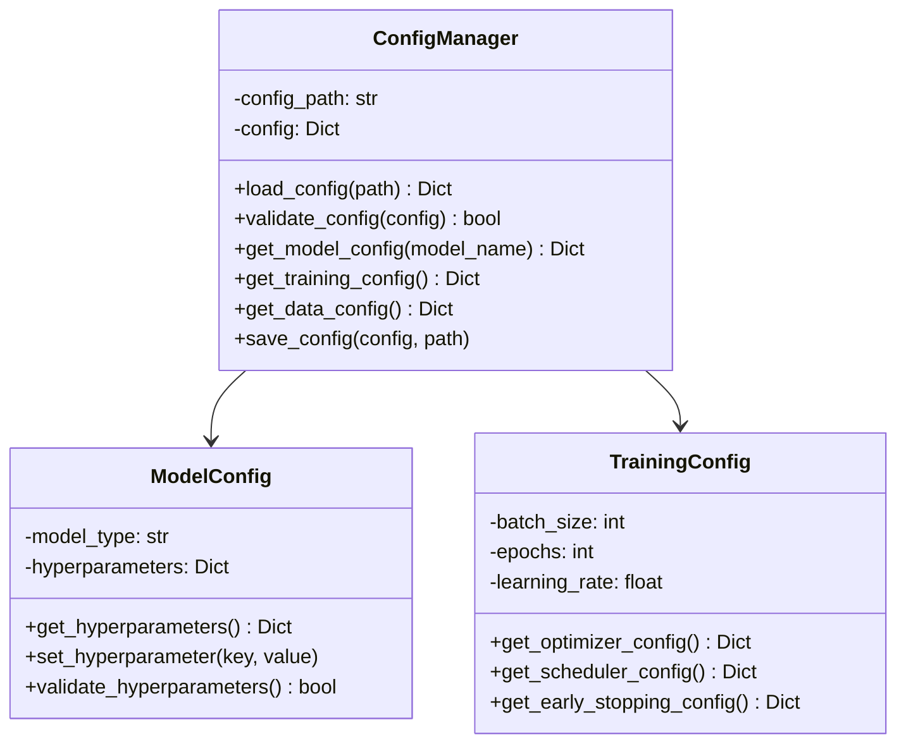

---

## Model Training Processes

### Traditional ML Models

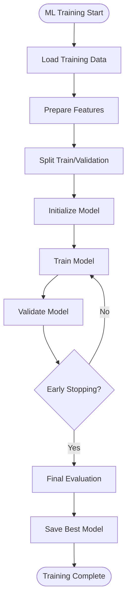

### Reinforcement Learning Agents

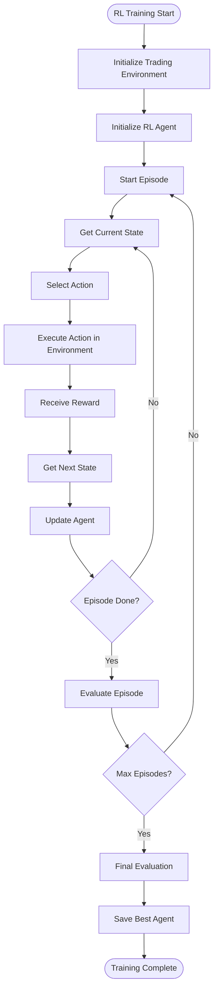

---

## Evaluation and Metrics

### Performance Metrics

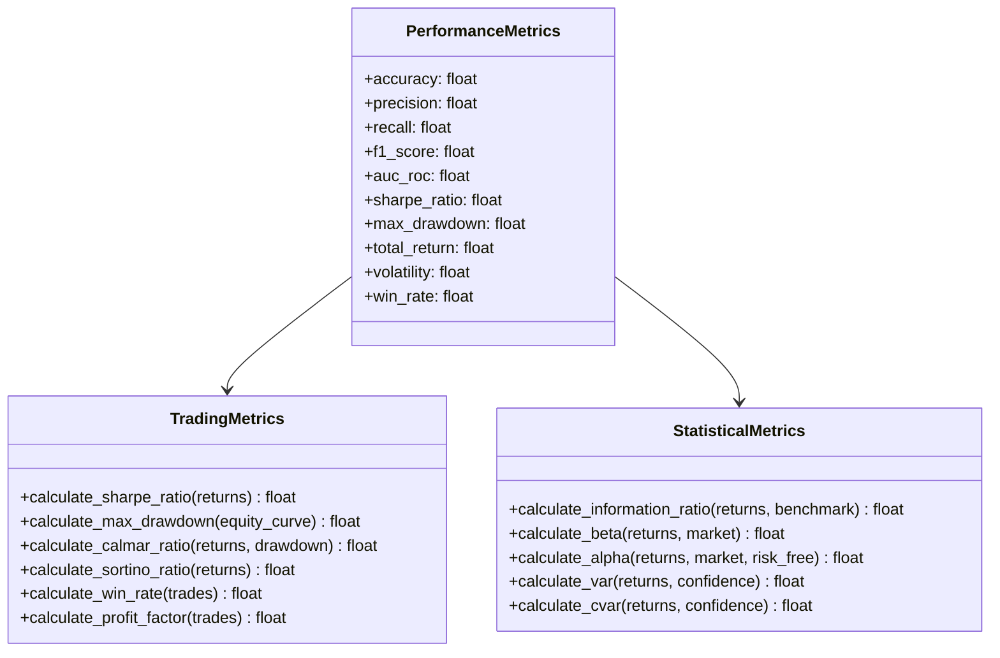

---

## Model Explanation and Interpretability

### Explanation Methods

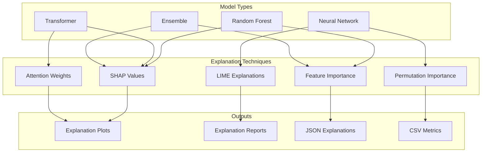

---

## Known Issues and Limitations

### Current Limitations
- **RL Agent Explanations:** Currently unsupported due to incompatibility with SHAP/LIME
- **TensorFlow Warnings:** Version compatibility issues with SHAP explainers
- **Device Mismatch:** Handled by ensuring model and data are on the same device
- **Memory Usage:** Large models may require distributed training for optimal performance

### Planned Improvements
- Enhanced RL agent explanation support using specialized techniques
- Improved memory management for large-scale training
- Advanced hyperparameter optimization with Optuna integration
- Real-time training monitoring with MLflow integration

---

## Usage Examples

### Basic Training Command
```bash
python training/train_models.py --config training/config/model_config.yaml --data data/processed/training_data.csv
```

### Advanced Training with Custom Parameters
```bash
python training/train_models.py \
    --config training/config/model_config.yaml \
    --data data/processed/training_data.csv \
    --models transformer,random_forest,ensemble \
    --epochs 200 \
    --batch-size 64 \
    --distributed
```

---

## References

### Core Files
- `training/train_models.py` - Main training pipeline
- `training/models/model_trainer.py` - Model training logic
- `training/models/evaluator.py` - Performance evaluation
- `training/config/model_config.yaml` - Configuration file
- `training/data/data_downloader.py` - Data acquisition
- `core/data/processors/base_processor.py` - Data processing interface

### Related Documentation
- [Random Forest Model Documentation](random_forest.md)
- [Future Improvements](future_improvements.md)
- [Architecture Overview](../README.md)

---

This documentation will be continuously updated as the training pipeline evolves and new features are added.
