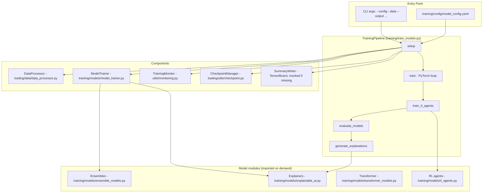
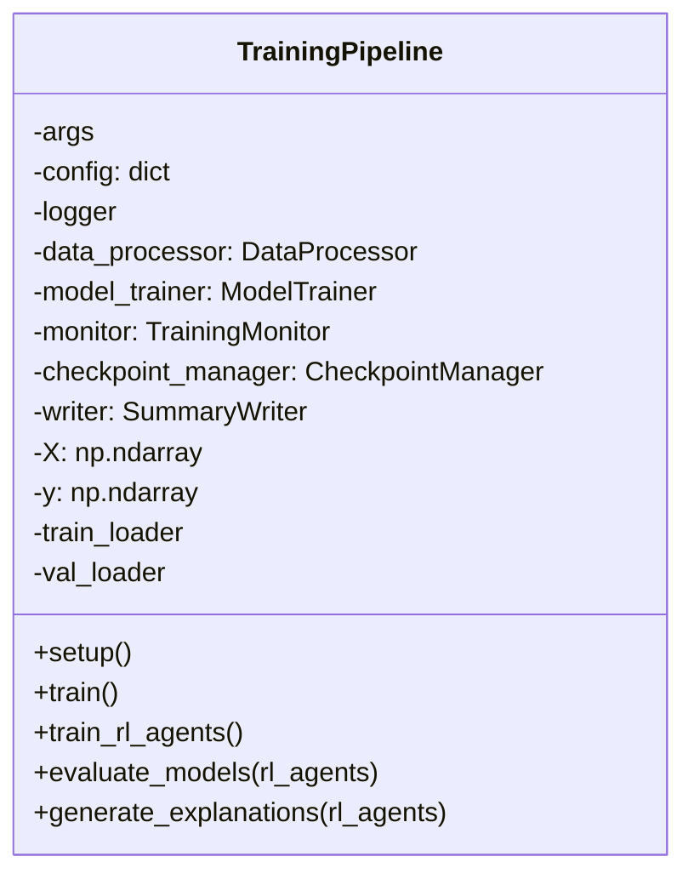
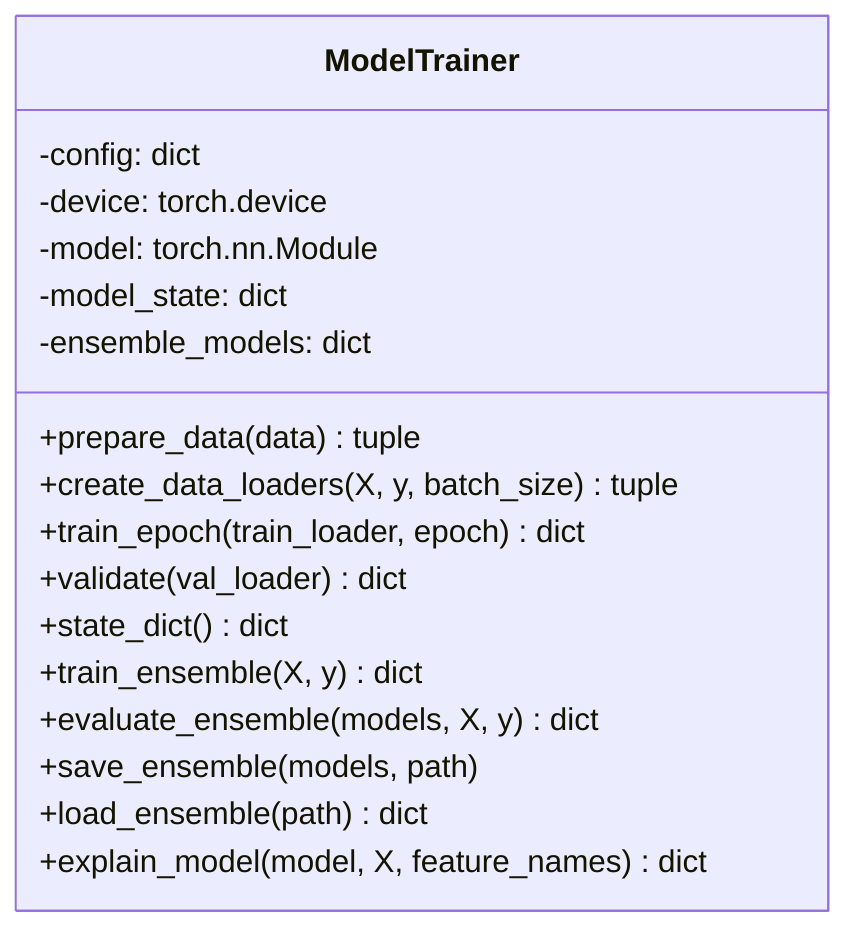
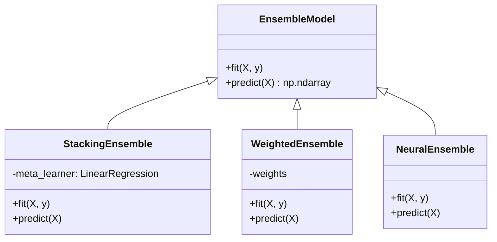
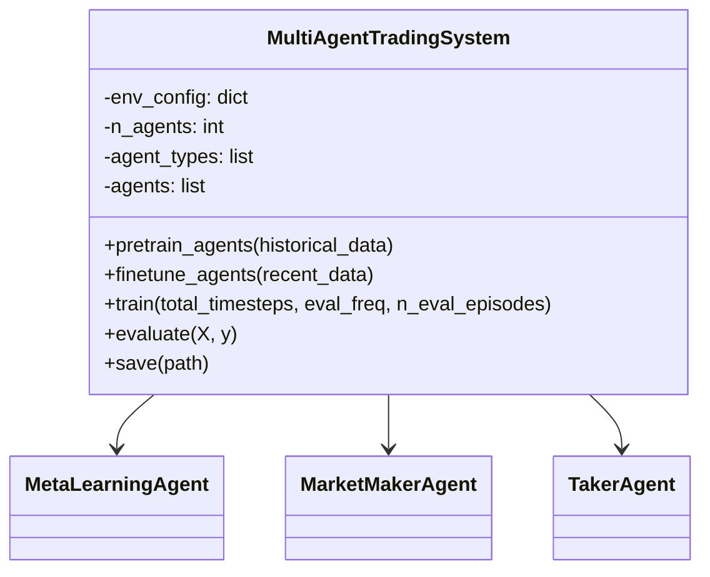
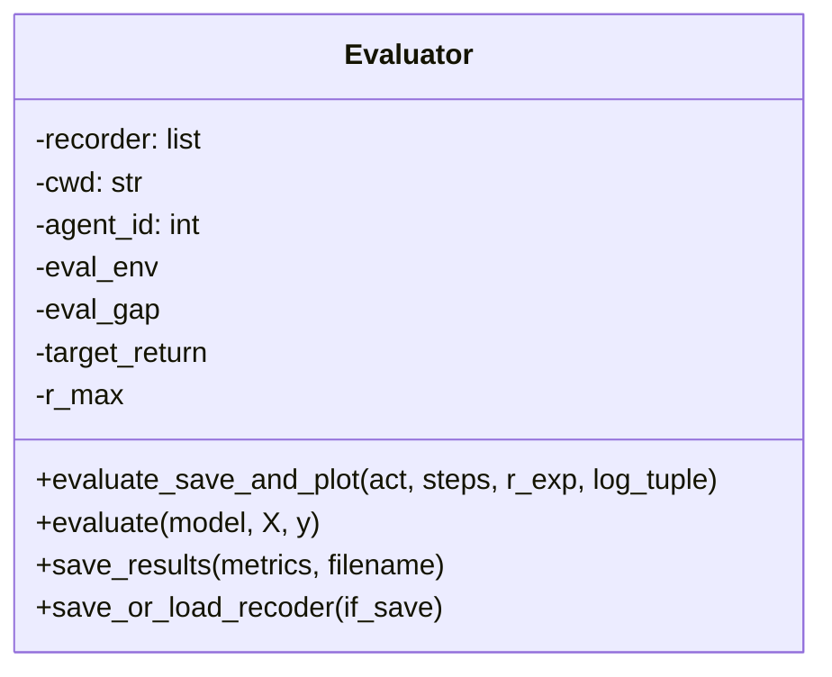
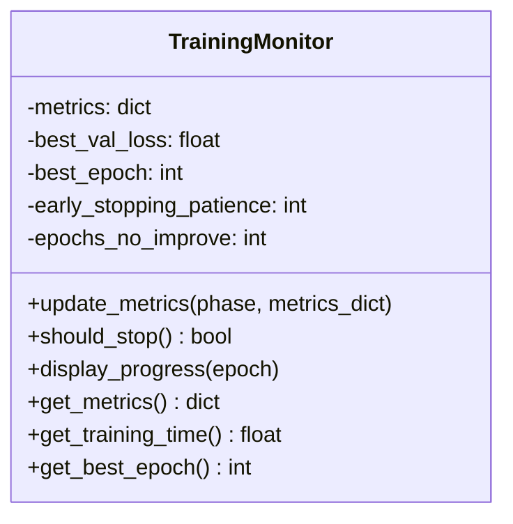
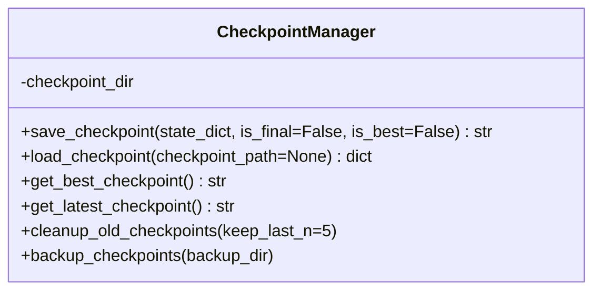

# ELVIS Trading System - Model Training Documentation

> **Compatibility paper-training reference.** Training does not deploy or
> activate a model. Python 3.14 is required and `ACTIVE` remains a **NO-GO**.

## Overview

This document describes the model training pipeline for the ELVIS trading
system. It covers the architecture, the concrete classes and methods, the data
flow, the configuration file, and how to actually run training.

The pipeline is orchestrated by `training/train_models.py`. It trains a small
PyTorch regression model epoch-by-epoch, optionally trains reinforcement-learning
agents, evaluates, and writes explanation artifacts. Ensemble training,
hyperparameter optimization, and explainability live in sibling modules that are
imported on demand.

> Reality check: several optional libraries may be absent from CI or minimal
> environments — `optuna`, `shap`, `lime`, and `plotly`. Their imports are
> guarded and their features remain inert when missing. The supported Python
> 3.14 distribution has no Keras training backend; the legacy neural wrapper
> can only attempt to read an old artefact when a backend is separately
> supplied. `xgboost` and `lightgbm` are
> likewise import-guarded: when present they are added as ensemble base models,
> and when absent the ensembles simply drop those members. Install the full set
> with the `ml` extra (`pip install -e '.[ml]'`).

---

## Training Architecture



---

## Core Components

### 1. Training Pipeline (`training/train_models.py`)

`TrainingPipeline` is the main orchestrator. `main()` constructs it from parsed
CLI args, then calls `setup()`, `train()`, `train_rl_agents()`,
`evaluate_models(rl_agents)`, and `generate_explanations(rl_agents)` in sequence.



`setup()` runs these private steps in order:
`_setup_signal_handlers` -> `_setup_logging` -> `_load_config` ->
`_setup_distributed` -> `_setup_training_environment` ->
`_initialize_components` -> `_load_and_prepare_data` ->
`_create_data_loaders` -> `_resume_training_if_needed`.

Key behavior:
- **Signal handling:** installs `SIGINT`/`SIGTERM` handlers that raise
  `KeyboardInterrupt` to stop training cleanly. (`train_models.py` also defines a
  module-level `TrainingInterrupt` exception and `signal_handler`, but the
  handler actually installed is the instance method `_signal_handler`.)
- **Config loading:** `yaml.safe_load` of the `--config` file into `self.config`.
- **Distributed:** only if `--distributed` is passed; initializes an NCCL process
  group and sets the CUDA device to `--local_rank`.
- **Output dirs:** creates `<output>/models`, `<output>/logs`,
  `<output>/checkpoints` and writes those paths back into `self.config` as
  `model_dir`, `log_dir`, `checkpoint_dir`.
- **Components:** builds `DataProcessor`, `ModelTrainer`, `TrainingMonitor`,
  `CheckpointManager`, and a TensorBoard `SummaryWriter` (a no-op
  `MockSummaryWriter` is substituted if `torch.utils.tensorboard` fails to
  import).
- **Data:** reads `--data` as CSV (or Parquet if the path does not end in
  `.csv`). If `--include-trade-history` is set, it also pulls trade history from
  the database via `TradeHistoryProcessor` and stores those features/targets on
  the pipeline; otherwise trade-history frames are left empty. Features/targets
  for the PyTorch loop come from `ModelTrainer.prepare_data(self.data)`.
- **Data loaders:** `ModelTrainer.create_data_loaders(X, y, batch_size)` using
  `config["batch_size"]`.
- **Resume:** `--resume` accepts a checkpoint path, or `latest` / `best` to
  auto-resume from the newest or best-scoring checkpoint recorded in the
  metadata. It restores the model weights and sets the start epoch, and carries
  the prior best val loss forward so a worse post-resume epoch cannot overwrite
  the genuine best checkpoint.

`train()` runs a plain PyTorch loop for `config["transformer"]["epochs"]`
iterations. Each epoch calls `ModelTrainer.train_epoch`, then `validate`, pushes
metrics to `TrainingMonitor` and TensorBoard, and checkpoints every
`config["checkpoint_frequency"]` epochs (default 5) plus whenever the val loss
improves (marked `is_best`). After each save it prunes to
`config["keep_last_checkpoints"]` (default 5), always keeping the best, and
writes a final checkpoint when the run ends. Checkpoint writes are restricted to
rank 0 under `--distributed`. Training breaks early when `monitor.should_stop()`
is true.

`train_rl_agents()` builds a `MultiAgentTradingSystem` from `config["rl"]` and
calls `.train(...)`. `evaluate_models()` loads any saved ensemble models and
evaluates them (and the RL agents) through an `Evaluator`, writing
`transformer_evaluation.json` and `rl_agents_evaluation.json` into the output
dir. `generate_explanations()` calls `ModelTrainer.explain_model(...)` and writes
`transformer_explanations.json` and an empty `rl_explanations.json` (RL
explanations are intentionally skipped) under `<log_dir>/explanations`.

### 2. Model Trainer (`training/models/model_trainer.py`)

`ModelTrainer` orchestrates data prep, the PyTorch training step, and the
ensemble/explainability paths. It picks a device (`cuda` -> `mps` -> `cpu`) and
pre-instantiates three ensemble wrappers.



Notes on the real behavior:
- `prepare_data(data)` reads feature names from
  `config["feature_config"]["features"]` (each entry has a `name`) and the target
  from `config["target"]` (default `"price"`). It raises `ValueError` if any
  named feature or the target column is missing. Returns `(X, y)` as NumPy arrays.
- `create_data_loaders(X, y, batch_size=32)` uses a **time-series split**
  (`sklearn.model_selection.TimeSeriesSplit(n_splits=5)`), taking the last split
  as train/validation, and wraps them in PyTorch `TensorDataset`/`DataLoader`s.
- `train_epoch(train_loader, epoch)` lazily builds a tiny MLP
  (`Linear(input_dim, 64) -> ReLU -> Linear(64, 1)`) with Adam (`lr=0.001`) and
  `MSELoss`, trains one epoch, and returns `{"loss": avg_loss}`.
- `validate(val_loader)` is currently a placeholder that logs and returns
  `{"val_loss": 0.01}`.
- The three entries in `ensemble_models` are `"stacking"`, `"weighted"`, and
  `"neural"` (see the ensemble module below). `train_ensemble` fits them all;
  `save_ensemble`/`load_ensemble` persist them as
  `<model_dir>/ensemble_models/<name>_model.joblib` via `joblib`.
- `explain_model(model, X, feature_names)` picks `LIMEExplainer` if the model
  exposes `predict`/`predict_proba`, else `SHAPExplainer`, and returns the
  explanation dict (or `{}` on error).

There are **no** `EnsembleTrainer` or `RLTrainer` classes. Ensemble logic lives
in `ensemble_models.py` and RL logic in `rl_agents.py`.

### 3. Ensemble models (`training/models/ensemble_models.py`)

A base `EnsembleModel` with `fit`/`predict`, plus three concrete ensembles. All
base estimators are classic sklearn/gradient-boosting regressors — there is no
TensorFlow Decision Forests here.



- `StackingEnsemble` and `WeightedEnsemble` both use the same base models:
  `RandomForestRegressor`, `GradientBoostingRegressor` (both from
  `sklearn.ensemble`), `xgboost.XGBRegressor`, and `lightgbm.LGBMRegressor`.
  Stacking adds a `LinearRegression` meta-learner over the base predictions.
- `NeuralEnsemble` builds a small `torch.nn` network.
- Random Forest here is **sklearn**, and standalone Random Forest training/serving
  in this repo uses `joblib` for persistence — see
  [Random Forest Model Documentation](random_forest.md) and
  [Enhanced Random Forest Guide](enhanced_random_forest_guide.md).

### 4. Reinforcement-learning agents (`training/models/rl_agents.py`)

`MultiAgentTradingSystem` wraps one or more agents.



`__init__(env_config, n_agents=1, agent_types=None, device="cpu")` instantiates
agents by type: `"maml"` -> `MetaLearningAgent`, `"market_maker"` ->
`MarketMakerAgent`, `"taker"` -> `TakerAgent`, anything else -> `None`
placeholder. Several methods (`evaluate`, individual agent `train`/`evaluate`)
are currently stubs/placeholders — this subsystem is scaffolding, not a fully
trained RL stack. In `TrainingPipeline.train_rl_agents()` the system is built
with just `(env_config, n_agents)`, so agents default to type `"default"` (i.e.
`None` placeholders) unless `agent_types` is supplied programmatically.

### 5. Evaluator (`training/models/evaluator.py`)

`Evaluator` is an **ElegantRL-style reinforcement-learning evaluator**, not a
generic metrics dashboard. Its constructor is
`Evaluator(cwd, agent_id, eval_env, args)` where `args` carries `eval_gap`,
`eval_times`, and `target_return`.



- `evaluate_save_and_plot(...)` runs evaluation episodes, saves the actor to
  `<cwd>/actor_<step>_<reward>.pth` when the average reward improves, appends to
  the recorder, and re-draws the learning curve.
- `evaluate(model, X, y)` simply delegates to `model.evaluate(X, y)` (used by the
  pipeline over loaded ensemble models).
- `save_results(metrics, filename)` dumps a metrics dict to `<cwd>/<filename>` as
  JSON.
- Module-level helpers `get_episode_return_and_step(env, act)` and
  `save_learning_curve(...)` support the RL evaluation loop and plot the
  learning curve with matplotlib (Agg backend).

There is no `MetricsCalculator`, `PerformancePlotter`, `record_metrics`,
`generate_performance_report`, or `calculate_statistical_significance` method.

### 6. Training monitor (`utils/monitoring.py`)

`TrainingMonitor` tracks train/val metric history and drives early stopping.



Early stopping is keyed off `val_loss`: it stops once `epochs_no_improve` reaches
`config["early_stopping_patience"]` (default 10). The module also exposes a
standalone `push_metric_to_prometheus(...)` helper that pushes a gauge to a
Prometheus pushgateway when `prometheus_client.gateway` is available.

### 7. Checkpoint manager (`trading/utils/checkpoint.py`)

`CheckpointManager(config)` writes `.pt` checkpoints under `config["checkpoint_dir"]`
and maintains a metadata index.



`save_checkpoint` takes a state dictionary (the pipeline passes
`{"epoch", "model_state", "metrics"}`), names the file
`checkpoint_/best_checkpoint_/final_checkpoint_<timestamp>.pt`, saves it with
`torch.save`, and records it in the metadata index.

---

## Data Processing

Training data is loaded directly from the `--data` file (CSV or Parquet); the
pipeline does not run indicator engineering itself — it expects the feature
columns named in `config["feature_config"]["features"]` to already exist in that
file. Feature/target extraction happens in `ModelTrainer.prepare_data`.

Two processor families exist in the repo:

- `trading/data/data_processor.py` (`DataProcessor`) — instantiated by the
  pipeline but, given the current `train()` loop, the CSV/Parquet read is what
  actually feeds training.
- `core/data/processors/base_processor.py` (`BaseProcessor`, ABC) with concrete
  `core/data/processors/binance_processor.py` — the abstract interface defines
  `download_data`, `clean_data`, `add_technical_indicator`, `df_to_array`, and
  `run`; the Binance processor implements indicator computation. `BaseProcessor`
  itself is an abstract base, not a concrete data source used inside
  `train_models.py`.

Trade-history data (when `--include-trade-history` is passed) is produced by
`training/data/trade_history_processor.py` (`TradeHistoryProcessor`), whose
`process_for_training(limit=...)` returns `(features, targets)` DataFrames and
`save_processed_data(...)` persists them.

Binance download utilities live in `training/data/data_downloader.py`, which uses
`binance.client.Client` (with a fallback definition for
`KLINE_INTERVAL_1H` when `binance.enums` lacks it).

---

## Training Workflow

```mermaid
sequenceDiagram
    participant CLI as CLI (train_models.py main)
    participant P as TrainingPipeline
    participant MT as ModelTrainer
    participant Mon as TrainingMonitor
    participant CK as CheckpointManager
    participant Ev as Evaluator

    CLI->>P: TrainingPipeline(args); setup()
    P->>P: load YAML config, build components
    P->>P: read --data (CSV/Parquet)
    P->>MT: prepare_data(data) -> X, y
    P->>MT: create_data_loaders(X, y, batch_size)

    loop epochs (config.transformer.epochs)
        CLI->>P: train()
        P->>MT: train_epoch(train_loader, epoch)
        MT-->>P: {loss}
        P->>MT: validate(val_loader)
        MT-->>P: {val_loss}
        P->>Mon: update_metrics(train/val)
        P->>CK: save_checkpoint (every checkpoint_frequency)
        P->>Mon: should_stop()?
    end

    CLI->>P: train_rl_agents()
    P->>P: MultiAgentTradingSystem(env, n_agents).train(...)
    CLI->>P: evaluate_models(rl_agents)
    P->>Ev: evaluate loaded ensembles + RL; save_results(...)
    CLI->>P: generate_explanations(rl_agents)
    P->>MT: explain_model(model, X, feature_names)
```

---

## Configuration (`training/config/model_config.yaml`)

The real config keys are shown below (values are the checked-in defaults).

```yaml
feature_config:
  features:
    - name: "feature1"
      type: "float"
    - name: "feature2"
      type: "float"
    - name: "feature3"
      type: "float"
  normalization: "minmax"
  window_size: 50

quality_config:
  min_data_quality: 0.8
  max_missing_ratio: 0.1

batch_size: 64
checkpoint_frequency: 5

transformer:
  epochs: 20
  learning_rate: 0.001
  model_params:
    d_model: 128
    nhead: 8
    num_encoder_layers: 4
    num_decoder_layers: 4
    dim_feedforward: 512
    dropout: 0.1

rl:
  env:
    max_steps: 1000
    reward_type: "sharpe_ratio"
    data: []
    multi_agent: true
    n_agents: 2
  agent:
    gamma: 0.99
    epsilon_start: 1.0
    epsilon_end: 0.01
    epsilon_decay: 500
    learning_rate: 0.0005
    batch_size: 64
    target_update: 10
    agents:
      - type: "market_maker"
        role: "maker"
      - type: "taker"
        role: "taker"

logging:
  level: "INFO"
  log_to_file: true

output:
  model_dir: "models"
  log_dir: "logs"
  checkpoint_dir: "checkpoints"
```

How the pipeline consumes these keys:
- `feature_config.features[].name` and `target` (falls back to `"price"`) drive
  `ModelTrainer.prepare_data`. Note the checked-in config lists placeholder
  feature names (`feature1..3`) and does **not** set a `target` key, so
  `prepare_data` will look for a `price` column and the named features in your
  `--data` file — supply a data file (and, if needed, a `target:` key) that
  matches.
- `batch_size` -> data loaders. `checkpoint_frequency` -> checkpoint cadence.
- `transformer.epochs` -> number of loop iterations in `train()`.
- `rl.env` / `rl.agent.n_agents` -> `MultiAgentTradingSystem`.

There is no `ConfigManager`, `ModelConfig`, or `TrainingConfig` class layer —
config is a plain dict loaded with `yaml.safe_load` and mutated in place by the
pipeline.

---

## Model Explanation and Interpretability

Explainers live in `training/models/explainable_ai.py`:

- `ModelExplainer` (base) with `explain`/`visualize`.
- `SHAPExplainer` and `LIMEExplainer` — used by `ModelTrainer.explain_model`.
- `AttentionVisualizer` and `DecisionBoundaryVisualizer` for transformer/2-D
  visualizations.
- A module-level `generate_explanations(...)` helper.

`shap`, `lime`, and `plotly` are **optional, guarded imports**
(`SHAP_AVAILABLE`, `LIME_AVAILABLE`, `PLOTLY_AVAILABLE`). When a library is
absent the corresponding explainer degrades gracefully instead of raising at
import time. RL-agent explanations are intentionally skipped by the pipeline
(`generate_explanations` writes an empty `rl_explanations.json`).

---

## Hyperparameter Optimization (`training/automl/hyperparameter_optimizer.py`)

`HyperparameterOptimizer` wraps **Optuna** (TPE/random/CMA-ES samplers,
median/percentile/hyperband/nop pruners, SQLite study storage by default). Optuna
is an optional dependency omitted from the minimal install, so its import is
guarded; this module is not invoked by the default `train_models.py` flow.

---

## Transformer model (`training/models/transformer_models.py`)

`TimeSeriesTransformer` (PyTorch `nn.Module`) with `PositionalEncoding`, plus
`FinancialTransformer(TimeSeriesTransformer)`. `FinancialTransformer.__init__`
takes `(input_dim, d_model=512, nhead=8, num_layers=6, dropout=0.1,
max_seq_length=100)` and its `forward(price_data, technical_data,
fundamental_data)` returns `(output, attention_dict)` for interpretability. A
`load_pretrained_model(model_path)` helper is also provided. Note the default
transformer sizes here differ from the `model_config.yaml` `transformer.model_params`
(which the current `train()` loop does not actually use to build this model — the
loop trains the small MLP in `ModelTrainer.train_epoch`).

---

## Known Limitations

- **The default `train()` loop trains a tiny MLP**, not the transformer. The
  transformer and ensemble modules exist and are importable, but wiring them into
  the epoch loop is not done in `ModelTrainer.train_epoch`.
- **`ModelTrainer.validate` is a placeholder** returning a constant `val_loss`;
  early stopping therefore never triggers from real validation signal in the
  default path.
- **RL agents are largely scaffolding** — several `train`/`evaluate` methods are
  stubs, and the pipeline constructs the system without explicit `agent_types`,
  yielding placeholder agents.
- **Optional heavy deps** (`optuna`, `shap`, `lime`, and `plotly`) are guarded;
  features depending on them are inert when the libraries are missing. Legacy
  Keras training is not part of the supported distribution.
- **RL-agent explanations are unsupported** and skipped.

---

## Usage

### Basic training

```bash
python training/train_models.py \
    --config training/config/model_config.yaml \
    --data data/processed/training_data.csv
```

### Available CLI flags (from `parse_args()`)

| Flag | Default | Purpose |
| --- | --- | --- |
| `--config` | `training/config/model_config.yaml` | Path to the YAML config |
| `--data` | `data/processed/training_data.csv` | Training data (`.csv` -> CSV, else Parquet) |
| `--output` | `models` | Output root; `models/`, `logs/`, `checkpoints/` are created under it |
| `--resume` | `None` | Path to a checkpoint to resume from |
| `--distributed` | off | Enable NCCL distributed training |
| `--local_rank` | `0` | Local rank for distributed training |
| `--debug` | off | Enable debug mode |
| `--include-trade-history` | off | Pull trade history from the database via `TradeHistoryProcessor` |

There are no `--models`, `--epochs`, or `--batch-size` flags — epoch count and
batch size come from the config file (`transformer.epochs`, `batch_size`).

### Include trade history from the database

```bash
python training/train_models.py \
    --config training/config/model_config.yaml \
    --data data/processed/training_data.csv \
    --include-trade-history
```

---

## References

### Core files
- `training/train_models.py` — `TrainingPipeline` orchestrator and CLI
- `training/models/model_trainer.py` — `ModelTrainer`
- `training/models/ensemble_models.py` — `StackingEnsemble`, `WeightedEnsemble`, `NeuralEnsemble`
- `training/models/rl_agents.py` — `MultiAgentTradingSystem` and agents
- `training/models/evaluator.py` — RL-style `Evaluator`
- `training/models/explainable_ai.py` — SHAP/LIME/attention explainers
- `training/models/transformer_models.py` — `FinancialTransformer`
- `training/automl/hyperparameter_optimizer.py` — Optuna `HyperparameterOptimizer`
- `training/config/model_config.yaml` — configuration file
- `training/data/data_downloader.py` — Binance historical download
- `training/data/trade_history_processor.py` — `TradeHistoryProcessor`
- `utils/monitoring.py` — `TrainingMonitor`
- `trading/utils/checkpoint.py` — `CheckpointManager`
- `trading/data/data_processor.py` — `DataProcessor`
- `core/data/processors/base_processor.py` — `BaseProcessor` (ABC)

### Related documentation
- [Random Forest Model Documentation](random_forest.md)
- [Enhanced Random Forest Guide](enhanced_random_forest_guide.md)
- [V2 migration roadmap](architecture_migration/04-migration-roadmap.md)
- [Architecture Overview](../README.md)
