# ELVIS Trading System - Utilities & Monitoring Documentation

> ⚠️ **Partially outdated (audited 2026-07-02).** A large share of this document's concrete claims — file paths, class/param names, config files, and library choices (e.g. TFDF/Optuna/SHAP, `trading_config.yaml`) — no longer match the code. Treat the source under `core/`, `trading/`, and `training/` as the authority until this doc is rewritten.


## Overview

This document provides comprehensive documentation of the utilities and monitoring infrastructure for the ELVIS trading system. It covers the console dashboard, price fetching, monitoring systems, notification services, and performance tracking components.

---

## Utilities Architecture

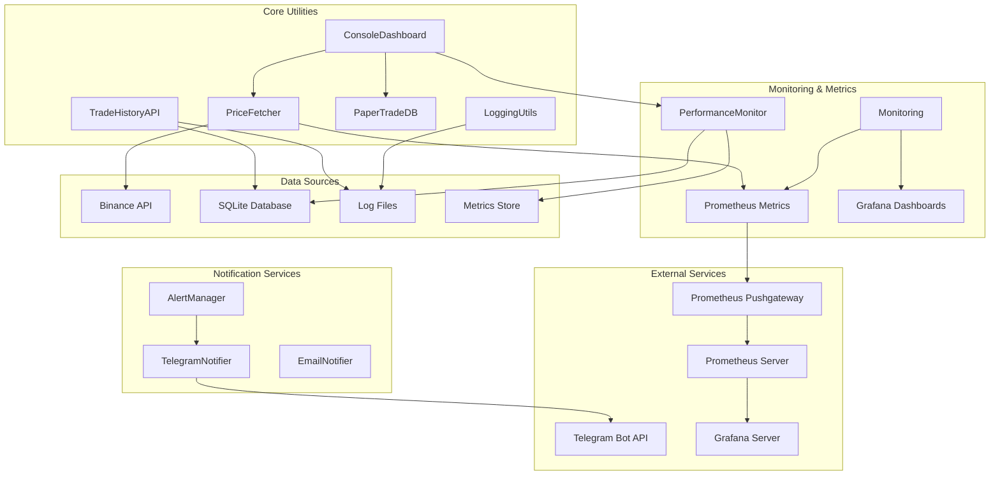
```mermaid
graph TB
    subgraph "Core Utilities"
        PriceFetcher[PriceFetcher]
        Dashboard[ConsoleDashboard]
        Logging[LoggingUtils]
        PaperTradeDB[PaperTradeDB]
        TradeHistoryAPI[TradeHistoryAPI]
    end
    
    subgraph "Monitoring & Metrics"
        Monitoring[Monitoring]
        PerformanceMonitor[PerformanceMonitor]
        PrometheusMetrics[Prometheus Metrics]
        GrafanaDashboards[Grafana Dashboards]
    end
    
    subgraph "Notification Services"
        TelegramNotifier[TelegramNotifier]
        EmailNotifier[EmailNotifier]
        AlertManager[AlertManager]
    end
    
    subgraph "Data Sources"
        BinanceAPI[Binance API]
        Database[SQLite Database]
        LogFiles[Log Files]
        MetricsStore[Metrics Store]
    end
    
    subgraph "External Services"
        Telegram[Telegram Bot API]
        Prometheus[Prometheus Server]
        Grafana[Grafana Server]
        PushGateway[Prometheus Pushgateway]
    end
    
    PriceFetcher --> BinanceAPI
    PriceFetcher --> PrometheusMetrics
    
    Dashboard --> PerformanceMonitor
    Dashboard --> PriceFetcher
    Dashboard --> PaperTradeDB
    
    Monitoring --> PrometheusMetrics
    Monitoring --> GrafanaDashboards
    
    PerformanceMonitor --> Database
    PerformanceMonitor --> MetricsStore
    
    TelegramNotifier --> Telegram
    AlertManager --> TelegramNotifier
    
    PrometheusMetrics --> PushGateway
    PushGateway --> Prometheus
    Prometheus --> Grafana
    
    TradeHistoryAPI --> Database
    TradeHistoryAPI --> LogFiles
    
    Logging --> LogFiles
```

---

## Core Utility Components

### 1. PriceFetcher (`utils/price_fetcher.py`)

Handles real-time and historical price data acquisition with technical indicators:

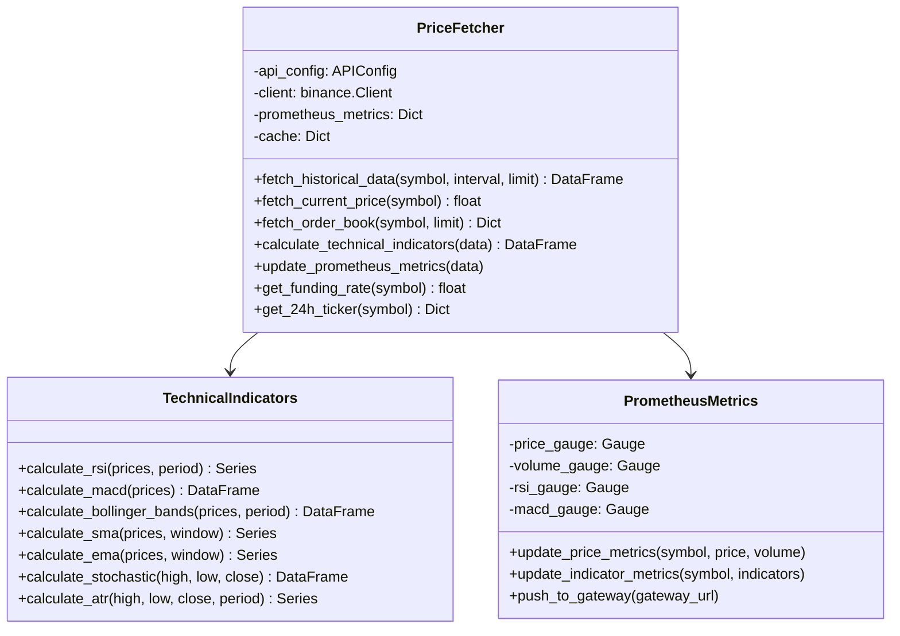
```mermaid
classDiagram
    class PriceFetcher {
        -api_config: APIConfig
        -client: binance.Client
        -prometheus_metrics: Dict
        -cache: Dict
        +fetch_historical_data(symbol, interval, limit) DataFrame
        +fetch_current_price(symbol) float
        +fetch_order_book(symbol, limit) Dict
        +calculate_technical_indicators(data) DataFrame
        +update_prometheus_metrics(data)
        +get_funding_rate(symbol) float
        +get_24h_ticker(symbol) Dict
    }
    
    class TechnicalIndicators {
        +calculate_rsi(prices, period) Series
        +calculate_macd(prices) DataFrame
        +calculate_bollinger_bands(prices, period) DataFrame
        +calculate_sma(prices, window) Series
        +calculate_ema(prices, window) Series
        +calculate_stochastic(high, low, close) DataFrame
        +calculate_atr(high, low, close, period) Series
    }
    
    class PrometheusMetrics {
        -price_gauge: Gauge
        -volume_gauge: Gauge
        -rsi_gauge: Gauge
        -macd_gauge: Gauge
        +update_price_metrics(symbol, price, volume)
        +update_indicator_metrics(symbol, indicators)
        +push_to_gateway(gateway_url)
    }
    
    PriceFetcher --> TechnicalIndicators
    PriceFetcher --> PrometheusMetrics
```

**Key Features:**
- Real-time price data from Binance API
- Technical indicator calculations (RSI, MACD, Bollinger Bands, etc.)
- Prometheus metrics integration
- Data caching for performance optimization
- Error handling and retry mechanisms

### 2. ConsoleDashboard (`utils/console_dashboard.py`)

Terminal-based real-time monitoring interface:

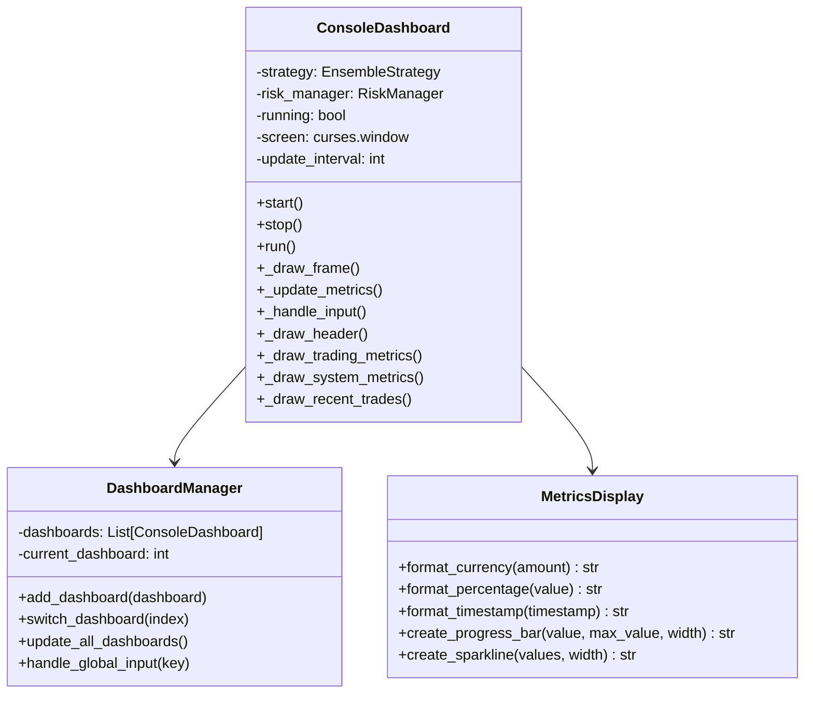
```mermaid
classDiagram
    class ConsoleDashboard {
        -strategy: EnsembleStrategy
        -risk_manager: RiskManager
        -running: bool
        -screen: curses.window
        -update_interval: int
        +start()
        +stop()
        +run()
        +_draw_frame()
        +_update_metrics()
        +_handle_input()
        +_draw_header()
        +_draw_trading_metrics()
        +_draw_system_metrics()
        +_draw_recent_trades()
    }
    
    class DashboardManager {
        -dashboards: List[ConsoleDashboard]
        -current_dashboard: int
        +add_dashboard(dashboard)
        +switch_dashboard(index)
        +update_all_dashboards()
        +handle_global_input(key)
    }
    
    class MetricsDisplay {
        +format_currency(amount) str
        +format_percentage(value) str
        +format_timestamp(timestamp) str
        +create_progress_bar(value, max_value, width) str
        +create_sparkline(values, width) str
    }
    
    ConsoleDashboard --> DashboardManager
    ConsoleDashboard --> MetricsDisplay
```

**Dashboard Sections:**
- **Header:** System status, current time, uptime
- **Trading Metrics:** P&L, positions, recent signals
- **System Metrics:** CPU, memory, network usage
- **Recent Trades:** Trade history with performance metrics
- **Risk Metrics:** Current risk exposure, limits

### 3. TradeHistoryAPI (`utils/trade_history_api.py`)

Flask-based API for trade history and performance data:

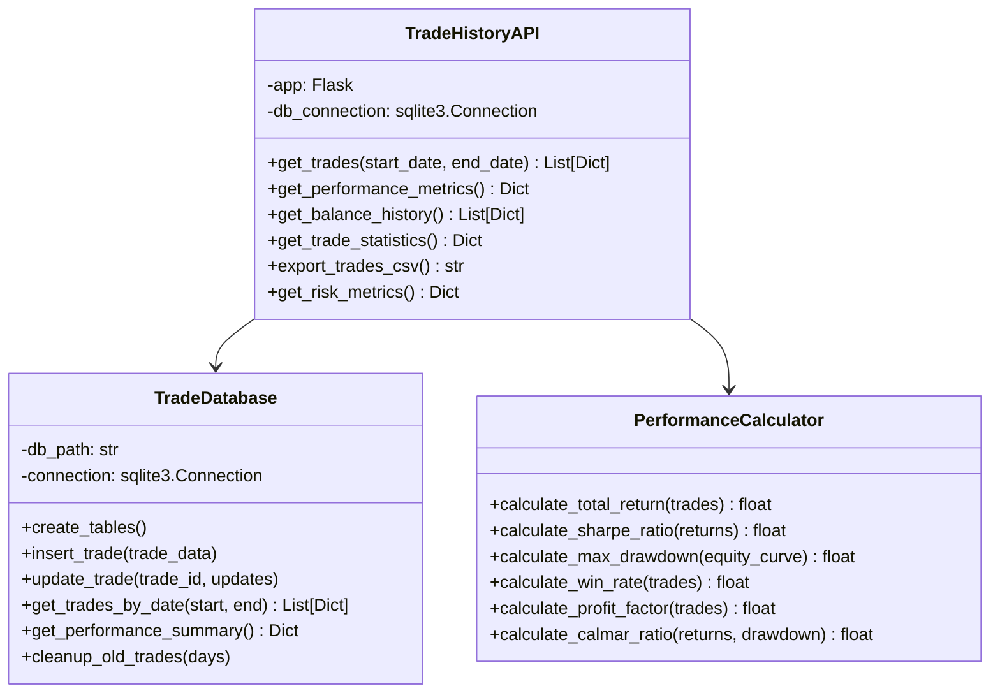
```mermaid
classDiagram
    class TradeHistoryAPI {
        -app: Flask
        -db_connection: sqlite3.Connection
        +get_trades(start_date, end_date) List[Dict]
        +get_performance_metrics() Dict
        +get_balance_history() List[Dict]
        +get_trade_statistics() Dict
        +export_trades_csv() str
        +get_risk_metrics() Dict
    }
    
    class TradeDatabase {
        -db_path: str
        -connection: sqlite3.Connection
        +create_tables()
        +insert_trade(trade_data)
        +update_trade(trade_id, updates)
        +get_trades_by_date(start, end) List[Dict]
        +get_performance_summary() Dict
        +cleanup_old_trades(days)
    }
    
    class PerformanceCalculator {
        +calculate_total_return(trades) float
        +calculate_sharpe_ratio(returns) float
        +calculate_max_drawdown(equity_curve) float
        +calculate_win_rate(trades) float
        +calculate_profit_factor(trades) float
        +calculate_calmar_ratio(returns, drawdown) float
    }
    
    TradeHistoryAPI --> TradeDatabase
    TradeHistoryAPI --> PerformanceCalculator
```

**API Endpoints:**
- `GET /trades` - Retrieve trade history
- `GET /performance` - Get performance metrics
- `GET /balance` - Get balance history
- `GET /statistics` - Get trade statistics
- `GET /export/csv` - Export trades to CSV
- `GET /risk` - Get risk metrics

---

## Monitoring Infrastructure

### 1. Performance Monitor (`core/metrics/performance_monitor.py`)

Tracks and analyzes trading performance:

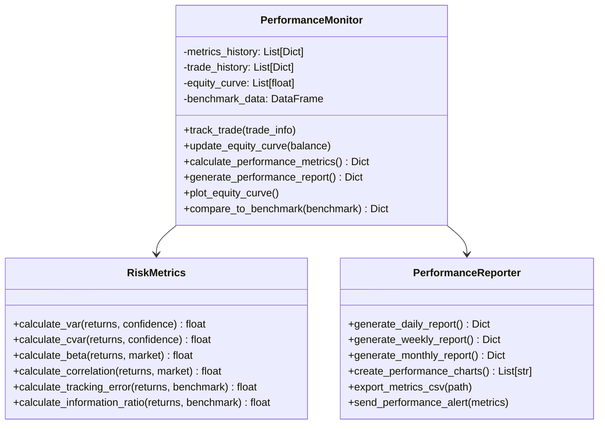
```mermaid
classDiagram
    class PerformanceMonitor {
        -metrics_history: List[Dict]
        -trade_history: List[Dict]
        -equity_curve: List[float]
        -benchmark_data: DataFrame
        +track_trade(trade_info)
        +update_equity_curve(balance)
        +calculate_performance_metrics() Dict
        +generate_performance_report() Dict
        +plot_equity_curve()
        +compare_to_benchmark(benchmark) Dict
    }
    
    class RiskMetrics {
        +calculate_var(returns, confidence) float
        +calculate_cvar(returns, confidence) float
        +calculate_beta(returns, market) float
        +calculate_correlation(returns, market) float
        +calculate_tracking_error(returns, benchmark) float
        +calculate_information_ratio(returns, benchmark) float
    }
    
    class PerformanceReporter {
        +generate_daily_report() Dict
        +generate_weekly_report() Dict
        +generate_monthly_report() Dict
        +create_performance_charts() List[str]
        +export_metrics_csv(path)
        +send_performance_alert(metrics)
    }
    
    PerformanceMonitor --> RiskMetrics
    PerformanceMonitor --> PerformanceReporter
```

### 2. Monitoring System (`utils/monitoring.py`)

Comprehensive system and application monitoring:

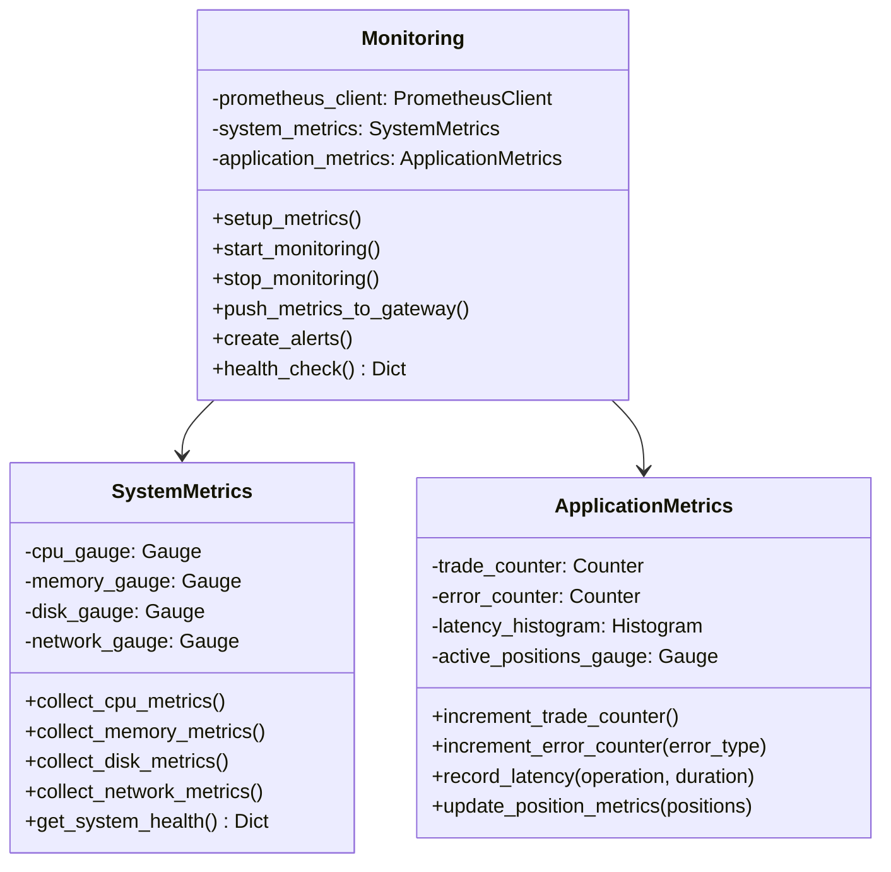
```mermaid
classDiagram
    class Monitoring {
        -prometheus_client: PrometheusClient
        -system_metrics: SystemMetrics
        -application_metrics: ApplicationMetrics
        +setup_metrics()
        +start_monitoring()
        +stop_monitoring()
        +push_metrics_to_gateway()
        +create_alerts()
        +health_check() Dict
    }
    
    class SystemMetrics {
        -cpu_gauge: Gauge
        -memory_gauge: Gauge
        -disk_gauge: Gauge
        -network_gauge: Gauge
        +collect_cpu_metrics()
        +collect_memory_metrics()
        +collect_disk_metrics()
        +collect_network_metrics()
        +get_system_health() Dict
    }
    
    class ApplicationMetrics {
        -trade_counter: Counter
        -error_counter: Counter
        -latency_histogram: Histogram
        -active_positions_gauge: Gauge
        +increment_trade_counter()
        +increment_error_counter(error_type)
        +record_latency(operation, duration)
        +update_position_metrics(positions)
    }
    
    Monitoring --> SystemMetrics
    Monitoring --> ApplicationMetrics
```

---

## Notification Services

### 1. Telegram Notifier

Real-time notifications via Telegram bot:

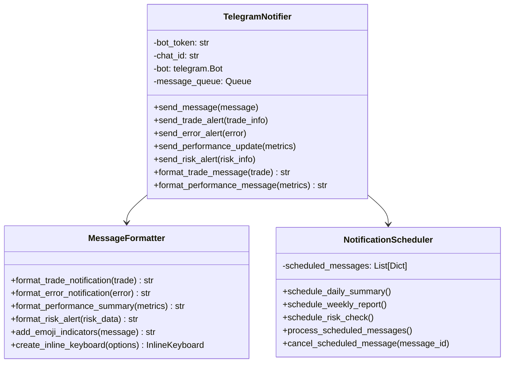
```mermaid
classDiagram
    class TelegramNotifier {
        -bot_token: str
        -chat_id: str
        -bot: telegram.Bot
        -message_queue: Queue
        +send_message(message)
        +send_trade_alert(trade_info)
        +send_error_alert(error)
        +send_performance_update(metrics)
        +send_risk_alert(risk_info)
        +format_trade_message(trade) str
        +format_performance_message(metrics) str
    }
    
    class MessageFormatter {
        +format_trade_notification(trade) str
        +format_error_notification(error) str
        +format_performance_summary(metrics) str
        +format_risk_alert(risk_data) str
        +add_emoji_indicators(message) str
        +create_inline_keyboard(options) InlineKeyboard
    }
    
    class NotificationScheduler {
        -scheduled_messages: List[Dict]
        +schedule_daily_summary()
        +schedule_weekly_report()
        +schedule_risk_check()
        +process_scheduled_messages()
        +cancel_scheduled_message(message_id)
    }
    
    TelegramNotifier --> MessageFormatter
    TelegramNotifier --> NotificationScheduler
```

### 2. Alert Manager

Centralized alert management system:

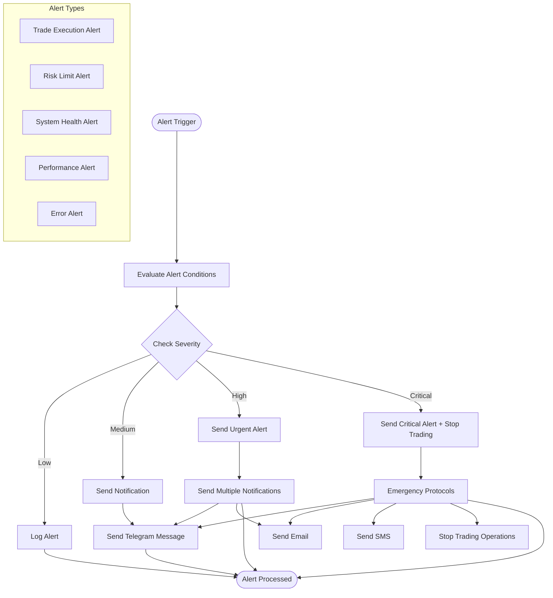
```mermaid
flowchart TD
    Start([Alert Trigger]) --> Evaluate[Evaluate Alert Conditions]
    Evaluate --> CheckSeverity{Check Severity}
    
    CheckSeverity --> |Low| LogAlert[Log Alert]
    CheckSeverity --> |Medium| SendNotification[Send Notification]
    CheckSeverity --> |High| SendUrgent[Send Urgent Alert]
    CheckSeverity --> |Critical| SendCritical[Send Critical Alert + Stop Trading]
    
    LogAlert --> End([Alert Processed])
    SendNotification --> Telegram[Send Telegram Message]
    SendUrgent --> Multiple[Send Multiple Notifications]
    SendCritical --> Emergency[Emergency Protocols]
    
    Telegram --> End
    Multiple --> Telegram
    Multiple --> Email[Send Email]
    Multiple --> End
    
    Emergency --> Telegram
    Emergency --> Email
    Emergency --> SMS[Send SMS]
    Emergency --> StopTrading[Stop Trading Operations]
    Emergency --> End
    
    subgraph "Alert Types"
        TradeAlert[Trade Execution Alert]
        RiskAlert[Risk Limit Alert]
        SystemAlert[System Health Alert]
        PerformanceAlert[Performance Alert]
        ErrorAlert[Error Alert]
    end
```

---

## Data Flow and Integration

### Real-time Data Pipeline

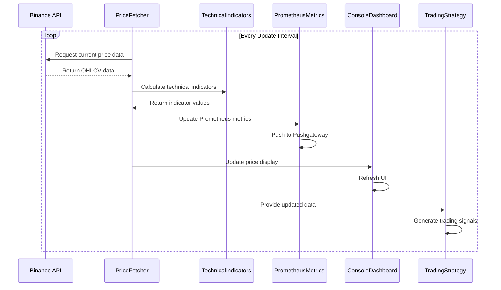
```mermaid
sequenceDiagram
    participant API as Binance API
    participant Fetcher as PriceFetcher
    participant Indicators as TechnicalIndicators
    participant Metrics as PrometheusMetrics
    participant Dashboard as ConsoleDashboard
    participant Strategy as TradingStrategy
    
    loop Every Update Interval
        Fetcher->>API: Request current price data
        API-->>Fetcher: Return OHLCV data
        
        Fetcher->>Indicators: Calculate technical indicators
        Indicators-->>Fetcher: Return indicator values
        
        Fetcher->>Metrics: Update Prometheus metrics
        Metrics->>Metrics: Push to Pushgateway
        
        Fetcher->>Dashboard: Update price display
        Dashboard->>Dashboard: Refresh UI
        
        Fetcher->>Strategy: Provide updated data
        Strategy->>Strategy: Generate trading signals
    end
```

### Monitoring Data Flow

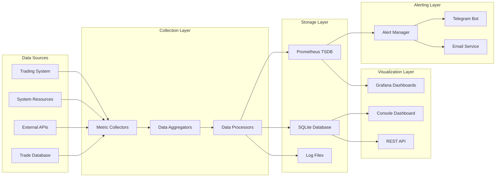
```mermaid
graph LR
    subgraph "Data Sources"
        Trading[Trading System]
        System[System Resources]
        API[External APIs]
        Database[Trade Database]
    end
    
    subgraph "Collection Layer"
        Collectors[Metric Collectors]
        Aggregators[Data Aggregators]
        Processors[Data Processors]
    end
    
    subgraph "Storage Layer"
        Prometheus[Prometheus TSDB]
        SQLite[SQLite Database]
        LogFiles[Log Files]
    end
    
    subgraph "Visualization Layer"
        Grafana[Grafana Dashboards]
        Console[Console Dashboard]
        API_Server[REST API]
    end
    
    subgraph "Alerting Layer"
        AlertManager[Alert Manager]
        Telegram[Telegram Bot]
        Email[Email Service]
    end
    
    Trading --> Collectors
    System --> Collectors
    API --> Collectors
    Database --> Collectors
    
    Collectors --> Aggregators
    Aggregators --> Processors
    
    Processors --> Prometheus
    Processors --> SQLite
    Processors --> LogFiles
    
    Prometheus --> Grafana
    SQLite --> Console
    SQLite --> API_Server
    
    Prometheus --> AlertManager
    AlertManager --> Telegram
    AlertManager --> Email
```

---

## Configuration and Setup

### Monitoring Configuration

```yaml
# monitoring_config.yaml
monitoring:
  prometheus:
    pushgateway_url: "http://localhost:9091"
    job_name: "elvis_trading_bot"
    push_interval: 30  # seconds
    
  grafana:
    url: "http://localhost:3000"
    dashboard_path: "./grafana/dashboards/"
    
  system_metrics:
    collection_interval: 10  # seconds
    cpu_threshold: 80  # percent
    memory_threshold: 85  # percent
    disk_threshold: 90  # percent
    
  alerts:
    telegram:
      enabled: true
      bot_token: "${TELEGRAM_BOT_TOKEN}"
      chat_id: "${TELEGRAM_CHAT_ID}"
    
    email:
      enabled: false
      smtp_server: "smtp.gmail.com"
      smtp_port: 587
      
  performance:
    tracking_enabled: true
    benchmark_symbol: "BTCUSDT"
    report_frequency: "daily"  # daily, weekly, monthly
```

### Dashboard Configuration

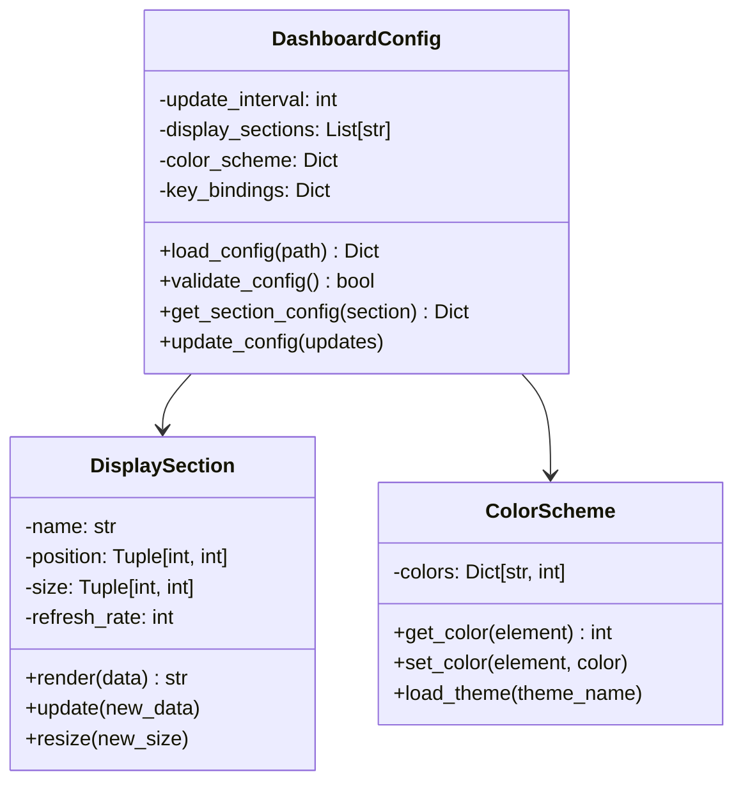
```mermaid
classDiagram
    class DashboardConfig {
        -update_interval: int
        -display_sections: List[str]
        -color_scheme: Dict
        -key_bindings: Dict
        +load_config(path) Dict
        +validate_config() bool
        +get_section_config(section) Dict
        +update_config(updates)
    }
    
    class DisplaySection {
        -name: str
        -position: Tuple[int, int]
        -size: Tuple[int, int]
        -refresh_rate: int
        +render(data) str
        +update(new_data)
        +resize(new_size)
    }
    
    class ColorScheme {
        -colors: Dict[str, int]
        +get_color(element) int
        +set_color(element, color)
        +load_theme(theme_name)
    }
    
    DashboardConfig --> DisplaySection
    DashboardConfig --> ColorScheme
```

---

## Performance Optimization

### Caching Strategy

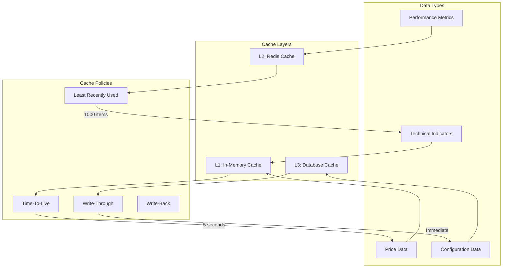
```mermaid
graph TB
    subgraph "Cache Layers"
        L1[L1: In-Memory Cache]
        L2[L2: Redis Cache]
        L3[L3: Database Cache]
    end
    
    subgraph "Data Types"
        PriceData[Price Data]
        Indicators[Technical Indicators]
        Metrics[Performance Metrics]
        Config[Configuration Data]
    end
    
    subgraph "Cache Policies"
        TTL[Time-To-Live]
        LRU[Least Recently Used]
        WriteThrough[Write-Through]
        WriteBack[Write-Back]
    end
    
    PriceData --> L1
    Indicators --> L1
    Metrics --> L2
    Config --> L3
    
    L1 --> TTL
    L2 --> LRU
    L3 --> WriteThrough
    
    TTL --> |5 seconds| PriceData
    LRU --> |1000 items| Indicators
    WriteThrough --> |Immediate| Config
```

### Async Processing

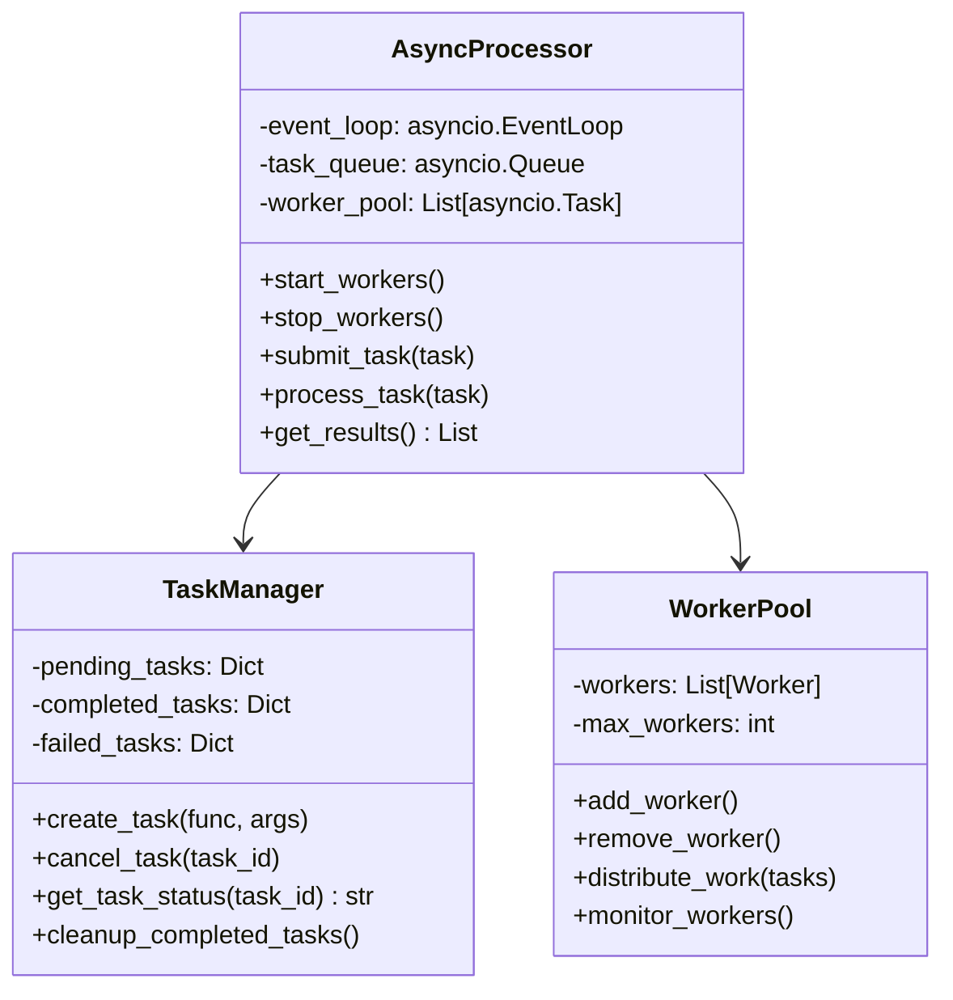
```mermaid
classDiagram
    class AsyncProcessor {
        -event_loop: asyncio.EventLoop
        -task_queue: asyncio.Queue
        -worker_pool: List[asyncio.Task]
        +start_workers()
        +stop_workers()
        +submit_task(task)
        +process_task(task)
        +get_results() List
    }
    
    class TaskManager {
        -pending_tasks: Dict
        -completed_tasks: Dict
        -failed_tasks: Dict
        +create_task(func, args)
        +cancel_task(task_id)
        +get_task_status(task_id) str
        +cleanup_completed_tasks()
    }
    
    class WorkerPool {
        -workers: List[Worker]
        -max_workers: int
        +add_worker()
        +remove_worker()
        +distribute_work(tasks)
        +monitor_workers()
    }
    
    AsyncProcessor --> TaskManager
    AsyncProcessor --> WorkerPool
```

---

## Error Handling and Logging

### Logging Architecture

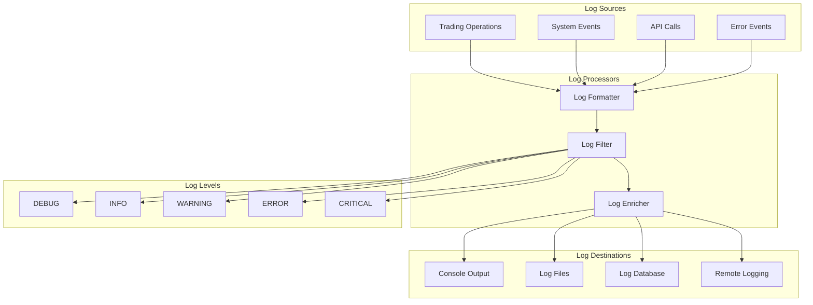
```mermaid
graph TB
    subgraph "Log Sources"
        Trading[Trading Operations]
        System[System Events]
        API[API Calls]
        Errors[Error Events]
    end
    
    subgraph "Log Processors"
        Formatter[Log Formatter]
        Filter[Log Filter]
        Enricher[Log Enricher]
    end
    
    subgraph "Log Destinations"
        Console[Console Output]
        Files[Log Files]
        Database[Log Database]
        Remote[Remote Logging]
    end
    
    subgraph "Log Levels"
        DEBUG[DEBUG]
        INFO[INFO]
        WARNING[WARNING]
        ERROR[ERROR]
        CRITICAL[CRITICAL]
    end
    
    Trading --> Formatter
    System --> Formatter
    API --> Formatter
    Errors --> Formatter
    
    Formatter --> Filter
    Filter --> Enricher
    
    Enricher --> Console
    Enricher --> Files
    Enricher --> Database
    Enricher --> Remote
    
    Filter --> DEBUG
    Filter --> INFO
    Filter --> WARNING
    Filter --> ERROR
    Filter --> CRITICAL
```

---

## Testing and Validation

### Monitoring Tests

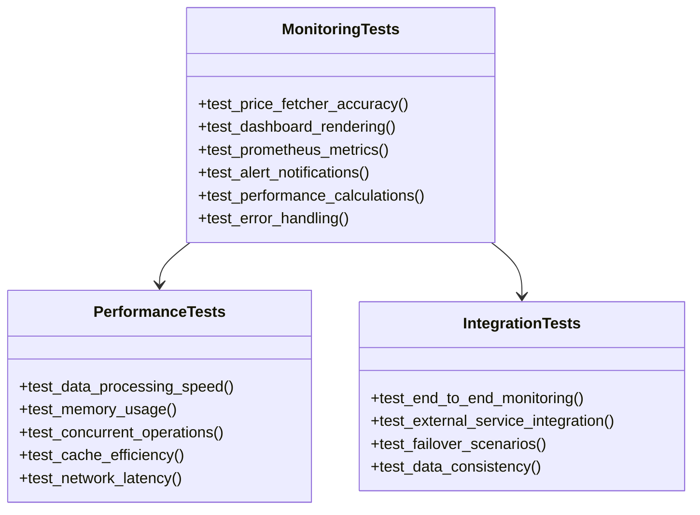
```mermaid
classDiagram
    class MonitoringTests {
        +test_price_fetcher_accuracy()
        +test_dashboard_rendering()
        +test_prometheus_metrics()
        +test_alert_notifications()
        +test_performance_calculations()
        +test_error_handling()
    }
    
    class PerformanceTests {
        +test_data_processing_speed()
        +test_memory_usage()
        +test_concurrent_operations()
        +test_cache_efficiency()
        +test_network_latency()
    }
    
    class IntegrationTests {
        +test_end_to_end_monitoring()
        +test_external_service_integration()
        +test_failover_scenarios()
        +test_data_consistency()
    }
    
    MonitoringTests --> PerformanceTests
    MonitoringTests --> IntegrationTests
```

---

## Future Enhancements

### Planned Improvements

1. **Enhanced Visualization**
   - Multi-timeframe charts in console dashboard
   - Interactive web-based dashboard
   - Real-time candlestick charts
   - Advanced technical indicator overlays

2. **Advanced Monitoring**
   - Machine learning-based anomaly detection
   - Predictive performance alerts
   - Automated system optimization
   - Advanced correlation analysis

3. **Extended Notifications**
   - Multi-channel notification routing
   - Smart notification filtering
   - Voice alerts for critical events
   - Integration with external alerting systems

4. **Performance Optimization**
   - Distributed monitoring architecture
   - Advanced caching strategies
   - Real-time stream processing
   - GPU-accelerated calculations

---

## References

### Core Files
- `utils/price_fetcher.py` - Price data acquisition
- `utils/console_dashboard.py` - Terminal dashboard
- `utils/monitoring.py` - System monitoring
- `utils/trade_history_api.py` - Trade history API
- `core/metrics/performance_monitor.py` - Performance tracking

### Related Documentation
- [Architecture Overview](../README.md)
- [Training Pipeline](training.md)
- [Future Improvements](future_improvements.md)

---

This documentation will be continuously updated as new monitoring features and utilities are added to the system.
