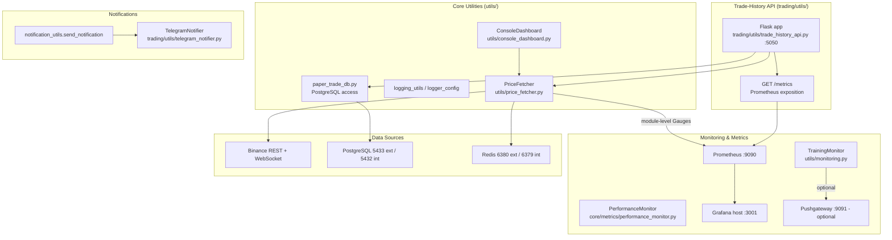
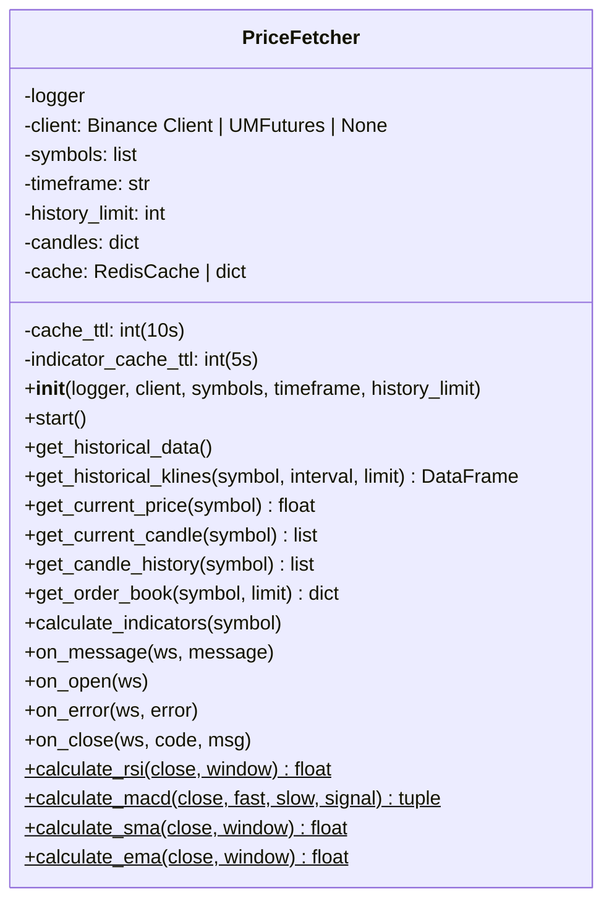
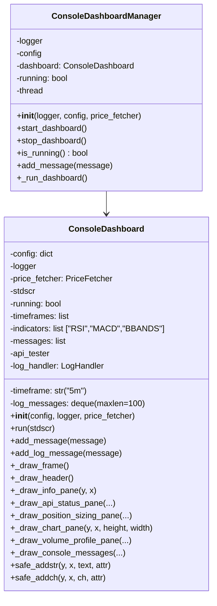
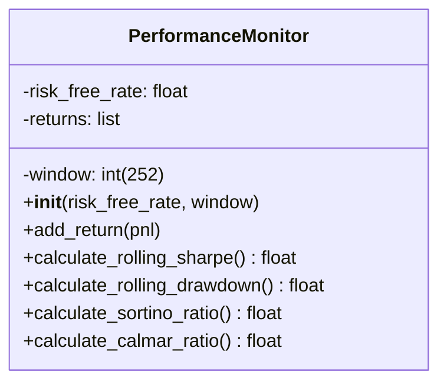
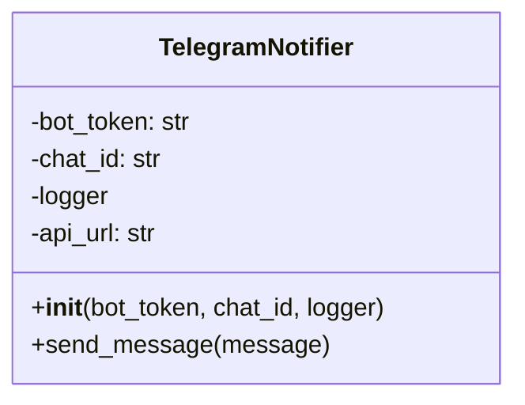
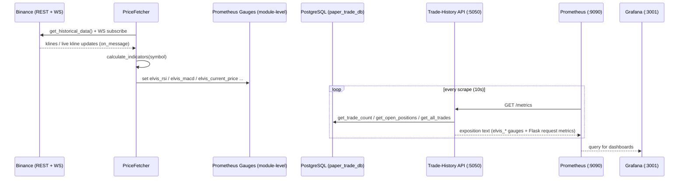

# ELVIS Trading System - Utilities & Monitoring Documentation

## Overview

This document describes the utilities and monitoring infrastructure for the
ELVIS trading system: price fetching, the curses console dashboard, the Flask
trade-history API (which also serves Prometheus metrics), the Prometheus /
Grafana stack, notifications, and the performance-metric helper.

All symbol names, file paths, ports, and endpoints below have been verified
against the source under `utils/`, `trading/utils/`, and `core/metrics/`.

---

## Utilities Architecture



> Note: the Prometheus scrape model here is **pull**, not push. The Flask API
> exposes `GET /metrics` on `:5050` and Prometheus scrapes it directly (see
> `prometheus.yml`). The Pushgateway on `:9091` is only used by the optional
> training-time helper `push_metric_to_prometheus` and is **not** part of
> `docker-compose.yml`.

---

## Core Utility Components

### 1. PriceFetcher (`utils/price_fetcher.py`)

Fetches historical candles from Binance REST, streams live klines over
WebSocket, computes a few technical indicators, and publishes them as
module-level Prometheus gauges.



Key facts (verified):

- **No separate `TechnicalIndicators` / `PrometheusMetrics` classes exist.** The
  indicator calculators (`calculate_rsi`, `calculate_macd`, `calculate_sma`,
  `calculate_ema`) are `@staticmethod`s on `PriceFetcher`. Only RSI, MACD (line +
  signal), SMA, and EMA are computed — there are no Bollinger Bands, Stochastic,
  or ATR calculators in this module.
- Prometheus metrics are **module-level `Gauge` objects**, not a class:
  `elvis_current_price`, `elvis_rsi`, `elvis_macd`, `elvis_macd_signal`,
  `elvis_sma`, `elvis_ema_short`, `elvis_ema_long` (all labelled by `symbol`).
  `calculate_indicators(symbol)` sets these gauges directly; there is no
  `update_prometheus_metrics` / `push_to_gateway` method.
- The client is chosen at construction: futures (`binance.um_futures.UMFutures`)
  if keys and the connector are available, otherwise the spot `Client`, or an
  unauthenticated public `Client` for price-only use.
- Caching uses `utils.redis_cache.get_cache()` (Redis) with a plain in-memory
  `dict` fallback when Redis is unavailable. There is **no** `fetch_current_price`,
  `fetch_order_book`, `get_funding_rate`, or `get_24h_ticker` method — the real
  accessors are `get_current_price`, `get_order_book`, `get_current_candle`,
  `get_candle_history`, and `get_historical_klines`.

### 2. ConsoleDashboard (`utils/console_dashboard.py`)

`curses`-based terminal UI. It renders trading info, an API-status pane, a
position-sizing pane, a price chart, a volume-profile pane, and a scrolling
console/log pane.



Key facts (verified):

- `ConsoleDashboard.__init__(self, config=None, logger=None, price_fetcher=None)`.
  It does **not** take a `strategy` or `risk_manager`, and has no
  `update_interval`, `_update_metrics`, `_handle_input`, `_draw_trading_metrics`,
  `_draw_system_metrics`, or `_draw_recent_trades` methods.
- The main loop is `run(stdscr)` (driven via `curses.wrapper(...)`), not
  `start()` / `stop()` / a private `run()`. Press `q` to quit.
- Lifecycle/threading is handled by `ConsoleDashboardManager`
  (`start_dashboard` / `stop_dashboard` / `is_running`), **not** a fictional
  `DashboardManager` with a list of dashboards. There is a single dashboard per
  manager, and `start_dashboard` refuses to start without a TTY and a `TERM`
  environment variable (headless-safe).
- There is no `MetricsDisplay` helper class. Formatting is done inline within the
  draw methods. `utils/console_dashboard_support.py` provides `LogHandler` and
  `create_api_tester` used by the dashboard.
- A standalone `main(stdscr)` entry point exists in the module; in normal
  operation the dashboard is launched from `main.py` via
  `ConsoleDashboardManager`. `scripts/run_console_dashboard.sh` runs the whole bot
  (`main.py --mode paper`) in a container with the dashboard attached.

### 3. Trade-History API (`trading/utils/trade_history_api.py`)

A module-level Flask `app` (not a class) that serves trade/portfolio data and
the Prometheus scrape endpoint. Started from `main.py`
(`start_trade_history_server`) on host `127.0.0.1` (override with
`TRADE_HISTORY_API_HOST`) and port `5050` (override with
`TRADE_HISTORY_API_PORT`). In `docker-compose.yml` the container publishes
`5050:5050`.

> There is also a small unused stub at `utils/trade_history_api.py` that only
> exposes a placeholder `GET /api/trade_history`. The authoritative API is the
> `trading/utils/` module described here.

Data comes from PostgreSQL via helper functions in `utils.paper_trade_db`
(`get_all_trades`, `get_open_positions`, `get_trade_count`, `get_total_fees`,
`get_pnl_breakdown`, `get_rolling_stats`, `get_trade_distribution`,
`get_volume_profile`, `get_market_depth`, `get_conn`). There is no `sqlite3`
connection and no `TradeDatabase` / `PerformanceCalculator` class.

**Authentication.** Every request is gated by `require_api_key` (a
`@app.before_request` hook) which requires the `X-API-Key` header to match the
`API_KEY` environment variable. If `API_KEY` is unset the API fails closed
(HTTP 503). `/health` and `/metrics` are exempt so Docker health checks and the
Prometheus server can reach them without the header.

**Endpoints (verified):**

| Method | Path | Purpose |
| --- | --- | --- |
| GET | `/` | JSON pointer to the console TUI (the static HTML dashboard was removed — unreachable since the X-API-Key hardening) |
| GET | `/trades` | Recent trades since the last session reset (capped) |
| GET | `/trades/count` | Total trade count |
| GET | `/open_positions` | Open positions list |
| GET | `/balance` | Current per-asset balance with recent P&L applied |
| GET | `/fees` | Total fees |
| GET | `/pnl_breakdown` | P&L breakdown |
| GET | `/rolling_stats` | Rolling statistics |
| GET | `/trade_distribution` | Trade distribution |
| GET | `/volume_profile` | Volume profile |
| GET | `/market_depth` | Market depth snapshot |
| POST | `/emergency_stop` (alias `/emergency-stop`) | Activate kill-switch |
| DELETE | `/emergency_stop` (alias `/emergency-stop`) | Clear kill-switch |
| GET | `/emergency_stop/status` (alias `/emergency-stop/status`) | Kill-switch state |
| GET | `/metrics` | Prometheus scrape endpoint (see below) |
| GET | `/health` | Health check (Docker) |

There are no `/performance`, `/statistics`, `/risk`, or `/export/csv` routes.

**Emergency kill-switch.** `POST /emergency_stop` halts trading and persists the
state to Redis under key `ELVIS_KILL_SWITCH` (`'1'`), surviving restarts;
`DELETE` clears it; `GET /emergency_stop/status` re-reads from Redis. An
in-memory flag (`KILL_SWITCH_ACTIVE`, read via `is_trading_halted()`) caches the
state for the hot loop. If Redis is unavailable it falls back to in-memory only.
Redis connection parameters come from `REDIS_HOST` / `REDIS_PORT` / `REDIS_DB` /
`REDIS_PASSWORD` env vars.

### Prometheus `/metrics` endpoint — how it works & how to use

**What it is.** `GET /metrics` on the trade-history Flask API
(`trading/utils/trade_history_api.py`, served on `:5050`) is the target
Prometheus scrapes. It is the endpoint referenced by `prometheus.yml`
(`metrics_path: '/metrics'`, target `host.docker.internal:5050`, `scrape_interval:
10s`, job name `elvis`).

**How it works.**

- The route calls `prometheus_client.generate_latest()` and returns it with the
  `CONTENT_TYPE_LATEST` header (`text/plain; version=0.0.4; charset=utf-8`), the
  standard Prometheus text exposition format.
- On every scrape it refreshes a few real gauges straight from
  `utils.paper_trade_db` so the values reflect live paper-trading state:
  - `elvis_portfolio_value` — paper equity: base equity (2000 = 1000 USDT +
    1000 BNB) plus the summed realized P&L of recent trades
    (`get_all_trades(limit=100)`, P&L in field index 6).
  - `elvis_open_positions_count` — number of open positions (`get_open_positions`).
  - `elvis_total_trades` — total number of trades (`get_trade_count`).
- Many additional gauges/histograms are defined at module load and refreshed by
  a background thread (`start_metrics_updater`, every 10s): e.g.
  `elvis_total_pnl`, `elvis_unrealized_pnl`, `elvis_win_rate`,
  `elvis_profit_factor`, `elvis_system_cpu_percent`, `elvis_system_memory_percent`,
  `elvis_market_spread`, `elvis_market_volume`, and others. All of these render in
  the same `/metrics` output.
- The default per-request Flask metrics collected by
  `prometheus_flask_exporter` are included too. The exporter's built-in endpoint
  is disabled (`PrometheusMetrics(app, path=None)`) so this explicit route owns
  the `/metrics` path without a collision.
- **Auth exemption:** `/metrics` (like `/health`) is exempt from the
  `X-API-Key` check in `require_api_key`, because the Prometheus server does not
  send that header. All other data/action routes still require the key. If the
  database is unreachable the endpoint still returns `200` with base values
  rather than failing the scrape.

**How to use.**

```bash
# Scrape it directly (no API key needed):
curl -s http://localhost:5050/metrics | grep elvis_

# Prometheus is already configured to scrape it (see prometheus.yml):
#   job_name: 'elvis'
#   metrics_path: '/metrics'
#   scrape_interval: 10s
#   targets: ['host.docker.internal:5050']
```

---

## Monitoring Infrastructure

### 1. PerformanceMonitor (`core/metrics/performance_monitor.py`)

A small helper that accumulates per-period returns and computes rolling
risk-adjusted metrics. It does **not** track trades, equity curves, benchmarks,
or generate reports/plots (there are no `RiskMetrics` / `PerformanceReporter`
classes).



Usage:

```python
from core.metrics.performance_monitor import PerformanceMonitor

pm = PerformanceMonitor(risk_free_rate=0.0, window=252)
for pnl in per_period_returns:
    pm.add_return(pnl)
sharpe = pm.calculate_rolling_sharpe()   # 0.0 until >= `window` returns collected
```

### 2. TrainingMonitor & metric push (`utils/monitoring.py`)

`utils/monitoring.py` provides a **training** monitor plus an optional
Pushgateway helper — not a general system/application monitoring stack. (A
separate, richer `TrainingMonitor` with plotting also exists at
`trading/utils/monitoring.py` for the training pipeline.)

```mermaid
classDiagram
    class TrainingMonitor {
        -config: dict
        -metrics: dict {train:[], val:[]}
        -best_val_loss: float
        -best_epoch: int
        -early_stopping_patience: int (10)
        -epochs_no_improve: int
        +update_metrics(phase, metrics_dict)
        +should_stop() bool
        +display_progress(epoch)
        +get_metrics() dict
        +get_training_time() float
        +get_best_epoch() int
    }
```

`push_metric_to_prometheus(metric_name, value, job_name="elvis_trading",
gateway="localhost:9091", labels=None)` is a free function that pushes a single
gauge to a Prometheus Pushgateway. It is a no-op if the Pushgateway client is
unavailable (`prometheus_client.gateway` import guarded). There are no
`SystemMetrics` / `ApplicationMetrics` classes; system CPU/memory gauges are
sampled with `psutil` inside the trade-history API's `update_trading_metrics`
loop instead.

### 3. Prometheus / Grafana stack (`docker-compose.yml`)

| Service | Image | Host port | Notes |
| --- | --- | --- | --- |
| Prometheus | `prom/prometheus:latest` | `9090:9090` | Scrapes itself and the Flask API |
| Grafana | `grafana/grafana:latest` | `3001:3000` | Host port **3001** |
| Loki | `grafana/loki:2.9.0` | — | Log aggregation |
| Promtail | `grafana/promtail:2.9.0` | — | Log shipper |
| PostgreSQL | — | `5433:5432` | External **5433** (env `POSTGRES_EXTERNAL_PORT`) |
| Redis | — | `6380:6379` | External **6380** (env `REDIS_EXTERNAL_PORT`) |
| Trade-history API | (bot image) | `5050:5050` | Serves `/metrics` |

Grafana provisioning lives under `grafana/provisioning/`, and prebuilt
dashboards under `grafana/dashboards/` (e.g. `elvis-trading.json`,
`elvis_full_prometheus_dashboard.json`, `elvis_master_console_replica.json`).

---

## Notification Services

### TelegramNotifier (`trading/utils/telegram_notifier.py`)

A minimal Telegram sender. It has a single public method, `send_message`, and
posts to `https://api.telegram.org/bot<token>/sendMessage` with `parse_mode:
HTML`.



There is **no** `EmailNotifier`, `AlertManager`, `MessageFormatter`,
`NotificationScheduler`, message queue, or inline-keyboard support in this class,
and no `send_trade_alert` / `send_error_alert` / `send_performance_update`
methods.

### notification_utils (`utils/notification_utils.py`)

A functional alternative used elsewhere in the codebase:

- `send_notification(logger, message, notification_type="info")` — prefixes the
  message with an emoji by type (`info` / `warning` / `error`) and forwards to
  Telegram if `TELEGRAM_TOKEN` and `TELEGRAM_CHAT_ID` are configured (from
  `API_CONFIG` or environment), otherwise just logs.
- `telegram_notify(logger, message, token, chat_id)` — sends via a GET request
  to the Telegram `sendMessage` endpoint with `parse_mode=Markdown`.

Alert severity is handled ad hoc by callers (info/warning/error prefixes); there
is no centralized alert-manager state machine or SMS/email fan-out in the code.

---

## Real-time Data Pipeline



---

## Configuration and Setup

There is **no `monitoring_config.yaml`** in this repo. Monitoring knobs live in
two places:

1. **`trading_config.yaml`** (loaded via
   `config.trading_config.load_trading_config()`), which includes a `monitoring`
   block:

   ```yaml
   monitoring:
     trade_history_port: 5050
     prometheus_pushgateway: localhost:9091
     grafana_port: 3001
   ```

2. **`config/config.py`** — Python dicts `TRADING_CONFIG`, `PAPER_TRADING_CONFIG`,
   `SYMBOLS_CONFIG` (with `PRIMARY_SYMBOLS`), and `API_CONFIG`. The console
   dashboard imports `TRADING_CONFIG` from here; the trade-history API reads
   `SYMBOLS_CONFIG["PRIMARY_SYMBOLS"]` to initialize the `PriceFetcher`.

**Relevant environment variables:**

- `API_KEY` — required by the trade-history API's `X-API-Key` auth.
- `TRADE_HISTORY_API_HOST` (default `127.0.0.1`), `TRADE_HISTORY_API_PORT`
  (default `5050`).
- `REDIS_HOST` / `REDIS_PORT` / `REDIS_DB` / `REDIS_PASSWORD` — kill-switch and
  cache Redis connection.
- `TELEGRAM_TOKEN` / `TELEGRAM_CHAT_ID` — notifications.

Binance credentials are read via the secrets layer (Vault KV mount `secrets`,
keys `secrets/binance` → `api_key` / `secret_key`) surfaced through `API_CONFIG`;
see `utils/secrets_manager.py` and `utils/vault_client.py`.

---

## Logging

Logging helpers live in `utils/logging_utils.py` (`setup_logger`, `print_info`,
`print_error`, `print_warning`, `print_debug`) and `utils/logger_config.py`
(`setup_logging`, used by the trade-history API). The console dashboard installs
a `LogHandler` (from `utils/console_dashboard_support.py`) on the root logger so
recent log lines can be shown in the console pane (`log_messages` deque,
`maxlen=100`).

Container log aggregation is handled by Loki + Promtail (see `docker-compose.yml`,
`loki/`, `promtail/`).

---

## Testing

Relevant tests include `tests/test_metrics_endpoint.py`, which imports the Flask
`app` from `trading.utils.trade_history_api` and exercises the `/metrics`
endpoint (auth exemption, exposition format, gauge refresh with the DB
unavailable). Run the suite with `./scripts/run_tests.sh` or `pytest`.

---

## References

### Core Files

- `utils/price_fetcher.py` — Binance price streaming + indicators + gauges
- `utils/console_dashboard.py` — curses dashboard + `ConsoleDashboardManager`
- `utils/console_dashboard_support.py` — `LogHandler`, `create_api_tester`
- `utils/monitoring.py` — `TrainingMonitor`, `push_metric_to_prometheus`
- `trading/utils/trade_history_api.py` — Flask API + `/metrics` + kill-switch
- `trading/utils/telegram_notifier.py` — `TelegramNotifier`
- `utils/notification_utils.py` — `send_notification` / `telegram_notify`
- `core/metrics/performance_monitor.py` — `PerformanceMonitor`
- `prometheus.yml` — scrape config
- `docker-compose.yml` — Prometheus/Grafana/Loki/Postgres/Redis stack

### Related Documentation

- [Architecture Overview](../README.md)
- [Trading System](trading_system.md)
- [Training Pipeline](training.md)
