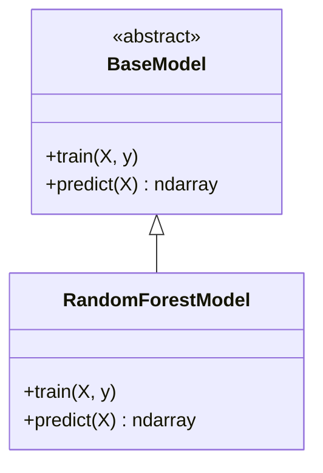

# Mermaid Syntax Test

```mermaid
classDiagram
    class BaseModel {
        <<abstract>>
        +train(X, y)
        +predict(X) ndarray
    }
    
    class RandomForestModel {
        +train(X, y)
        +predict(X) ndarray
    }
    
    BaseModel <|-- RandomForestModel
```

This should render correctly without any syntax errors.
